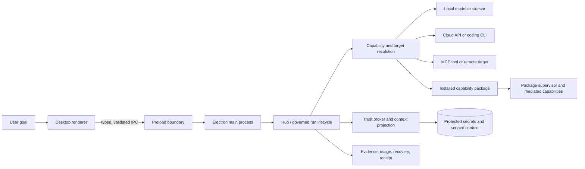

# TomniHubOS


[](LICENSE)
[](package.json)
[](packages/desktop)
[](#project-status)

TomniHubOS is a desktop-first Agent OS for running useful AI work across local models, cloud providers, coding CLIs, MCP tools, and downloadable capability packages. It is being built as a governed execution hub—not another provider-specific chat client—so users can choose how work runs while retaining control over permissions, secrets, private context, evidence, and recovery.

The product is organized around two cores:

1. **Hub Agent OS** — turns a goal into a governed run that can resolve capabilities, select an execution target, delegate work, request approval, verify the result, and persist a terminal receipt.
2. **Trust and User Intelligence** — protects identity, permissions, secrets, egress, audit evidence, and user-owned context without allowing learned behavior to become authorization.

The Store and package platform is a parallel launch track. IDE, Browser, Studio, Office, media, and other domain applications are intended to become independently installable packages instead of permanent members of the trusted base.

> [!IMPORTANT]
> TomniHubOS is **pre-MVP**. The repository contains substantial working implementations and tests, but several production paths are still converging. This README labels material claims as **CURRENT**, **PARTIAL**, or **TARGET** and does not present target architecture as shipped behavior.

Model topology: Qwen3.5-2B is removed from the architecture. One immutable Qwen3.5-0.8B base serves three independent adapters (security, user-understanding, combined semantic-analysis). Orchestration uses an API LLM. See [AI runtime](docs/core/ai-runtime.md#immutable-semantic-model-decision-2026-09-08) for policy and admission gates.

## Why TomniHubOS

- **Provider-neutral execution.** Local OpenAI-compatible runtimes, cloud APIs, supervised coding CLIs, remote agents, MCP tools, and package adapters share a common target model.
- **Governance at the execution seam.** The design binds identity, capability, destination, budget, cancellation, evidence, and recovery to a run instead of relying on UI-only checks.
- **User-owned intelligence.** Explicit preferences, scoped project context, corrections, retention, export, and deletion are designed to remain inspectable and reversible.
- **A smaller trusted base.** Optional applications are moving behind signed manifests, contribution registries, permissions, isolated runtimes, and transactional install/update/rollback flows.
- **Repository-aware agent tooling.** MTUI provides bounded reads, deterministic output compaction, safe edits, history, undo, verification, and semantic repository navigation when IDE Understanding is available.

## Project status

| Area                         | Status             | Evidence-backed state                                                                                                                                                                        |
| ---------------------------- | ------------------ | -------------------------------------------------------------------------------------------------------------------------------------------------------------------------------------------- |
| Electron desktop application | **CURRENT**        | Separate main-process, preload, and React renderer areas are active under `packages/desktop`.                                                                                                |
| Provider and agent adapters  | **PARTIAL**        | ACP, Codex app-server, Tomny Core, remote, sidecar, local-loopback, and provider integration code exists, but not every path has converged on one production Run Kernel.                     |
| Trust and secrets            | **PARTIAL**        | OS-protected provider secrets, sender validation, destination checks, redacted evidence, and deny-by-default containment exist on named paths; universal coverage is not yet release-proven. |
| User Intelligence            | **PARTIAL**        | Scoped records, provenance, correction/forget/delete/export controls, causal reasons, and learning pause exist; automatic learning has no production caller.                                 |
| Package platform and Store   | **PARTIAL**        | Signed manifests, catalog, verification, transaction, contribution, lifecycle, and pilot components exist; physical extraction of every optional application is not complete.                |
| Managed AI and managed cloud | **TARGET / gated** | These are separate metered capabilities and are not prerequisites for local, BYOK, CLI, MCP, or ordinary Store paths.                                                                        |
| Release readiness            | **pre-MVP**        | C0–C6 and S0–S6 evidence must pass on one recorded revision before a release claim is made.                                                                                                  |

See [current architecture](docs/architecture/current.md) for the inspected implementation snapshot and [target architecture](docs/architecture/target.md) for the intended boundaries.

## Core capabilities

### Governed agent execution

The target Hub lifecycle accepts a goal and workspace, projects only permitted context, resolves required capabilities, selects a policy-compatible target, acquires leases, executes, verifies, records usage and evidence, and then completes, recovers, or compensates. Current runtime work spans the Foundation Run Kernel and the production-used `ExperimentalCoreRuntime`; consolidating ownership remains a release requirement.

### Local, cloud, CLI, and MCP targets

The repository contains integration paths for:

- explicit loopback OpenAI-compatible engines for user-provisioned local inference;
- cloud-model APIs with write-only credentials and renderer-safe metadata;
- supervised provider and coding CLIs, including ACP and Codex app-server paths;
- Tomny Core and local sidecar components;
- MCP servers and tools governed as capabilities;
- remote and package-contributed execution targets.

The product does not scrape subscription credentials or treat tool discovery as permission to execute. A target must still satisfy identity, health, policy, budget, cancellation, and evidence requirements.

### Trust and User Intelligence

The main process owns protected credentials and security-sensitive decisions. Learned context may improve a proposal, but it cannot mint permissions, widen a grant, approve spending, or bypass consent. Current controls include scoped context records with provenance, explicit correction and deletion operations, protected provider storage, selected sender/origin guards, bounded egress authorities, and redacted execution evidence.

### Capability packages and Store

Manifest schema version 1 supports application, UI, and agent-capsule packages; artifact identity and Ed25519 signature metadata; declared permissions and dependencies; sandboxed-web and reviewed first-party runtimes; and contribution/lifecycle state. The package manager contains download, verification, transactional install, restore, quarantine, contribution registry, disable, rollback, and uninstall foundations.

Package source is still being separated from the base artifact. A hidden route or catalog entry alone is not considered proof of extraction.

## Architecture



Primary process boundaries:

- **Renderer:** React user interfaces; no direct Node.js access.
- **Preload:** the only renderer-to-main bridge, with explicit IPC contracts.
- **Main process:** orchestration, Trust decisions, credentials, persistence, package lifecycle, native resources, and supervised processes.
- **Isolated targets:** CLIs, local runtimes, sidecars, remote services, MCP tools, and package workers operate through adapters rather than importing renderer authority.

## MTUI and IDE Understanding

MTUI—**Memory Terminal UI**—is the repository-aware terminal and file-operation layer in [`packages/mtui`](packages/mtui). Its token-efficiency story has two distinct paths that should not be conflated.

### Direct, deterministic operations

`read`, `search`, `compact`, `diff`, safe edit/patch operations, `history`, `undo`, `verify`, and code-aware `compass read` operate directly on files or command output. They do **not** require AI-generated file summaries. These commands provide bounded payloads, deterministic formatting, operation history, backup/undo support, stale-edit checks, and machine-readable JSON.

### Understanding-powered semantic operations

Semantic MTUI operations depend on the IDE's **Understanding** pipeline:

```text
repository files
    ↓
deterministic structural analysis
    tree-sitter symbols · imports · modules · fingerprints · runbook
    ↓
configured LLM semantic pass
    file summaries · module summaries · tags · architecture overview
    ↓
.tomni/understand/summary.json
    ↓
MTUI summary · context · map · info · wiki ranking
    ↓
small, task-focused context for the agent
```

Each file summary records its provenance as `llm` or `fallback`. When the file fingerprint and output language are unchanged, an existing LLM summary is reused instead of spending tokens to regenerate it. Files the semantic pass cannot summarize receive a deterministic fallback, so the graph remains navigable.

MTUI checks cache freshness. Repository writes create stale evidence; missing or stale Understanding data lowers confidence and can trigger filesystem/path/symbol fallback. High-confidence semantic navigation therefore requires the IDE to rebuild or incrementally refresh Understanding for the current repository revision. Direct compaction and bounded file operations remain available without that cache.

## Benchmarks and evidence

The repository contains a reproducible [fix-bug evaluation harness](benchmarks/fix-bug) for comparing agent runs by wall time, input/output tokens, tool calls, duplicate research, files read, tests run, quality, and pass/fail. The checked-in [scorecard](benchmarks/fix-bug/scorecard.csv) currently contains no completed comparison rows, so this project does **not** claim a published Tomny-versus-Claude-Code-versus-Codex-versus-Kiro winner.

A local MTUI corpus benchmark generated at commit `df9468b5` measured direct tooling—not a fresh Understanding pipeline:

- log compaction reduced complete agent-visible JSON tokens by **76.8% weighted overall** across 14 local cases;
- all **49/49** unique critical diagnostic signals were retained;
- each timed case used 2 warmups and 15 measured invocations with `o200k_base` tokenization;
- bounded reads reduced tokens on the tested source corpus, while the experimental Compass slice benchmark retained only **4/29 query anchors**, exposing a real ranking limitation.

These figures are corpus- and commit-specific. They do not prove universal savings, end-to-end bug-fix speed, or the benefit of AI Understanding. A defensible semantic claim still requires a fresh Understanding cache, a fixed repository commit/model/prompt, no-cache versus fresh-cache ablation, indexing cost amortization, successful task criteria, and repeated paired agent runs.

## Technology stack

| Layer                    | Technologies                                                                |
| ------------------------ | --------------------------------------------------------------------------- |
| Desktop                  | Electron 37, electron-vite, TypeScript, React 19                            |
| UI                       | Arco Design, UnoCSS, CodeMirror, xterm.js, React Flow                       |
| Agent/model protocols    | ACP, MCP, OpenAI SDK, Anthropic SDK, Google GenAI, AWS Bedrock SDK          |
| Persistence and services | better-sqlite3, Express, WebSocket, PostgreSQL/MySQL drivers                |
| Repository intelligence  | Rust, tree-sitter, MTUI, deterministic fingerprints, optional LLM summaries |
| Validation and testing   | Zod, Vitest, Testing Library, Playwright, Bun tests                         |
| Build and distribution   | Bun workspaces, electron-builder, GitHub Actions                            |

An installed dependency is not automatically an enabled or release-proven product integration. See [AI runtime](docs/core/ai-runtime.md) and [current architecture](docs/architecture/current.md) for status by path.

## Quick start

### Prerequisites

- Node.js `>=22 <25`
- [Bun](https://bun.sh/)
- Git
- Electron native-module build prerequisites for your operating system

### Install and run

```sh
git clone https://github.com/VNDT1625/tomni-hub-agent-os.git
cd tomni-hub-agent-os
bun install
bun run start
```

Useful development modes:

```sh
bun run start:fast     # Skip dependency preparation after the first successful setup
bun run start:multi    # Allow a separate development instance
bun run dev:services   # Start supporting local services
bun run dev:web        # Start the web renderer development entry
```

## Configuration

- Add cloud providers and credentials through the application settings. Persistent provider secrets require OS-protected storage; the renderer receives credential metadata, not plaintext values.
- Configure a user-owned local engine through an explicit loopback OpenAI-compatible endpoint. Local-only routing rejects non-loopback fallback.
- MCP server discovery does not grant tool execution; permissions and policy are evaluated when a capability is requested.
- Package permissions, runtime class, data behavior, and provenance are reviewed during installation and activation.

For the real local release test, provide a running compatible engine and installed model:

```sh
TOMNI_LOCAL_OPENAI_URL=http://127.0.0.1:11434/v1 \
TOMNI_LOCAL_OPENAI_MODEL=<installed-model-id> \
bun run test:release:local
```

PowerShell equivalent:

```powershell
$env:TOMNI_LOCAL_OPENAI_URL = 'http://127.0.0.1:11434/v1'
$env:TOMNI_LOCAL_OPENAI_MODEL = '<installed-model-id>'
bun run test:release:local
```

## Testing

Run focused tests while iterating, then the applicable repository gates:

```sh
bun run lint
bun run format:check
bunx tsc --noEmit
bun run test
```

Additional suites:

```sh
bun run test:coverage
bun run test:contract
bun run test:c0:evidence
bun run test:integration
bun run test:bun
bun run test:e2e
```

Mocks do not satisfy release gates that claim a real model, process cleanup, signed artifact, network boundary, or clean-machine package absence. Release evidence must name the revision, command, exit code, artifact, blockers, and feature-switch state.

## Repository structure

```text
TomniHubOS/
├── packages/
│   ├── desktop/          # Electron main, preload, renderer, and desktop services
│   ├── mtui/             # Rust repository-aware terminal/file-operation layer
│   ├── tomny-runtime/    # Rust runtime compatibility package
│   ├── cloud-relay/      # Remote relay service
│   ├── web-host/         # WebUI host and reverse proxy
│   ├── web-cli/          # Standalone WebUI CLI
│   ├── package-apps/     # Independently built capability-package sources
│   ├── music-core/       # Headless music-domain engine
│   └── shared-scripts/   # Shared build and preparation scripts
├── tests/                # Unit, contract, integration, regression, and E2E suites
├── benchmarks/           # Reproducible evaluation fixtures and scorecards
├── scripts/              # Development, build, benchmark, training, and release tools
├── docs/                 # Canonical product, architecture, platform, and QA documents
└── resources/            # Desktop branding and distributable resources
```

## Security and privacy

TomniHubOS treats model output, CLI output, provider responses, package manifests and archives, web content, IPC payloads, and remote tools as untrusted input.

The intended shared execution seam validates origin and schema, resolves a narrow capability, projects purpose-bound context, leases secrets just in time, inspects the final destination and serialized payload, applies approval and resource limits, and records safe evidence. Unknown origin, missing authority, unsafe destination, unavailable protected storage, expired permission, or missing final-egress inspection should fail closed.

Security coverage is currently path-specific rather than universal. Review [Trust and User Intelligence](docs/core/trust-and-understanding.md), [package boundaries](docs/platform/packages.md), and [testing and release evidence](docs/engineering/testing-and-release.md) before enabling a new executor or remote integration. Please report vulnerabilities privately to the repository owner instead of opening a public exploit issue.

## Known limitations and roadmap

- Consolidate the Foundation and production runtime paths into one governed lifecycle.
- Complete universal TrustBroker, secret, egress, cancellation, and receipt coverage.
- Connect causal learning to a production proposal path while preserving explicit user control.
- Finish IDE and other optional-application extraction and prove clean install/uninstall boundaries.
- Complete the Store commerce lifecycle and production signing/revocation evidence.
- Prove one real local, one BYOK cloud, one supervised CLI, and one MCP journey through the same Hub surface.
- Improve Compass query-anchor recall and run a paired end-to-end MTUI/Understanding token-and-quality benchmark.
- Prove cross-platform package isolation and release behavior per supported operating system.
- Keep managed AI and managed cloud behind independent billing, resource, reconciliation, and kill-switch gates.

Execution order and acceptance evidence are maintained in the [C0–C6 master plan](docs/execution/mvp-plan.md).

## Documentation and contributing

- Start with the [canonical documentation index](docs/README.md).
- Read [CONTRIBUTING.md](CONTRIBUTING.md) and [AGENTS.md](AGENTS.md) before changing the repository.
- Use **CURRENT**, **PARTIAL**, **TARGET**, and **BLOCKED** consistently.
- Submit focused changes with tests and English Conventional Commits.

## Attribution

The IDE Understanding feature adapts ideas from [Understand Anything](https://github.com/Lum1104/Understand-Anything) under its MIT license. Third-party components remain governed by their respective licenses and notices.

## License

TomniHubOS is licensed under the [Apache License 2.0](LICENSE).
