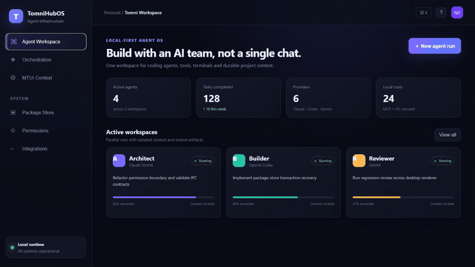
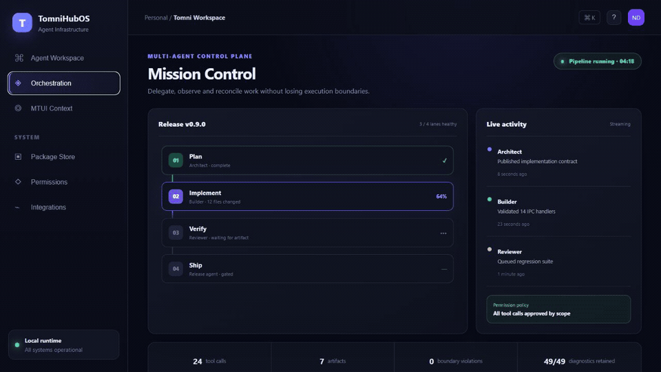
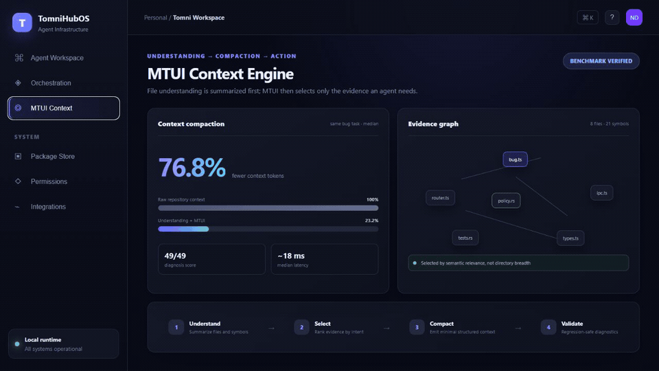
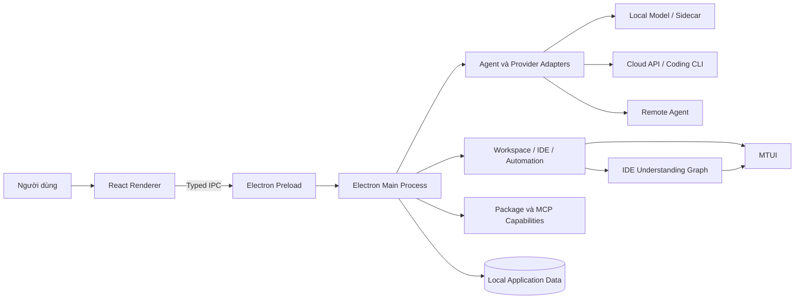

# TomniHubOS

<p align="right"><a href="readme.md">English</a> · <strong>Tiếng Việt</strong></p>

<p align="center">
  
</p>

<p align="center">
  <strong>Không gian làm việc desktop-first cho AI agent, coding tool, local model, cloud provider, MCP và phát triển phần mềm dựa trên ngữ cảnh repository.</strong>
</p>

TomniHubOS hợp nhất hội thoại AI, coding agent, workspace, terminal, IDE, automation, remote access và capability package trong một ứng dụng Electron. Kiến trúc provider-neutral cho phép người dùng kết nối cloud API, coding CLI được giám sát, MCP server hoặc local runtime tương thích OpenAI thay vì bị khóa vào một nhà cung cấp model.

> [!IMPORTANT]
> Dự án đang được phát triển tích cực. Repository có nhiều implementation và test hoạt động, nhưng một số luồng package, isolation, remote và release vẫn đang được harden. Các tài liệu trong `docs/prds/` mô tả định hướng, không phải bằng chứng mọi target capability đã hoàn thiện.

## Demo sản phẩm

<p align="center">
  
</p>
<p align="center"><em>Agent workspace desktop-first với provider trung lập, context tách biệt và local tool có giám sát.</em></p>

<p align="center">
  
</p>
<p align="center"><em>Mission Control hiển thị lane ownership, tiến độ thực thi, tool activity và permission boundary.</em></p>

<p align="center">
  
</p>
<p align="center"><em>IDE Understanding tóm tắt repository trước; MTUI tiếp tục chọn và nén evidence liên quan đến nhiệm vụ.</em></p>

> [!NOTE]
> Các bản ghi dùng đúng layout desktop 16:10 và dữ liệu demo không nhạy cảm. Số liệu trong màn hình MTUI được mô tả và có thể tái lập ở phần benchmark bên dưới.

## Điểm nổi bật

- **Multi-provider AI workspace:** provider adapter, model discovery, session history, file attachment, artifact và assistant tùy chỉnh.
- **Coding agent:** ACP-compatible agent, supervised CLI, Codex app-server, custom agent, terminal session và MCP tool.
- **Desktop IDE:** workspace tree, editor, terminal, Git, preview, planning, repository Understanding và nền tảng team edit.
- **MTUI:** bounded read, deterministic search/compaction, safe edit, history, undo, verification và semantic navigation.
- **Local-first:** local sidecar/runtime và loopback OpenAI-compatible endpoint giúp một số inference path chạy trên máy người dùng.
- **Remote và automation:** WebUI, remote channel, scheduled workflow, company/team collaboration và notification integration.
- **Capability package:** manifest, catalog, install lifecycle, permission và contribution point đang được phát triển thành platform boundary.

## Kiến trúc



Renderer không có quyền Node.js không giới hạn. Native process, credential, persistence, filesystem operation, provider call và package lifecycle được sở hữu bởi main process và đi qua preload/IPC contract cụ thể. Output từ model, tool, package và remote service phải được xem là input không đáng tin cậy.

## MTUI và IDE Understanding

MTUI—**Memory Terminal UI**—là lớp thao tác repository viết bằng Rust tại [`packages/mtui`](packages/mtui). Cơ chế tiết kiệm context gồm hai đường độc lập.

### Thao tác trực tiếp, xác định

`read`, `search`, `stats`, `compact`, `diff`, edit/patch, `history`, `undo`, `verify` và `compass read` làm việc trực tiếp trên file hoặc command output. Chúng không cần AI summary.

Các command này giảm context không cần thiết bằng:

- giới hạn số dòng/ký tự và output JSON ổn định;
- đánh dấu rõ output đã nén hoặc lossy;
- giữ line range, source path và lệnh đọc raw evidence tiếp theo;
- stale-edit protection, history, backup và undo;
- deterministic compaction cho log, test output và traceback.

### Thao tác semantic dựa trên Understanding

Các command như `summary`, `context`, `map` và `info` có thể sử dụng dữ liệu do IDE Understanding xuất ra:

```text
repository files
    ↓
structural analysis và fingerprint
    ↓
LLM summary được cấu hình hoặc deterministic fallback
    ↓
.tomni/understand/summary.json
    ↓
MTUI chọn context nhỏ, phù hợp với task
```

Mỗi file summary ghi nhận nguồn là LLM hay fallback. Khi fingerprint không đổi, summary cũ có thể được tái sử dụng để tránh tốn token tạo lại. MTUI cũng báo cache stale hoặc thiếu để agent refresh Understanding hoặc quay về bounded source read.

Vì vậy, MTUI direct tooling vẫn hoạt động khi không có Understanding; còn semantic ranking chất lượng cao phụ thuộc cache Understanding mới và khớp revision hiện tại. Xem [tài liệu MTUI](packages/mtui/README.md) để biết đầy đủ command.

## Trạng thái benchmark

Repository có [fix-bug evaluation harness](benchmarks/fix-bug) để ghi wall time, input/output token, tool call, nghiên cứu lặp lại, file đã đọc, test, quality và pass/fail giữa các agent tool.

Scorecard được track hiện chưa có comparison row hoàn chỉnh. Do đó README không tuyên bố Tomni nhanh hơn Claude Code, Codex, Kiro hoặc IDE khác, và không công bố một tỷ lệ tiết kiệm token phổ quát cho MTUI.

Một benchmark thuyết phục cần:

- cố định commit, model, prompt và acceptance test;
- so sánh cold cache, fresh Understanding cache và direct tooling;
- tính chi phí indexing/summary và mức độ tái sử dụng cache;
- chạy paired trials nhiều lần;
- đo đồng thời token, thời gian và chất lượng sửa lỗi.

## Công nghệ

| Lớp                     | Công nghệ chính                                               |
| ----------------------- | ------------------------------------------------------------- |
| Desktop                 | Electron, electron-vite, TypeScript, React 19                 |
| UI/Editor               | Arco Design, CodeMirror, Monaco, xterm.js, React Flow         |
| Agent/Model             | ACP, MCP, OpenAI, Anthropic, Google GenAI, AWS Bedrock        |
| Repository intelligence | Rust, tree-sitter, MTUI, IDE Understanding                    |
| Local services          | Express, WebSocket, better-sqlite3, supervised child process  |
| Quality                 | Vitest, Testing Library, Playwright, Bun tests, Oxlint, Oxfmt |
| Distribution            | Bun workspaces, electron-builder, GitHub Actions              |

Dependency tồn tại trong package không đồng nghĩa mọi integration liên quan đã được bật hoặc release-proven.

## Chạy nhanh

Yêu cầu Node.js `>=22 <25`, Bun, Git và native Electron build prerequisites:

```sh
git clone https://github.com/VNDT1625/tomni-hub-agent-os.git
cd tomni-hub-agent-os
bun install
bun run start
```

Các chế độ development hữu ích:

```sh
bun run start:fast
bun run start:multi
bun run dev:services
bun run dev:web
```

Credential nên được cấu hình trong application settings hoặc local environment file không commit. Không đưa service credential vào renderer code.

## Validation

```sh
bun run lint
bun run format:check
bunx tsc --noEmit
bun run test
bun run test:integration
bun run test:e2e
```

Mock test không chứng minh real model, remote service, native process, signed package hoặc clean-machine release path.

## Giới hạn hiện tại

- Nhiều platform area vẫn đang hội tụ; PRD có thể chứa target behavior chưa được wiring end-to-end.
- Local, cloud, CLI, MCP và remote path có yêu cầu vận hành khác nhau và cần được validate độc lập.
- Permission/isolation của package đang tiếp tục được harden theo từng hệ điều hành.
- Cần fresh end-to-end benchmark để định lượng chính xác token và tốc độ fix bug của MTUI kết hợp Understanding.

## Tài liệu và đóng góp

- Bắt đầu từ [documentation index](docs/README.md) và [codebase guide](docs/CODEBASE_GUIDE.md).
- Đọc [CONTRIBUTING.md](CONTRIBUTING.md) và [AGENTS.md](AGENTS.md) trước khi thay đổi repository.

## Ghi nhận và license

TomniHubOS kế thừa một phần công việc trước đây từ AionUi. Lịch sử Git công khai bắt đầu tại mốc nền Tomni/Omni được tạo ngày 15/06/2026; các commit AionUi thượng nguồn trước thời điểm này được chủ động loại khỏi lịch sử, trong khi phần ghi nhận nguồn và các giấy phép bên thứ ba liên quan vẫn được bảo toàn. IDE Understanding tham khảo ý tưởng của [Understand Anything](https://github.com/Lum1104/Understand-Anything) theo MIT License.

Dự án được phát hành theo [Apache License 2.0](LICENSE).
