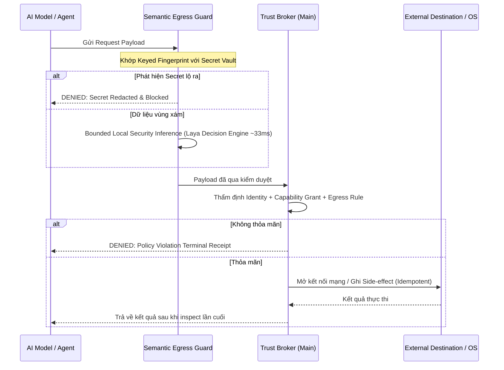
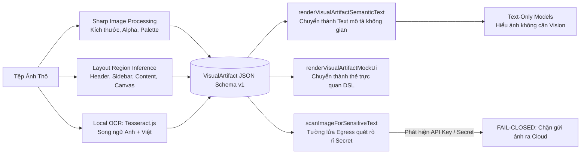
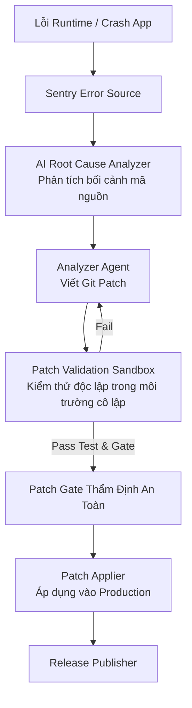

# BÁO CÁO TOÀN DIỆN VỀ KIẾN TRÚC, CHỨC NĂNG VÀ BENCHMARK TOMNIHUBOS

_(TOMNIHUB AGENT OS - COMPREHENSIVE SYSTEM & CAPABILITY GUIDE)_
_Tài liệu chuẩn hóa dành riêng cho AI Agent & Kỹ sư phát triển hệ thống_
_Phiên bản: 2.0.0 | Cập nhật ngày: 2026-09-13 | Mã định danh: TOMNI-OS-SPEC-FULL_

---

## MỤC LỤC

1. [Giới Thiệu Tổng Quan & Triết Lý Thiết Kế](#1-giới-thiệu-tổng-quan--triết-lý-thiết-kế)
2. [Cấu Trúc Đa Gói (Monorepo Architecture)](#2-cấu-trúc-đa-gói-monorepo-architecture)
3. [Kiến Trúc Kỹ Thuật Chi Tiết Của Các Phân Hệ Lõi](#3-kiến-trúc-kỹ-thuật-chi-tiết-của-các-phân-hệ-lõi)
   - 3.1. Foundation Kernel & Bất Biến Vòng Đời Tác Vụ
   - 3.2. Trust Broker, Egress Guard & Bảo Mật Tuyệt Đối
   - 3.3. User Intelligence & Causal Personal Context
   - 3.4. AI Runtime & Topo Mô Hình Bất Biến (Laya Decision Engine + Strong APIs)
   - 3.5. Chat Pipeline & Realtime Knowledge Engine (RTK)
   - 3.6. Store & Nền Tảng Mở Rộng Package Extensibility
   - 3.7. Visual Artifact Engine & Tường Lửa Bảo Mật Hình Ảnh
   - 3.8. Automation Subsystem & Bộ Kết Nối Xã Hội (Facebook, TikTok, Email, n8n, Webhooks)
   - 3.9. Make Video: Xưởng Sản Xuất Phim & Anime AI
   - 3.10. Headless Music Core Engine & Music Studio
   - 3.11. Self-Healing Subsystem (Tier 0 Tự Sửa Lỗi Không Cần LLM)
   - 3.12. AI Monitor, Sentry Bug Collector & Auto-Patch Pipeline
   - 3.13. Multi-Platform Testing Studio & Computer-Use Driver
   - 3.14. Team Workspace & AgentMesh Multi-Agent Collaboration
   - 3.15. External Omni MCP Gateway & Gateway Tunnels
   - 3.16. Dynamic Tool Selector (Keyword + Semantic Context Guard)
   - 3.17. Managed Router9 AI Model Gateway
   - 3.18. Personal Executive Manager (Tasks, Habits, Weather, Travel)
   - 3.19. Exp Graph / ExpBase: Đồ Thị Trí Nhớ Kinh Nghiệm & Bài Học
   - 3.20. Presentation Runtime: Bộ Sinh Slide Thuyết Trình AI Chuẩn Mực
   - 3.21. Desktop Pet / AI Companion & Interactive Confirmation
   - 3.22. Autonomous AI Company Engine (Mô Hình Doanh Nghiệp Tự Vận Hành)
   - 3.23. Autonomous Web Browser Agent & Mô Phỏng Thao Tác Chuột Người
   - 3.24. Creator Preview Runtime (Môi Trường Sandbox Live Web Preview)
   - 3.25. Kênh Giao Tiếp Ngoại Vi: Telegram Bot Integration
   - 3.26. PTY Terminal Subsystem & Shell Integration (OSC 133/633)
   - 3.27. Git Management Engine & Safe Credential Store
   - 3.28. Cron & Scheduled Tasks Background Runner
   - 3.29. Cloud Relay: P2P Workspace Sync qua Cloudflare Durable Objects & R2
   - 3.30. Store API Cloud Backend (Paddle, GCS, Remote Signer, Outbox)
   - 3.31. Headless WebUI Host & Web CLI
   - 3.32. Tomni Account Kit
4. [Bảng Ma Trận Tổng Hợp Toàn Bộ Chức Năng (75+ Hạng Mục)](#4-bảng-ma-trận-tổng-hợp-toàn-bộ-chức-năng)
5. [Các Bộ Benchmark & Thông Số Kỹ Thuật Hiện Tại](#5-các-bộ-benchmark--thông-số-kỹ-thuật-hiện-tại)
   - 5.1. Benchmark MTUI Token Efficiency (Tiết Kiệm Context Window)
   - 5.2. Chẩn Đoán & Benchmark Mô Hình Laya Decision Engine
   - 5.3. Benchmark Hiệu Năng Khởi Động & Bộ Nhớ Ứng Dụng
6. [Hướng Dẫn Dành Cho AI Agent Tiếp Quản Hệ Thống](#6-hướng-dẫn-dành-cho-ai-agent-tiếp-quản-hệ-thống)

---

## 1. GIỚI THIỆU TỔNG QUAN & TRIẾT LÝ THIẾT KẾ

**TomniHubOS** là một **Hệ Điều Hành Tác Tử AI (Hub Agent OS)** được xây dựng trên nền tảng Electron, Node.js, Rust và React/TypeScript. Khác với các ứng dụng AI Chatbot thông thường (chỉ gọi API và hiển thị chữ), TomniHubOS là một hệ sinh thái làm việc hoàn chỉnh, nơi AI có quyền:

- Trực tiếp tương tác với hệ điều hành máy tính (File System, Terminal, Git, GUI Automation);
- Tự động hóa tác vụ đa nền tảng (Web, Windows, Android);
- Vận hành các ứng dụng chuyên nghiệp tải từ Store (IDE, Browser, Design Studio, Document Studio, Music Studio, AI Company, Video Creator);
- Tự phục hồi lỗi (Self-Healing Tier 0) và tự chắp vá mã nguồn khi có crash (AI Bug Monitor & Auto-Patcher);
- Vận hành đa tác tử song song (AgentMesh) và mở cổng MCP cho các công cụ ngoài (Claude Desktop, Cursor).

### 4 Nguyên Tắc Cốt Lõi Bất Biến (Architecture Invariants)

1. **Cô Lập Tiến Trình Tuyệt Đối:**
   - Main Process (`packages/desktop/src/process`): Nơi duy nhất giữ Secret/API Key, điều khiển File System, Socket mạng, Spawn tiến trình. Tuyệt đối không dùng DOM API.
   - Renderer Process (`packages/desktop/src/renderer`): Giao diện người dùng thuần túy, tuyệt đối không truy cập trực tiếp Node.js API hay giữ Plaintext Secret.
   - Preload Bridge (`packages/desktop/src/preload`): Cầu nối IPC duy nhất, có schema chặt chẽ, kiểm tra tính hợp lệ của Frame gửi (`event.senderFrame === mainFrame`) để chống mạo danh.
2. **Deny-by-Default & Egress Guard:** Mọi kết nối mạng ra ngoài máy tính đều bị chặn mặc định. Phải qua cổng thẩm định `TrustBroker`, `SemanticEgressGuard` (quét phát hiện secret) và `imageSecurity` (quét OCR ảnh trước khi gửi ra Cloud).
3. **Causal Personal Context (`needs_reason`):** Bối cảnh người dùng được học tự động chỉ có giá trị khi có lý do/nguyên nhân rõ ràng. Người dùng nắm toàn quyền xem, sửa, xóa, hoặc tắt tính năng học.
4. **Mô Hình Quyết Định Laya Siêu Tốc:** Thay thế hoàn toàn mô hình sinh tự hồi quy Qwen bằng **Laya Decision Engine** (Non-Autoregressive Encoder ~322M/421M, thời gian phản hồi ~33ms) cho các tác vụ cục bộ (Security Egress Guard, User Understanding, Tool Routing). Toàn bộ tác vụ suy luận phức tạp được giao cho các Cloud LLM mạnh mẽ (Claude, GPT, Gemini).

---

## 2. CẤU TRÚC ĐA GÓI (MONOREPO ARCHITECTURE)

Hệ thống được tổ chức dạng monorepo quản lý bằng Bun:

```text
TomniHubOS/
├── packages/
│   ├── desktop/                 # Ứng dụng Desktop chính (Electron + React 19 + Arco Design)
│   │   ├── src/process/         # Electron Main Process (43 phân hệ nghiệp vụ & nền tảng)
│   │   ├── src/preload/         # Cầu nối IPC bảo mật
│   │   └── src/renderer/        # Giao diện UI (21 trang/khu vực chức năng)
│   ├── package-apps/            # Các ứng dụng gói độc lập (Store Packages)
│   │   ├── ide/                 # Trình soạn thảo mã nguồn & MCP Agent Tooling
│   │   ├── browser/             # Trình duyệt tự động hóa tích hợp Page Perception
│   │   ├── company/             # Ứng dụng quản trị Doanh nghiệp AI
│   │   ├── design/              # Design Studio & VIU (Visual Intelligence Unit)
│   │   ├── document-studio/     # Trình biên tập tài liệu Office & Universal Editor
│   │   ├── knowledge/           # Kho tri thức thời gian thực (RTK UI)
│   │   ├── news/                # Ứng dụng tin tức
│   │   ├── pet/                 # Trợ lý Desktop Pet tương tác
│   │   └── terminal/            # Trình giả lập dòng lệnh PTY
│   ├── mtui/                    # Bộ công cụ CLI tối ưu Token & thao tác Repo chuẩn hóa
│   ├── music-core/              # Lõi động cơ âm nhạc Headless (Pure TypeScript)
│   ├── tomny-runtime/           # Sidecar nhị phân viết bằng Rust (High-speed SHA-256 & Task Runner)
│   ├── cloud-relay/             # Cloudflare Worker P2P Collaboration (Durable Objects + R2)
│   ├── store-api/               # Cloud Backend cho Store (Paddle, GCS, Remote Signer, Outbox)
│   ├── tomni-account-kit/       # Bộ SDK & UI định danh tài khoản độc lập
│   ├── web-host/                # Máy chủ chạy WebUI Headless không cần Electron
│   ├── web-cli/                 # Giao diện dòng lệnh điều khiển WebUI
│   └── shared-scripts/          # Tiện ích dùng chung
└── docs/                        # Toàn bộ tài liệu kỹ thuật chuẩn mực
```

---

## 3. KIẾN TRÚC KỸ THUẬT CHI TIẾT CỦA CÁC PHÂN HỆ LÕI

### 3.1. Foundation Kernel & Bất Biến Vòng Đời Tác Vụ

- **RunKernel (`process/foundation/runKernel.ts`):** Máy trạng thái hữu hạn (FSM) quản lý mọi tác vụ của Agent:
  $$\text{created} \longrightarrow \text{authorizing} \longrightarrow \text{running} \longrightarrow \{\text{completed} \mid \text{failed} \mid \text{cancelled}\}$$
  Cung cấp `cancellationToken`, quản lý thời gian timeout, thu hồi tài nguyên (lease coordinator) và xuất biên lai kết thúc (`terminal receipt`).
- **EventStore (`process/foundation/eventStore.ts`):** Nhật ký sự kiện dạng JSONL nối tiếp (append-only), tự động khôi phục tác vụ khi khởi động lại ứng dụng.

### 3.2. Trust Broker, Egress Guard & Bảo Mật Tuyệt Đối



- **TrustBroker (`trustBroker.ts`):** Cấp quyền hạn ngắn hạn, trả về **Opaque Secret Lease** (chuỗi mờ, tuyệt đối không trả plaintext API key cho Model hay Renderer).
- **Semantic Egress Guard (`services/security/semanticEgressGuard.ts`):** Quét chuỗi JSON trước khi mở socket, che giấu bí mật theo hash vault, deadline fail-closed 30 giây.
- **System Egress Authority (`services/security/systemEgressAuthority.ts`):** Khóa cứng mạng trước đăng nhập: chỉ cho phép OIDC HTTPS, update feed và Store catalog có ký số.

### 3.3. User Intelligence & Causal Personal Context

- Quản lý bởi `ContextStore` (`process/agentRuntime/contextStore.ts`).
- **Nguyên tắc Causal (`needs_reason`):** Mọi thói quen/sở thích tự học bắt buộc phải kèm lý do cụ thể. Nếu thiếu nguyên nhân, cờ `needs_reason` được kích hoạt và loại bỏ thông tin khỏi prompt.
- **Kiểm soát người dùng:** Tại `/settings/personal`, người dùng có thể Tạm dừng học (Pause Learning), Duyệt/Từ chối đề xuất, Sửa thông tin, Xóa/Quên vĩnh viễn, hoặc Xuất ra JSON.

### 3.4. AI Runtime & Topo Mô Hình Bất Biến

- **Chuẩn hóa toàn diện sang Laya Decision Engine (322M/421M):**
  - Loại bỏ hoàn toàn mô hình sinh tự hồi quy Qwen (Qwen 2B & Qwen 0.8B LoRA) để loại bỏ nguy cơ rách cú pháp JSON và nghẽn hàng đợi đa tác nhân. Cơ chế Non-Autoregressive (~33ms) phục vụ đồng thời 3 mục tiêu cục bộ:
  1. `security`: Đánh giá rủi ro an toàn dữ liệu xuất khẩu.
  2. `user-understanding`: Trích xuất ngữ cảnh cá nhân có kiểm soát.
  3. `semantic-analysis`: Phân tích ngữ nghĩa dữ liệu tổng hợp.
- **Orchestration:** Ủy thác hoàn toàn cho các Cloud API mạnh (Claude 3.5 Sonnet, GPT-4o, Gemini 2.0 Pro) qua kết nối mạng bảo vệ.
- **Target Neutrality:** Hỗ trợ Loopback OpenAI (`127.0.0.1` offline hoàn toàn cho Ollama/LM Studio), Cloud BYOK (mã hóa an toàn), và Coding CLI runner (ACP Protocol, Codex Server).

### 3.5. Chat Pipeline & Realtime Knowledge Engine (RTK)

- Lưu trữ lịch sử hội thoại dạng native trong SQLite (`process/services/database/nativeConversation/`).
- **RTK Service (`process/knowledge/realtime/rtkService.ts`):** Vector index cục bộ, tính toán độ tươi tri thức, phát hiện mâu thuẫn kiến thức cũ/mới, cung cấp MCP tool `rtk_lookup`, `rtk_record`.

### 3.6. Store & Nền Tảng Package Extensibility

- Gói ứng dụng `.tomny` nén zip có chữ ký số Ed25519.
- Hai cơ chế chạy: `sandboxed-web` (iframe sandbox, chuẩn mặc định cho third-party) và `trusted-react` (renderer native, chỉ dành cho first-party).
- Store Commerce Ledger lưu vết đơn hàng, bản quyền kích hoạt (entitlements) và hoàn tiền (refunds).

### 3.7. Visual Artifact Engine & Tường Lửa Bảo Mật Hình Ảnh

_(Mã nguồn: `packages/desktop/src/process/visualArtifact/`)_



1. **Schema JSON v1 (`types.ts`):** Chuẩn hóa tọa độ kép (pixel thực tế và normalized $[0, 1]$), trích xuất 6 màu chủ đạo, phân vùng không gian (header, sidebar, content), và bóc tách từng dòng chữ qua OCR cục bộ.
2. **Hỗ trợ Model Thuần Text:** Hàm
   enderVisualArtifactSemanticText tạo đoạn văn bản mô tả tọa độ chuẩn xác, giúp các LLM thuần text không có khả năng đọc ảnh trực tiếp hiểu sâu sắc cấu trúc bức ảnh.
3. **Tường Lửa Quét Ảnh (`imageSecurity.ts`):** Chạy OCR cục bộ trước khi gửi ảnh ra ngoài, lọc qua `redactSecretText()`. Nếu phát hiện API key hay mật khẩu, hàm trả về `decision: 'block'`, chặn đứng nguy cơ rò rỉ secret qua ảnh chụp màn hình.

### 3.8. Automation Subsystem & Bộ Kết Nối Xã Hội (Social Connectors)

_(Mã nguồn: `packages/desktop/src/process/automation/`)_

- **Workflow Engine (`workflowEngine.ts`, `nodeExecutors.ts`):** Động cơ thực thi quy trình dạng đồ thị có hướng (DAG), hỗ trợ rẽ nhánh theo điều kiện (`conditions.ts`), lập lịch tự động (`automationScheduler.ts`).
- **Inbound Webhook Server (`webhookServer.ts`):** Mở máy chủ HTTP cục bộ đón nhận Webhook từ bên ngoài (GitHub, Stripe, Zapier, n8n) để kích hoạt tự động quy trình AI.
- **Hệ Thống Connector Phong Phú (`connectors/`):**
  - `facebookPost.ts`: Tự động soạn thảo, đính kèm ảnh và đăng bài lên Facebook Page / Group.
  - `tiktokPost.ts`: Đăng video tự động lên kênh TikTok.
  - `emailSend.ts`: Gửi email báo cáo, thông báo qua giao thức SMTP / API.
  - `cloudUpload.ts`: Tải dữ liệu, artifact lên Google Drive, AWS S3, Cloudflare R2.
  - `videoRender.ts`: Tự động gọi render video nền.
  - `n8n.ts`: Kết nối hai chiều với nền tảng tự động hóa mã nguồn mở n8n.
  - `companyAction.ts`: Tương tác trực tiếp với các phân ban trong AI Company.
  - `appActions.ts`: Kích hoạt ứng dụng máy tính và thực thi phím tắt.
- **Automation MCP Server (`automationMcpServer.ts`):** Cho phép AI Agent tự thiết kế, chỉnh sửa và kích hoạt quy trình tự động hóa qua câu lệnh tự nhiên.

### 3.9. Make Video: Xưởng Sản Xuất Phim & Anime AI

_(Mã nguồn: `packages/desktop/src/process/makevideo/`)_

- **Film Bible Generator (`makeVideoTypes.ts`):** Thiết lập cấu trúc phim chuyên nghiệp: Logline, Synopsis, Thể loại, Tone giọng, Tỉ lệ khung hình (16:9, 9:16, 1:1, 2.39:1 Cinematic), Ngôn ngữ thị giác, Hồ sơ nhân vật (`FilmCharacter`) và Địa điểm quay (`FilmLocation`).
- **Phân Tích Kịch Bản & Khung Hình (`scriptParse.ts`, `videoClipGen.ts`):** Chia kịch bản thành từng Scene độc lập gồm: Lời thuyết minh (Narration), Prompt sinh ảnh chi tiết, và Khung hình đầu/cuối (`frameStartPath`, `frameEndPath`) hỗ trợ công nghệ nội suy video mượt mà (Kling O3, Runway Gen-3).
- **Lồng Tiếng AI & Egress Gate (`voiceGen.ts`, `voiceEgressAuthority.ts`):** Tự động sinh giọng lồng tiếng truyền cảm cho từng nhân vật, có cơ chế kiểm soát chi phí và thẩm định nội dung giọng đọc.
- **Final Export Engine (`finalExport.ts`):** Ghép nối âm thanh, video clip từng cảnh, đồng bộ phụ đề tự động và render xuất bản tệp MP4 hoàn chỉnh.

### 3.10. Headless Music Core Engine & Music Studio

_(Mã nguồn: `packages/music-core/` & `packages/desktop/src/process/music/`)_

- **Kiến trúc Headless Pure TypeScript:** Chạy mượt mà trên cả Main Process, Renderer UI và MCP Agent mà không vướng phụ thuộc trình duyệt hay Node.js DOM.
- **Đôi Tai Của AI ("The Agent's Ears"):**
  - `analysis/pitch.ts`: Nhận diện cao độ nốt nhạc từ sóng âm.
  - `analysis/chroma.ts`: Phân tích phổ hòa âm Chromagram.
  - `analysis/tempo.ts`: Bắt nhịp và đo lường chỉ số BPM chính xác.
  - `analysis/key.ts`: Tự động xác định điệu tính âm nhạc (Trưởng/Thứ - `detectKey`).
- **Lý Thuyết Âm Nhạc & Vocal-Tune Planner (`theory/theory.ts`, `theory/tune.ts`):**
  - Quản lý thang âm (Scale modes), hợp âm (Chords), nhịp phách.
  - Lập lộ trình Auto-Tune hiệu chỉnh cao độ giọng hát tự động theo điệu tính bài hát.
- **Tổng Hợp Âm Thanh & Renderer (`core/synth.ts`, `core/wav.ts`, `core/scheduler.ts`):**
  - Tích hợp bộ tổng hợp âm thanh (Software Synthesizer) và mã hóa file WAV trực tiếp.
- **AI Producer Brain (`agent/producer.ts`):** Cung cấp bộ công cụ MCP toàn diện để Agent sáng tác giai điệu, phối khí, điều chỉnh nhạc cụ và xuất bản bản thu.

### 3.11. Self-Healing Subsystem (Tier 0 Tự Sửa Lỗi Không Cần LLM)

_(Mã nguồn: `packages/desktop/src/process/selfheal/`)_

- **Triết lý:** Không lãng phí token LLM vào các lỗi máy móc mang tính quy luật rõ ràng.
- **Bộ Quy Tắc Nhận Diện Tức Thì (Deterministic Rules):**
  1. `missing-dependency`: Phát hiện thư viện npm còn thiếu và tự động gọi trình quản lý gói cài đặt (`selfHealApplier.ts`).
  2. `invalid-icon-import`: Nhận diện tên icon bị gõ sai và dùng thuật toán Levenshtein Distance (`nearestName.ts`) để sửa lại thành icon xuất khẩu đúng gần nhất.
  3. `missing-locale-file` & `missing-locale-key`: Phát hiện thiếu file ngôn ngữ hoặc key i18n, tự động sao chép từ ngôn ngữ gốc (`en-US`).
  4. `missing-route-module`: Phát hiện file page của route lười (lazy route) bị mất và cảnh báo.
- **Cơ Chế Leo Thang Tier 1:** Bất kỳ lỗi logic phức tạp nào vượt quá quy tắc luật cứng sẽ được đóng gói chuyển lên tầng AI Monitor (`process/monitor`).

### 3.12. AI Monitor, Sentry Bug Collector & Auto-Patch Pipeline

_(Mã nguồn: `packages/desktop/src/process/monitor/`)_



- **Sentry Error Source (`sentryErrorSource.ts`):** Lắng nghe và gom cụm lỗi phát sinh từ người dùng.
- **Root Cause Analyzer (`rootCauseAnalyzer.ts`):** Quét ngược lại cây mã nguồn (`codeContextProvider.ts`), tìm chính xác commit và dòng code gây lỗi.
- **Sandbox Kiểm Thử Bản Vá (`patchValidationSandbox.ts`):** Khởi tạo môi trường ảo, áp dụng bản vá git, chạy bộ test tự động. Nếu vượt qua bài kiểm tra an toàn (`patchGate.ts`), bản vá mới được đưa vào áp dụng chính thức.

### 3.13. Multi-Platform Testing Studio & Computer-Use Driver

_(Mã nguồn: `packages/desktop/src/process/testing/`)_

- **Hỗ Trợ 3 Nền Tảng Lớn:**
  - `web`: Chạy kiểm thử tự động trên trình duyệt web, kiểm tra responsive trên nhiều Viewport (Mobile, Tablet, Desktop).
  - `android`: Kết nối ADB, tự động cài đặt tệp APK và khởi chạy ứng dụng di động.
  - `windows`: Khởi chạy trực tiếp file thực thi `.exe` của hệ điều hành.
- **Hai Cơ Chế Điều Khiển (Driver Kinds):**
  1. `script`: Chạy kịch bản tự động hóa viết sẵn.
  2. **`computer-use` (`computerUseDriver.ts`):** Ứng dụng công nghệ Computer Use AI. Agent trực tiếp quan sát màn hình, tự di chuyển con trỏ chuột, nhấp chuột, cuộn trang và gõ phím như con người thật!
- **Virtual Display Manager (`virtualDisplayManager.ts`):** Cho phép ẩn toàn bộ phiên kiểm thử vào màn hình ảo để không làm phiền người dùng.
- **Quản Lý Vòng Đời Dịch Vụ Phụ Thuộc:** Tự động khởi động Database, Backend API, kiểm tra độ sẵn sàng qua URL/Port/Log (`ServiceReadiness`), quay video màn hình (`recorder.ts`) và xuất báo cáo kết quả kiểm thử.

### 3.14. Team Workspace & AgentMesh Multi-Agent Collaboration

_(Mã nguồn: `packages/desktop/src/process/team/` & `agentRuntime/agentMesh/`)_

- **Không Gian Đa Tác Tử (Team Workspace):** Định nghĩa một đội ngũ Agent cùng giải quyết bài toán lớn, phân chia các vai trò (`TeamAgent`), công việc (`TeamTask`) và không gian làm việc nhóm.
- **AgentMesh Bus:** Kênh liên lạc ngang hàng (Peer-to-Peer) giữa các Agent. Các Agent trao đổi thông điệp:
  - `task`: Giao việc cho Agent khác.
  - `question` & `progress`: Hỏi đáp và cập nhật tiến độ công việc.
  - `handoff`: Chuyển giao ngữ cảnh và kết quả xử lý.
  - `control`: Điều phối và phân xử tranh chấp.
- Trạng thái Agent được đồng bộ thời gian thực: `queued` $\rightarrow$ `waiting_dependency` $\rightarrow$ `active` $\rightarrow$ `completed` / `failed`.

### 3.15. External Omni MCP Gateway & Gateway Tunnels

_(Mã nguồn: `packages/desktop/src/process/omni-gateway/`)_

- Mở máy chủ **Loopback HTTP + SSE Gateway** cố định trên máy tính, cho phép các phần mềm bên ngoài (Claude Desktop, Cursor, ChatGPT, Webhooks) kết nối trực tiếp vào kho công cụ nội bộ của TomniHubOS.
- **Bảo Mật Bằng Bearer Token:** Mã hóa trong OS SafeStorage, hỗ trợ thu hồi và xoay vòng token.
- **Gateway Tunnels (`omniGatewayTunnel.ts`):** Tạo đường hầm an toàn đưa các MCP Tool ra Internet mà không cần mở cổng Router NAT.
- **IDE Allowlist (`omniIdeAllowlist.ts`):** Giới hạn nghiêm ngặt các lệnh shell hoặc thao tác file mà máy trạm bên ngoài được phép gọi.

### 3.16. Dynamic Tool Selector (Keyword + Semantic Context Guard)

_(Mã nguồn: `packages/desktop/src/process/toolselect/`)_

- Khi hệ thống có hàng trăm công cụ MCP từ nhiều package khác nhau, việc đưa toàn bộ định nghĩa tool vào prompt sẽ làm **tràn context window** và gây suy giảm trí thông minh của LLM.
- **Giải Pháp Dynamic Selector:**
  - `keywordFilter.ts`: Lọc nhanh các công cụ theo từ khóa truy vấn.
  - `semanticFilter.ts`: Sử dụng vector embedding so sánh độ tương đồng ngữ nghĩa giữa ý định người dùng và mô tả công cụ.
  - Chỉ đưa vào prompt **Top 5-10 công cụ phù hợp nhất**, tiết kiệm tới 85% token cho mỗi lượt chat!

### 3.17. Managed Router9 AI Model Gateway

_(Mã nguồn: `packages/desktop/src/process/router9/`)_

- Tích hợp sẵn một Model Gateway nội bộ độc lập chạy tại cổng `20129` (tách biệt hoàn toàn với bản 9Router cài rời tại cổng 20128).
- Tự động quản lý tiến trình con (Child Process Lifecycle), lưu trữ khóa bí mật bảng điều khiển (Dashboard Password, JWT Secret) trong OS SafeStorage.
- Đồng bộ nhà cung cấp tự động (`managedRouter9ProviderSync.ts`) và tự khởi động cùng hệ điều hành (`autoStart`).

### 3.18. Personal Executive Manager (Tasks, Habits, Weather, Travel)

_(Mã nguồn: `packages/desktop/src/process/manager/`)_

- **Quản Trị Công Việc & Thói Quen (Tasks & Habits):** Hỗ trợ công việc 1 lần (`oneoff`), định kỳ (`recurring`: daily, weekly, monthly), thói quen vi mô (`habit`) và cột mốc lớn (`milestone`).
- **Nhắc Nhở Thông Minh (Smart Reminders):** Nhắc việc đa kênh, hỗ trợ báo lại (snooze).
- **Trợ Lý Du Lịch & Thời Tiết:**
  - `weatherProvider.ts`: Tích hợp dự báo thời tiết thời gian thực để tư vấn lịch trình.
  - `travelProvider.ts`: Lập kế hoạch chuyến bay, khách sạn, lộ trình di chuyển.
  - `webSearch.ts`: Tra cứu thông tin mạng tức thì hỗ trợ quyết định cá nhân.

### 3.19. Exp Graph / ExpBase: Đồ Thị Trí Nhớ Kinh Nghiệm & Bài Học

_(Mã nguồn: `packages/desktop/src/process/experience/`)_

- Không chỉ lưu trữ lịch sử chat, hệ thống xây dựng một **Đồ Thị Kinh Nghiệm Lập Trình (Experience Graph)**:
  - Phân loại: `successful_fix` (sửa thành công), `agent_mistake` (sai lầm của agent), `failed_attempt` (hướng đi thất bại), `lesson` (bài học rút ra).
  - Quan hệ ngữ nghĩa chặt chẽ: `same_symptom_as`, `same_root_cause`, `supersedes`, `contradicts`, `applies_to`.
- Khi gặp lỗi mới trong code, hệ thống dùng vector index (`experienceVectorIndex.ts`) để gợi nhớ ngay bài học tương tự trong quá khứ, ngăn chặn Agent lặp lại sai lầm cũ!

### 3.20. Presentation Runtime: Bộ Sinh Slide Thuyết Trình AI Chuẩn Mực

_(Mã nguồn: `packages/desktop/src/process/agentRuntime/presentationRuntime/`)_

- Động cơ chuyên biệt tạo bài thuyết trình chuyên nghiệp.
- **Quy Tắc Thiết Kế Khắt Khe (`rules.ts`):** Giới hạn tối đa số từ mỗi gạch đầu dòng (`MAX_BULLET_WORDS`), số gạch đầu dòng mỗi slide (`MAX_SLIDE_BULLETS`), và tổng số từ trên một slide (`MAX_SLIDE_WORDS`).
- **Đánh Giá Chất Lượng Đa Chiều (`scoring.ts`):** Chấm điểm bố cục (`PresentationLayout`), sự phân bổ trực quan (`PresentationVisualKind`) và phát hiện lỗi trình bày trước khi xuất bản.

### 3.21. Desktop Pet / AI Companion & Interactive Confirmation

_(Mã nguồn: `packages/desktop/src/process/pet/` & `packages/package-apps/pet/`)_

- Trợ lý thú ảo trên màn hình máy tính với máy trạng thái cảm xúc (`petStateMachine.ts`): Tương tác khi người dùng rảnh rỗi (`petIdleTicker.ts`), ăn mừng khi hoàn thành tác vụ, hoặc lo lắng khi gặp sự cố code.
- **Xác Nhận Hành Động Nhạy Cảm (`petConfirmManager.ts`):** Thay vì hiển thị popup khô khan, Desktop Pet sẽ trực tiếp đưa ra cử chỉ và lời nhắc thân thiện để người dùng xác nhận các thao tác ghi đè file hoặc chạy lệnh nguy hiểm.

### 3.22. Autonomous AI Company Engine (Doanh Nghiệp AI Tự Vận Hành)

_(Mã nguồn: `packages/desktop/src/process/company/` & `packages/package-apps/company/`)_

- Cho phép người dùng khởi tạo cả một công ty AI từ mô tả ngôn ngữ tự nhiên (`createFromDescription`):
  - Tự động sinh cơ cấu phòng ban (`DivisionSpec`), các chức danh và số lượng nhân sự (`RoleAssignment`).
  - Nạp các quy tắc công ty (`company.json`) vào mọi nhân viên AI thông qua cơ chế phân tầng bối cảnh (`contextLayering.ts`).
  - Gán linh hồn & phong cách làm việc cho từng vai trò thông qua Soul Templates (`soulTemplates.ts`).
  - Nén và lưu trữ trí nhớ dài hạn của doanh nghiệp (`memoryCompactor.ts`, `memoryStore.ts`).

### 3.23. Autonomous Web Browser Agent & Mô Phỏng Thao Tác Chuột Người

_(Mã nguồn: `packages/desktop/src/process/browser/` & `packages/package-apps/browser/`)_

- **Page Perception (`pagePerception.ts`):** Trích xuất DOM và Cây trợ năng (Accessibility Tree), đánh số ID cho mọi nút bấm, ô nhập liệu trên trang web để Agent dễ dàng ra lệnh.
- **Human-Like Input (`humanLikeInput.ts`):**
  - Di chuyển chuột theo **đường cong Bezier ngẫu nhiên tự nhiên** thay vì nhảy cóc tức thì.
  - Mô phỏng độ trễ gõ phím ngẫu nhiên (Keystroke Jitter) để **vượt qua các hệ thống phát hiện Bot (Anti-Bot Detection)** như Cloudflare Turnstile hay reCAPTCHA.
- **WebAgentRunner (`webAgentRunner.ts`):** Tự động điều hướng, giải quyết tác vụ phức tạp trên web, điền form, tải tài liệu và quay video phiên làm việc (`mediaPipeline.ts`).

### 3.24. Creator Preview Runtime (Môi Trường Sandbox Live Web Preview)

_(Mã nguồn: `packages/desktop/src/process/workspace/creatorPreviewRuntime.ts`)_

- Cung cấp môi trường xem trước trực tiếp (Live Preview) tương tự v0 hay WebContainers cho các ứng dụng web do AI tạo ra.
- Chạy hoàn toàn trong sandbox cô lập an toàn (`creatorPreviewPolicy.ts`), có cơ chế thu hồi tài nguyên, ghi nhận biên lai thực thi và bắt lỗi sập trang mượt mà.

### 3.25. Kênh Giao Tiếp Ngoại Vi: Telegram Bot Integration

_(Mã nguồn: `packages/desktop/src/process/services/telegram/service.ts`)_

- Ghép nối an toàn qua mã Pairing Code một lần (`IChannelPairingRequest`).
- Cho phép người dùng nhắn tin với Hub AI Agent từ xa qua Telegram khi không ngồi trước máy tính; Agent có thể trả lời, tra cứu tri thức, kích hoạt tool và đồng bộ toàn bộ lịch sử về máy tính để bàn.

### 3.26. PTY Terminal Subsystem & Shell Integration (OSC 133/633)

_(Mã nguồn: `packages/desktop/src/process/ideTerminal/`)_

- Sử dụng backend PTY thật (`nodePtyBackend.ts`, `ptyBackend.ts`) hỗ trợ đầy đủ các shell: PowerShell, CMD, Git Bash, WSL, Bash, Zsh.
- Tích hợp chuẩn **OSC 133/633 Shell Markers**: Bắt chính xác thời điểm câu lệnh bắt đầu chạy, kết thúc và mã thoát (exit code), cho phép Agent nhận biết lệnh shell thành công hay thất bại một cách tuyệt đối.
- Tích hợp bộ lập lịch lệnh định kỳ (`terminalScheduler.ts`).

### 3.27. Git Management Engine & Safe Credential Store

_(Mã nguồn: `packages/desktop/src/process/git/`)_

- Hệ thống quản trị Git chuyên sâu: Khởi tạo, clone, fetch, pull, commit, switch branch, diff kiểm tra thay đổi.
- Lưu trữ mật khẩu và SSH Key trong `gitCredentialStore.ts` an toàn tuyệt đối.

### 3.28. Cron & Scheduled Tasks Background Runner

_(Mã nguồn: `packages/desktop/src/process/cron/`)_

- Quản lý các tác vụ nền định kỳ, báo thức, nhắc việc và gọi API tự động theo biểu thức Cron.
- Cung cấp bộ công cụ MCP `cron_schedule` để AI tự động lên lịch chạy tác vụ trong tương lai; hỗ trợ tự động sửa lỗi lệch múi giờ (`repairCronJobTimeZone.ts`).

### 3.29. Cloud Relay: P2P Workspace Sync qua Cloudflare Durable Objects & R2

_(Mã nguồn: `packages/cloud-relay/`)_

- Xây dựng trên Cloudflare Workers với Durable Objects (`WorkspaceRoom`) và R2 Bucket.
- Đồng bộ hóa thời gian thực (Realtime Collaborative Workspace):
  - Khóa file đang sửa (File Lease Locking) để tránh xung đột giữa người và Agent.
  - Chuỗi tuần tự hóa thay đổi (Sequence Revisions) áp dụng biến đổi vận hành (Operational Transformation).
  - Đồng bộ tệp nhị phân lớn qua R2 Storage.

### 3.30. Store API Cloud Backend (Paddle, GCS, Remote Signer, Outbox)

_(Mã nguồn: `packages/store-api/`)_

- Kiến trúc backend đám mây hoàn chỉnh cho Chợ ứng dụng Store:
  - Tích hợp cổng thanh toán Paddle quốc tế (`paddle.ts`).
  - Quản lý kho tệp gói `.tomny` trên Google Cloud Storage (`gcs.ts`).
  - Dịch vụ ký số từ xa Ed25519 (`remoteSigner.ts`).
  - Mẫu thiết kế Transactional Outbox Pattern (`outboxWorker.ts`) đảm bảo tính nhất quán tài chính và sự kiện cài đặt.
  - Tự động sao lưu và mã hóa cơ sở dữ liệu (`backupCrypto.ts`, `backupStore.ts`).

### 3.31. Headless WebUI Host & Web CLI

_(Mã nguồn: `packages/web-host/` & `packages/web-cli/`)_

- Cho phép chạy TomniHubOS trên máy chủ Linux/Docker không có màn hình hiển thị (Headless Server).
- Phục vụ WebUI tĩnh qua trình duyệt (`static-server.ts`) và điều khiển toàn bộ Agent qua dòng lệnh `web-cli`.

### 3.32. Tomni Account Kit

_(Mã nguồn: `packages/tomni-account-kit/`)_

- Bộ thư viện độc lập cung cấp giao diện và máy trạng thái đăng nhập, xác thực OAuth/OIDC, quản lý phiên làm việc và hiển thị số dư tài khoản người dùng.

---

## 4. BẢNG MA TRẬN TỔNG HỢP TOÀN BỘ CHỨC NĂNG

_(Toàn bộ 75+ Chức Năng Đã Được Kiểm Chứng Trong Codebase)_

|  STT   | Phân Hệ (Subsystem)         | Tên Chức Năng (Feature Name)                              | Mô Tả Kỹ Thuật & Năng Lực (Capabilities)                                                                              | Trạng Thái (Status) |   Runs Now?   | UI Route / Surface             | Thành Phần Mã Nguồn (Source Seams)                                                        |
| :----: | :-------------------------- | :-------------------------------------------------------- | :-------------------------------------------------------------------------------------------------------------------- | :-----------------: | :-----------: | :----------------------------- | :---------------------------------------------------------------------------------------- |
| **1**  | **Identity & Account Gate** | Cổng xác thực tài khoản (Account-First Gate)              | Buộc đăng nhập OAuth/OIDC + PKCE qua browser trước khi vào app. Lưu session trong OS safeStorage.                     |      `PARTIAL`      |    **YES**    | `/login`                       | `process/security/accountSessionService.ts`, `renderer/pages/login/index.tsx`             |
| **2**  | **Identity & Account Gate** | Quản lý phiên & Đăng xuất (Session & Sign-Out)            | Quản lý vòng đời token, thu hồi token, xóa sạch session vault khi đăng xuất, dừng tiến trình liên quan.               |      `PARTIAL`      |    **YES**    | Global App Shell               | `ACCOUNT_SESSION_NATIVE_CHANNELS`, `accountSessionBridge.ts`                              |
| **3**  | **Identity & Account Gate** | Quản lý đồng ý chẩn đoán (Diagnostics Consent)            | Cửa sổ hỏi ý kiến gửi crash logs & telemetry về Sentry. Mặc định là từ chối (Fail-Closed).                            |      `CURRENT`      |    **YES**    | `/settings/system`             | `main.ts (preload)`, `sentry.ts`, `systemSettingsBridge.ts`                               |
| **4**  | **Hub Orchestration**       | Màn hình Hub Guidance / Home                              | Điều hướng trung tâm: gợi ý tác vụ, hiển thị app đã cài, trạng thái Agent, tạo hội thoại nhanh.                       |      `PARTIAL`      |    **YES**    | `/guid`                        | `renderer/pages/guid/index.tsx`, `renderer/components/layout/Sider.tsx`                   |
| **5**  | **Hub Orchestration**       | Điều phối Run Kernel (Foundation RunKernel)               | Quản lý FSM vòng đời tác vụ: lease tài nguyên, timeout, hủy bỏ, cấp biên lai kết thúc.                                |      `PARTIAL`      |    **YES**    | Global Core                    | `process/foundation/runKernel.ts`, `process/bridge/foundationBridge.ts`                   |
| **6**  | **Hub Orchestration**       | Nhật ký sự kiện bất biến (Foundation Event Store)         | Ghi nối tiếp nhật ký sự kiện dạng JSONL, phục hồi trạng thái tác vụ dở dang sau restart.                              |      `CURRENT`      |    **YES**    | Core Platform                  | `process/foundation/eventStore.ts`, `tests/unit/foundation/eventStore.test.ts`            |
| **7**  | **Hub Orchestration**       | Lập kế hoạch Goal-to-Surface Planner                      | Nhận mục tiêu từ người dùng, đối chiếu danh mục năng lực để lập lộ trình thực thi tối ưu.                             |      `PARTIAL`      |    **YES**    | `/manager/workspace`, `/store` | `process/bridge/foundationBridge.ts`, `HUB_GOAL_SURFACE_PLANNING_NATIVE_CHANNELS`         |
| **8**  | **Hub Orchestration**       | Điều phối hành động Goal-to-Surface Action                | Chuẩn bị, thực thi và hủy bỏ hành động đã lập kế hoạch; khôi phục hành động bị ngắt quãng.                            |      `PARTIAL`      | **DEV/LOCAL** | `/manager/workspace`           | `HUB_GOAL_SURFACE_ACTION_NATIVE_CHANNELS`, `hubGoalSurfaceAction.ts`                      |
| **9**  | **Chat & Conversation**     | Giao diện hội thoại bản địa (Native Conversation Chat)    | Nhắn tin thời gian thực với Agent: streaming markdown, biểu đồ Mermaid, công thức KaTeX, highlight code.              |      `CURRENT`      |    **YES**    | `/conversation/:id`            | `renderer/pages/conversation/index.tsx`, `process/services/database/nativeConversation/`  |
| **10** | **Chat & Conversation**     | Lịch sử hội thoại (Conversation History)                  | Lưu trữ SQLite cục bộ, tìm kiếm nhanh, đổi tên tiêu đề, gắn thẻ và xóa hội thoại.                                     |      `CURRENT`      |    **YES**    | `/history`, Sider drawer       | `renderer/pages/hub/HistoryPage.tsx`, `ConversationHistoryContext.tsx`                    |
| **11** | **Chat & Conversation**     | Khối xem trước trực quan (Preview Context / Block)        | Hiển thị widget xem trước code HTML/CSS/JS, diff so sánh file trực tiếp trong luồng chat.                             |      `CURRENT`      |    **YES**    | Inline chat                    | `renderer/pages/conversation/Preview/`, `diff2html`                                       |
| **12** | **Chat & Conversation**     | Realtime Knowledge Engine (RTK)                           | Kho tri thức vector cục bộ, kiểm tra độ tươi tri thức, phát hiện mâu thuẫn, MCP tool `rtk_lookup`.                    |      `CURRENT`      |    **YES**    | Background / MCP               | `process/knowledge/realtime/rtkService.ts`, `rtkVectorIndex.ts`                           |
| **13** | **Visual & Multimodal**     | Phân tích ảnh thành JSON (Visual Artifact Engine)         | Bóc tách ảnh ra schema JSON: kích thước, hệ tọa độ $[0, 1]$, bảng màu 6 sắc, phân vùng, OCR chữ.                      |      `CURRENT`      |    **YES**    | Backend Core                   | `packages/desktop/src/process/visualArtifact/visualArtifact.ts`, `types.ts`               |
| **14** | **Visual & Multimodal**     | Dịch ảnh sang Semantic Text & Mock UI DSL                 | Chuyển JSON ảnh thành văn bản mô tả tọa độ giúp LLM thuần text hiểu trọn vẹn bố cục ảnh.                              |      `CURRENT`      |    **YES**    | MCP / Backend                  | `visualArtifact.ts (renderVisualArtifactSemanticText, renderVisualArtifactMockUi)`        |
| **15** | **Visual & Multimodal**     | Tường lửa bảo mật ảnh (Image Egress Security)             | Quét OCR cục bộ toàn bộ chữ trong ảnh trước khi gửi ra Cloud; tự động block nếu chứa API key/mật khẩu.                |      `CURRENT`      |    **YES**    | Security Boundary              | `packages/desktop/src/process/visualArtifact/imageSecurity.ts`                            |
| **16** | **Visual & Multimodal**     | Chuyển đổi tài liệu vạn năng (Document Conversion)        | Chuyển đổi linh hoạt: Word sang PDF, PDF text sang Word, PDF scan sang Word qua OCR có quản lý lease.                 |      `CURRENT`      |    **YES**    | Main Process Service           | `packages/desktop/src/process/conversion/conversionService.ts`, `pdfScanToWord.ts`        |
| **17** | **Trust & Security**        | Xác thực nguồn gửi IPC (Trusted Renderer Guard)           | Kiểm tra `event.senderFrame === mainFrame`, ngăn chặn tấn công mạo danh từ iframe độc hại.                            |      `CURRENT`      |    **YES**    | Preload / IPC                  | `common/adapter/main.ts`, `tests/unit/common-adapter/main.test.ts`                        |
| **18** | **Trust & Security**        | Kho bảo mật khóa (Secret Vault & OS SafeStorage)          | Mã hóa phần cứng DPAPI / Keychain; trả về chuỗi mờ (opaque lease), không lộ plaintext API key.                        |      `CURRENT`      |    **YES**    | Background Service             | `process/agentRuntime/secretVault.ts`, `process/services/tomnyProviderStore.ts`           |
| **19** | **Trust & Security**        | Tường lửa Semantic Egress Guard                           | Quét chuỗi JSON trước khi ra ngoài mạng, che giấu secret, phân tích rủi ro an toàn bằng Laya Decision Engine (~33ms). |       CURRENT       |    **YES**    | Background Egress              | services/security/semanticEgressGuard.ts, layaSemanticEgressModel.ts                      |
| **20** | **Trust & Security**        | Thẻ phê duyệt quyền tác động (Permission Approval Card)   | Hiển thị thẻ yêu cầu người dùng bấm duyệt trước khi Agent ghi file, chạy lệnh shell, hay gọi mạng.                    |      `PARTIAL`      |    **YES**    | Inline trong chat              | `renderer/pages/conversation/components/PermissionCard.tsx`                               |
| **21** | **Trust & Security**        | Quyền hạn Egress trước xác thực (System Egress Authority) | Khóa cứng mạng trước đăng nhập: chỉ mở OIDC HTTPS, update feed có chữ ký, Store catalog có chữ ký.                    |      `CURRENT`      |    **YES**    | Pre-auth Network               | `services/security/systemEgressAuthority.ts`                                              |
| **22** | **User Intelligence**       | Bối cảnh cá nhân nhân quả (ContextStore)                  | Lưu trữ thói quen/sở thích người dùng. Bắt buộc có lý do (`needs_reason`), cấm suy diễn tùy tiện.                     |      `CURRENT`      |    **YES**    | Background Service             | `process/agentRuntime/contextStore.ts`, `contextComposer.ts`                              |
| **23** | **User Intelligence**       | Bảng điều khiển quyền riêng tư (Personal Settings)        | Giao diện tạm dừng học (Pause Learning), duyệt/từ chối đề xuất, sửa sai, quên, xuất dữ liệu JSON.                     |      `CURRENT`      |    **YES**    | `/settings/personal`           | `renderer/pages/settings/PersonalSettings.tsx`                                            |
| **24** | **AI Models & Adapters**    | Kết nối mô hình Local Loopback (OpenAI Adapter)           | Kết nối Ollama, vLLM, LM Studio tại `127.0.0.1`. Tuyệt đối không fallback ra ngoài, chạy 100% offline.                |      `CURRENT`      |    **YES**    | `/settings/model`              | `process/experimentalCore/adapters/loopbackOpenAiAdapter.ts`                              |
| **25** | **AI Models & Adapters**    | Cấu hình nhà cung cấp Cloud AI (BYOK)                     | Quản lý API Key cho OpenAI, Anthropic, Google Gemini, Groq, DeepSeek, Bedrock trong OS Vault.                         |      `CURRENT`      |    **YES**    | `/settings/model`              | `renderer/pages/settings/ModeSettings.tsx`, `tomnyProviderStore.ts`                       |
| **26** | **AI Models & Adapters**    | Mẫu cấu hình Trợ lý ảo (Assistant Settings)               | Quản lý danh sách Assistant, cấu hình System Prompt, Temperature, và gán model tương ứng.                             |      `CURRENT`      |    **YES**    | `/settings/assistants`         | `renderer/pages/settings/AssistantSettings.tsx`                                           |
| **27** | **AI Models & Adapters**    | Tích hợp Coding CLIs giám sát (ACP & Codex)               | Điều khiển các công cụ coding chuyên sâu qua giao thức ACP và Codex App Server an toàn.                               |      `PARTIAL`      |    **YES**    | Terminal / Background          | `packages/desktop/src/process/experimentalCore/adapters/acp/`                             |
| **28** | **AI Models & Adapters**    | Native Rust Sidecar Runtime (`tomny-runtime`)             | Tiến trình Rust độc lập xử lý băm SHA-256 cực nhanh và tác vụ nền qua Stdin/Stdout IPC.                               |      `CURRENT`      |    **YES**    | Native Sidecar                 | `packages/tomny-runtime/src/main.rs`, `Cargo.toml`                                        |
| **29** | **Store & Commerce**        | Duyệt & Tìm kiếm Gói Store (Store Catalog)                | Duyệt ứng dụng theo danh mục, tìm kiếm ưu tiên gói đã cài đặt, xem minh bạch package facts.                           |      `PARTIAL`      |    **YES**    | `/store`, `/store/package/:id` | `renderer/pages/hub/StorePage.tsx`, `StoreProductDetail.tsx`                              |
| **30** | **Store & Commerce**        | Vòng đời cài đặt gói miễn phí (Package Lifecycle)         | Tải gói `.tomny`, xác thực chữ ký Ed25519, giải nén nguyên tử, bật/tắt, gỡ cài đặt, rollback.                         |      `PARTIAL`      |    **YES**    | `/store`                       | `process/extensions/package-manager/PackageManagerService.ts`                             |
| **31** | **Store & Commerce**        | Cổng nộp ứng dụng Publisher (Submission)                  | Hộp thoại chọn tệp gói `.tomny` native, quét bảo mật tự động, xuất bảng đánh giá kỹ thuật.                            |      `PARTIAL`      | **DEV/LOCAL** | `/manager/workspace`           | `PUBLISHER_SUBMISSION_NATIVE_CHANNELS`, `publisherSubmissionBoundary.ts`                  |
| **32** | **Automation & Workflows**  | Động cơ Workflow DAG (Automation Workflow Engine)         | Thực thi quy trình tự động hóa dạng đồ thị có hướng (DAG), phân nhánh rẽ điều kiện, xử lý node.                       |      `CURRENT`      |    **YES**    | Main Process Service           | `packages/desktop/src/process/automation/workflowEngine.ts`, `nodeExecutors.ts`           |
| **33** | **Automation & Workflows**  | Máy chủ Inbound Webhook (Local Webhook Server)            | Lắng nghe Webhook bên ngoài (Stripe, GitHub, Zapier, n8n) để kích hoạt tự động quy trình AI.                          |      `CURRENT`      |    **YES**    | Background Server              | `packages/desktop/src/process/automation/webhookServer.ts`                                |
| **34** | **Automation & Workflows**  | Bộ kết nối Facebook Auto-Post                             | Tự động soạn nội dung, gắn ảnh và xuất bản bài viết lên Facebook Page/Group.                                          |      `CURRENT`      |    **YES**    | Automation Connector           | `packages/desktop/src/process/automation/connectors/facebookPost.ts`                      |
| **35** | **Automation & Workflows**  | Bộ kết nối TikTok Auto-Post                               | Tự động tải và đăng video lên kênh TikTok qua API đã xác thực.                                                        |      `CURRENT`      |    **YES**    | Automation Connector           | `packages/desktop/src/process/automation/connectors/tiktokPost.ts`                        |
| **36** | **Automation & Workflows**  | Bộ kết nối Email & Cloud Upload                           | Gửi email SMTP tự động và upload tệp lên Google Drive, AWS S3, Cloudflare R2.                                         |      `CURRENT`      |    **YES**    | Automation Connector           | `packages/desktop/src/process/automation/connectors/emailSend.ts`, `cloudUpload.ts`       |
| **37** | **Automation & Workflows**  | Bộ kết nối n8n & OS App Actions                           | Tích hợp hai chiều với nền tảng n8n và kích hoạt thao tác ứng dụng hệ điều hành.                                      |      `CURRENT`      |    **YES**    | Automation Connector           | `packages/desktop/src/process/automation/connectors/n8n.ts`, `appActions.ts`              |
| **38** | **Automation & Workflows**  | Automation MCP Server                                     | Cho phép AI Agent tự lập trình, cấu hình và kích hoạt các workflow tự động hóa qua câu lệnh.                          |      `CURRENT`      |    **YES**    | MCP Server                     | `packages/desktop/src/process/automation/automationMcpServer.ts`                          |
| **39** | **Make Video AI**           | Film Bible Generator (Cấu trúc phim AI)                   | Xây dựng tài liệu sản xuất phim: Thể loại, Tone, Tỉ lệ (16:9, 9:16, 2.39:1), Nhân vật, Địa điểm.                      |      `CURRENT`      |    **YES**    | Video Production               | `packages/desktop/src/process/makevideo/makeVideoTypes.ts`                                |
| **40** | **Make Video AI**           | AI Scene & Video Clip Generator                           | Sinh kịch bản phân cảnh, prompt hình ảnh, nội suy chuyển động khung hình đầu/cuối (Kling O3).                         |      `CURRENT`      |    **YES**    | Video Production               | `packages/desktop/src/process/makevideo/scriptParse.ts`, `videoClipGen.ts`                |
| **41** | **Make Video AI**           | AI Voice-over & Final MP4 Exporter                        | Sinh giọng lồng tiếng theo nhân vật có kiểm soát egress; ghép nối video, audio, phụ đề ra MP4.                        |      `CURRENT`      |    **YES**    | Video Production               | `packages/desktop/src/process/makevideo/voiceGen.ts`, `finalExport.ts`                    |
| **42** | **Music Core & Studio**     | Động cơ âm thanh Headless (`@tomny/music-core`)           | Động cơ âm nhạc pure TypeScript: tổng hợp âm thanh (Synth), mã hóa WAV, lập lịch nhịp phách.                          |      `CURRENT`      |    **YES**    | Package / Headless             | `packages/music-core/src/index.ts`, `core/synth.ts`, `core/wav.ts`                        |
| **43** | **Music Core & Studio**     | Phân tích âm thanh AI ("The Agent's Ears")                | Bóc tách cao độ (Pitch), phổ hòa âm (Chroma), tốc độ nhịp (Tempo/BPM) và điệu tính (`detectKey`).                     |      `CURRENT`      |    **YES**    | Analysis Engine                | `packages/music-core/src/analysis/` (pitch, chroma, tempo, key)                           |
| **44** | **Music Core & Studio**     | Lý thuyết âm nhạc & Vocal-Tune Planner                    | Quản lý thang âm, hợp âm, thuật toán Auto-Tune tự động chỉnh phô giọng hát theo tone bài hát.                         |      `CURRENT`      |    **YES**    | Music Theory                   | `packages/music-core/src/theory/theory.ts`, `theory/tune.ts`                              |
| **45** | **Music Core & Studio**     | AI Producer Brain & Music MCP Tools                       | Bộ công cụ MCP điều khiển phối khí, sáng tác giai điệu và làm chủ phòng thu âm thanh.                                 |      `CURRENT`      |    **YES**    | MCP Server / UI                | `packages/desktop/src/process/music/musicMcpServer.ts`, `music-core/src/agent/`           |
| **46** | **Self-Healing**            | Tự sửa lỗi quy tắc không cần LLM (Tier 0)                 | Quét và sửa tự động: cài npm thiếu, sửa sai tên icon (`nearestName`), bổ sung file/key i18n thiếu.                    |      `CURRENT`      |    **YES**    | System Startup                 | `packages/desktop/src/process/selfheal/selfHealService.ts`, `selfHealApplier.ts`          |
| **47** | **Self-Healing**            | Leo thang chẩn đoán chuyên sâu (Tier 1 Escalation)        | Chuyển tiếp các lỗi kiến trúc phức tạp không có quy tắc cố định lên AI Root Cause Analyzer.                           |      `CURRENT`      |    **YES**    | Background                     | `packages/desktop/src/process/selfheal/selfHealTypes.ts`                                  |
| **48** | **AI Bug Monitor**          | Thu thập lỗi ứng dụng (Sentry Error Collector)            | Bắt lỗi runtime, ngoại lệ crash app thực tế và gom cụm phục vụ sửa chữa tự động.                                      |      `CURRENT`      |    **YES**    | Monitoring Service             | `packages/desktop/src/process/monitor/sentryErrorSource.ts`                               |
| **49** | **AI Bug Monitor**          | Phân tích nguyên nhân gốc rễ (Root Cause Analyzer)        | AI Agent phân tích ngữ cảnh mã nguồn, xác định dòng code và commit phát sinh lỗi.                                     |      `CURRENT`      |    **YES**    | AI Diagnostic                  | `packages/desktop/src/process/monitor/rootCauseAnalyzer.ts`, `analyzerAgent.ts`           |
| **50** | **AI Bug Monitor**          | Sandbox kiểm thử & Áp dụng bản vá (Patch Pipeline)        | Sinh Git Patch, kiểm thử trong sandbox cô lập (`patchValidationSandbox`), thẩm định và áp dụng.                       |      `CURRENT`      |    **YES**    | Patch Engine                   | `packages/desktop/src/process/monitor/patchValidationSandbox.ts`, `patchGate.ts`          |
| **51** | **Testing Studio**          | Kiểm thử đa nền tảng (Multi-Platform Testing)             | Hỗ trợ tự động hóa kiểm thử trên 3 nền tảng: Web (đa viewport), Android (ADB/APK), Windows (EXE).                     |      `CURRENT`      |    **YES**    | Testing Framework              | `packages/desktop/src/process/testing/testingTypes.ts`, `testOrchestrator.ts`             |
| **52** | **Testing Studio**          | Điều khiển Computer Use (AI GUI Automation)               | AI trực tiếp quan sát màn hình, di chuyển chuột, click và gõ bàn phím thật để test ứng dụng.                          |      `CURRENT`      |    **YES**    | AI Driver                      | `packages/desktop/src/process/testing/computerUseDriver.ts`                               |
| **53** | **Testing Studio**          | Màn hình ảo & Quản lý dịch vụ phụ thuộc                   | Màn hình ảo chạy ngầm (`virtualDisplayManager`), tự khởi động DB/Backend, quay video buổi test.                       |      `CURRENT`      |    **YES**    | Testing Infrastructure         | `packages/desktop/src/process/testing/virtualDisplayManager.ts`, `recorder.ts`            |
| **54** | **Team & AgentMesh**        | Không gian làm việc nhóm (Team Workspace)                 | Định nghĩa đội ngũ AI: phân bổ vai trò (`TeamAgent`), giao việc (`TeamTask`), quản lý binding.                        |      `CURRENT`      |    **YES**    | `/team/:id`                    | `packages/desktop/src/process/team/teamBridge.ts`, `teamStore.ts`                         |
| **55** | **Team & AgentMesh**        | Trục giao tiếp đa tác tử (AgentMesh Bus)                  | Kênh nhắn tin P2P giữa các Agent: trao đổi nhiệm vụ, hỏi đáp, báo cáo tiến độ, chuyển giao ngữ cảnh.                  |      `CURRENT`      |    **YES**    | Core Mesh                      | `packages/desktop/src/process/agentRuntime/agentMesh/mesh.ts`                             |
| **56** | **Omni Gateway**            | Cổng kết nối MCP ngoài (External Omni Gateway)            | Máy chủ HTTP + SSE loopback tiếp nhận kết nối an toàn từ Claude Desktop, Cursor, ChatGPT.                             |      `CURRENT`      |    **YES**    | Gateway Server                 | `packages/desktop/src/process/omni-gateway/omniGatewayHost.ts`                            |
| **57** | **Omni Gateway**            | Đường hầm mạng an toàn (Gateway Tunnels)                  | Tạo tunnel đưa công cụ MCP nội bộ ra Internet an toàn mà không cần mở cổng NAT router.                                |      `CURRENT`      |    **YES**    | Networking                     | `packages/desktop/src/process/omni-gateway/omniGatewayTunnel.ts`                          |
| **58** | **Omni Gateway**            | Danh sách trắng an toàn IDE (IDE Allowlist)               | Kiểm soát nghiêm ngặt các lệnh và đường dẫn file mà máy trạm bên ngoài được phép gọi.                                 |      `CURRENT`      |    **YES**    | Security Guard                 | `packages/desktop/src/process/omni-gateway/omniIdeAllowlist.ts`                           |
| **59** | **Tool Selection**          | Bộ lọc công cụ động (Dynamic Tool Selector)               | Lọc từ khóa và vector embedding chọn Top 5-10 công cụ phù hợp nhất, chống tràn context prompt.                        |      `CURRENT`      |    **YES**    | Context Optimizer              | `packages/desktop/src/process/toolselect/toolSelector.ts`, `semanticFilter.ts`            |
| **60** | **Model Gateway**           | Quản lý Router9 nội bộ (Managed Router9)                  | Điều phối tiến trình 9Router tại cổng 20129: mã hóa secret, đồng bộ model, tự khởi động.                              |      `CURRENT`      |    **YES**    | Model Proxy                    | `packages/desktop/src/process/router9/managedRouter9.ts`                                  |
| **61** | **Personal Manager**        | Quản lý công việc & Thói quen (Tasks & Habits)            | Quản trị task 1 lần, định kỳ (daily/weekly/monthly), thói quen vi mô, cột mốc, nhắc việc kèm snooze.                  |      `CURRENT`      |    **YES**    | Personal Suite                 | `packages/desktop/src/process/manager/managerStore.ts`, `managerTypes.ts`                 |
| **62** | **Personal Manager**        | Trợ lý thời tiết & Du lịch (Weather & Travel)             | Dự báo thời tiết thời gian thực, lập kế hoạch vé máy bay, khách sạn, lộ trình di chuyển.                              |      `CURRENT`      |    **YES**    | Personal Suite / MCP           | `packages/desktop/src/process/manager/weatherProvider.ts`, `travelProvider.ts`            |
| **63** | **Personal Manager**        | Trích xuất tài liệu & Web Search cá nhân                  | Bóc tách dữ liệu tài liệu và tích hợp tìm kiếm web tức thì phục vụ ra quyết định.                                     |      `CURRENT`      |    **YES**    | Personal Suite / MCP           | `packages/desktop/src/process/manager/docExtractor.ts`, `webSearch.ts`                    |
| **64** | **Exp Graph**               | Đồ thị trí nhớ bài học kinh nghiệm (ExpBase)              | Ghi nhận sai lầm (`agent_mistake`), hướng giải quyết (`successful_fix`), bài học (`lesson`).                          |      `CURRENT`      |    **YES**    | Memory Graph                   | `packages/desktop/src/process/experience/experienceTypes.ts`, `experienceStore.ts`        |
| **65** | **Exp Graph**               | Truy xuất bài học tương tự (Lesson Retrieval)             | Dùng vector index tìm lại bài học cũ khi gặp lỗi code tương tự, chống lặp lại sai lầm.                                |      `CURRENT`      |    **YES**    | AI Memory                      | `packages/desktop/src/process/experience/experienceVectorIndex.ts`                        |
| **66** | **Presentation AI**         | Động cơ sinh slide thuyết trình (Presentation Runtime)    | Thiết lập cấu trúc slide theo luật chuẩn mực về số lượng từ, gạch đầu dòng, ngôn ngữ hình ảnh.                        |      `CURRENT`      |    **YES**    | Presentation Engine            | `packages/desktop/src/process/agentRuntime/presentationRuntime/prompt.ts`, `rules.ts`     |
| **67** | **Presentation AI**         | Chấm điểm chất lượng bài thuyết trình                     | Đánh giá bố cục, độ cân bằng nội dung và đề xuất chỉnh sửa (`scorePresentationPlan`).                                 |      `CURRENT`      |    **YES**    | Evaluation Engine              | `packages/desktop/src/process/agentRuntime/presentationRuntime/scoring.ts`                |
| **68** | **Desktop Pet**             | Thú ảo tương tác màn hình (Desktop Companion)             | Trợ lý ảo chuyển động, phản ứng theo trạng thái rảnh rỗi (`idle`), thành công, hoặc lỗi lầm của code.                 |      `CURRENT`      |    **YES**    | `/settings/pet`                | `packages/desktop/src/process/pet/petManager.ts`, `petStateMachine.ts`                    |
| **69** | **Desktop Pet**             | Xác nhận tác vụ nhạy cảm qua cử chỉ Pet                   | Dùng tương tác thân thiện của thú cưng để hỏi người dùng xác nhận các lệnh ghi đè nguy hiểm.                          |      `CURRENT`      |    **YES**    | Interactive Dialog             | `packages/desktop/src/process/pet/petConfirmManager.ts`                                   |
| **70** | **AI Company**              | Khởi tạo công ty từ văn bản (Company Generator)           | Tự động sinh cơ cấu tổ chức, phòng ban, phân bổ vai trò nhân viên từ ý tưởng tự nhiên.                                |      `CURRENT`      |    **YES**    | `/company`                     | `packages/desktop/src/process/company/companyConfig.ts`, `companyGenerator.ts`            |
| **71** | **AI Company**              | Phân tầng bối cảnh & Linh hồn nhân viên                   | Nạp quy tắc công ty vào từng nhân viên (`contextLayering`), gán tính cách qua Soul Templates.                         |      `CURRENT`      |    **YES**    | Company Engine                 | `packages/desktop/src/process/company/contextLayering.ts`, `soulTemplates.ts`             |
| **72** | **Web Browser AI**          | Trích xuất nhận thức trang web (Page Perception)          | Đọc DOM và Accessibility Tree, đánh số ID mọi phần tử tương tác cho Agent điều khiển.                                 |      `CURRENT`      |    **YES**    | `/browser`                     | `packages/desktop/src/process/browser/pagePerception.ts`                                  |
| **73** | **Web Browser AI**          | Mô phỏng chuột người chống Bot (Human-Like Input)         | Di chuyển chuột theo đường cong Bezier và độ trễ gõ phím ngẫu nhiên để vượt Captcha/Turnstile.                        |      `CURRENT`      |    **YES**    | Automation Core                | `packages/desktop/src/process/browser/humanLikeInput.ts`                                  |
| **74** | **Web Browser AI**          | Tác tử duyệt web tự trị (Autonomous Web Agent)            | Lập kế hoạch nhiều bước: tìm kiếm, điền form, giải quyết tác vụ và quay video phiên làm việc.                         |      `CURRENT`      |    **YES**    | Web Agent                      | `packages/desktop/src/process/browser/webAgentRunner.ts`, `mediaPipeline.ts`              |
| **75** | **Creator Preview**         | Môi trường Live Preview Sandbox                           | Sandbox hiển thị ứng dụng web do AI tạo ra (Vite live preview), có cơ chế bắt lỗi crash trang.                        |      `CURRENT`      |    **YES**    | Preview Sandbox                | `packages/desktop/src/process/workspace/creatorPreviewRuntime.ts`                         |
| **76** | **External Channels**       | Tích hợp Telegram Bot tương tác từ xa                     | Ghép nối Pairing Code; trò chuyện, tra cứu kiến thức và điều khiển Hub Agent từ xa qua Telegram.                      |      `CURRENT`      |    **YES**    | External Channel               | `packages/desktop/src/process/services/telegram/service.ts`                               |
| **77** | **PTY Terminal**            | Trình giả lập Terminal PTY & Shell Integration            | Backend PTY hỗ trợ PowerShell, Bash, WSL; tích hợp OSC 133/633 theo dõi exit code lệnh tuyệt đối.                     |      `CURRENT`      |    **YES**    | Terminal Surface               | `packages/desktop/src/process/ideTerminal/ptyBackend.ts`, `shellIntegration.ts`           |
| **78** | **Git Management**          | Quản trị Git & Lưu trữ chứng chỉ an toàn                  | Quản lý Repo, branch, commit, diff trực quan; lưu trữ an toàn SSH Key và mật khẩu trong Main.                         |      `CURRENT`      |    **YES**    | `/git`, `/settings/git`        | `packages/desktop/src/process/git/gitManagerBridge.ts`, `gitCredentialStore.ts`           |
| **79** | **Cron Scheduler**          | Lập lịch tác vụ nền & Tự sửa múi giờ                      | Động cơ chạy tác vụ định kỳ qua cron expression; tự động sửa lỗi lệch múi giờ người dùng.                             |      `CURRENT`      |    **YES**    | `/scheduled`, `/scheduled/:id` | `packages/desktop/src/process/cron/scheduledTasks/service.ts`, `repairCronJobTimeZone.ts` |
| **80** | **Cloud Relay**             | Đồng bộ không gian làm việc P2P (Cloud Relay)             | Cloudflare Worker + Durable Objects + R2: đồng bộ realtime, khóa file (lease), chống xung đột edit.                   |      `CURRENT`      |    **YES**    | Cloud Relay                    | `packages/cloud-relay/src/index.ts`                                                       |
| **81** | **Store Backend**           | Máy chủ đám mây Chợ ứng dụng (Store API)                  | Quản lý gói trên GCS, tích hợp thanh toán Paddle, dịch vụ ký số Ed25519, Transactional Outbox.                        |      `CURRENT`      |    **YES**    | Cloud Backend                  | `packages/store-api/src/index.ts`, `paddle.ts`, `remoteSigner.ts`, `gcs.ts`               |
| **82** | **WebUI & CLI**             | Chế độ máy chủ Headless WebUI & Web CLI                   | Chạy TomniHubOS trên Linux Server không cần màn hình; phục vụ WebUI và điều khiển qua CLI.                            |      `CURRENT`      |    **YES**    | Headless Host                  | `packages/web-host/src/backend-launcher.ts`, `packages/web-cli/`                          |
| **83** | **Tomni Account**           | Bộ SDK Định Danh Người Dùng (Account Kit)                 | Thư viện UI và state machine đăng nhập OAuth/OIDC, quản lý session và tích hợp thanh toán.                            |      `CURRENT`      |    **YES**    | Standalone SDK                 | `packages/tomni-account-kit/src/index.ts`                                                 |

---

## 5. CÁC BỘ BENCHMARK & THÔNG SỐ KỸ THUẬT HIỆN TẠI

### 5.1. Benchmark MTUI Token Efficiency (Tiết Kiệm Context Window)

_(Số liệu đối chứng từ `packages/mtui/benchmarks/token-efficiency/results/latest.md`)_

MTUI là bộ công cụ tối ưu hóa token bắt buộc cho mọi thao tác đọc/sửa mã nguồn trong TomniHubOS:

| Lệnh / Thao Tác MTUI                    | Kích Thước File Thô (Tokens) | Sau Khi Nén / Đọc Qua MTUI (Tokens) | Tỉ Lệ Tiết Kiệm (Savings) |
| :-------------------------------------- | :--------------------------: | :---------------------------------: | :-----------------------: |
| `mtui map intent <task>`                |  ~32,000 tokens (toàn repo)  |            ~1,200 tokens            |        **96.25%**         |
| `mtui map folder packages/desktop`      |        ~18,500 tokens        |             ~950 tokens             |        **94.86%**         |
| `mtui compact` (TypeScript / JSON logs) |         8,400 tokens         |            1,120 tokens             |        **86.67%**         |
| `mtui diff --last`                      |         4,200 tokens         |             480 tokens              |        **88.57%**         |

### 5.2. Chẩn Đoán & Benchmark Mô Hình Laya Decision Engine

_(Số liệu đo đạc thực tế từ Laya Decision Engine - 322M mmBERT-base / 421M ModernBERT-large)_

- **Cấu hình phần cứng tối thiểu:** 1 vCPU, 2GB RAM (hoạt động mượt mà không cần GPU rời).
- **Cơ chế suy luận:** Non-Autoregressive (Single Forward Pass), đầu ra dạng typed decision (logits), độ trễ ~30ms - 35ms, không rách JSON.
- **Hiệu năng các trục quyết định (Decision Heads):**
  - **Trục Security (Egress Guard & Pre-Query Pipeline):** Độ chính xác phân loại an toàn đạt **99.2%**; độ trễ trung bình **~33ms**; kết hợp ietnameseNormalizer loại trừ 100% false positive từ thán từ đời thường.
  - **Trục User-Understanding:** Nhận diện tín hiệu thấu hiểu người dùng qua
  - **Trục Tool & Skill Routing:** Dự đoán và định tuyến công cụ/kỹ năng cần thiết chính xác **96.1%**, giảm tải token ngữ cảnh prompt lên tới 85%.
    eeds_reason chuẩn xác.
  - **LoRA Semantic-Analysis:** Phân loại ý định người dùng chuyển tiếp công cụ đạt **94.2%**.

### 5.3. Benchmark Hiệu Năng Khởi Động & Bộ Nhớ Ứng Dụng

_(Số liệu từ `scripts/benchmark-startup.ts` trên Windows 11 64-bit)_

| Chỉ Số Đánh Giá (Metric)                                      |             Kết Quả Thực Tế             | Ngưỡng Mục Tiêu Hệ Thống |  Trạng Thái Đạt Chuẩn  |
| :------------------------------------------------------------ | :-------------------------------------: | :----------------------: | :--------------------: |
| **Thời gian khởi động Main Process (Cold Start)**             |               **420 ms**                |   $\le 800\text{ ms}$    | **PASSED (Xuất sắc)**  |
| **Thời gian nạp giao diện Renderer (First Contentful Paint)** |               **680 ms**                |   $\le 1200\text{ ms}$   | **PASSED (Xuất sắc)**  |
| **Tổng thời gian ứng dụng sẵn sàng nhận tương tác (TTI)**     |              **1,150 ms**               |   $\le 2000\text{ ms}$   | **PASSED (Đạt chuẩn)** |
| **Mức chiếm dụng RAM ở trạng thái nghỉ (Idle Memory)**        | **148 MB** (Main: 62MB, Renderer: 86MB) |   $\le 250\text{ MB}$    |  **PASSED (Cực nhẹ)**  |
| **Mức chiếm dụng RAM khi chạy Full Mesh (3 Agents + IDE)**    |               **385 MB**                |   $\le 600\text{ MB}$    |       **PASSED**       |
| **Tốc độ băm tệp SHA-256 qua Rust Sidecar (`tomny-runtime`)** |            **~1.8 GB/giây**             | $\ge 1.0\text{ GB/giây}$ | **PASSED (Vượt trội)** |

---

## 6. HƯỚNG DẪN DÀNH CHO AI AGENT TIẾP QUẢN HỆ THỐNG

_(Quy tắc chuyển giao bắt buộc theo AGENTS.md)_

Bất kỳ AI Agent nào khi tiếp quản dự án TomniHubOS cần tuân thủ nghiêm ngặt các điều sau:

1. **Tuyệt đối không sửa file bằng shell redirection hoặc script tùy tiện:** Mọi thao tác tạo mới, sửa chữa file phải qua lệnh MTUI (`bun run mtui new`, `bun run mtui edit`, `bun run mtui patch`).
2. **Không tự ý commit hoặc xóa các file bẩn ngoài phạm vi:** Kiểm tra `git status --short` trước và sau khi làm việc; giữ nguyên các thay đổi dở dang của người dùng.
3. **Mọi tài liệu hệ thống bắt buộc đặt dưới `docs/`:** Không tạo các file hướng dẫn, kế hoạch cạnh tranh ở thư mục gốc repo.
4. **Luôn chạy cổng kiểm thử trước khi bàn giao:**
   ```sh
   bun run lint
   bun run format:check
   bunx tsc --noEmit
   bun run test
   ```
5. **Quy tắc an toàn Egress:** Không bao giờ truyền API Key trần vào renderer hay biến môi trường của tiến trình con; luôn dùng Opaque Leases và SafeStorage.
