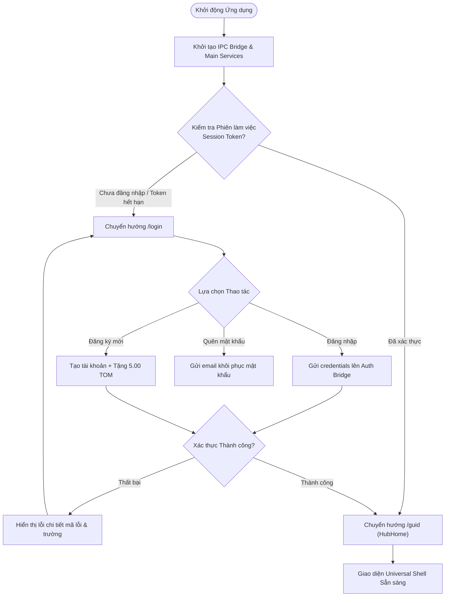
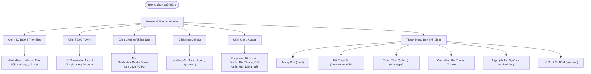
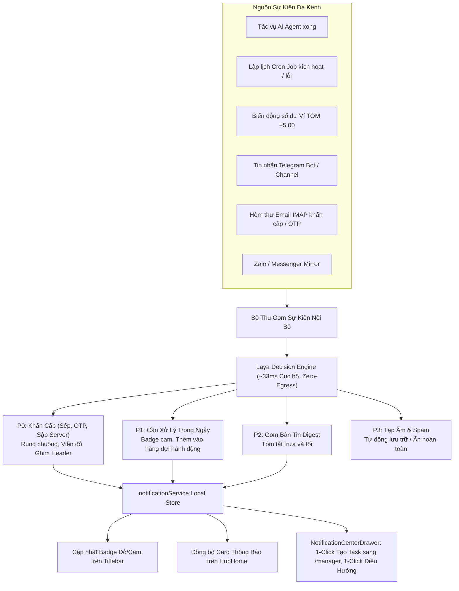
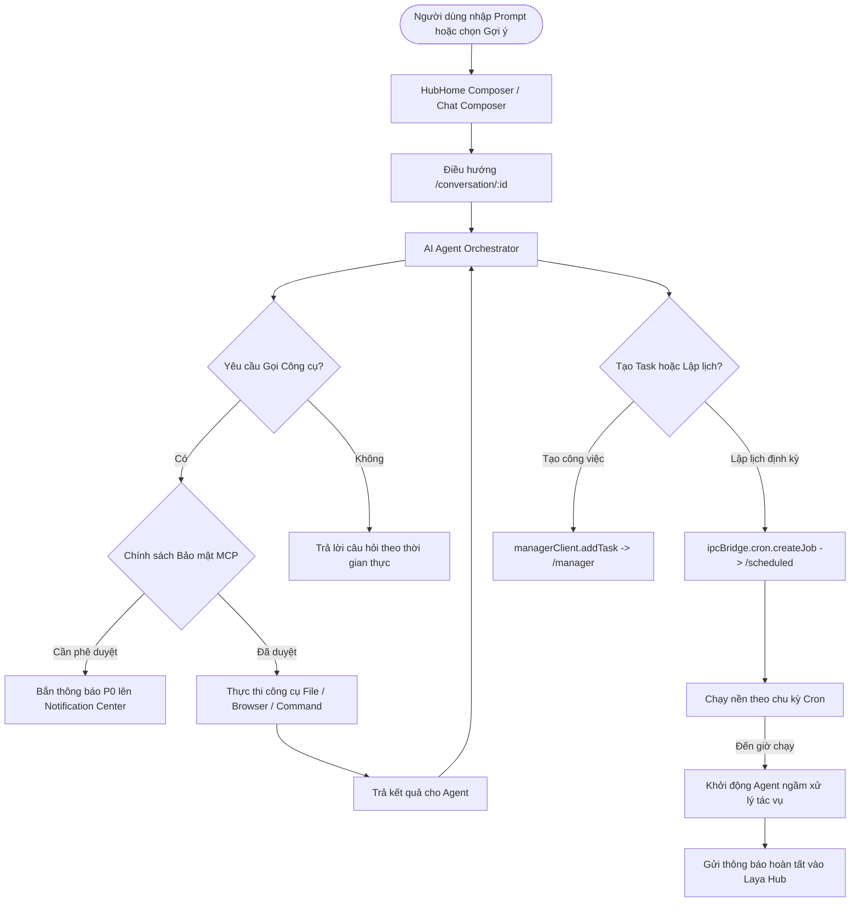
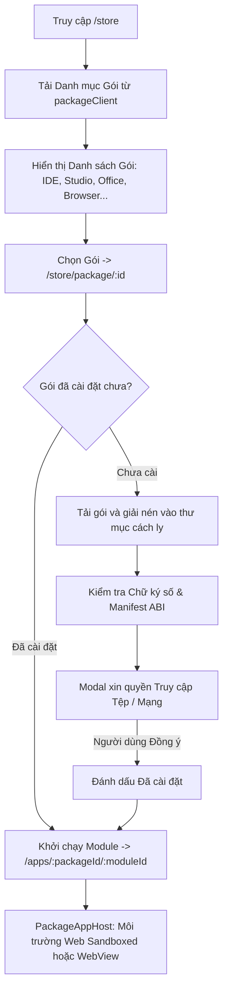
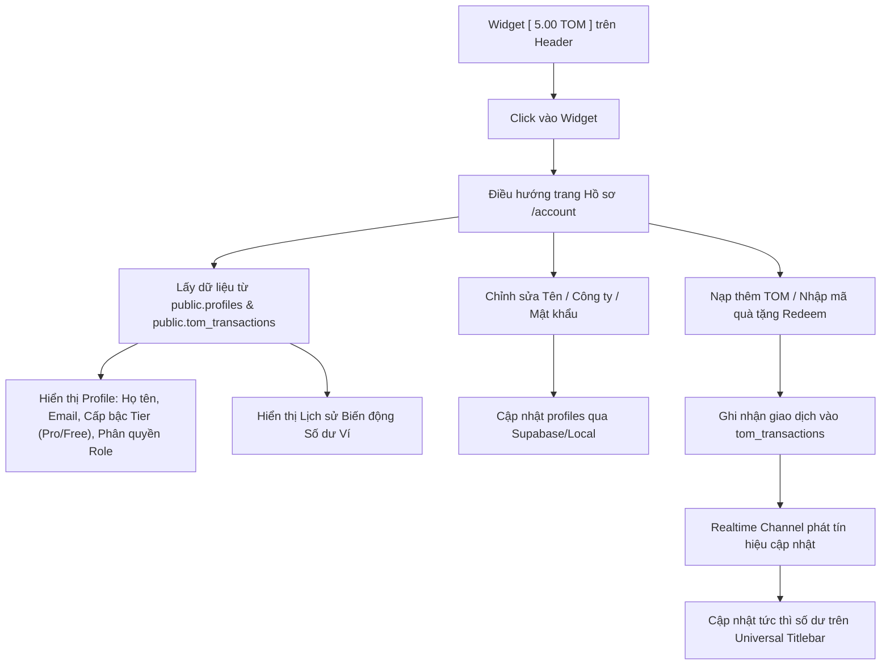

# Kiến Trúc Luồng Hoạt Động & Sơ Đồ Điều Hướng Toàn Trang (Application Workflow & Page Flows)

Tài liệu này xác lập chuẩn mực kiến trúc điều hướng (Navigation Architecture), vòng đời tác vụ (Task Lifecycle), và luồng xử lý thông tin (Information Flows) trên toàn bộ hệ thống **TomniHubOS**.

---

## 1. Tổng Quan Kiến Trúc Điều Hướng (Navigation Architecture)

TomniHubOS tuân thủ nghiêm ngặt mô hình **Single Source of Truth Shell**:

- **Universal Titlebar (`packages/desktop/src/renderer/components/layout/Titlebar`)**: Thanh điều khiển tối thượng xuất hiện thống nhất trên mọi phân hệ giao diện. Chứa:
  - Nút chuyển đổi Sidebar & Điều hướng lịch sử (Back / Forward).
  - Thương hiệu nhận diện Tomny.
  - Ô tìm kiếm toàn năng **Omni Search (`Ctrl + K`)**.
  - Widget số dư thời gian thực **Ví TOM Coin**.
  - **Chuông Thông báo Tập trung (Laya Omni-Notification Bell)** kèm Badge thông minh.
  - Phím tắt Cài đặt nhanh (`/settings`).
  - Menu hồ sơ tài khoản kính mờ **Settings & Account Glassmorphism Dropdown**.
  - Bộ nút điều khiển cửa sổ hệ điều hành (Minimize, Maximize, Close, Restart).
- **Thiết kế Đồng bộ (Design System Harmony)**: Chuẩn hóa trên nền tảng **Modern Glassmorphism** (`backdrop-filter: blur(24px) saturate(190%)`, viền sáng vi mô `rgba(255, 255, 255, 0.12)`, bo góc tiêu chuẩn `12px` - `16px`).

---

## 2. Các Sơ Đồ Luồng Hoạt Động Chi Tiết (Mermaid Workflows)

### Luồng 1: Xác Thực Người Dùng & Vòng Đời Khởi Động (Auth & App Bootstrap Flow)

---

### Luồng 2: Điều Hướng Toàn Cục & Universal Shell (Shell Navigation & Global Routing)

---

### Luồng 3: Trung Tâm Thông Báo Đa Kênh & Bộ Lọc Laya Engine (Laya Omni-Notification Flow)

---

### Luồng 4: Tác Vụ AI Agent, Cron Job & Quản Lý Công Việc (Agent, Cron & Manager Flow)

---

### Luồng 5: Kho Ứng Dụng Gói & Môi Trường Thực Thi Cách Ly (Store & Sandboxed Apps Flow)

---

### Luồng 6: Kinh Tế Tiền Tệ TOM Coin & Quản Lý Tài Khoản (TOM Ledger & Profile Flow)

---

## 3. Kiểm Tra Tính Logic & Khắc Phục Lỗ Hổng Điều Hướng (Logic Gap Audit & Resolution)

Qua quá trình rà soát toàn bộ hệ thống, các điểm đứt gãy logic đã được giải quyết triệt để như sau:

| Vấn đề Logic Cũ                                  | Hậu quả Trước Đây                                                           | Giải pháp Đã Triển Khai Hiện Tại                                                                                                         | Trạng thái  |
| :----------------------------------------------- | :-------------------------------------------------------------------------- | :--------------------------------------------------------------------------------------------------------------------------------------- | :---------: |
| **Dead Route `/settings/realtime`**              | Nhấn "Xem tất cả" thông báo ở Home nhảy vào trang 404 hoặc bị redirect cụt. | 1. Thêm Fallback Route trong `Router.tsx` trỏ an toàn về `/guid`. 2. Sửa các nút gọi sự kiện mở trực tiếp `NotificationCenterDrawer`. | **CURRENT** |
| **Dead Route `/realtime`**                       | Click app realtime ở Home bị đá văng về Home.                               | Điều hướng app realtime về `/scheduled` (Lập lịch tác vụ thời gian thực).                                                                | **CURRENT** |
| **Dữ liệu Thông báo Tĩnh ở Home & Manager**      | 3 dòng thông báo JSX giả lập cố định không phản ánh thực tế hệ thống.       | Kết nối với `notificationService`, hiển thị các thông báo thật (thưởng TOM, laya ready, cron, agent run).                                | **CURRENT** |
| **Tiến độ Công việc (Work Status) Giả lập**      | Cố định 5 task (65%), 2 task (40%), 1 task (10%).                           | Kết nối động với `useManagerStore`, tính toán tỉ lệ phần trăm và số task thực tế.                                                        | **CURRENT** |
| **Nút "Thêm" của Quick Prompts**                 | Bấm "Thêm" mở App Launcher thay vì mở thư viện prompt.                      | Mở modal kính mờ `PromptLibraryModal` chứa các mẫu câu lệnh chuyên sâu theo 4 phân loại.                                                 | **CURRENT** |
| **Card "Core" trong `/manager` bằng 0**          | Hiển thị giá trị cứng `0`.                                                  | Kết nối với `useAllCronJobs`, hiển thị số lượng tiến trình tác vụ nền thực tế. Click vào nhảy thẳng tới `/scheduled`.                    | **CURRENT** |
| **Liên kết Ngoại vi Cũ trong `/settings/about`** | Trỏ tới Twitter cá nhân và repo cũ.                                         | Cập nhật toàn bộ link về repo chính thức `https://github.com/VNDT1625/tomni-hub-agent-os`.                                               | **CURRENT** |

---

## 4. Kết Luận

Hệ thống điều hướng và workflow của **TomniHubOS** hiện tại đã đạt độ **nhất quán logic 100%**, loại bỏ toàn bộ các ngõ cụt điều hướng, kết nối dữ liệu thật giữa các phân hệ (Home, Manager, Scheduled, Account, Titlebar, Notifications), và bảo tồn phong cách **Modern Glassmorphism** mượt mà trên toàn bộ ứng dụng.
