# Quy trình Thực thi Chat và Vòng đời Điều phối Tool (Chat Execution Flow & Tool Dispatch Lifecycle)

**Trạng thái:** CURRENT (Được chứng minh bởi mã nguồn thực tế và các bài kiểm thử tích hợp)

**Tài liệu liên quan:**

- [Chat Pipeline Architecture](chat-pipeline.md)
- [AI Runtime & Adapters](ai-runtime.md)
- [Trust & Permissions](trust-and-understanding.md)

---

## 1. Tổng quan Kiến trúc

Trong TomniHubOS, một lượt chat (turn) không phải là một chuỗi hàm monolithic gọi trực tiếp API đám mây. Hệ thống vận hành theo kiến trúc đa tầng tách biệt:

- **Renderer Process (Giao diện người dùng):** Thu thập văn bản, áp dụng chỉ thị điều hướng (goal steering, team task, UI language) và kích hoạt IPC bridge.
- **Main Process Bridge & Chat Pipeline:** Kiểm tra an toàn xuất cảnh (Egress Security), bắt các hành động trực tiếp Zero-LLM (Direct Actions), và định tuyến tool suy đoán (Tool Router).
- **Native Conversation Service & Storage:** Đảm bảo tính nhất quán của phiên, kiểm tra thư mục workspace và lưu tin nhắn vào SQLite database trước khi khởi chạy agent.
- **Foundation Hub & Core Runtime:** Quản lý vòng đời chạy (Run Lifecycle), gắn định danh người dùng và chính sách bảo mật, nạp máy chủ MCP và danh mục công cụ (Tool Catalog).
- **Core Adapter & CLI Process:** Khởi chạy tiến trình CLI (Tomny CLI hoặc Codex/ACP) qua stdio pipe, phân giải và truyền quyền thực thi tool theo thời gian thực, stream phản hồi ngược lại UI.

---

## 1.1. Sơ đồ Luồng Thực thi Tổng thể (Mermaid Architecture Diagram)

```mermaid
flowchart TD
    %% Styling
    classDef ui fill:#1e293b,stroke:#38bdf8,stroke-width:2px,color:#f8fafc;
    classDef p1 fill:#312e81,stroke:#818cf8,stroke-width:2px,color:#f8fafc;
    classDef p2 fill:#14532d,stroke:#4ade80,stroke-width:2px,color:#f8fafc;
    classDef tool fill:#701a75,stroke:#f472b6,stroke-width:2px,color:#f8fafc;
    classDef bypass fill:#78350f,stroke:#fbbf24,stroke-width:2px,color:#f8fafc;

    %% -------------------------------------------------------------
    %% GIAO DIỆN NGƯỜI DÙNG
    %% -------------------------------------------------------------
    subgraph UI [" GIAO DIỆN (Renderer UI) "]
        A["👤 Người dùng nhập tin nhắn"]:::ui
        A --> B["TomnyAgenticSendBox.tsx:280<br/>• Chèn Goal steering<br/>• Chèn UI language directive<br/>• Tạo model_input ẩn"]:::ui
        B --> C["ipcBridge.conversation.sendMessage.invoke"]:::ui
    end

    %% -------------------------------------------------------------
    %% TẦNG 1: CHAT PIPELINE
    %% -------------------------------------------------------------
    subgraph P1 [" TẦNG 1: CHAT PIPELINE (Pre-flight Chain) "]
        C --> D["ChatPipelineExecutor (pipelineExecutor.ts:40)"]:::p1

        subgraph Stages ["Chuỗi Stage có thể kéo-thả / cấu hình"]
            D --> S1["1. builtin:laya-security<br/>(Quét rò rỉ secret / PII)"]:::p1
            S1 --> S2["2. builtin:rtk-knowledge<br/>(Nhúng tri thức thời gian thực)"]:::p1
            S2 --> S3{"3. builtin:direct-action<br/>(Lệnh tắt không dùng LLM?)"}:::p1
            S3 -- "Có (vd: /repotopackage)" --> DA["Bypass Zero-LLM (bridge.ts:220)<br/>Đóng gói mã nguồn trực tiếp<br/>(0 Token, < 50ms)"]:::bypass
            S3 -- "Không" --> S4["4. builtin:tool-router<br/>(Chào hỏi ➔ 0 tool<br/>Lập trình ➔ nạp code tools)"]:::p1
            S4 --> S5["5. builtin:model-router<br/>(Tự chọn model tối ưu)"]:::p1
            S5 --> S6["6. Store Package Stages<br/>(Context7, Web search, v.v.)"]:::p1
        end

        S1 -- "Phát hiện mã độc/vi phạm" --> BLK["❌ Chặn ngay lập tức<br/>(CHAT_PIPELINE_BLOCKED)"]:::bypass
        S6 --> E["executeAfterOutboundInspection (bridge.ts:327)<br/>Khử khuẩn Egress an toàn"]:::p1
    end

    %% -------------------------------------------------------------
    %% TẦNG 2: CORE RUNTIME & PERSISTENCE
    %% -------------------------------------------------------------
    subgraph P2 [" TẦNG 2: TURN LIFECYCLE & RUNTIME "]
        E --> F["NativeConversationService.send (service.ts:836)<br/>• Chống gửi chồng tin nhắn<br/>• Kiểm tra thư mục workspace"]:::p2
        F --> G[("💾 SQLite Database<br/>Lưu user_content tin nhắn")]:::p2
        G --> H["Foundation Hub & RunIntent (foundationBridge.ts:714)<br/>Thiết lập quyền hạn & Audit trail"]:::p2
        H --> I["ExperimentalCoreRuntime.run (experimentalCoreRuntime.ts:1675)<br/>• Nạp Session Memory & Context Vault<br/>• Nạp danh mục công cụ Tool Catalog<br/>• Ánh xạ adapter 'tomny'"]:::p2
    end

    %% -------------------------------------------------------------
    %% TẦNG 3: CLI ADAPTER & VÒNG LẶP TOOL
    %% -------------------------------------------------------------
    subgraph P3 [" TẦNG 3: CLI PROCESS & TOOL LOOP "]
        I --> J["TomnyCoreAdapter (tomnyCoreAdapter.ts:1435)<br/>• Khởi tạo tiến trình CLI qua stdio pipe<br/>• Ghi lệnh {type: 'message'} vào stdin"]:::tool
        J --> K["🧠 LLM Suy Luận (CLI / Provider API)"]:::tool

        K --> L{"LLM có cần<br/>gọi Tool?"}:::tool

        %% Nhánh gọi tool
        L -- "Cần gọi Tool" --> M["CLI gửi {type: 'tool_request'}<br/>(tomnyCoreAdapter.ts:1681)"]:::tool
        M --> N{"Kiểm tra quyền<br/>(Permission Mode)"}:::tool

        N -- "Chế độ Deny" --> O1["Gửi tool_deny vào stdin"]:::bypass
        N -- "Chế độ Approve" --> O2["Gửi tool_approve vào stdin"]:::tool
        N -- "Cần hỏi (Ask)" --> O3["Hiện Modal trên UI<br/>Người dùng phê duyệt"]:::ui
        O3 --> O2

        O2 --> TEXEC["THỰC THI TOOL (MCP Servers)<br/>• coreWorkspaceServer: Đọc/ghi tệp<br/>• browserControlServer: Thao tác web<br/>• ideServer: Tìm kiếm code, terminal"]:::tool
        TEXEC --> TRES["Trả {type: 'tool_result'} vào stdin"]:::tool
        TRES --> K

        %% Nhánh trả về kết quả
        L -- "Hoàn thành trả lời" --> P["Stream {type: 'delta'} qua stdout"]:::tool
    end

    %% -------------------------------------------------------------
    %% PHẢN HỒI VỀ GIAO DIỆN
    %% -------------------------------------------------------------
    P --> Q["ipcBridge.conversation.responseStream.emit"]:::ui
    DA --> Q
    Q --> R["💬 Hiển thị chữ chạy (Streaming) trên bong bóng Chat UI"]:::ui
    J --> S["Nhận stream_end ➔ Lưu assistant message vào DB & Đóng turn"]:::p2
```



---

## 2. Truy vết Chi tiết Luồng Chat từ Giao diện đến Phản hồi (End-to-End Code Trace)

### Giai đoạn 1: Gửi Tin nhắn và Chỉ thị Điều hướng từ Giao diện (Renderer)

- **Tệp:** `packages/desktop/src/renderer/pages/conversation/platforms/tomnyagentic/TomnyAgenticSendBox.tsx`
- **Dòng 280–289:**
  ```typescript
  const steeredMessage = withGoalSteeringDirective(guardedMessage, conversation_id);
  const taskBoundMessage = withTeamTaskDirective(steeredMessage, conversation_id);
  const modelInput = withResponseLanguageDirective(taskBoundMessage, conversation_id);
  ```
  _Bằng chứng & Kết luận:_ Trước khi gửi, hệ thống tự động chèn 3 chỉ thị vào `model_input` nhưng giữ ẩn khỏi bong bóng chat người dùng: (1) chỉ thị ép buộc tuân thủ pipeline nếu ở Goal Mode, (2) chỉ thị gắn nhiệm vụ nhóm được ghim, (3) chỉ thị ngôn ngữ giao diện (UI language) để agent không suy đoán sai ngôn ngữ khi code/tool output bằng tiếng Anh.
- **Dòng 296–301:**
  ```typescript
  const res = await ipcBridge.conversation.sendMessage.invoke({
    input: displayMessage,
    model_input: modelInput,
    conversation_id,
    files,
  });
  ```
  _Bằng chứng & Kết luận:_ Giao diện gọi hàm IPC `sendMessage` sang tiến trình Main, truyền cả nội dung hiển thị (`input`), nội dung chỉ thị mô hình (`model_input`), ID phiên và tệp đính kèm.
- **Dòng 302–320:**
  _Bằng chứng & Kết luận:_ UI chờ nhận `msg_id` từ server rồi mới vẽ bong bóng người dùng vào state qua `addOrUpdateMessage`, tránh trùng lặp hiển thị khi cache nạp lại.

---

### Giai đoạn 2: Pre-flight Pipeline, Zero-LLM Bypass và Kiểm soát Egress

- **Tệp:** `packages/desktop/src/process/services/database/nativeConversation/bridge.ts`
- **Dòng 204–218:**

  ```typescript
  ipcBridge.conversation.sendMessage.provider(
    authenticated(async (params) => {
      const activeDefinition =
        params.conversation_id && pipelineDefinitions.has(params.conversation_id)
          ? pipelineDefinitions.get(params.conversation_id)
          : pipelineRegistry.createDefaultDefinition();

      const pipelineResult = await pipelineExecutor.execute({
        runId: params.conversation_id,
        query: params.input,
        definition: activeDefinition,
      });

      if (pipelineResult.status === 'blocked') {
        throw new Error(`CHAT_PIPELINE_BLOCKED_${pipelineResult.blockedReasonCode ?? 'REJECTED'}`);
      }
  ```

  _Bằng chứng & Kết luận:_ Mọi tin nhắn đều phải qua `pipelineExecutor.execute()`. Nếu vi phạm an ninh (bị chặn), hệ thống ném lỗi ngay mà không gửi dữ liệu ra ngoài hoặc gọi LLM.

- **Dòng 220–316 (Cơ chế Bypass Zero-LLM Direct Action):**
  _Bằng chứng & Kết luận:_ Nếu lệnh người dùng là `/repotopackage`, pipeline trả về `status: 'direct_action'`. Quá trình đóng gói mã nguồn `buildTomnyPackageFromRepo({ source: repoTarget })` được gọi trực tiếp trong máy tính, phát các bước tiến trình qua `ipcBridge.conversation.responseStream.emit` và kết thúc với **0 token**, không tốn chi phí gọi mô hình đám mây.
- **Dòng 327–353 (Kiểm tra An ninh Xuất cảnh Egress):**
  ```typescript
  const result = await executeAfterOutboundInspection(
    { ... },
    { allowSanitize: true, requireApprovalForFindings: false, policyVersion: 'outbound-text-v1' },
    async (safeParts) => {
      const safeInput = safeParts.find((part) => part.id === 'input')?.text;
      const safeModelInput = safeParts.find((part) => part.id === 'model-input')?.text;
      if (safeInput === undefined) throw new Error('Outbound inspection returned no safe user input.');
      return service.send({ ...params, input: safeInput, model_input: safeModelInput });
    }
  );
  ```
  _Bằng chứng & Kết luận:_ Hàm `executeAfterOutboundInspection` khử khuẩn các chuỗi nhạy cảm (API key, mật khẩu) trước khi chuyển vào `service.send()`.

---

### Giai đoạn 3: Khởi tạo Phiên, Lưu trữ SQLite và Định vị Target

- **Tệp:** `packages/desktop/src/process/services/database/nativeConversation/service.ts`
- **Dòng 836–846:**
  ```typescript
  if (this.activeByConversation.has(params.conversation_id)) {
    throw new Error('This conversation is already generating a response.');
  }
  const workspace = workspaceFor(conversation);
  if (!workspace.trim()) throw new Error('Select a workspace before starting the agent.');
  ```
  _Bằng chứng & Kết luận:_ Đảm bảo tính đơn nhiệm trên mỗi phiên chat (không gửi chồng tin nhắn) và bắt buộc phải có thư mục workspace được chọn.
- **Dòng 848–857:**
  ```typescript
  const userMessage = textMessage(userMessageId, conversation.id, input, 'right', now);
  await this.repository.saveMessage(userMessage);
  this.events.response({
    type: 'user_content',
    data: { content: input },
    msg_id: userMessageId,
    conversation_id: conversation.id,
    created_at: now,
  });
  ```
  _Bằng chứng & Kết luận:_ Tin nhắn của người dùng được lưu bền vững vào bảng SQLite `messages` trước khi agent chạy, đồng thời phát sự kiện `user_content` cập nhật giao diện.
- **Dòng 172–182 (`targetFor`):**
  ```typescript
  const targetFor = (conversation: TChatConversation): string => {
    const nativeTarget = (conversation.extra as Record<string, unknown>).tomny_core_target_id;
    if (typeof nativeTarget === 'string' && nativeTarget.trim()) return nativeTarget;
    if (conversation.type === 'tomnyagentic') return 'tomny';
    if (conversation.type === 'codex') return 'codex';
  ```
  _Bằng chứng & Kết luận:_ Cuộc hội thoại kiểu `tomnyagentic` sẽ ánh xạ target là `'tomny'` (sử dụng Tomny CLI).
- **Dòng 870–888 (Deep Debug Injection):**
  _Bằng chứng & Kết luận:_ Nếu tin nhắn chứa yêu cầu Deep Debug (`isDeepDebugRequest`), service tự động chèn chỉ thị phản chứng và gọi `ide_research` với `mode="bug"` và `deepDebug=true`.
- **Dòng 890–901:**
  ```typescript
  const started = this.runtime.start(
    requestId,
    targetFor(conversation),
    prompt,
    workspace,
    modelKeyFor(conversation),
    permissionFor(conversation),
    sessionId,
    undefined,
    contextIdentityFor(conversation, savedMemoryContextFor(conversation, this.memory, prompt))
  );
  ```
  _Bằng chứng & Kết luận:_ Nạp Session Memory đã lưu vào `contextIdentity` và khởi chạy engine qua `this.runtime.start()`.

---

### Giai đoạn 4: Lớp Kiểm soát Foundation Hub

- **Tệp:** `packages/desktop/src/process/bridge/foundationBridge.ts`
- **Dòng 714–750 (`createFoundationRunLifecycle`):**
  _Bằng chứng & Kết luận:_ Tạo `RunIntent` gắn nhãn quyền hạn tối thiểu (`['target.execute']`), giới hạn phạm vi workspace (`workspaceScope`), thiết lập timeout và AbortController để đảm bảo có thể huỷ tác vụ (Cancel) bất kỳ lúc nào.
- **Dòng 625–645 (`createFoundationHubTargets`):**
  _Bằng chứng & Kết luận:_ Ánh xạ target đã chọn và chuyển tiếp sang `runtime.executeToCompletion()`.

---

### Giai đoạn 5: Lõi Điều phối ExperimentalCoreRuntime

- **Tệp:** `packages/desktop/src/process/experimentalCore/experimentalCoreRuntime.ts`
- **Dòng 897–960 (`start` & `launch`):**
  _Bằng chứng & Kết luận:_ Khởi tạo trạng thái active turn trong bộ nhớ, kích hoạt hàm điều phối trung tâm `run()`.
- **Dòng 1675–1685:**
  ```typescript
  const target = this.targets.find((candidate) => candidate.id === transportTargetId);
  const adapter = this.deps.adapters.find((candidate) => candidate.protocol === target.protocol);
  ```
  _Bằng chứng & Kết luận:_ Tìm adapter phù hợp với giao thức của target. Target `tomny` có giao thức `tomny-json-stream`, tương ứng với `TomnyCoreAdapter`.
- **Dòng 1700–1730:**
  ```typescript
  const toolCatalog = resolveCoreToolCatalogPolicy(resolvedSurface, contextIdentity.superMode);
  const mcpServerNames = resolveCoreCapabilityServerNames(resolvedSurface, this.deps.surfaceRegistry, ...);
  ```
  _Bằng chứng & Kết luận:_ Khởi tạo danh mục công cụ và các máy chủ MCP được phép hoạt động theo chính sách bảo mật của Surface hiện tại.
- **Dòng 1820–1845:**
  _Bằng chứng & Kết luận:_ Tổng hợp ngữ cảnh hệ thống (`surfaceHarness`), bộ nhớ phiên (`savedMemoryContext`), và cá nhân hóa người dùng qua `contextComposer.composePrompt()`.
- **Dòng 1910–1940:**
  _Bằng chứng & Kết luận:_ Kích hoạt hàm chạy của adapter:
  ```typescript
  await adapter.run({
    sessionId,
    target,
    prompt: effectivePrompt,
    workspace: normalizedWorkspace,
    modelKey,
    permissionMode,
    surface: resolvedSurfaceId,
    mcpServers,
    toolCatalog,
    signal,
    emit: (event) => { ... },
    requestPermission: (request) => this.requestPermission(...),
  });
  ```

---

### Giai đoạn 6: Khởi chạy CLI, Stdio Protocol & Streaming

- **Tệp:** `packages/desktop/src/process/experimentalCore/adapters/tomnyCoreAdapter.ts`
- **Dòng 1424–1433 (`run`):**
  _Bằng chứng & Kết luận:_ Bọc phương thức thực thi trong `withPersistentAgentRetry` với tối đa 3 lần thử lại tự động khi gặp sự cố ngắt kết nối.
- **Dòng 1555–1595 (`startProcess`):**
  _Bằng chứng & Kết luận:_ Nạp API Key và Base URL từ cấu hình Provider trong Settings (OpenAI, Anthropic, Gemini, DeepSeek, v.v.).
- **Dòng 1598–1605:**
  ```typescript
  const toolServer = createCoreWorkspaceServer({ workspace: cwd });
  const child = spawnTarget(target, cwd, modelKey, strictProjectDirectory, surface, toolCatalog, environment);
  ```
  _Bằng chứng & Kết luận:_ Khởi tạo server MCP workspace cục bộ và spawn tiến trình con CLI với 3 kênh stdio pipe `['pipe', 'pipe', 'pipe']`.
- **Dòng 1475–1520:**
  _Bằng chứng & Kết luận:_ Gửi cấu hình model (`set_config`), chế độ phân quyền (`set_mode`), và gửi nội dung prompt vào `stdin` của CLI:
  ```typescript
  writeCommand(runtime, {
    type: 'message',
    msg_id: msgId,
    content: promptWithAttachmentToolNotice(input.prompt, input.attachments),
  });
  ```
- **Dòng 1640–1675 & 1765–1785:**
  _Bằng chứng & Kết luận:_ Dùng `readline.createInterface` đọc từng dòng JSON từ `stdout` của tiến trình con. Khi nhận event `text_delta` hoặc `thinking`, adapter chuẩn hoá thành `ExperimentalCoreEvent` và đẩy về UI. Khi nhận `stream_end`, kết thúc lượt chạy.

---

## 3. Khi nào Dùng Tool và Cơ chế Hoạt động Chi tiết (Tool Dispatch Lifecycle)

### 3.1. Ai quyết định khi nào gọi Tool?

1. **Mô hình LLM:** Dựa vào danh mục schema các tool được nạp trong prompt, khi LLM nhận thấy câu hỏi cần đọc tệp, sửa code, chạy lệnh hoặc duyệt web, LLM sẽ phát sinh lời gọi tool (tool call).
2. **Pre-flight Filter (Tối ưu hoá token trước khi gọi mô hình):**
   - **Tệp:** `packages/desktop/src/process/services/chatPipeline/stages/toolRouterStage.ts`
   - **Dòng 48–53 (Lời chào thuần túy nạp 0 tool):**
     ```typescript
     const isPureGreeting =
       /^(?:hello(?:\s+there)?|hi(?:\s+there)?|xin chào(?:\s+bạn)?|chào(?:\s+bạn)?|alo|hey|good\s+(?:morning|evening|afternoon))[!.,\s]*$/iu.test(
         query
       );
     ```
     _Bằng chứng & Kết luận:_ Khi người dùng chỉ chào hỏi thông thường, hệ thống **không nạp bất kỳ tool nào (0 tool)**. Điều này giúp tiết kiệm 100% chi phí token cho tool schema trong các lượt chat xã giao.
   - **Dòng 55–82 (Phân loại Domain Tool):**
     _Bằng chứng & Kết luận:_ Nếu tin nhắn liên quan đến lập trình (`code`, `debug`, `python`, `typescript`, `git`), hệ thống nạp các domain `code_executor`, `file_search`. Nếu liên quan đến duyệt web (`browser`, `trang web`, `url`), nạp `browser_action`.
   - **Dòng 35–46 (Cơ chế tự phục hồi hai chiều - Self-Healing Fallback):**
     ```typescript
     const fallbackMatch = /(?:request_tools|cần_công_cụ)\s*(?:\(([\w-]+)\))?/iu.exec(query);
     ```
     _Bằng chứng & Kết luận:_ Nếu LLM nhận thấy câu hỏi cần công cụ mà schema chưa được nạp, nó có thể phát tín hiệu `request_tools(domain)`. `ToolRouterStage` sẽ bắt tín hiệu này để nạp bổ sung schema cần thiết.

---

### 3.2. Vòng đời Xử lý Yêu cầu Gọi Tool từ CLI (Tool Request Lifecycle)

- **Tệp:** `packages/desktop/src/process/experimentalCore/adapters/tomnyCoreAdapter.ts`
- **Dòng 1681:**
  ```typescript
  if (event.type === 'tool_request') {
    const callId = textField(event, 'call_id');
    const request = tomnyToolRequest(event);
  ```
  _Bằng chứng & Kết luận:_ Khi LLM trong CLI quyết định gọi tool, nó xuất ra dòng JSON mang type `tool_request` chứa `call_id`, tên tool và tham số JSON.
- **Dòng 1690–1700:**
  ```typescript
  pending.emit({
    type: 'tool-call',
    tool: request.name,
    callId,
    text: `Calling ${request.name}`,
    phase: 'requested',
    ...(request.input !== undefined ? { input: sanitizeTomnyToolInput(request.name, request.input) } : {}),
  });
  ```
  _Bằng chứng & Kết luận:_ Adapter phát ngay sự kiện `tool-call` về Renderer để giao diện hiển thị tên tool và tham số trên thanh tiến trình cho người dùng quan sát.
- **Dòng 1710–1735 (Xử lý Tool cục bộ & Chuyển đổi):**
  _Bằng chứng & Kết luận:_
  - Nếu tool là `tomny_session_actions`: Gọi `provideSessionActionHistory` nạp lịch sử session.
  - Nếu tool có thể dịch trực tiếp (`translateNativeTomnyTool`): Thực thi trong tiến trình native và gửi kết quả về CLI qua `tomnyProvidedToolResultCommand`.
- **Dòng 1736–1748 (Kiểm tra Quyền hạn - Permission Modes):**
  ```typescript
  const access = tomnyToolAccessForPermission(pending.permissionMode, request.name, request.category);
  if (access === 'deny') {
    writeCommand(runtime, {
      type: 'tool_deny',
      call_id: callId,
      reason: 'Tool denied by the current permission mode.',
    });
    return;
  }
  if (access === 'approve') {
    writeCommand(runtime, { type: 'tool_approve', call_id: callId, scope: 'once' });
    return;
  }
  ```
  _Bằng chứng & Kết luận:_ Quyền thực thi tool tuân thủ chế độ phân quyền (`permissionMode`):
  - Chế độ cấm (`deny`): Trả lệnh từ chối ngay lập tức vào `stdin` của CLI.
  - Chế độ tự động chấp thuận (`approve`): Gửi lệnh `tool_approve` để CLI tiếp tục chạy.
- **Dòng 1749–1765 (Hỏi Ý kiến Người dùng Phê duyệt - Interactive Approval):**
  ```typescript
  void pending.requestPermission({ tool: request.name, detail: request.detail }).then((approved) => {
    writeCommand(
      runtime,
      approved
        ? { type: 'tool_approve', call_id: callId, scope: 'once' }
        : { type: 'tool_deny', call_id, reason: 'Denied by user' }
    );
  });
  ```
  _Bằng chứng & Kết luận:_ Khi quyền là chế độ hỏi (`ask`), hệ thống gửi yêu cầu lên giao diện người dùng. Renderer hiển thị hộp thoại phê duyệt Modal. Khi người dùng bấm Chấp thuận hoặc Từ chối, adapter gửi lệnh tương ứng (`tool_approve` hoặc `tool_deny`) vào `stdin` của CLI để tiếp tục.

---

### 3.3. Các Máy chủ Cung cấp Tool Thực tế trong Mã nguồn

1. **Core Workspace Server:**
   - **Tệp:** `packages/desktop/src/process/agentRuntime/agentMesh/mcp/coreWorkspaceServer.ts:40–120`
   - **Công cụ cung cấp:** `read_file`, `write_file`, `list_directory`, `file_search`.
2. **Built-in System MCP Servers:**
   - **Thư mục:** `packages/desktop/src/process/resources/builtinMcp/`
   - `browserControlServer.ts:35–90`: `browser_navigate`, `browser_click`, `browser_screenshot`.
   - `officeEditorServer.ts:30–80`: Thao tác tài liệu văn phòng Word (`.docx`), Excel (`.xlsx`).
   - `cronServer.ts:25–70`: Lập lịch tác vụ và hẹn giờ thông báo.
3. **IDE MCP Server:**
   - **Tệp:** `packages/package-apps/ide/src/process/mcp/ideServer.ts:120–210`
   - **Công cụ cung cấp:** `ide_read_file`, `ide_search`, `ide_grep`, `terminal_run`, `git_status`, `ide_memory_remember`, `ide_secret_context_list`.

---

## 4. Bảng Đối Chiếu Bằng Chứng Mã Nguồn

| Bước | Hành động                       | Tệp mã nguồn                 | Dòng chứng minh | Kết luận kiến trúc                                                 |
| :--- | :------------------------------ | :--------------------------- | :-------------- | :----------------------------------------------------------------- |
| 1    | Thêm directive ngôn ngữ & goal  | `TomnyAgenticSendBox.tsx`    | 282–289         | Directive được chèn vào `model_input`, ẩn khỏi bong bóng chat user |
| 2    | Gửi IPC sang Main               | `TomnyAgenticSendBox.tsx`    | 296–301         | Gọi `ipcBridge.conversation.sendMessage.invoke`                    |
| 3    | Pipeline tiền kiểm & chặn lỗi   | `bridge.ts`                  | 207–217         | Lỗi chặn ngay nếu vi phạm an ninh, không tốn token                 |
| 4    | Bypass Zero-LLM Direct Action   | `bridge.ts`                  | 220–316         | Lệnh `/repotopackage` chạy 100% cục bộ với 0 token LLM             |
| 5    | Khử khuẩn bảo mật Egress        | `bridge.ts`                  | 327–353         | Che giấu API Key / secret trước khi gửi đi                         |
| 6    | Kiểm tra phiên & Workspace      | `service.ts`                 | 836–846         | Chống gửi chồng tin nhắn, bắt buộc có workspace                    |
| 7    | Lưu SQLite & vẽ UI bong bóng    | `service.ts`                 | 848–857         | Lưu bền vững trước khi chạy, phát `user_content`                   |
| 8    | Lọc Tool theo từ khoá/lời chào  | `toolRouterStage.ts`         | 48–82           | Lời chào xã giao nạp 0 tool, từ khoá nạp đúng domain               |
| 9    | Ánh xạ target sang adapter      | `experimentalCoreRuntime.ts` | 1675–1685       | `tomny` khớp giao thức `tomny-json-stream` với `TomnyCoreAdapter`  |
| 10   | Ghép Context & Session Memory   | `experimentalCoreRuntime.ts` | 1820–1845       | Ghép bộ nhớ phiên đã lưu vào đầu prompt                            |
| 11   | Spawn CLI qua stdio pipes       | `tomnyCoreAdapter.ts`        | 1598–1605       | Tạo process với stdio `['pipe', 'pipe', 'pipe']`                   |
| 12   | Gửi prompt vào stdin CLI        | `tomnyCoreAdapter.ts`        | 1482–1520       | Gửi JSON `{ type: 'message', content: ... }`                       |
| 13   | Bắt sự kiện tool_request từ CLI | `tomnyCoreAdapter.ts`        | 1681–1700       | Nhận JSON qua stdout, phát event `tool-call` lên UI                |
| 14   | Kiểm tra quyền & Phê duyệt Tool | `tomnyCoreAdapter.ts`        | 1736–1765       | Chặn hoặc hiện Modal phê duyệt trước khi gửi `tool_approve`        |
| 15   | Stream kết quả & Kết thúc turn  | `tomnyCoreAdapter.ts`        | 1765–1785       | Stream `delta` lên UI, hoàn thành khi nhận `stream_end`            |
