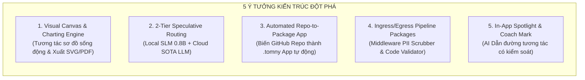
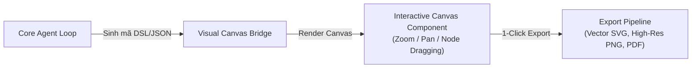
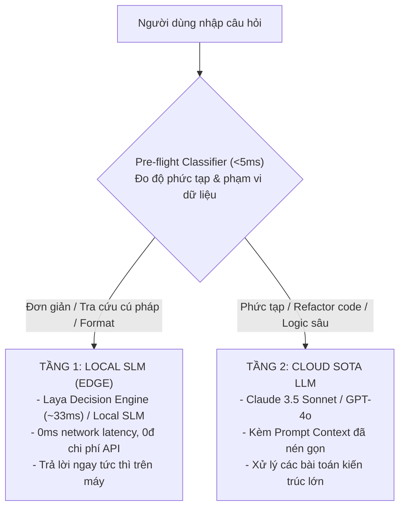
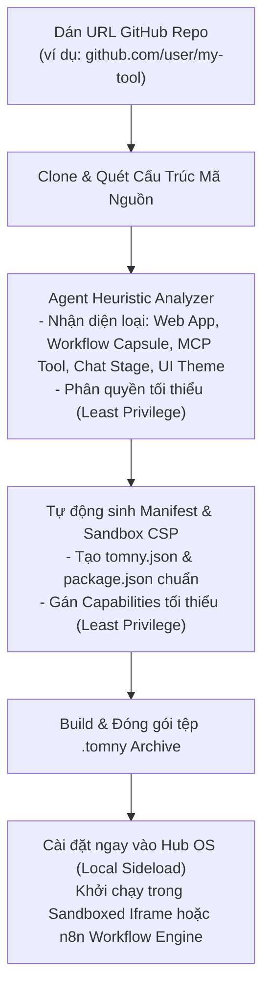
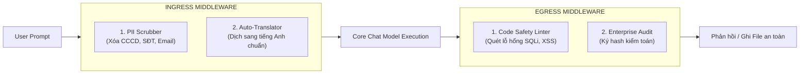
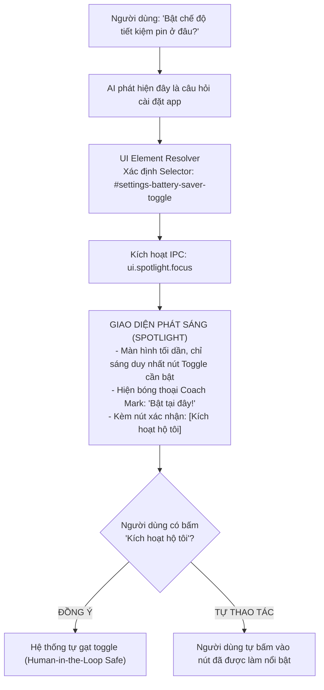

# 5 Ý Tưởng Kiến Trúc Đột Phá cho TomniHubOS

## Đề xuất Nâng cấp Hệ sinh thái & Trải nghiệm Người dùng Thế hệ Mới

- **Trạng thái:** TARGET / Đề xuất nâng cấp kiến trúc chiến lược
- **Phân loại:** Ecosystem, Developer Experience (DX), User Experience (UX) & Edge Intelligence
- **Tác giả/Chủ sở hữu:** Core Architecture & Platform Engineering

---

## 1. Tổng quan Mục tiêu (Executive Summary)

Sau khi hoàn thiện hạ tầng cốt lõi gồm **MTUI tối ưu (Backup Delta & Compass Slicing)** và **Unified Context Backbone (Cắt tỉa Token, Prefix KV Caching, Thị giác tự phục hồi)**, TomniHubOS đã sở hữu nền tảng vận hành nhẹ và rẻ nhất.

Để đưa TomniHubOS vượt lên trên các công cụ coding agent truyền thống và trở thành một **Hệ điều hành Agent toàn diện (Hub Agent OS)** thực thụ, 5 ý tưởng kiến trúc đột phá dưới đây được thiết kế nhằm mở rộng năng lực về:

1. **Trực quan hóa Dữ liệu (Data & Architecture Visualization).**
2. **Trí tuệ Cận biên (Edge / Local Small Model 2-Tier Routing).**
3. **Phát triển Hệ sinh thái Thần tốc (Auto Repo-to-Package Ecosystem).**
4. **Kiểm soát Luồng Dữ liệu Mở rộng (Pluggable Middleware Pipeline).**
5. **Dẫn đường Trải nghiệm Người dùng (In-App Coach Mark & Spotlight).**



---

## 2. Ý tưởng 1: Visual Diagramming & Charting Engine (Tương tác Trực quan)

### 2.1. Bối cảnh & Điểm nghẽn Hiện tại

Khi Agent giải thích kiến trúc hệ thống, phân tích cơ sở dữ liệu, hoặc tính toán tài chính:

- Hiện tại, Agent chỉ có thể xuất ra văn bản Markdown thô, sơ đồ ASCII, hoặc các khối mã Mermaid tĩnh.
- **Hạn chế:** Người dùng không thể phóng to (zoom), di chuyển (pan), chỉnh sửa trực tiếp các node, hoặc xuất ra tệp thiết kế chất lượng cao để đính kèm vào báo cáo hay slide thuyết trình.

### 2.2. Thiết kế Kiến trúc

Tích hợp một **Visual Canvas Runtime** tương tác trực tiếp bên trong cửa sổ Chat và Surface Deliverables:



- **Giao thức DSL Đa năng:**
  Agent có thể sinh ra:
  1. _Kiến trúc & Luồng:_ Mã Mermaid hoặc Excalidraw JSON.
  2. _Dữ liệu số liệu:_ Chart.js / Vega-Lite JSON (biểu đồ cột, đường, nhiệt, radar).
- **Khả năng Tương tác (Interactive Features):**
  - Người dùng có thể click vào từng node trên sơ đồ để xem chi tiết hoặc ra lệnh cho Agent: _"Tách node Database này thành Read/Write Replica"_.
  - Cho phép kéo thả chỉnh sửa vị trí các khối trực tiếp trên Canvas.
- **Xuất bản Đa định dạng:**
  - Hỗ trợ xuất SVG vector sắc nét không vỡ hạt.
  - Tự động nhúng vào báo cáo DOCX/PPTX trong Office Package App mà không cần chụp màn hình thủ công.

---

## 3. Ý tưởng 2: Real-time Pre-flight RAG với Bộ Định Tuyến 2 Tầng (2-Tier Routing)

### 3.1. Bối cảnh & Điểm nghẽn

Hiện tại, mọi câu lệnh của người dùng (từ việc chào hỏi, format JSON, giải thích mã lỗi HTTP, đến refactor cả hệ thống) đều bị đẩy thẳng lên các mô hình Cloud đắt đỏ (Claude 3.5 Sonnet, GPT-4o).

- **Hậu quả:** Tốn chi phí API không cần thiết và tạo độ trễ mạng (Network Latency) từ 1-3 giây ngay cả với những câu hỏi đơn giản.

### 3.2. Thiết kế Kiến trúc Bộ Định Tuyến 2 Tầng



- **Tầng 1 (Local Edge SLM):**
  - Chạy mô hình siêu nhẹ **Laya Decision Engine (~33ms)** hoặc **Phi-3.5 Mini** thông qua engine ONNX/Rust Sidecar (`rustSidecarClient.ts`).
  - Xử lý hoàn toàn cục bộ: Không cần kết nối Internet, bảo mật 100% dữ liệu riêng tư.
  - Phụ trách:
    - Giải thích các thuật ngữ cơ bản, tra cứu cú pháp ngôn ngữ.
    - Format văn bản, chuyển đổi JSON/YAML/CSV.
    - Trích xuất thông tin ngắn và sinh regex.
- **Tầng 2 (Cloud SOTA LLM):**
  - Chỉ được kích hoạt khi câu hỏi liên quan đến: Lập luận đa bước, sửa đổi nhiều file mã nguồn, phân tích lỗi logic trừu tượng.
- **Hiệu quả kỳ vọng:** Cắt giảm thêm **30 - 40% số lượng request** gửi lên Cloud, đưa trải nghiệm phản hồi ở các thao tác cơ bản về mức **tức thì (< 100ms)**.

---

## 4. Ý tưởng 3: Automated GitHub Repo-to-Package App (`.tomny` Packager)

### 4.1. Bối cảnh & Điểm nghẽn

TomniHubOS định hướng trở thành Store/Package Ecosystem, nơi các công cụ chuyên biệt (như IDE, Media Editor, Browser) là các package có thể cài đặt thêm. Tuy nhiên, rào cản lớn nhất của các nhà phát triển là:

- Phải tự viết manifest `tomny.json`.
- Phải tự đóng gói bundle và cấu hình sandbox an toàn (CSP, capabilities).

### 4.2. Thiết kế Kiến trúc "Repo-to-App" Tự Động & Bộ Phân Loại Đa Hình Thái

Một tính năng tự động hóa cấp nền tảng cho phép người dùng biến **bất kỳ GitHub Repository nào thành một Package App `.tomny`** chỉ bằng 1 thao tác dán link.

Tuy nhiên, thay vì áp dụng một công thức đóng gói ngây thơ cho mọi repo, hệ thống sử dụng **Heuristic Code Scanner** để phân loại repo vào 1 trong [7 Nhóm Package Chuẩn Hóa](../platform/package-taxonomy.md):



- **Quy trình Thực thi & Phân Loại Đa Dạng:**
  1. **Source & Archetype Analysis:** Phân tích `package.json`, cây thư mục, file cấu hình và dependencies để phân loại chính xác:
     - **Web Surface App (Vite, React, Vue, Flutter Web, WASM C++):** Đóng gói thành app độc lập chạy trong Iframe `sandboxed-web`, xuất hiện icon trên thanh Dock.
     - **Workflow Capsule (n8n-style):** Đóng gói quy trình tự động hóa nhiều bước. **Nguyên lý cốt tử: 80% Deterministic Nodes chạy bằng code hệ thống (0 tokens, 1ms, 0% lỗi layout) + 20% AI Nodes chỉ gọi khi thực sự cần tư duy sáng tạo**. Hỗ trợ cả _Instant Run_ (chạy tức thì) lẫn _Parametric Wizard Form_ (điền tham số đầu vào như ví dụ tạo Landing Page).
     - **Chat Stage Package (Context7, Laya):** Đóng gói trạm trung chuyển kéo thả vào Chat Pipeline (pre_query, retrieve, pre_model, post_model).
     - **MCP Tool Server (SQLite, Git, Search):** Đóng gói công cụ Function Calling cho Agent qua giao thức MCP.
     - **UI Theme & Shell:** Đóng gói theme, skin, layout tùy biến giao diện của chính Hub OS.
     - **Prompt thuần:** Lưu dưới dạng `Prompt Preset` (`.json`/`.md`), không đóng gói bừa bãi thành `.tomny`.
  2. **Capability Derivation:** Áp dụng nguyên tắc Least Privilege (Quyền hạn tối thiểu), mặc định zero-permission hoặc sandbox cô lập.
  3. **Auto-Packaging & Sideload:** Tạo bundle `.tomny` an toàn và nạp trực tiếp vào Hub OS.
- **Ý nghĩa:** Biến hàng triệu công cụ mã nguồn mở trên GitHub thành ứng dụng, trạm xử lý, công cụ AI và quy trình tự động hóa chạy ngay trên TomniHubOS mà lập trình viên không cần can thiệp thủ công.

---

## 5. Ý tưởng 4: Ingress/Egress Middleware Pipeline (Pipeline Packages)

### 5.1. Bối cảnh & Điểm nghẽn

Hiện nay, dữ liệu đi vào Core Chat (Ingress) và dữ liệu đi ra (Egress) chỉ được kiểm tra bởi một bộ lọc cứng cố định ([`executeAfterOutboundInspection`](file:///c:/NDT/PJ/TomniHubOS/packages/desktop/src/process/services/database/nativeConversation/bridge.ts#L125)). Các tổ chức, doanh nghiệp hoặc người dùng nâng cao không thể chèn thêm các quy tắc kiểm duyệt riêng của họ.

### 5.2. Thiết kế Kiến trúc Middleware có thể Cắm ghép (Pluggable Pipelines)

Giới thiệu một loại package hoàn toàn mới trong Store: **`Pipeline Package`** (triển khai chi tiết tại [`docs/core/chat-pipeline.md`](../core/chat-pipeline.md) và [`docs/platform/package-taxonomy.md`](../platform/package-taxonomy.md)).



- **Hợp đồng Middleware (TypeScript Contract):**

  ```typescript
  export interface IngressMiddleware {
    name: string;
    priority: number;
    process(input: IngressContext): Promise<IngressContext>;
  }

  export interface EgressMiddleware {
    name: string;
    priority: number;
    process(output: EgressContext): Promise<EgressContext>;
  }
  ```

- **Các Use Case Đột phá:**
  - **Doanh nghiệp:** Cài đặt package `Enterprise-PII-Guard` để chặn tuyệt đối việc rò rỉ mã số nội bộ hoặc dữ liệu khách hàng ra ngoài các model cloud.
  - **Lập trình viên:** Cài đặt package `Strict-TypeScript-Validator` để tự động kiểm tra cú pháp của đoạn code mà LLM sinh ra; nếu có lỗi type thì bắt LLM tự sửa lại trước khi hiển thị cho người dùng.

---

## 6. Ý tưởng 5: In-App Spotlight & Coach Mark Bubble Navigation (AI Dẫn Đường Trực Quan)

### 6.1. Bối cảnh & Điểm nghẽn

Một trong những trải nghiệm gây khó chịu nhất cho người dùng khi dùng AI hỗ trợ là:

- AI hướng dẫn bằng văn bản: _"Để sửa lỗi này, bạn hãy mở Cài đặt, chọn tab Model Provider, cuộn xuống tìm mục Router9, sau đó gạt toggle Streaming sang bật"_.
- **Vấn đề:** Người dùng phải tự đi tìm menu, dò từng nút, rất dễ bấm nhầm hoặc bỏ cuộc giữa chừng.

### 6.2. Thiết kế Kiến trúc "Dẫn đường & Nhấp nháy Tương tác" (Spotlight Navigation)

Thay vì hướng dẫn bằng chữ, AI có khả năng **soi đèn (Spotlight)** và gắn **Bong bóng Hướng dẫn (Coach Mark Bubble)** trực tiếp lên thành phần giao diện cần thao tác:



- **Nguyên tắc An toàn Tuyệt đối (Informed Consent & Human-in-the-Loop):**
  - AI **tuyệt đối không tự tiện âm thầm thay đổi cài đặt** của người dùng trong bóng tối.
  - AI chỉ làm nổi bật (highlight/spotlight) vị trí của nút bấm trên giao diện thực tế.
  - Người dùng luôn là người đưa ra quyết định cuối cùng (tự tay bấm hoặc bấm nút xác nhận ủy quyền).
- **Ứng dụng:**
  - Onboarding cho người dùng mới.
  - Dẫn đường kích hoạt các tính năng ẩn (Super Mode, Đổi model, Thêm token API).

---

## 7. Ma trận Đánh giá Tác động & Lộ trình Triển khai (Roadmap Matrix)

| Ý tưởng                                   | Độ phức tạp Kỹ thuật |          Tác động Trực quan / Giá trị          |         Checkpoint Đề xuất         |
| :---------------------------------------- | :------------------: | :--------------------------------------------: | :--------------------------------: |
| **1. Visual Canvas & Charting Engine**    | Trung bình (Medium)  |  **Rất cao (Game changer cho báo cáo/sơ đồ)**  |    **C4** (Surface Experience)     |
| **2. 2-Tier Speculative Routing**         | Trung bình (Medium)  |    **Rất cao (Giảm 40% chi phí, 0ms TTFT)**    |  **C3** (Model & Local Boundary)   |
| **3. Automated Repo-to-Package App**      |      Cao (High)      |    **Cực cao (Mở rộng thần tốc Store App)**    | **C5** (Ecosystem & Store Release) |
| **4. Ingress/Egress Middleware Pipeline** |  Thấp - Trung bình   | **Cao (Bảo mật doanh nghiệp & Extensibility)** | **C2** (Trust & Security Firewall) |
| **5. In-App Spotlight Navigation**        |      Thấp (Low)      |  **Cao (Trải nghiệm UX vượt trội hoàn toàn)**  |      **C4** (UI/UX Usability)      |

---

## 8. Kết luận

5 ý tưởng kiến trúc trên không chỉ giải quyết các vấn đề đơn lẻ, mà tương hỗ lẫn nhau để tạo nên một hệ sinh thái gắn kết:

- **Tầng 1 (Visual Canvas & Spotlight):** Nâng tầm trải nghiệm người dùng cuối lên mức trực quan, sống động.
- **Tầng 2 (2-Tier Routing & Pipeline Middleware):** Bảo vệ chi phí, tốc độ và an toàn dữ liệu ở mức chuyên nghiệp nhất.
- **Tầng 3 (Repo-to-Package):** Tháo van áp lực cho sự phát triển của hệ sinh thái ứng dụng Store.

Tài liệu này đóng vai trò là kim chỉ nam kỹ thuật cho các giai đoạn phát triển tiếp theo của TomniHubOS.
