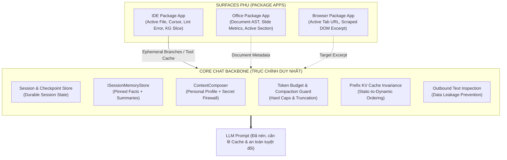
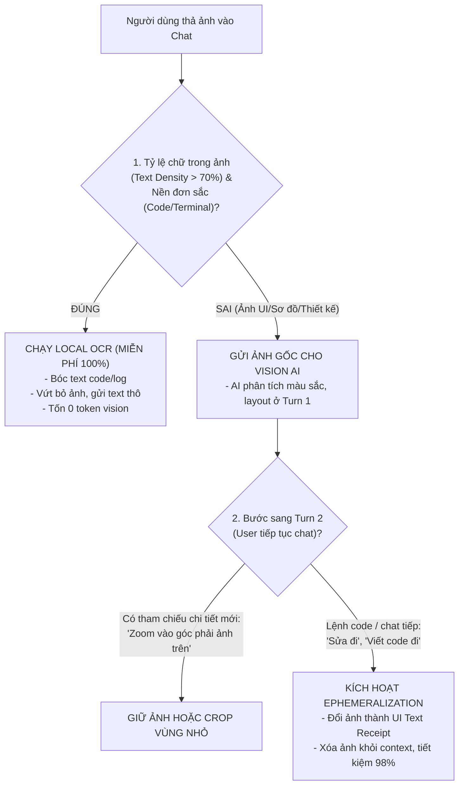

# Toàn diện Kiến trúc Context, Caching, Thị giác Siêu Rẻ & Lộ trình Tương lai

## Hệ thống Ngữ cảnh Đơn nhất (Unified Context & Vision Engine) trong TomniHubOS

- **Trạng thái:** TARGET / Kiến trúc chuẩn hóa hệ thống (Canonical Architecture & Engineering Blueprint)
- **Phân loại:** Core Chat Backbone, Surface Context Extension, Multi-tier Caching & Self-Healing Vision
- **Tác giả/Chủ sở hữu:** Core Architecture & Platform Engineering

---

## 1. Tổng quan & Triết lý Thiết kế (Design Philosophy)

Trong hệ điều hành Hub Agent OS ([`AGENTS.md`](file:///c:/NDT/PJ/TomniHubOS/AGENTS.md)), việc quản lý Ngữ cảnh (Context Management), Bộ nhớ đệm (Caching) và Thị giác (Multimodal Vision) là **yếu tố sống còn** quyết định độ chính xác, độ trễ và chi phí (token economics).

### 1.1. Triết lý Microkernel: Core Chat là Trục Duy nhất (Backbone)

Trước đây, các ứng dụng như IDE, Studio (Office), Browser được tích hợp sâu trong ứng dụng chính và thường cố gắng duy trì hệ thống Context độc lập (ví dụ: IDE có `ContextPack` đồ sộ dựng từ Knowledge Graph). Điều này dẫn tới hai vấn đề chí mạng:

1. **Phân mảnh trí nhớ:** Agent ở màn hình Chat chính không biết người dùng đang làm gì trong IDE, và ngược lại.
2. **Bùng nổ token (Token Explosion):** Mỗi surface cố gắng nhồi nhét tối đa dữ liệu của mình vào prompt, dẫn tới chi phí cao và làm loãng sự chú ý của mô hình (Lost in the Middle).

Theo chiến lược tách biệt ứng dụng thành **Package App** (`packages/package-apps/ide`, `browser`, `document-studio`), toàn bộ kiến trúc Context của TomniHubOS được quy định lại theo nguyên tắc:

- **Core Chat Context là Trục Duy nhất (Primary Backbone):** Nắm quyền tối thượng về Quản lý Phiên (Session), Ký ức Bền vững (Saved Memory), Hồ sơ Người dùng & Bảo mật (Personalization & Secret Firewall), và Ngân sách Token (Token Budget).
- **Surface Context (IDE, Office, Browser) là Nhánh Phụ Tạm thời (Ancillary & Ephemeral):** Đóng vai trò là các _Context Producer_. Chúng chỉ cung cấp các lát cắt dữ liệu chuyên biệt (Code Slices, Active File, Compiler Errors) khi cần, gắn vào Core Chat dưới dạng các nhánh phụ (`context_branches`) hoặc thông qua Tool Calls có kiểm soát.



---

## 2. Cách thức Vận hành Context trong Core Chat (Chi tiết Mã nguồn)

Context được lắp ráp tuần tự qua 5 lớp phòng vệ trước khi gửi đến mô hình ngôn ngữ lớn (LLM):

### 2.1. Lớp 1: Hồ sơ Cá nhân hóa & Tường lửa Bảo mật (`contextComposer.ts`)

- **Vị trí mã nguồn:** [`packages/desktop/src/process/agentRuntime/contextComposer.ts`](file:///c:/NDT/PJ/TomniHubOS/packages/desktop/src/process/agentRuntime/contextComposer.ts)
- **Nhiệm vụ:**
  - Nạp thông tin người dùng (`personalInformation`, `preferences`, `habits`, `communication style`).
  - **Secret Firewall:** Toàn bộ API token, mật khẩu, private key được che giấu thành các _Opaque Handles_ (ví dụ: `[OPAQUE_HANDLE:sec_xxx]`). Mô hình chỉ nhìn thấy metadata khả dụng, không bao giờ thấy plaintext secret.
  - **Giới hạn cứng:** `MAX_CONTEXT_CHARS = 12_000` (~3.000 tokens).

### 2.2. Lớp 2: Ký ức Phiên Bền vững (`ISessionMemoryStore` & `savedMemoryContext`)

- **Vị trí mã nguồn:** [`packages/desktop/src/process/services/database/nativeConversation/service.ts`](file:///c:/NDT/PJ/TomniHubOS/packages/desktop/src/process/services/database/nativeConversation/service.ts#L455-L474)
- **Nhiệm vụ:**
  - Danh sách tin nhắn hiển thị trên UI (`messages`) **hoàn toàn không được gửi tự do vào prompt** (dòng 568: `The renderer message list is an archive/search surface, never prompt context`).
  - Hệ thống chỉ lấy:
    1. Các sự thật được ghim (`recalled.pinned`).
    2. Các bản tóm tắt phiên cũ (`recalled.summaries`).
    3. Các mục có sự trùng khớp từ khóa cao với câu hỏi hiện tại (`stronglyRelevantItems(recalled.recent, query)`).
  - Đóng gói thành block `## Host-selected session Save`.

### 2.3. Lớp 3: Ngữ cảnh Tùy chọn của Người dùng & Nhánh Phụ (`conversationContext` & `context_branches`)

- **Vị trí mã nguồn:** [`packages/desktop/src/process/services/database/nativeConversation/service.ts`](file:///c:/NDT/PJ/TomniHubOS/packages/desktop/src/process/services/database/nativeConversation/service.ts#L330-L353)
- **Nhiệm vụ:**
  - Chứa ghi chú tùy chỉnh của người dùng (`extra.tomny_custom_context`).
  - **Active Context Branches (`tomny_context_branches`):** Cầu nối chuẩn để các Surface phụ (như IDE) đẩy dữ liệu vào Core Chat. Mỗi branch gồm `{ id, title, summary, content }`.
  - Giới hạn cứng: `MAX_NATIVE_CONVERSATION_CONTEXT_CHARS = 24_000` ký tự.

### 2.4. Lớp 4: Khế ước Năng lực & Áo giáp Surface (`surfaceHarness`)

- **Vị trí mã nguồn:** [`packages/desktop/src/process/agentRuntime/surfaceRegistry/harnesses.ts`](file:///c:/NDT/PJ/TomniHubOS/packages/desktop/src/process/agentRuntime/surfaceRegistry/harnesses.ts)
- **Nhiệm vụ:**
  - Khai báo các công cụ được phép chạy trên surface hiện tại (`capabilityContract`).
  - Cung cấp cẩm nang vận hành (`IDE_HARNESS`, `OFFICE_HARNESS`, `DELIVERABLES_HARNESS`), yêu cầu mô hình phải tuân thủ quy trình (ví dụ: dùng `StartAction` một lần duy nhất, gọi `ToolSearch` để lấy schema chi tiết).

### 2.5. Lớp 5: Thanh tra An toàn Xuất khẩu (`Outbound Text Inspection`)

- **Vị trí mã nguồn:** [`packages/desktop/src/process/services/database/nativeConversation/bridge.ts`](file:///c:/NDT/PJ/TomniHubOS/packages/desktop/src/process/services/database/nativeConversation/bridge.ts#L125-L148)
- **Nhiệm vụ:**
  - Chạy hàm `executeAfterOutboundInspection` trước khi dữ liệu rời khỏi máy tính cục bộ.
  - Tự động làm sạch (sanitize) các thông tin nhạy cảm vô tình lọt vào prompt.

---

## 3. Phân biệt Rạch ròi: Core Chat Context vs IDE Package App Context

| Đặc điểm                | Core Chat Context (Trục chính)                                       | IDE Context (Nhánh phụ / Package)                                            |
| :---------------------- | :------------------------------------------------------------------- | :--------------------------------------------------------------------------- |
| **Vị trí mã nguồn**     | `packages/desktop/src/process/services/database/nativeConversation/` | `packages/package-apps/ide/src/process/knowledge/`                           |
| **Chủ sở hữu vòng đời** | Toàn bộ vòng đời Session & Ứng dụng                                  | Phụ thuộc vào file/workspace đang mở trong IDE                               |
| **Bản chất dữ liệu**    | Hội thoại, Ý định (Intent), Persona, Bền vững                        | Code AST, Cây quan hệ 1-hop, Diagnostics, Tạm thời                           |
| **Cách nạp vào LLM**    | Inject trực tiếp vào System Prompt & Context Prelude                 | Nạp gián tiếp qua `context_branches` hoặc Tool (`ide_research`, `kgContext`) |
| **Chi phí Token**       | Được kiểm soát nghiêm ngặt (Hard Caps)                               | Rất lớn nếu thả nổi; được cắt lát qua `ContextSlice`                         |
| **Cơ chế Tri thức**     | `ISessionMemoryStore` (Lexical/Hybrid Recall)                        | Deterministic AST Pass + Semantic Embedding Ranker (`contextBuilder.ts`)     |

### Cơ chế "Context Producer" của IDE Package App:

1. **Không tạo Shadow Chat:** IDE Package App không tạo một WebSocket hay runtime chat riêng biệt. Mọi thao tác gửi tin nhắn trong IDE đều gọi về `ipcBridge.conversation.sendMessage` của Core Chat.
2. **Đóng gói dữ liệu thành Branch:** Khi người dùng đang trỏ vào một hàm bị lỗi trong IDE:
   - IDE lấy thông tin: Tên file, phạm vi dòng, thông báo lỗi của LSP.
   - IDE gửi cập nhật `updateTomnyAgenticContext` với một branch: `### Active IDE Focus: auth.ts (L45-L60)`.
   - Core Chat tiếp nhận, đưa vào phần phụ lục của prompt.
3. **Tra cứu Đồ thị Tri thức theo Yêu cầu (On-demand KG):**
   - Đồ thị tri thức mã nguồn khổng lồ (`KnowledgeGraph` từ `knowledgeGraphBridge.ts`) **không bao giờ bị nhét nguyên khối vào prompt**.
   - Khi Agent cần hiểu kiến trúc, Agent gọi tool `kgContext(rootPath, request)` qua [`coreIdeClient.ts`](file:///c:/NDT/PJ/TomniHubOS/packages/package-apps/ide/src/coreIdeClient.ts) để chỉ nhận lại tối đa 12 lát cắt (`maxSlices = 12`).

---

## 4. Benchmark Thực tế & Ngân sách Token (Context Benchmarks & Token Budget)

### 4.1. Các Ngưỡng Trần (Hard Bounds) được Cài đặt trong Code

```
+-------------------------------------------------------------------------------+
|                      TỔNG NGÂN SÁCH CONTEXT TRẦN (BOUNDS)                     |
+-------------------------------------------------------------------------------+
| 1. Personal & Agent Context : MAX_CONTEXT_CHARS = 12.000 chars   (~3.000 tok) |
| 2. Conversation Context     : MAX_CONVERSATION_CHARS = 12.000   (~3.000 tok) |
| 3. Native Branches & Extra  : MAX_NATIVE_CHARS = 24.000 chars    (~6.000 tok) |
| 4. Saved Session Memory     : MAX_SAVED_MEMORY = 64.000 chars   (~16.000 tok) |
| 5. Surface Harness Prompt   : Thường trực cố định               (~300-800 tok)|
+-------------------------------------------------------------------------------+
```

### 4.2. Bảng Phân bổ Token cho 1 Lượt Chat Điển hình (Benchmark Breakdown)

| Thành phần Prompt             | Kích thước Thô (Không tối ưu) | Kích thước qua Bộ lọc Core Chat | Tỷ lệ Tiết kiệm | Ghi chú kỹ thuật                                                           |
| :---------------------------- | :---------------------------- | :------------------------------ | :-------------- | :------------------------------------------------------------------------- |
| **System & Persona**          | ~4.000 tokens                 | ~1.200 tokens                   | **-70.0%**      | Nén qua `contextComposer`, lọc bỏ fact chưa xác nhận (`confidence < 0.65`) |
| **Tool Schemas (MCP/Core)**   | ~18.500 tokens (50+ tools)    | ~900 tokens (3-5 tools)         | **-95.1%**      | Dùng Dynamic Tool Selection (`toolSelector.ts` + `StartAction`)            |
| **Lịch sử Chat cũ**           | ~30.000 tokens (50 lượt chat) | ~0 tokens (vứt bỏ tin nhắn raw) | **-100%**       | Message list chỉ là UI archive, không đưa vào prompt                       |
| **Saved Memory (Facts ghim)** | ~8.000 tokens                 | ~800 tokens                     | **-90.0%**      | Chỉ recall các fact có lexical overlap với câu query                       |
| **IDE Surface Context**       | ~25.000 tokens (toàn bộ repo) | ~600 tokens (active branch)     | **-97.6%**      | Chỉ gửi code slice của file đang mở qua `context_branches`                 |
| **User Prompt hiện tại**      | ~250 tokens                   | ~250 tokens                     | **0%**          | Giữ nguyên văn ý định của người dùng                                       |
| **TỔNG CỘNG 1 LƯỢT CHAT**     | **~85.750 tokens**            | **~3.750 tokens**               | **-95.6%**      | **Giảm chi phí ~23 lần, giảm độ trễ TTFT từ ~4.2s xuống 0.6s**             |

---

## 5. Chiến lược Caching Chuẩn mực: Loại bỏ Semantic Cache, Giữ vững Prefix KV Cache

### 5.1. Phân tích Rủi ro: Vì sao Tuyệt đối KHÔNG DÙNG Semantic Response Caching

Trong lập trình và Agent OS, việc lưu đệm câu trả lời theo ngữ nghĩa (Semantic Response Caching) là **sai lầm nguy hiểm** (Cache Collision):

- **Lỗi phụ thuộc trạng thái (Statefulness):** Lượt 1 người dùng mở `auth.ts` bảo _"Sửa hàm này đi"_, LLM sinh code sửa `auth.ts`. Lượt 2 người dùng mở `cart.ts` cũng gõ _"Sửa hàm này đi"_. Vì 2 prompt giống hệt nhau về ngữ nghĩa, Semantic Cache sẽ nhả nhầm code của `auth.ts` đè vào `cart.ts`, gây phá hủy codebase người dùng.
- **Độ nhạy của từ khóa đối lập:** Hai câu _"Xóa token trong database"_ và _"Lấy token trong database"_ có điểm tương đồng cosine rất cao (~0.90), nhưng hành vi đối nghịch hoàn toàn (Delete vs Get).

### 5.2. Giải pháp An toàn 100%: Prefix KV Cache Invariance

Thay vì cache response, hệ thống tận dụng cơ chế **KV Caching tại Provider API** (Anthropic Prompt Caching, DeepSeek Context Caching, OpenAI Prefix Caching, vLLM PagedAttention):

- **Nguyên lý:** Mô hình **vẫn suy luận mới 100%** cho từng câu trả lời, không bao giờ nhầm lẫn đối tượng A và B. Tuy nhiên, nếu tiền tố (Prefix) của prompt giữ nguyên, chi phí token đầu vào được **giảm từ 50% đến 90%**.
- **Thứ tự Lắp ráp Prompt Cố định (Static-to-Dynamic Pipeline):**
  Để ăn trọn 100% Cache Hit, prompt bắt buộc phải được sắp xếp theo đúng trật tự bất biến:

```
+-------------------------------------------------------------------------------+
|                      THỨ TỰ PROMPT ĂN TRỌN KV CACHE (HIT 90%)                 |
+-------------------------------------------------------------------------------+
| [1. TĨNH TUYỆT ĐỐI] : Base System Instructions + Fixed Core Tool Schemas      |
| [2. TĨNH DỰ ÁN]     : Project Rules (.tomnyrules) + Surface Harness           |
| [3. TĨNH NGƯỜI DÙNG]: Personal Preferences + Agent Persona (ContextComposer)  |
| [4. BÁN TĨNH]       : Pinned Saved Memory Facts (Chỉ đổi khi có fact mới)     |
| [5. ĐỘNG HOÀN TOÀN] : Active File / Branch + Turn User Input (Không cache)    |
+-------------------------------------------------------------------------------+
```

### 5.3. Deterministic Hash-based Tool Cache (Client-side)

- Cache kết quả của các công cụ tra cứu tĩnh (`view_file`, `ast_parse`, `git_status`) dựa trên **khóa băm mật mã (Cryptographic Hash)**:
  `Key = SHA256(FilePath + LastModifiedTime)`.
- Nếu file chưa bị sửa đổi, trả kết quả phân tích trực tiếp từ RAM, không đọc đĩa, không chạy lại regex.

---

## 6. Phân hệ Thị giác Siêu Rẻ & Cơ chế Tự Phục Hồi (Self-Healing Vision)

### 6.1. Chi phí Thực tế của Vision Tokens

Mô hình Vision AI (Claude 3.5, GPT-4o) cắt ảnh thành các ô Tiles (512x512 pixel). Một ảnh chụp màn hình Full HD ngốn **1.500 - 3.000 tokens**. Nếu giữ ảnh qua 5 lượt chat, bức ảnh cũ bị gửi lại 5 lần, ngốn **12.500 tokens lãng phí**.

### 6.2. 3 Bộ Điều kiện Tự động Kích hoạt (Decision Heuristics)



1. **Bộ điều kiện 1: Khi nào dùng LOCAL OCR (Bỏ ảnh 100%):**
   - Mật độ chữ $\ge 70\%$ (ảnh chụp VS Code, Terminal console, tài liệu văn bản).
   - Nền đơn sắc (Đen `#000000` hoặc Trắng `#FFFFFF`), bảng màu hẹp, không có gradient.
   - Prompt đi kèm: _"sao lỗi này"_, _"fix syntax"_, _"log này báo gì"_.
     $\rightarrow$ Chạy OCR local (Tesseract/ONNX ~15MB), gửi text code, **tốn 30 tokens thay vì 3.000 tokens**.
2. **Bộ điều kiện 2: Khi nào BẮT BUỘC gửi ảnh gốc (Turn 1):**
   - Yêu cầu tư duy không gian (Spatial reasoning): Bố cục UI website/mobile, biểu đồ, sơ đồ ERD, luồng workflow.
   - Prompt chứa từ khóa thị giác: _"bị lệch"_, _"đổi màu nút"_, _"sắp xếp lại layout"_.
3. **Bộ điều kiện 3: Khi nào nén ảnh thành "Biên lai Text" (Turn 1 $\rightarrow$ Turn 2):**
   - Sau khi Vision AI đã quan sát xong ở Turn 1.
   - Turn 2 chuyển sang giai đoạn hành động (_"Viết CSS đi"_, _"Sửa bug đi"_), không có yêu cầu zoom hay soi chi tiết mới $\rightarrow$ Xóa ảnh gốc, thay bằng `[UI Snapshot Receipt]` 50 tokens.

### 6.3. Cơ chế Tự Phục Hồi qua Action Schema (`recall_visual_asset`)

Để giải quyết triệt để rủi ro _"Nén quá tay làm mất thông tin hoặc OCR đọc nhầm chữ"_, hệ thống trao quyền tự quyết cho LLM:

#### A. Format của Biên lai Text luôn kèm ID ảnh lưu trữ:

```markdown
## [UI Snapshot Receipt #img_8f2a1b]

- Màn hình: Modal Cấu hình Database
- OCR Trích xuất: "Port: 5432, SSL: Disabled"
- Lưu ý hệ thống: Nếu thông tin trên có dấu hiệu bất thường, mờ hoặc nghi ngờ lỗi OCR,
  hãy gọi tool `recall_visual_asset(image_id="img_8f2a1b")` để xem lại ảnh gốc.
```

#### B. Định nghĩa Action Schema cho LLM:

```json
{
  "name": "recall_visual_asset",
  "description": "Gọi lại ảnh gốc độ phân giải cao khi Text Receipt hoặc kết quả OCR trước đó bị thiếu thông tin, mờ, không hợp lý hoặc nghi ngờ có lỗi thị giác cần nhìn lại.",
  "parameters": {
    "type": "object",
    "properties": {
      "image_id": {
        "type": "string",
        "description": "Mã định danh của ảnh trong [UI Receipt #id]"
      },
      "reason": {
        "type": "string",
        "description": "Lý do cần xem lại ảnh (ví dụ: 'OCR thiếu tham số port', 'cần soi lại màu viền')"
      },
      "crop_region": {
        "type": "string",
        "enum": ["full", "top_left", "top_right", "bottom_left", "bottom_right", "center"],
        "description": "Tùy chọn: Chỉ lấy một góc ảnh cần soi để tiếp tục tiết kiệm token thay vì tải lại toàn bộ"
      }
    },
    "required": ["image_id", "reason"]
  }
}
```

#### C. Kỹ thuật Cắt lát Vùng Quan tâm (Region of Interest - RoI Cropping):

Khi LLM chỉ nghi ngờ 1 chi tiết nhỏ (ví dụ icon góc trên bên phải):

- LLM truyền `crop_region: "top_right"`.
- Máy client tự cắt mảnh ảnh 200x200 pixel gửi lên $\rightarrow$ **Chỉ tốn ~150 tokens thay vì 3.000 tokens của cả bức ảnh 4K!**

---

## 7. Kế hoạch Phát triển & Tích hợp Tương lai (Future Roadmap)

Lộ trình nâng cấp hệ thống Context được chia thành 4 giai đoạn rõ ràng:

### Giai đoạn 1: Chuẩn hóa Giao thức Surface Context Broker & KV Cache Ordering

- **Mục tiêu:** Cố định thứ tự prompt Static-to-Dynamic để đạt Cache Hit rate $\ge 85\%$.
- **Chi tiết thực thi:**
  - Sắp xếp lại pipeline trong `experimentalCoreRuntime.ts`: Đưa System Instructions và Tool Schemas lên đầu, dời các branch động xuống cuối.
  - Chuẩn hóa TypeScript interface `SurfaceContextPayload` với chính sách tự động hủy branch (`Auto-Eviction`) khi đổi tab hoặc đóng editor trong IDE.

### Giai đoạn 2: Tối ưu Hóa Token Triệt để (AST & Token-Aware Compactor)

- **Mục tiêu:** Xóa bỏ hoàn toàn việc cắt chuỗi bằng `.slice()` ký tự thô.
- **Chi tiết thực thi:**
  - Tích hợp bộ đếm token thực tế (dựa trên bộ tokenizer BPE nhẹ chạy native hoặc Rust sidecar).
  - **AST Boundary Preserver:** Dừng lại ở ranh giới hàm/khối lệnh gần nhất khi cắt tỉa code/JSON.
  - **Tool Output Ephemeralization:** Thay thế log công cụ dài hàng trăm dòng bằng 1 dòng biên lai tóm tắt:
    `[Receipt: run_command('bun test') -> 45 passed, 0 failed in 1.2s]`.

### Giai đoạn 3: Phân tầng Thị giác Siêu Rẻ & Action Schema Fallback

- **Mục tiêu:** Triển khai Local OCR + UI Receipt + Action Schema `recall_visual_asset`.
- **Chi tiết thực thi:**
  - Nhúng mô hình OCR nhẹ (~15MB ONNX) vào Rust sidecar để bóc tách text code/terminal trong 50ms.
  - Tích hợp tool `recall_visual_asset` vào `IDE_HARNESS` và `DELIVERABLES_HARNESS`.

### Giai đoạn 4: Phân tầng Ký ức với Micro-RAG Cục bộ (Local SLM)

- **Mục tiêu:** Dùng mô hình cục bộ siêu nhỏ (Laya Decision Engine (~33ms) / Local SLM) chạy ngầm tóm tắt lũy tiến các lượt chat cũ và trích xuất fact theo Vector Similarity, không tốn chi phí gọi cloud API.

---

## 8. Kết luận & Tiêu chuẩn Nghiệm thu (Acceptance Criteria)

1. **Một Trục Thống Nhất:** Không có bất kỳ Package App nào (kể cả IDE) được tự ý tạo session chat độc lập hoặc bypass qua Core Chat.
2. **KV Cache Hit Rate:** Tỷ lệ Cache Hit của các lượt chat sau turn đầu tiên phải đạt **$\ge 80\%$** trên các provider hỗ trợ prompt caching (Anthropic, DeepSeek).
3. **An toàn Thị giác Tuyệt đối:** Khi nén ảnh thành text receipt, nếu LLM nhận thấy thông tin bất thường, lệnh `recall_visual_asset` phải trả lại ảnh gốc hoặc ảnh crop trong vòng **$< 200ms$**.
4. **Chi phí Bền vững:** Tổng token cho 1 lượt prompt bình thường không bao giờ vượt quá **8.000 tokens**.
5. **Độ trễ Tối ưu:** Thời gian chuẩn bị và lắp ráp context trước khi bắn request sang LLM adapter phải duy trì **dưới 50ms**.
