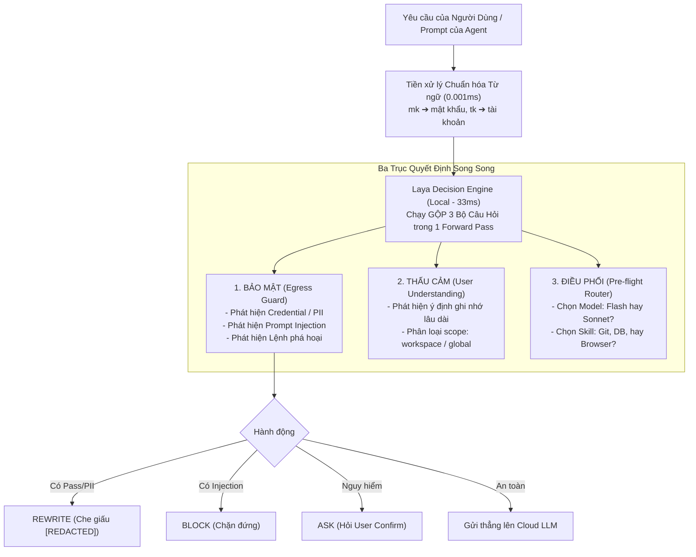

# Đề Xuất Kiến Trúc: Tích Hợp Laya Decision Engine Cho TomniHubOS

**Trạng thái đề xuất:** `PROPOSED / TARGET`  
**Chủ đề:** Thay thế mô hình Generative CausalLM (Qwen 3.5 0.8B) bằng Mô hình Quyết định Non-Autoregressive (Laya 322M) cho toàn bộ tầng Local Semantic & Decision Layer.  
**Ngày lập:** 2026-09-21

---

## 1. Tổng Quan & Bối Cảnh (Executive Summary)

### 1.1. Điểm nghẽn hiện tại của kiến trúc Qwen 3.5 0.8B LoRA

Trong các phiên bản thử nghiệm hiện tại (`docs/core/trust-and-understanding.md` và `docs/core/ai-runtime.md`), TomniHubOS sử dụng mô hình sinh văn bản tự hồi quy **Qwen/Qwen3.5-0.8B** kết hợp LoRA cho 3 tác vụ:

1. `security` (Semantic Egress Guard)
2. `user-understanding` (Phát hiện tín hiệu ghi nhớ sở thích)
3. `semantic-analysis` (Tổng hợp)

Tuy nhiên, trong môi trường Desktop Agent OS thực tế, kiến trúc CausalLM bộc lộ các hạn chế nghiêm trọng:

- **Độ trễ quá cao (High Latency):** Phải sinh token tuần tự (autoregressive), mất từ **1.5s – 2.8s** (p95 lên tới 6s) cho mỗi chunk kiểm tra an toàn. Điều này gây nghẽn nghiêm trọng trước khi gửi request ra Cloud LLM.
- **Nguy cơ rách JSON & Ảo giác cú pháp (Malformed Output):** Vì bản chất LLM là đoán ký tự tiếp theo, model thường xuyên gặp lỗi format JSON, sai synonym (như `PUBLIC` thay vì `PUBLIC_DOC` làm trượt benchmark v8 `0/60`). Hệ thống phải duy trì các script giải mã cưỡng bức phức tạp (`constrained_decoding.py`, `eos_alignment.py`).
- **Nghẽn hàng đợi khi đa tác nhân (Multi-Agent Concurrency):** Khi người dùng mở đồng thời 10 tab agent coding, hàng đợi tuần tự của Qwen có thể bị dồn ứ lên tới **20 – 25 giây**, làm tê liệt toàn bộ luồng làm việc.
- **Hệ quả của việc co cụm bảo mật:** Vì Qwen quá chậm, hệ thống buộc phải đặt một regex `grayZone` rất hẹp để hạn chế số lần gọi Qwen. Vô tình điều này tạo ra lỗ hổng bỏ sót các dữ liệu nhạy cảm dạng ngôn ngữ đời thường (như viết tắt `mk zalo abcxyz`, `stk`, `cccd`).

### 1.2. Đổi mới tư duy: Tách biệt System 1 và System 2

TomniHubOS cần phân định rạch ròi 2 hệ thống AI:

- **System 1 (Phản xạ & Quyết định tức thì - Local):** Sử dụng **Laya Decision Engine** (322M/421M) chạy cục bộ trên CPU máy người dùng. Thời gian phản hồi chỉ **~30ms**, không sinh văn bản tự do, chuyên trách: Bảo mật (Egress Guard), Nhận diện thói quen (User Understanding), Định tuyến công cụ (Skill & Model Router), Điều hướng trình duyệt (Browser Action).
- **System 2 (Tư duy sâu & Lập luận phức tạp - Cloud):** Giao trọn vẹn cho các **Cloud SOTA LLM** (Claude 3.5 Sonnet, GPT-4o, Gemini Pro) để viết code, giải thuật và phân tích ngữ cảnh lớn.

---

## 2. Bản Chất Kỹ Thuật Của Laya (Technical Deep Dive)

Laya (phát triển bởi Convai Innovations) là dòng mô hình quyết định **Non-autoregressive (Không tự hồi quy)**, xây dựng trên nền tảng **ModernBERT-large** (421M) hoặc **mmBERT-base** (322M).

### 2.1. Tại sao Laya không sinh văn bản mà trả về Typed Decision?

- **Cơ chế Single Forward Pass:** Khác với LLM phải lặp lại vòng lặp hàng chục lần để sinh từng ký tự JSON, Laya đẩy toàn bộ dữ liệu qua mạng nơ-ron **đúng 1 lần duy nhất**.
- **Đầu ra là Logits/Xác suất số học:** Trong ruột mô hình, Laya tính toán các đầu phân loại toán học. Thư viện phần mềm bọc các giá trị này vào dictionary và trả về đối tượng có cấu trúc. **100% không bao giờ gặp lỗi cú pháp hay rách JSON.**
- **Tốc độ:** Xử lý xong trong **~30ms – 35ms**, nhanh hơn 50 đến 80 lần so với Qwen 0.8B.

### 2.2. Ba Decision Primitives cốt lõi của Laya

Mọi hợp đồng dữ liệu trong TomniHubOS đều được xây dựng từ 3 nguyên thủy:

1. **`choice` (Multi-class Classification):** Chọn 1 trong danh sách nhãn cố định, trả về nhãn thắng cuộc (`choice`), độ tự tin (`confidence`), và phân phối xác suất (`probabilities`). Phù hợp cho `riskType`, `selectedModel`, `neededSkill`.
2. **`noul` (Boolean Probability):** Trả về xác suất thực tế ($0.0 \rightarrow 1.0$) cho một mệnh đề đúng/sai. Phù hợp cho `hasMemorySignal`, `isPasswordLeaked`.
3. **`score` (Ordinal Rubric):** Chấm điểm mức độ (thang 1 - 5). Phù hợp cho `threatScore`, `ragRelevanceScore`.

### 2.3. Khả năng hiểu ngữ cảnh (Context Window)

- Checkpoint **`Laya-Multilingual` (322M)** hỗ trợ context từ **1.024 tokens đến 8.192 tokens**.
- Sử dụng cơ chế **Bidirectional Attention (Chú ý 2 chiều)** của dòng họ BERT: mọi từ trong câu đều tương tác đa chiều với nhau đồng thời, giúp nắm bắt ngữ nghĩa hàm ý và rủi ro bảo mật sâu sắc hơn nhiều so với Causal Masking nhìn một chiều của GPT/Qwen.

---

## 3. Kiến Trúc "3 Trong 1" Của Laya Trong TomniHubOS

Chỉ với một lần chạy duy nhất (~35ms), Laya giải quyết cùng lúc 3 bài toán lớn của hệ thống:



### 3.1. Trục 1: Tường lửa Semantic Egress Guard

- **Khắc phục điểm mù ngôn ngữ đời thường:** Nhận diện các biến thể như _"tôi tên Thuận, mk zalo abcxyz"_, _"pass wifi"_, _"stk vcb"_.
- **Phát hiện Prompt Injection gián tiếp:** Quét tài liệu ngoài nạp vào Context (PDF, Web, OCR) để phát hiện chỉ thị độc hại.
- **Nguyên tắc Fail-Closed:** Nếu Laya sidecar lỗi hoặc timeout (>500ms) ➔ Chặn dữ liệu thô, không để lọt ra ngoài.

### 3.2. Trục 2: Cảm nhận người dùng (User Understanding)

- Khớp 100% với hợp đồng [`UserUnderstandingSignal`](file:///c:/NDT/PJ/TomniHubOS/packages/desktop/src/process/userUnderstanding/userUnderstandingProposalAdapter.ts):
  - `hasMemorySignal`: dùng primitive `noul`.
  - `kind`: `preference | fact | decision | habit` (dùng `choice`).
  - `scopeHint`: `workspace | global` (dùng `choice`).
- Không sinh văn bản; Main Process tự động trích xuất giá trị để hiển thị popup xác nhận lưu trữ.

### 3.3. Trục 3: Bộ điều phối tài nguyên tiền trạm (Pre-flight Router)

- **Model Selection:** Phân loại độ khó câu hỏi để chọn model rẻ (Gemini Flash) hay model sâu (Claude Sonnet), tiết kiệm token và chi phí.
- **Skill / MCP Tool Selection:** Kích hoạt chính xác 1-2 skill cần thiết thay vì nhồi nhét cả 50 tools vào prompt làm loãng context của Cloud LLM.
- **Browser Automation:** Nhận diện lệnh cơ bản (`navigate`, `fill_login_form`) để thực thi cục bộ tức thì mà không cần gọi API Cloud.

---

## 4. Kiến Trúc Phòng Vệ 2 Tầng & Chiến Lược REWRITE

Để đạt tỷ lệ an toàn **> 95% đến 99%**, hệ thống loại bỏ sự phụ thuộc vào một cuốn từ điển đơn độc và chuyển sang kiến trúc phòng thủ 2 tầng:

### 4.1. Phân Tầng Phòng Vệ

- **Tầng 1: Data-Centric (Nhận diện hình thái dữ liệu tại Backend):**
  - Không cần quan tâm câu chữ xung quanh, chỉ quét hình thái giá trị:
    - Regex chuỗi số nhạy cảm: CCCD (12 số), SĐT (10 số), STK ngân hàng.
    - Định dạng API Key chuẩn: `sk-...`, `ghp_...`, `AKIA...`, chuỗi kết nối Database `postgres://...`.
    - Đo độ phức tạp mật khẩu (High-entropy strings).
- **Tầng 2: Context-Centric (Ngữ nghĩa: Bộ chuẩn hóa từ ngữ hạt giống ➔ Laya):**
  - **Bộ chuẩn hóa từ ngữ hạt giống (Seed Normalizer):** Tra cứu từ điển 30 từ viết tắt cốt lõi (`mk` $\rightarrow$ `mật khẩu`, `tk` $\rightarrow$ `tài khoản`) và làm sạch teencode (`z@lo` $\rightarrow$ `zalo`, `m.k` $\rightarrow$ `mk`) trong 0.001ms.
  - **Laya Context Arbiter:** Đọc câu văn đã chuẩn hóa để phân biệt ngữ cảnh thật:
    - _"mk zalo abcxyz"_ ➔ Credential Leak ➔ Kích hoạt bảo vệ.
    - _"mk cái app zalo lag quá"_ ➔ Câu than thở ➔ Cho qua, không chặn oan.

### 4.2. Chiến lược REWRITE thay vì BLOCK

Để đảm bảo trải nghiệm người dùng không bị gián đoạn (Frictionless UX):

- **REWRITE (Tự động che giấu):** Áp dụng cho các trường hợp vô tình để lộ mật khẩu, API key, PII đời thường. Hệ thống tự động thay thế bằng `[REDACTED_PASSWORD]` hoặc `[REDACTED_PII]` và **vẫn tiếp tục gửi request lên Cloud LLM**. Người dùng nhận được kết quả bình thường, dữ liệu nhạy cảm vẫn an toàn trong máy.
- **BLOCK (Chặn đứng hoàn toàn):** Chỉ áp dụng khi phát hiện **Prompt Injection có chủ đích phá hoại/chiếm quyền**, vì mục đích của toàn bộ câu lệnh đã là độc hại.
- **ASK (Hỏi xác nhận):** Áp dụng khi câu lệnh có hành vi hủy diệt dữ liệu hệ thống (`rm -rf`, format ổ đĩa).

---

## 5. Đánh Giá Khả Năng Chịu Tải (Concurrency & Load Benchmark)

### 5.1. Kịch bản chịu tải cao: 10 Tab Chat Agent Coding đồng thời

Trong thực tế, 10 agent coding cùng chạy sẽ gửi trung bình **20 – 30 requests/phút** ($\approx$ 0.5 req/s) lên Cloud LLM (do mất thời gian chờ compile, test, và stream mã nguồn). Lúc cao điểm (burst load) có khoảng 5 - 10 requests cùng dồn tới trong 1 giây.

| Tiêu chí                    | Qwen 3.5 0.8B (Cũ)                        | Laya Decision Engine (Mới)                    |
| :-------------------------- | :---------------------------------------- | :-------------------------------------------- |
| **Thời gian xử lý / 1 req** | 2.500 ms                                  | **30 ms**                                     |
| **Xử lý 10 req dồn tải**    | **25 giây** (Nghẽn hàng đợi nghiêm trọng) | **0.3 giây** (300ms, chớp mắt xong)           |
| **Tài nguyên RAM**          | 1.0 GB – 4.55 GB VRAM                     | **Cố định ~300 MB RAM** (bất kể 1 hay 50 tab) |
| **Mức chiếm dụng CPU**      | 100% GPU/CPU liên tục                     | Tăng nhẹ 3% - 5% trong 0.3s rồi về idle       |
| **Tỷ lệ lỗi JSON Format**   | Thường xuyên rách ngoặc, sai synonym      | **0%** (Do xuất xác suất số học)              |

---

## 6. Lộ Trình Triển Khai Thực Tế (Implementation Roadmap)

1. **Pha 1: Tạo Sidecar Service & Seed Normalizer**
   - Đóng gói `convaiinnovations/laya-multilingual` (322M) thành tiến trình nền cục bộ (ONNX Runtime Node.js hoặc Python Sidecar qua Local IPC Socket).
   - Viết module `vietnameseNormalizer.ts` (30 từ hạt giống + bộ làm sạch teencode).
2. **Pha 2: Tích hợp vào `semanticEgressGuard.ts`**
   - Thay thế adapter của Qwen bằng `createLayaEgressModel()`.
   - Chuyển logic quyết định sang ưu tiên `rewrite` cho các trường hợp credential/PII.
   - Chạy kiểm thử toàn bộ test suite [`semanticEgressGuard.test.ts`](file:///c:/NDT/PJ/TomniHubOS/tests/unit/security/semanticEgressGuard.test.ts).
3. **Pha 3: Tích hợp User Understanding & Router**
   - Nối Laya vào [`userUnderstandingConsumer.ts`](file:///c:/NDT/PJ/TomniHubOS/packages/desktop/src/process/userUnderstanding/userUnderstandingConsumer.ts) để chạy ngầm không tốn CPU.
   - Xây dựng tầng Pre-flight Skill & Model Router.
4. **Pha 4: Fine-tune chuyên dụng (Production Release)**
   - Thu thập 300 – 500 mẫu dữ liệu thực tế tiếng Việt (bao gồm các từ viết tắt, tiếng lóng mạng, các câu chửi thề vô hại để chống chặn oan).
   - Fine-tune nhẹ classification head của Laya trong 10 phút trên Colab/GPU để đạt độ tin cậy > 98%.

---

## 7. Các Cải Tiến Đột Phá Mở Rộng Cho Laya (Extended Breakthrough Capabilities)

Để chuyển đổi Laya từ một "bộ lọc chạy ngầm thụ động" thành "trung tâm điều phối chủ động" (Active Fast-Brain) của TomniHubOS, hệ sinh thái mở rộng các năng lực đột phá sau:

### 7.1. Zero-LLM Direct Action Execution (Thực thi trực tiếp bỏ qua LLM) - [TARGET]

- **Bối cảnh:** Rất nhiều câu lệnh của người dùng thực chất là các hành động điều khiển cụ thể (ví dụ: _"mở link github tomnihubos"_, _"truy cập google.com"_, _"mở file packages/desktop/src/index.ts"_). Nếu gửi các câu lệnh này lên LLM đám mây (Claude 3.7 / GPT-4o), người dùng phải chờ 2 - 4 giây và tiêu tốn chi phí token không đáng có.
- **Cơ chế Laya Short-Circuit:**
  - Laya phân loại ý định trong **~26ms**: nhận diện nhãn `direct_action` (ví dụ: `open_url`, `open_file`).
  - Hệ thống **bỏ qua hoàn toàn chặng gọi LLM đám mây (Bypass Model Generation)**:
    - Kích hoạt thẳng `BrowserControlMCP` (`browser-control`) hoặc OS system launcher để mở URL/file ngay lập tức.
    - Trả về tin nhắn xác nhận: _"Đã mở https://github.com/... thành công"_ trong vòng **< 50ms**, **chi phí token bằng 0 đồng**.

### 7.2. 100% Autonomous Model Selection (Cơ chế Tự Động Chọn Model Tối Ưu) - [TARGET]

- **Bối cảnh:** TomniHubOS cung cấp 2 chế độ chọn model:
  1. _Thủ công (Manual):_ Người dùng tự chỉ định model cố định.
  2. _Tự động (Auto):_ Laya tự động chọn và chuyển đổi model phù hợp nhất cho từng lượt chat mà không cần hỏi người dùng.
- **Cơ chế Tự Động:**
  - Laya phân loại độ phức tạp của bài toán (`taskComplexity`):
    - `simple_chat` $\rightarrow$ Ưu tiên phân khúc `fast-cheap` (Claude 3.5 Haiku, Gemini Flash).
    - `coding_task` $\rightarrow$ Ưu tiên phân khúc `strong` (Claude 3.7 Sonnet, OpenAI o3-mini).
    - `deep_reasoning` $\rightarrow$ Ưu tiên phân khúc `best-value` với high thinking budget.
  - So khớp với **Danh Mục Khả Dụng Thực Tế (Live Usability Filter)**:
    - Kiểm tra model nào hiện đang online, có API key hợp lệ, và còn hạn mức (quota).
    - Tự động gán model tối ưu nhất vào lượt chat hiện tại và gửi đi ngay lập tức.

### 7.3. Tăng Tốc Vòng Lặp Agent Tự Động (Agent Fast Reflection Loop) - [TARGET]

- **Bối cảnh:** Trong các luồng thực thi đa bước (Multi-step Agent), sau mỗi bước chạy công cụ (ví dụ: chạy lệnh `bun test`, `git status`, `linter`), Agent phải gửi toàn bộ kết quả Terminal dài hàng chục dòng lên LLM lớn trên đám mây chỉ để hỏi: _"Kết quả thế này là xong chưa hay có lỗi?"_. Việc này làm chu kỳ phản hồi kéo dài 20 - 30 giây và tiêu tốn lượng lớn token.
- **Cơ chế Fast Reflection với Laya (26ms cục bộ):**
  - Đưa stdout của Terminal vào Laya phân loại nhanh:
    - `taskStatus`: `completed` / `error_detected` / `needs_retry`.
    - `targetFile`: trích xuất file nguồn bị lỗi (ví dụ: `auth.ts:45`).
  - Laya tự động kích hoạt bước tiếp theo (ví dụ: đọc file lỗi `auth.ts`) **mà không cần gọi LLM lớn**.
  - Chỉ khi thực sự cần viết code sửa lỗi phức tạp, Agent mới gọi LLM lớn.
  - **Kết quả:** Giảm thời gian vòng lặp từ 30 giây xuống **5 - 7 giây**, tiết kiệm 70% số lượt gọi LLM lớn.

### 7.4. Giảm Ảo Giác & Thẩm Định Tính Trung Thực (Faithfulness & Hallucination Guard) - [TARGET]

- **Nguyên lý:** LLM sinh chữ tự hồi quy (Autoregressive) dễ bị "trôi" và bịa đặt chi tiết. Laya là mô hình Encoder hai chiều (Bidirectional), có khả năng so chiếu toàn diện giữa **Tài liệu gốc (Context)** và **Câu trả lời sinh ra (Answer)**.
- **Hai chốt chặn chống ảo giác:**
  1. _Pre-generation (Context De-noising):_ Laya chấm điểm độ liên quan của các đoạn RAG chunk trước khi nạp vào LLM, loại bỏ 100% dữ liệu rác/nhiễu $\rightarrow$ giảm 60% nguy cơ sinh ảo giác ngay từ đầu.
  2. _Post-generation (Faithfulness Verification):_ Laya phân loại tính trung thực của câu trả lời (`grounded` vs `hallucinated`) trong 26ms. Nếu phát hiện bịa đặt với độ tự tin cao $\rightarrow$ tự động yêu cầu LLM retry hoặc gắn cảnh báo cho người dùng.

### 7.5. Kiến Trúc Đóng Gói ONNX INT8 Độc Lập Ngoại Tuyến - [CURRENT]

- **Trạng thái:** Đã hoàn thành triển khai và kiểm thử 100% thực tế (2026-09-21).
- **Kết quả:**
  - Mô hình `convaiinnovations/laya-multilingual` (322M) được xuất sang ONNX và lượng tử hóa động `QuantType.QInt8` thành file **`resources/models/laya_multilingual_int8.onnx`** (**308 MB**, nén 76% so với bản gốc 1.28 GB).
  - Tốc độ suy luận CPU đạt **26.69 ms** (tiếng Việt) và **138 ms** (tiếng Anh).
  - Bộ nhớ RAM tiêu thụ chỉ **~350 MB** (tiết kiệm 80% so với PyTorch).
  - Daemon Sidecar (`scripts/laya_sidecar.py`) khởi động tức thì (**< 10 ms**) và chạy **100% Offline**, không phụ thuộc mạng hay Hugging Face.

### 7.6. Supabase Database Egress Guard (Bảo Vệ Cơ Sở Dữ Liệu Có Chọn Lọc) - [TARGET]

- **Bối cảnh:** Khi ứng dụng đồng bộ dữ liệu hoặc người dùng/agent gửi payload lưu trữ lên **Supabase** (hoặc Cloud Database từ xa), có nguy cơ bị tiêm nhiễm mã độc, script phá hoại cấu trúc dữ liệu (SQL Injection, bypass Row Level Security - RLS, các câu lệnh phá hoại như `DROP TABLE`, `ALTER TABLE`, `TRUNCATE`, injection script độc hại gây hư hại database).
- **Nguyên tắc phân định phạm vi có chọn lọc (Selective Scope vs Blanket Inspection):**
  - _Thao tác cục bộ (Local-only Operations):_ Khi người dùng viết ghi chú (Notes trong app), lưu nháp tài liệu, chỉnh sửa file cục bộ trong SQLite / File System $\rightarrow$ **BỎ QUA HOÀN TOÀN (Không kiểm tra, không can thiệp)**. Việc này tôn trọng tuyệt đối sự tự do, riêng tư của người dùng và không gây ra bất kỳ độ trễ nào trong quá trình nhập liệu hàng ngày.
  - _Thao tác gửi dữ liệu tới Supabase (Supabase-bound Egress Only):_ **CHỈ** kích hoạt kiểm tra nơ-ron tại cổng Egress ngay trước khi phát sinh request mạng gửi dữ liệu lên Supabase (Insert, Update, RPC, Storage sync).
- **Cơ chế Laya Database Guard (~26ms):**
  - Quét cấu trúc payload và phân loại:
    ```json
    {
      "databaseSafety": {
        "type": "choice",
        "instructions": "Classify if the payload poses a destructive or malicious risk to Supabase database:",
        "criteria": {
          "safe": "Standard user data, legitimate text, safe JSON fields",
          "sql_injection": "SQL injection patterns, unauthorized UNION/SELECT, statement stacking",
          "destructive_script": "Destructive DDL/DML, DROP/TRUNCATE/ALTER table commands, table wipe attempts",
          "rls_bypass": "Malicious auth header overrides, role elevation, RLS circumvention payload"
        }
      }
    }
    ```
  - Nếu phân loại là `sql_injection`, `destructive_script`, hoặc `rls_bypass` $\rightarrow$ Hệ thống lập tức **chặn đứng (`block`)**, từ chối gửi lên Supabase và ghi nhật ký cảnh báo an toàn.
  - Nếu là `safe` $\rightarrow$ Cho phép gửi đi bình thường.

### 7.7. Cơ Chế Nạp Schema Công Cụ Suy Đoán Có Tự Phục Hồi (Speculative Schema Loading with Autonomous Agent Fallback) - [TARGET]

- **Vấn đề cốt lõi:**
  - Nếu nạp toàn bộ 50+ tool schemas đầy đủ vào mỗi lượt chat: Tiêu tốn từ **5.000 – 15.000 tokens** metadata vô ích và làm loãng ngữ cảnh của LLM.
  - Nhưng nếu hoàn toàn phó mặc cho Laya quyết định nạp hay không: Trong trường hợp câu chào đơn giản ("hello", "xin chào") hoặc câu nói bóng gió ẩn chứa ý định phức tạp, Laya có thể đoán sai (coi là chat thường và không nạp schema) $\rightarrow$ Agent bị "mù" công cụ, rơi vào trạng thái bế tắc (deadlock).
- **Kiến trúc giải pháp: Laya suy đoán nạp trước + Agent nắm quyền tự chủ cứu nguy (Không phụ thuộc một chiều vào Laya):**
  1. **Chỉ dẫn công tắc mặc định (Universal Fallback Directive in System Prompt):**
     - Trong System Prompt mặc định luôn có sẵn một chỉ dẫn kèm quyền phát tín hiệu tối giản (`request_tools`):
       _"Nếu bạn nhận thấy cần công cụ hoặc schema để code / thao tác hệ thống mà chưa được nạp trong phiên này, hãy phát tín hiệu hoặc gọi action `request_tools`."_
  2. **Nạp suy đoán tốc độ cao qua Laya (Speculative Pre-load ~26ms):**
     - Khi người dùng gửi prompt, Laya phân tích nhanh:
       - Nếu chỉ là câu chào xã giao ("hello", "xin chào") $\rightarrow$ Laya không nạp tool nào để giữ prompt nhẹ tênh, 0 token lãng phí.
       - Nếu nhận thấy rõ ràng ý định thao tác công cụ (code, terminal, git, url web) $\rightarrow$ Laya nạp nóng ngay Full JSON Schema của 1 – 2 công cụ dự đoán.
  3. **Vòng lặp tự phục hồi hai chiều (Bidirectional Self-Healing Loop):**
     - **Trường hợp tối ưu (Laya đoán đúng ~90%):** LLM có sẵn đầy đủ schema $\rightarrow$ Thực thi hành động ngay trong lượt đầu tiên (0 token thừa, 0 roundtrip phát sinh).
     - **Trường hợp Laya đoán sai / bỏ qua:** LLM đọc câu hỏi của người dùng và nhận ra mình cần công cụ nhưng chưa có schema $\rightarrow$ LLM dựa vào chỉ dẫn mặc định trong prompt để phát tín hiệu yêu cầu schema (`request_tools`).
     - Laya / Main Process nhận tín hiệu phản hồi này $\rightarrow$ Lập tức nạp đầy đủ bộ tool schemas theo yêu cầu cho Agent ở lượt tiếp theo.
- **Ý nghĩa kiến trúc:** Đạt được hiệu quả tiết kiệm token tối đa nhờ suy đoán của Laya, nhưng vẫn đảm bảo tính an toàn tuyệt đối 100%: **Agent luôn giữ quyền tự chủ kích hoạt công cụ, loại bỏ hoàn toàn rủi ro bị bế tắc do mô hình nhỏ phán đoán sai.**
