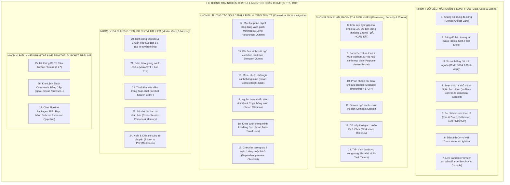
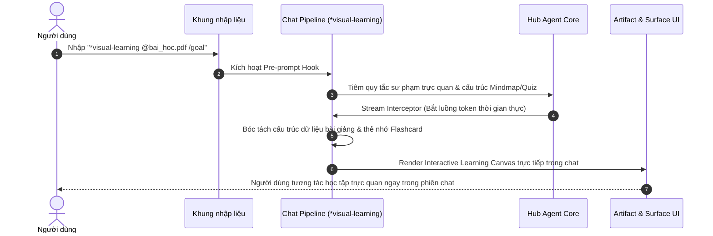
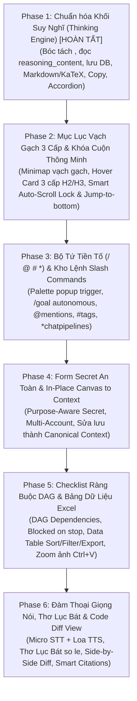

# Đặc Tả Kiến Trúc & Thiết Kế Toàn Diện: Chat UI, Artifacts Đa Năng, Trực Quan Hóa & Hệ Sinh Thái Agent OS (27 Trụ Cột)

## Bản Đặc Tả Kỹ Thuật Chuẩn Hóa Toàn Diện Hệ Thống Trải Nghiệm Chat UI & Agent OS Thế Hệ Mới

- **Trạng thái:** TARGET / Đề xuất nâng cấp kiến trúc & trải nghiệm người dùng
- **Phân loại:** Chat UI, Data Interaction, In-place Editing, Hierarchical Outline, Context Menu, Smart Citations, Voice 2-Way, Auto-Scroll Lock, Reasoning Engine, Command Palette (/ @ # \*), Chat Pipeline Packages (Repo to Subchat)
- **Tác giả/Chủ sở hữu:** Core UI/UX & Renderer Engineering
- **Tài liệu liên quan:** [docs/README.md](../README.md), [docs/product/vision.md](../product/vision.md), [docs/future/5-y-tuong-kien-truc-dot-pha.md](5-y-tuong-kien-truc-dot-pha.md)

---

## 1. Tổng Quan Kiến Trúc Toàn Diện (27 Trụ Cột)

Bản đặc tả kỹ thuật này thiết lập tiêu chuẩn sản phẩm cho TomniHubOS, tích hợp đầy đủ 27 trụ cột trải nghiệm người dùng (UX), năng lực tương tác dữ liệu, điều khiển phím tắt và hệ sinh thái mở rộng subchat, sánh ngang và vượt trội so với các nền tảng hàng đầu (ChatGPT, Claude, Cursor, Devin):



---

## 2. Nhóm I: Dữ Liệu, Mã Nguồn & Soạn Thảo Trực Tiếp (Data, Code & Editing)

### 2.1. Trụ cột 1: Khung Chứa Nội Dung Đa Năng (Unified Artifact Card)

- **Nguyên lý Zero Agent Burden:** Agent chỉ cần trả về khối mã tiêu chuẩn kèm tên file (ví dụ `html:index.html`, `python:app.py`, `csv:data.csv`).
- **TypeScript Interface:**

  ```typescript
  export type ArtifactType = 'code' | 'html' | 'svg' | 'mermaid' | 'table' | 'diff' | 'sandbox' | 'markdown';

  export interface IArtifactCardPayload {
    id: string;
    title: string;
    filename?: string;
    language: string;
    content: string;
    type: ArtifactType;
    isExecutable: boolean;
    version: number;
    createdAt: number;
  }
  ```

- **Toolbar tự sinh:**
  - Nút `[ 📋 Copy ]`: Sao chép nội dung mã nguồn vào clipboard.
  - Nút `[ 💾 Save to Workspace ]`: Ghi trực tiếp file vào thư mục làm việc hiện tại qua IPC native filesystem (`ipcBridge.fs.writeFile`).
  - Nút `[ ⛶ Toàn màn hình ]`: Mở Artifact ra modal toàn màn hình 95vw $\times$ 90vh.
- **Tabs chuyển đổi linh hoạt:** `[ 💻 Mã nguồn ]` $\leftrightarrow$ `[ 🌐 Xem trước (Live Preview) ]` đối với các định dạng HTML, SVG, Markdown và Mermaid.

### 2.2. Trụ cột 2: Bảng Dữ Liệu Tương Tác (Interactive Data Tables: Sắp Xếp, Lọc & Xuất Excel)

- **Cơ chế hoạt động:** Bất kỳ bảng Markdown nào có từ 3 dòng trở lên đều tự động được render thành **Interactive Data Table Component** thay vì thẻ `<table>` tĩnh.
- **Tính năng cốt lõi:**
  1. **Sort theo cột:** Click vào Header cột để chuyển đổi trạng thái: Sắp xếp tăng dần ($A \rightarrow Z$, số nhỏ $\rightarrow$ lớn), giảm dần, và trả về mặc định.
  2. **Thanh tìm kiếm nội bộ (Filter bar):** Ô tìm kiếm nhỏ ở góc trên bên phải bảng; lọc theo thời gian thực (debounce 150ms) trên toàn bộ các cột.
  3. **Xuất 1-Click ra Excel / CSV:**
     - Nút `[ 📊 Xuất .xlsx ]`: Sử dụng thư viện `xlsx` tạo file Excel chuẩn, tự động định dạng độ rộng cột.
     - Nút `[ 📄 Xuất .csv ]`: Xuất file UTF-8 CSV có BOM để mở trên Excel không bị lỗi font tiếng Việt.
  4. **Sticky Header & Phân trang tự động:** Khi bảng dài trên 15 dòng, tiêu đề cột được ghim cố định ở đỉnh khi cuộn, hoặc chia trang (10 / 25 / 50 dòng/trang).

### 2.3. Trụ cột 3: So Sánh Thay Đổi Mã Nguồn (Side-by-Side Code Diff & 1-Click Apply)

- **Cơ chế hoạt động:** Khi Agent đề xuất sửa đổi mã nguồn cho một file đã tồn tại, thay vì in lại toàn bộ file hoặc in patch thô, hệ thống hiển thị khối **Code Diff Viewer**:
- **Chế độ hiển thị:**
  - `Split Mode`: 2 cột song song (Bản gốc bên trái, Bản sửa bên phải).
  - `Unified Mode`: Kết hợp 1 cột với các dòng đỏ (`-`) và dòng xanh (`+`).
- **Nút "Áp dụng vào File" (1-Click Apply to File):**
  - Gửi IPC gọi lệnh patch của Hub Main Process (`applyUnifiedDiff`).
  - Kiểm tra hash toàn vẹn của file gốc trước khi ghi đè; tự động backup phiên bản cũ trước khi thay đổi.
  - Thông báo kết quả ngay trên thẻ: _"Đã cập nhật file src/auth.ts (+12, -3 dòng)"_.

### 2.4. Trụ cột 4: Soạn Thảo Tại Chỗ & Biến Thành Ngữ Cảnh Chính (In-Place Canvas to Canonical Context)

- **Edit Mode Toggle:** Nút `[ ✏️ Chỉnh sửa ]` xuất hiện ở góc phải tin nhắn của Agent hoặc nhấp đúp vào khối nội dung:
  - Khối hiển thị chuyển thành Monaco Editor / Markdown Editor cho phép người dùng sửa đổi, bổ sung hoặc xóa bớt nội dung.
- **Cơ chế Chuyển giao Ngữ cảnh Chính (Canonical Context Transition):**

  ```mermaid
  flowchart LR
      Edit["User sửa nội dung tin nhắn"] --> Save["Bấm nút [ 💾 Lưu thay đổi ]"]
      Save --> DB["Ghi đè SQLite DB cục bộ"]
      Save --> Canonical["Đặt cờ: Active Canonical Context"]
      Canonical --> NextTurn["Lượt chat tiếp theo của Agent: Tự động kế thừa bản sửa làm ngữ cảnh chính"]
  ```

  - Khi người dùng bấm **[Lưu thay đổi]**:
    1. Cập nhật trực tiếp vào SQLite database của tin nhắn đó (bảo toàn sau reload).
    2. Gán cờ `isCanonicalContext = true`.
    3. Đẩy nội dung đã sửa vào `ConversationContext` của phiên làm việc.
    4. Lượt chat kế tiếp của Agent tự động làm việc dựa trên chính xác phiên bản người dùng đã sửa mà không cần user phải nhắc lại.

- **Selection AI Toolbar:** Bôi đen một đoạn văn bản trong khối soạn thảo bung thanh công cụ mini:
  - `[ 🪄 Viết lại ngắn hơn ]`
  - `[ 🎯 Đổi giọng chuyên nghiệp ]`
  - `[ 🌐 Dịch sang tiếng Anh/Việt ]`
  - `[ 💬 Prompt riêng ]`

### 2.5. Trụ cột 5: Hệ Thống Sơ Đồ Mermaid Chuẩn Thực Tế Dự Án

- **Bản đồ tương tác Pan & Zoom:** Cho phép kéo rê tự do (Pan) và cuộn con lăn chuột để phóng to/thu nhỏ (Zoom in/out) mượt mà bằng thư viện `@panzoom/panzoom`.
- **Fullscreen Modal:** Phóng to sơ đồ ra cửa sổ Modal 95vw $\times$ 90vh, tối ưu cho các sơ đồ kiến trúc vi dịch vụ hoặc sequence diagrams phức tạp.
- **Xuất ảnh chất lượng cao:** Nút `[ 📥 Xuất SVG ]` (vector chuẩn) và `[ 🖼️ Xuất PNG 3x ]` (rasterize độ phân giải cao có nền trong suốt hoặc nền trắng).
- **Cơ chế Syntax Tolerance & Tự phục hồi:** Nếu mô hình sinh cú pháp Mermaid bị lỗi (thiếu ngoặc, ký tự đặc biệt chưa escape), hệ thống không làm sập giao diện mà tự động:
  - Chuyển sang hiển thị tab Mã nguồn thô.
  - Báo đỏ dòng có lỗi cú pháp để người dùng hoặc Agent nhận biết và sửa lại.

### 2.6. Trụ cột 6: Dán Ảnh Chụp Màn Hình `Ctrl + V` với Zoom Hover & Lightbox Phóng To

- **Dán trực tiếp từ Clipboard:** Người dùng nhấn `Win + Shift + S` chụp màn hình lỗi $\rightarrow$ bấm `Ctrl + V` vào ô SendBox $\rightarrow$ hệ thống tự động bóc tách clipboard data (`image/png`), lưu file tạm vào `.tmp/attachments/` và tạo thumbnail đính kèm.
- **Di chuột phóng to tức thì (Hover Magnifier Tooltip):**
  - Khi rê chuột qua thumbnail ảnh đính kèm, xuất hiện một cửa sổ popover phóng to cục bộ (Zoom Tooltip 300px $\times$ 300px) tại tọa độ con trỏ chuột, giúp soi nhanh các dòng log hoặc đoạn code nhỏ trong ảnh mà không cần mở ảnh.
- **Click mở Lightbox toàn màn hình:**
  - Nhấp chuột vào ảnh để mở Lightbox Modal: Phóng to 100% kích thước gốc, hỗ trợ con lăn chuột zoom, kéo rê ảnh và nút xoay ảnh 90 độ.

### 2.7. Trụ cột 7: Live Sandbox Preview An Toàn & Interactive Playground

- **Isolated Iframe Sandbox:** Chạy thử nghiệm HTML/CSS/JS, Canvas 2D, Three.js, SVG tương tác trong thẻ `<iframe>` với các thuộc tính bảo mật tuyệt đối:

  ```html
  <iframe sandbox="allow-scripts" srcdoc="..." />
  ```

  - Chặn hoàn toàn quyền truy cập vào `window.electronAPI`, `localStorage` của app, Node.js runtime và DOM của Electron host.

- **Mini Console Output:** Tích hợp bộ bắt log (`console.log`, `console.warn`, `console.error`) bên dưới khung preview, giúp người dùng theo dõi runtime errors của code Javascript.
- **Xuất bản Web 1-Click (Publish to Web):** Tích hợp Cloudflare Tunnel / Ngrok local bridge để sinh đường dẫn công khai tức thì (`https://preview.tomny.site/...`) để xem thử trên điện thoại di động.

---

## 3. Nhóm II: Suy Luận, Bảo Mật & Điều Khiển Tác Tử (Reasoning, Security & Control)

### 3.1. Trụ cột 8: Khối Suy Nghĩ (Reasoning Engine) Gập Mở Êm Ái & Lưu DB Bền Vững _(Đã Hoàn Tất ở Phase 1)_

- **Kiến trúc đã triển khai:**
  - `extractThinkingAndContent` tại [`thinkTagFilter.ts`](file:///c:/NDT/PJ/TomniHubOS/packages/desktop/src/renderer/utils/chat/thinkTagFilter.ts): Bóc tách realtime `<think>...</think>` cả khi đang stream lẫn khi đã hoàn tất, xử lý định dạng MiniMax.
  - Decode `delta.reasoning_content` và `delta.reasoning` tại [`loopbackOpenAiAdapter.ts`](file:///c:/NDT/PJ/TomniHubOS/packages/desktop/src/process/experimentalCore/adapters/loopbackOpenAiAdapter.ts).
  - Lưu bền vững vào SQLite DB qua `this.repository.saveMessage(...)` tại [`nativeConversation/service.ts`](file:///c:/NDT/PJ/TomniHubOS/packages/desktop/src/process/services/database/nativeConversation/service.ts) kèm `duration`. F5 / reload không mất khối suy nghĩ.
  - Bảo toàn nội dung trên frame `done` tại [`hooks.ts`](file:///c:/NDT/PJ/TomniHubOS/packages/desktop/src/renderer/pages/conversation/Messages/hooks.ts).
  - Nâng cấp [`MessageThinking.tsx`](file:///c:/NDT/PJ/TomniHubOS/packages/desktop/src/renderer/pages/conversation/Messages/components/MessageThinking.tsx): Render Markdown, KaTeX, nút Copy, accordion animation và cờ `userToggledRef` bảo toàn ý định người dùng.
  - Tự động hiển thị `MessageThinking` cho các tin nhắn lịch sử có thẻ `<think>` tại [`MessageText.tsx`](file:///c:/NDT/PJ/TomniHubOS/packages/desktop/src/renderer/pages/conversation/Messages/components/MessageText.tsx).

### 3.2. Trụ cột 9: Form Xác Thực Bí Mật An Toàn, Multi-Account & Học Ngữ Cảnh Mục Đích (Purpose-Aware Secret)

- **Rủi ro bảo mật:** Khi Agent cần đăng nhập tài khoản (Facebook, GitHub, Server SSH), chatbot thông thường hỏi pass qua text $\rightarrow$ rò rỉ mật khẩu lên Cloud LLM và chat log!
- **Card Form An Toàn Trực Tiếp Trong Chat:** Chặn trước khi gửi prompt lên LLM, hiển thị form nhập an toàn với ô password bị che `••••••••`.
- **Hỗ trợ Đa Tài Khoản & Gắn Ngữ Cảnh Mục Đích (Purpose / Context Note):**
  - Người dùng có thể lưu nhiều tài khoản cho cùng một nền tảng:
    - `fb_acc_1`: Mục đích _"Bán hàng, Quản lý Fanpage, Đăng bài sản phẩm"_.
    - `fb_acc_2`: Mục đích _"Cá nhân, Bạn bè"_.
- **Cơ chế Causal Context Learning của Laya:**
  ```mermaid
  flowchart TD
      UserPrompt["User: 'Đăng bài bán hàng lên Facebook'"] --> LayaCheck["Laya SessionMemoryStore kiểm tra luật nhân quả"]
      LayaCheck --> Match{"Có khớp Context Note không?"}
      Match -->|Khớp 'Bán hàng'| AutoPick["Tự động lấy fb_acc_1 thực thi 100% không hỏi lại"]
      Match -->|Mơ hồ: 'Vào Facebook'| PromptDropdown["Bung dropdown hỏi: Chọn acc Bán hàng hay Cá nhân?"]
  ```
- **Bảo Mật Tuyệt Đối Opaque Handle:** Mật khẩu được mã hóa và lưu trữ tại OS Keychain / SafeStorage ở Main process. Cả Renderer process và Model Context chỉ nhận mã mờ không thể đảo ngược `{{secret:cred_fb_01}}`.

### 3.3. Trụ cột 10: Phân Nhánh Hội Thoại Khi Sửa Câu Hỏi (Message Branching `< 1 / 2 >`)

- Người dùng bấm nút `[ ✏️ Sửa ]` trên bong bóng tin nhắn của mình để sửa lại prompt.
- Khi gửi lại, hệ thống không xóa lịch sử cũ mà tạo một nhánh rẽ mới (Branch DAG Node).
- Hiển thị bộ điều hướng `< Nhánh 2 / 3 >` ở đầu lượt chat, cho phép người dùng chuyển đổi qua lại giữa các phiên bản câu trả lời của AI một cách tức thì.

### 3.4. Trụ cột 11: Drawer Ngữ Cảnh & Nút Thu Dọn Nén Ngữ Cảnh (Compact Context Button)

- Drawer đồng bộ mở nhanh ở cả trang Home và thanh chat với 3 tab:
  1. `Tab Note (Ghi chú)`: Bàn nháp lưu ý tưởng, checklist và prompt tạm thời.
  2. `Tab Context (Ngữ cảnh)`: Hiển thị danh sách các file đang tham chiếu trong phiên và thanh đo dung lượng token trực quan (Token Usage Gauge).
  3. `Tab Secret Key (Kho bí mật)`: Quản lý các tài khoản, API key và nhãn mục đích.
- **Nút Thu Dọn & Nén Ngữ Cảnh (Compact Context):**
  - Nút **`[ 🧹 Thu dọn & Nén ngữ cảnh ]`** kích hoạt thuật toán nén ngữ cảnh của `SessionMemoryStore`:
  - Tóm tắt các lượt chat cũ thành các bản ghi sự thật cô đọng (Fact Capsules), giải phóng 60-80% dung lượng token nhưng không làm mất ngữ cảnh cốt lõi của dự án.

### 3.5. Trụ cột 12: Cỗ Máy Thời Gian - Hoàn Tác Workspace 1-Click (1-Click Workspace Rollback)

- Trên mỗi lượt chạy (Turn) của Agent có nút `[ ⏪ Hoàn tác Turn này ]`.
- Trước khi thực thi bất kỳ công cụ ghi file nào, hệ thống tự động ghi nhận snapshot delta vào `actionEvidenceLedger`.
- Khi bấm Rollback: Hệ thống hoàn tác toàn bộ các file bị sửa/tạo/xóa về đúng trạng thái nguyên vẹn trước khi Turn đó bắt đầu.

### 3.6. Trụ cột 13: Theo Dõi Tiến Trình Đa Tác Vụ Song Song (Parallel Multi-Task Execution & Timers)

- Khi Agent hoặc hệ thống Multi-Agent thực hiện đồng thời nhiều tác vụ (ví dụ: Việc 1 build backend, Việc 2 fetch API & phân tích):
- Hiển thị bảng theo dõi tiến trình song song (Parallel Progress Tracker):
  ```text
  ⚡ Đang xử lý song song 2 tác vụ:
  ├── [🔄 Việc 1: Build Backend Server]      Đã chạy 14s (Dự kiến: ~25s)  [ Chi tiết ▾ ]
  └── [🔄 Việc 2: Lấy dữ liệu API & Cache]   Đã chạy 6s  (Đang phân tích) [ Chi tiết ▾ ]
  ```
- Cho phép người dùng theo dõi độc lập thời gian thực thi của từng luồng và hủy riêng rẽ từng tác vụ nếu bị nghẽn.

---

## 4. Nhóm III: Tương Tác Ngữ Cảnh Nâng Cao & Điều Hướng Tinh Tế (Contextual UX & Navigation)

### 4.1. Trụ cột 14: Mục Lục Phân Cấp 3 Tầng Dạng Vạch Gạch Minimap (3-Level Hierarchical Outline)

- **Cấu trúc 3 tầng chuẩn mực (Điểm dừng tối ưu công thái học):**
  - **Cấp 1 (Lượt chat / Turn):** Mỗi lượt hội thoại là một vạch gạch lớn `—` (ví dụ: `Turn 1: Fix bug Auth`).
  - **Cấp 2 (Mục lớn / H2):** Các đề mục chính trong câu trả lời (`## 1. Nguyên nhân`, `## 2. Giải pháp`).
  - **Cấp 3 (Mục con / H3):** Các bước chi tiết (`### 2.1 Cập nhật Token`, `### 2.2 Sửa Middleware`).
- **Tương tác Minimap Vạch Gạch + Hover Card:**
  - Mép phải màn hình chat hiển thị cột các **vạch gạch lớn `—`** mảnh mai, bán trong suốt, không che chữ. Vạch của Turn đang đọc sẽ sáng màu (Active Indicator).
  - Khi **di chuột (Hover)** vào một vạch lớn của Turn X: Bung ngay **Popup Cây Mục Lục Thu Nhỏ (Mini Outline Card)** của riêng Turn đó, hiển thị đầy đủ tên Turn, các mục H2 và các mục con H3 thụt lề rõ ràng.
  - **Click 1 chạm:** Bấm vào tên Turn $\rightarrow$ cuộn mượt về câu hỏi của Turn; bấm vào mục H2/H3 $\rightarrow$ cuộn mượt chính xác đến đúng dòng tiêu đề đó trong câu trả lời.
  - **Không làm cấp sâu hơn (H4, H5...):** Tránh hiện tượng bẫy chuột (hover tunnel trap) gây ức chế.

```text
(Mép phải màn hình)
┌───┐
│ — │ Turn 1
│ ━ │ Turn 2 (Đang xem) ──(Khi Hover)──► ┌──────────────────────────────────────────────┐
│ — │ Turn 3                             │ Turn 2: Sửa lỗi Auth Supabase & Cookie       │
└───┘                                    ├──────────────────────────────────────────────┤
                                         │ • 1. Nguyên nhân gốc rễ                      │
                                         │    - 1.1 Thiếu CSRF Cookie                   │
                                         │    - 1.2 Type discrimination chưa chuẩn      │
                                         │ • 2. Giải pháp triển khai                    │
                                         │    - 2.1 Cập nhật AuthContext.tsx            │
                                         │ • 3. Kiểm thử xác thực                       │
                                         └──────────────────────────────────────────────┘
```

### 4.2. Trụ cột 15: Bôi Đen Trích Xuất Ngữ Cảnh Tức Thì (Inline Text Selection & Contextual Quote)

- Người dùng bôi đen một cụm từ trong tin nhắn $\rightarrow$ hiện nút nổi **`[ 💬 Hỏi về đoạn này ]`** ngay đầu con trỏ chuột.
- Bấm vào: Tự động trích dẫn đoạn bôi đen kèm ngữ cảnh đưa thẳng vào SendBox:
  ```text
  > Trích dẫn: "...chatgpt là 1 llm api..."
  [Con trỏ đặt sẵn tại đây để người dùng gõ câu hỏi tiếp theo]
  ```

### 4.3. Trụ cột 16: Menu Chuột Phải Ngữ Cảnh Thông Minh (Smart Context Right-Click Menu)

- Click chuột phải vào vùng chat hoặc đoạn văn bản bôi đen, hiển thị menu 2 tầng rõ rệt:
  - **Tầng 1 (Tra cứu nhanh):** Google Search, X/Twitter Search, GitHub Code Search, Dịch sang tiếng Việt, Định dạng chữ.
  - **Tầng 2 (Năng lực đặc thù Hub Agent OS):**
    - `[ 📌 Chuyển đoạn này thành Task cho Subagent ]`
    - `[ 📝 Lưu vào Ghi chú phiên (Session Note) ]`
    - `[ 🔒 Đánh dấu là Bí mật (Mask as Secret / Opaque Handle) ]`
    - `[ 💻 Chạy lệnh này trong Terminal ]` (nếu là khối shell command)

### 4.4. Trụ cột 17: Nguồn Tham Chiếu Web Ẩn/Hiện Thông Minh (Smart Citations Toggle & Contextual Copy)

- Mặc định thu gọn tinh tế: `[ 🌐 4 nguồn tham khảo ▾ ]`.
- **Cơ chế Copy thông minh (Smart Copy):**
  - **Trạng thái đóng:** Bấm Copy tin nhắn chỉ lấy văn bản thuần sạch sẽ, **không dính link URL rác**.
  - **Trạng thái mở:** Bấm Copy lấy toàn bộ văn bản **kèm danh sách URL trích dẫn đầy đủ** ở cuối bài để phục vụ lưu trữ học thuật.

### 4.5. Trụ cột 18: Khóa Cuộn Thông Minh Khi Đang Đọc (Smart Auto-Scroll Lock)

- Khi AI đang stream: Người dùng chỉ cần cuộn chuột lên > 80px, màn hình lập tức đóng băng vị trí đọc, triệt tiêu hoàn toàn rung giật kéo tuột màn hình.
- Góc dưới phải hiện nút tròn nổi: `[ ↓ Nhảy xuống tin mới (3 dòng) ]`. Bấm vào mới cuộn mượt xuống đáy và kích hoạt lại auto-scroll.

### 4.6. Trụ cột 19: Checklist Tương Tác 2 Loại Có Ràng Buộc DAG (Dependency-Aware Checklist)

- **Loại A: Checklist Tiến Độ của Agent (Có ràng buộc Dependency DAG):**
  - Mỗi bước có định danh `id`, `title`, trạng thái (`pending`, `running`, `done`, `blocked`, `stopped`) và danh sách phụ thuộc `dependsOn: [ids]`.
  - Nếu người dùng bấm `[Dừng / Pause]` ở Bước 1 (_Viết code_), thì Bước 2 (_Kiểm tra code_) có phụ thuộc vào Bước 1 sẽ **tự động chuyển sang trạng thái Khóa (Blocked)**, không chạy tiếp.
  - Các bước độc lập khác (ví dụ: _Tạo file tài liệu_) vẫn tiếp tục thực thi bình thường.
- **Loại B: Checklist Nhiệm Vụ Ngắn của User (Micro-tasks):**
  - Dành cho các việc tức thì người dùng cần làm trong phiên (ví dụ: `[ ] Bật 2FA trên điện thoại`).
  - Đối với các tác vụ dài hạn theo ngày/tuần: Agent tự động đề xuất chuyển sang **Lịch hẹn / Cron Schedule** thay vì để trên chat làm rác màn hình.

---

## 5. Nhóm IV: Đa Phương Tiện, Giọng Nói, Bộ Nhớ & Tìm Kiếm (Media, Voice, Memory & Search)

### 5.1. Trụ cột 20: Định Dạng Văn Bản & Chuẩn Thơ Lục Bát 6-8 Việt Nam

- Hỗ trợ thẻ màu an toàn, `==highlight==` và GitHub Alerts. Tự động nhận diện và căn lề so le truyền thống câu 6 thụt 2.5rem nghiêng, câu 8 thụt 1.25rem đứng; hỗ trợ căn giữa trục nghệ thuật `.poem-luc-bat`.

### 5.2. Trụ cột 21: Đàm Thoại Giọng Nói 2 Chiều (Speech-to-Text Micro & Text-to-Speech Loa)

- Micro STT tại SendBox $\leftrightarrow$ Loa TTS tại bong bóng tin nhắn kèm thanh sóng âm thanh (Audio Waveform), tạo chu trình đàm thoại tự nhiên khép kín.

### 5.3. Trụ cột 22: Tìm Kiếm Toàn Diện Trong Đoạn Chat (In-Chat Search & Jump `Ctrl + F`)

- Highlight từ khóa màu vàng, nút nhảy cuộn nhanh kèm bộ đếm kết quả `(3 / 12)`.

### 5.4. Trụ cột 23: Bộ Nhớ Dài Hạn Cá Nhân Hóa (Cross-Session Long-Term Memory & Persona)

- Tự động ghi nhớ sở thích, thói quen và quy tắc cá nhân xuyên suốt các phiên chat qua `SessionMemoryStore`. Người dùng có quyền xem, sửa và xóa ký ức bất kỳ lúc nào.

### 5.5. Trụ cột 24: Xuất & Chia Sẻ Cuộc Trò Chuyện (Export to PDF / Markdown / Snapshot)

- Xuất dữ liệu ra Markdown (`.md`), PDF in ấn (`.pdf`), hoặc gói nén Snapshot đầy đủ code và artifact.

---

## 6. Nhóm V: Điều Khiển Phím Tắt & Hệ Sinh Thái Subchat Pipeline

### 6.1. Trụ cột 25: Hệ Thống Bộ Tứ Tiền Tố Bàn Phím (`/`, `@`, `#`, `*`)

Chuẩn hóa hệ thống kích hoạt phím tắt nhanh ngay trong ô nhập liệu (SendBox):

```text
┌─────────────────────────────────────────────────────────────────────────────┐
│  /  (Lệnh, Chế độ & Mẫu prompt)  |   @  (Ngữ cảnh & Thực thể)               │
│  #  (Tri thức, Ký ức & Nhãn)     |   *  (Chat Pipeline Packages từ Repo)    │
└─────────────────────────────────────────────────────────────────────────────┘
```

1. **`/` (Slash Commands - Lệnh, Chế độ & Mẫu câu):** Kích hoạt các chế độ làm việc, quy trình tự trị và mẫu prompt nhanh:
   - Các lệnh quy trình: `/goal`, `/boost`, `/grill-me`, `/teamwork`, `/browser`, `/schedule`, `/diff`, `/test`, `/terminal`, `/compact`, `/clear`...
   - Các chế độ suy nghĩ & Mẫu câu 1 chạm: `/deep` (suy nghĩ sâu), `/fast` (phản hồi nhanh), `/architect` (góc nhìn kiến trúc), `/fix` (sửa lỗi), `/review` (soi code), `/refactor` (tái cấu trúc), `/vietnamese` (thuần tiếng Việt).
2. **`@` (At-Mentions - Thực thể & Ngữ cảnh):** Trỏ đích danh tài nguyên:
   - `@file`: Trỏ file trong workspace (`@AuthContext.tsx`).
   - `@folder`: Trỏ thư mục dự án (`@packages/desktop`).
   - `@agent`: Gọi Subagent chuyên biệt (`@researcher`, `@reviewer`, `@db-specialist`).
   - `@chat` / `@turn`: Trích dẫn lượt chat trước làm ngữ cảnh.
   - `@app`: Trỏ package/ứng dụng trong Store (`@studio`, `@browser`).
3. **`#` (Hash - Tri thức / Nhãn / Bộ nhớ Laya):**
   - `#memory`: Gọi ký ức cá nhân Laya đã học (`#fb_selling_account`).
   - `#rule`: Nạp quy chuẩn dự án (`#AGENTS.md`, `#coding_rules`).
   - `#tag`: Gắn nhãn phân loại phiên chat (`#bug`, `#auth`, `#feature`).
4. **`*` (Star - Chat Pipeline Packages / Subchat Extensions từ Repo):**
   - Kích hoạt các gói pipeline mở rộng được đóng gói từ kho mã nguồn (Repo-to-Package), cắm trực tiếp vào luồng xử lý của Turn:
     - `*visual-learning`: Pipeline biến đổi câu trả lời thành bài giảng trực quan tương tác (Mindmap, Flashcard, Trắc nghiệm).
     - `*slide-deck`: Pipeline tự động dàn trang Slide HTML5/Reveal.js từ câu trả lời của AI.
     - `*paper-analyst`: Pipeline bóc tách, tóm tắt và phản biện bài báo khoa học chuẩn IEEE/ArXiv.
     - `*api-mockup`: Pipeline sinh Mock API Server thử nghiệm cục bộ.
     - `*game-builder`: Pipeline tạo mini-game HTML5 Canvas 2D từ ý tưởng.

### 6.2. Trụ cột 26: Kho Lệnh Slash Commands Đẳng Cấp Toàn Diện (Sánh Ngang ChatGPT & Claude)

Bảng phân loại các lệnh Slash Commands tích hợp trong Hub Agent OS:

| Lệnh Slash                    | Nhóm chức năng    | Mô tả chi tiết hành động                                                                                                                                                           |
| :---------------------------- | :---------------- | :--------------------------------------------------------------------------------------------------------------------------------------------------------------------------------- |
| **`/goal <mục tiêu>`**        | **Autonomous**    | Kích hoạt chế độ Autonomous Goal-Seeking: Agent tự lập kế hoạch DAG, tự chạy các vòng lặp thực thi, tự kiểm tra test và sửa lỗi, **không dừng lại cho đến khi đạt 100% mục tiêu**. |
| **`/boost`**                  | **Reasoning**     | Kích hoạt chế độ suy luận tối đa (Deep Thinking & Planning), phân tích đa góc nhìn và tự phản biện kiến trúc trước khi viết code.                                                  |
| **`/grill-me`**               | **Alignment**     | Chế độ phỏng vấn ngược: Agent đóng vai chuyên gia khó tính, hỏi dồn người dùng để làm rõ mọi yêu cầu mơ hồ, trường hợp biên và rủi ro tiềm ẩn.                                     |
| **`/teamwork`**               | **Multi-Agent**   | Triệu tập nhóm đa tác tử: Phân rã bài toán thành 3 luồng công việc độc lập giao cho 3 subagents chạy song song dưới sự điều phối của Integrator.                                   |
| **`/review`**                 | **Audit**         | Chế độ kiểm tra mã nguồn chuyên sâu: Soi từng dòng code về bảo mật (OWASP), memory leak, race condition và tuân thủ conventions.                                                   |
| **`/browser <url/tác vụ>`**   | **Tools**         | Khởi chạy trình duyệt tương tác tự động: Truy cập web, crawl nội dung, tương tác form và chụp ảnh màn hình trang web.                                                              |
| **`/schedule <thời gian>`**   | **Automation**    | Lên lịch hẹn chạy một lần hoặc thiết lập cron job định kỳ chạy ngầm trong hệ điều hành.                                                                                            |
| **`/diff`**                   | **Visual**        | Mở bảng so sánh trực quan (Side-by-side Diff View) giữa mã nguồn hiện tại và các thay đổi đề xuất.                                                                                 |
| **`/test`**                   | **Verification**  | Tự động quét và thực thi các bộ kiểm thử tự động (Unit & Integration tests) liên quan đến tính năng vừa thay đổi.                                                                  |
| **`/terminal <lệnh>`**        | **Execution**     | Đề xuất và thực thi lệnh shell trên hệ thống với cơ chế xác thực quyền nghiêm ngặt.                                                                                                |
| **`/compact`**                | **Context**       | Nén và tóm tắt ngữ cảnh phiên chat qua thuật toán `SessionMemoryStore`, giảm 60-80% token mà vẫn giữ nguyên các sự thật cốt lõi.                                                   |
| **`/clear`**                  | **Session**       | Dọn sạch ngữ cảnh phiên hiện tại để bắt đầu một luồng công việc mới tinh khôi.                                                                                                     |
| **`/remember <thông tin>`**   | **Memory**        | Chủ động lưu một quy tắc, bí mật hoặc thói quen mới vào bộ nhớ dài hạn của Laya.                                                                                                   |
| **`/forget <thông tin>`**     | **Privacy**       | Xóa bỏ một thông tin hoặc nhãn nhạy cảm khỏi bộ nhớ dài hạn.                                                                                                                       |
| **`/artifact <loại>`**        | **Creation**      | Yêu cầu Agent tạo một Artifact độc lập (React Component, HTML Prototype, SVG Diagram, Markdown Doc).                                                                               |
| **`/mermaid <loại>`**         | **Visualization** | Sinh sơ đồ trực quan (Architecture Flowchart, Sequence, ERD, State Diagram).                                                                                                       |
| **`/table`**                  | **Data**          | Tạo bảng dữ liệu tương tác có đầy đủ tính năng sắp xếp, tìm kiếm và xuất Excel.                                                                                                    |
| **`/export <md\|pdf\|json>`** | **Output**        | Xuất toàn bộ hoặc một phần lịch sử hội thoại ra file tài liệu.                                                                                                                     |

### 6.3. Trụ cột 27: Kiến Trúc Chat Pipeline Package (`chatpipeline`) & Repo to Subchat Package

Khác với App Package thông thường (mở ra một giao diện độc lập), một **Chat Pipeline Package (`chatpipeline`)** là một gói mở rộng cắm trực tiếp vào **Vòng đời Lượt Chat (Chat Turn Lifecycle)**:



- **Quy trình "Repo to Chat Pipeline":**
  1. Người dùng hoặc cộng đồng có một kho mã nguồn chuyên dụng (ví dụ: repo tạo tài liệu học tập, repo sinh slide trình chiếu, repo phân tích tài chính).
  2. Bấm **"Biến Repo thành Package" (Repo to Package)** trong Hub Store, chọn loại `contributionType: 'chatpipeline'`.
  3. Package được đăng ký vào hệ thống với tiền tố định danh (ví dụ `*visual-learning`).
  4. Người dùng bất kỳ có thể gọi ra tức thì trong chat bằng phím tắt `*` hoặc kết hợp thành **Tổ hợp Combo**:
     > `*visual-learning @bai_giang.pdf #kien_thuc_thi_cu /goal`

---

## 7. Lộ Trình Triển Khai Thực Tế Theo Giai Đoạn (Implementation Roadmap)



| Giai đoạn   |   Trạng thái    | Tính năng trọng tâm                                              | Giá trị mang lại                                                                                                                                          |
| :---------- | :-------------: | :--------------------------------------------------------------- | :-------------------------------------------------------------------------------------------------------------------------------------------------------- |
| **Phase 1** |  **HOÀN TẤT**   | **Khắc phục Toàn diện Khối Suy Nghĩ (Thinking Block Engine)**    | Đã bóc tách `<think>`, đọc `reasoning_content`, lưu SQLite DB bền vững, Markdown/KaTeX, nút Copy và accordion êm ái.                                      |
| **Phase 2** |   **KẾ TIẾP**   | **Mục Lục Vạch Gạch 3 Cấp & Khóa Cuộn Thông Minh**               | Minimap vạch gạch ở mép phải, hover mở card 3 cấp (Turn $\rightarrow$ H2 $\rightarrow$ H3); khóa cuộn khi đang đọc và nút Jump to bottom.                 |
| **Phase 3** | **ĐÃ THIẾT KẾ** | **Bộ Tứ Tiền Tố Bàn Phím (`/`, `@`, `#`, `*`) & Kho Lệnh Slash** | Điều khiển phím tắt siêu tốc: `/` (hành động `/goal`, `/browser`), `@` (ngữ cảnh), `#` (bộ nhớ), `*` (Chat Pipeline Packages từ Repo to Package).         |
| **Phase 4** | **ĐÃ THIẾT KẾ** | **Form Secret An Toàn & Soạn Thảo Thành Ngữ Cảnh Chính**         | Form nhập mật khẩu đa tài khoản tự học ngữ cảnh mục đích; bấm Lưu biến đoạn sửa thành Canonical Context cho lượt chat kế tiếp.                            |
| **Phase 5** | **ĐÃ THIẾT KẾ** | **Checklist Ràng Buộc DAG & Bảng Dữ Liệu Tương Tác**             | Checklist thông minh 2 loại có liên kết phụ thuộc DAG (dừng bước 1 thì khóa bước phụ thuộc); Bảng dữ liệu Sort/Filter/Xuất Excel; Zoom ảnh Ctrl+V.        |
| **Phase 6** | **ĐÃ THIẾT KẾ** | **Đàm Thoại Giọng Nói, Thơ Lục Bát & Code Diff View**            | Micro STT $\leftrightarrow$ Loa TTS; Thơ lục bát chuẩn so le 6-8; So sánh code diff 2 cột 1-Click Apply; Nguồn tham chiếu Web ẩn/hiện và copy thông minh. |
