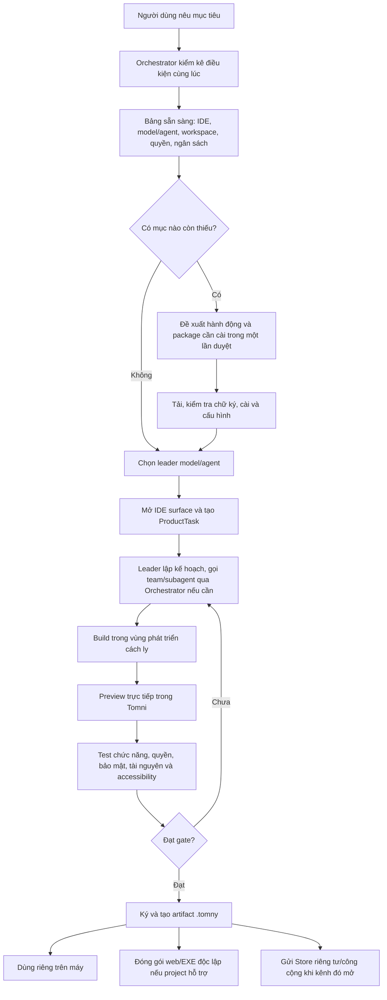
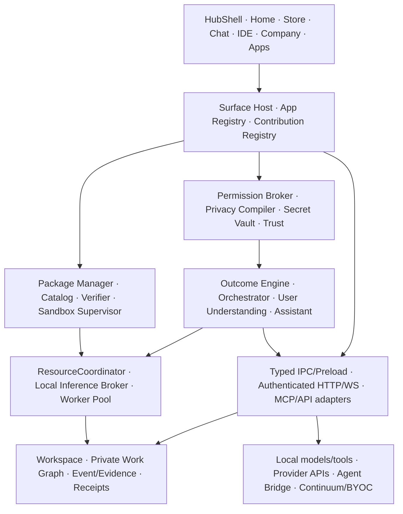

# TomniHubOS — Thiết kế sản phẩm hoàn chỉnh

> **Trạng thái tài liệu:** thiết kế đích đang sống; không phải tuyên bố rằng mọi hạng mục đã được triển khai.  
> **Ngày hợp nhất:** 2026-07-26.  
> **Phạm vi:** trải nghiệm người dùng, kiến trúc sản phẩm, package, Store, IDE, AI cục bộ/từ xa, bảo mật, tài nguyên, đám mây, cộng đồng, triển khai và tiêu chí nghiệm thu.  
> **Tên dùng trong tài liệu:** `TomniHubOS` là sản phẩm; `Tomni` là tên ngắn; `.tomny` là phần mở rộng artifact; ID mới dùng namespace `com.tomni.*`. Tên `Tomny` và ID cũ trong mã/tài liệu là dữ liệu tương thích, không được đổi hàng loạt khi chưa có migration riêng.

## 1. Cách đọc và thứ tự ưu tiên

Tài liệu này hợp nhất trạng thái đích từ bộ PRD `docs/prds/feature-packs`. Nó không thay thế bằng chứng triển khai, test hay audit chi tiết của từng PRD.

Thứ tự áp dụng khi có mâu thuẫn:

1. quyết định sản phẩm mới nhất được ghi rõ là **đích** trong tài liệu này;
2. hợp đồng bảo mật, quyền và ranh giới tiến trình;
3. [Visual Design System](../prds/feature-packs/tomni-hub-visual-design.md) cho cách trình bày;
4. [Store và Package Runtime audit](../prds/feature-packs/tomni-package-backend-mvp.md) cho bằng chứng triển khai theo thời điểm;
5. các PRD chức năng còn lại cho chi tiết không xung đột.

Hai quyết định mới thay thế thiết kế cũ:

- **Không còn Studio như một app/package khổng lồ.** `com.tomni.studio` chỉ còn là collection/compatibility redirect trong cửa sổ migration, không chứa runtime. Người dùng có thể nhóm app/tab tùy ý và đặt tên nhóm là **Studio**.
- **Đích AI có bốn adapter chuyên trách:** Security 0.8B; User Understanding 2B; Orchestrator 2B; Assistant 2B. Đây là bốn vai trò/adapter, không đồng nghĩa phải giữ bốn full model cùng lúc trong RAM/VRAM.

Các câu “Studio Suite tải một lần” trong README, Package Platform Design, Migration Design và những đoạn cũ của Store/Backend PRD được coi là đã bị thay thế. Các phần manifest, sandbox, Store, lifecycle và migration không xung đột vẫn còn giá trị.

## 2. Tuyên ngôn sản phẩm

TomniHubOS là một hệ điều hành tác nhân chạy theo nguyên tắc **cục bộ trước, mở rộng bằng package, hoàn thành công việc có kiểm chứng**. Người dùng có thể biến một yêu cầu tự nhiên thành app, quy trình hay đội tác nhân; thử ngay trong vùng cách ly; dùng riêng; hoặc phát hành cho cộng đồng.

Giá trị không nằm ở một mô hình lớn duy nhất. Tomni kết hợp:

- lõi cục bộ bảo vệ dữ liệu và điều phối công việc;
- nhiều mô hình, nhà cung cấp và tác nhân mà người dùng tự chọn;
- IDE và runtime tạo sản phẩm;
- Store phân phối artifact thật;
- mạng lưới kết quả đã được xác minh để lựa chọn cách làm tốt hơn theo thời gian;
- đám mây tùy chọn cho công việc liên tục, chia sẻ năng lực và bảo vệ phần lõi của creator.

Sản phẩm hoàn thiện phải khiến hệ sinh thái mạnh hơn khi người dùng phát triển thêm, nhưng không cho package cộng đồng phá vỡ lõi, đánh cắp secret hoặc làm sập toàn hệ thống.

## 3. Nguyên tắc bất biến

1. **Cục bộ trước, không giả cục bộ.** Dữ liệu và xử lý ở máy khi có thể; mọi lần rời máy phải có policy và trạng thái rõ.
2. **Không khóa nhà cung cấp.** OpenAI, Anthropic, Manus, mô hình cục bộ, BYOC và nhà cung cấp tương lai đi qua adapter có cùng hợp đồng.
3. **Base nhỏ và hữu ích.** Base mở được Home, Chat tối thiểu, Store, Settings và phục hồi khi không có package/model tùy chọn.
4. **Chưa cài nghĩa là code chưa có.** Không dùng nút Install để chỉ bật route/code đã nằm sẵn trong installer.
5. **Một package lỗi không làm hỏng Base.** Không chạy code cộng đồng trong Electron Main; mọi đặc quyền qua capability bridge.
6. **Quyền tối thiểu và có thể thu hồi.** Không có secret plaintext trong package, renderer, prompt, log hay receipt.
7. **AI không tự cấp quyền.** Output mô hình phải qua schema, policy, xác nhận và verifier xác định.
8. **Người dùng sở hữu sản phẩm và dữ liệu.** Có export, xóa, tự host và đóng gói web/EXE ngoài Tomni khi hợp đồng cho phép.
9. **Không hứa bảo mật tuyệt đối.** Chống dịch ngược chỉ nâng chi phí; phần thật sự cần giữ bí mật phải ở hạ tầng creator/Tomni hoặc BYOC.
10. **Không gọi tài nguyên là vô tận.** Gói dịch vụ, API, MCP và đám mây luôn có quota, chi phí, rate limit và điều khoản.
11. **Không thu thập dữ liệu âm thầm.** Telemetry, dữ liệu cải thiện mô hình và chia sẻ outcome đều opt-in, tối thiểu hóa và có thể xóa.
12. **Không viết lại toàn bộ.** Chuyển dần theo lát dọc, giữ dữ liệu và hành vi đã kiểm chứng.

## 4. Đích và hiện trạng không được trộn lẫn

### 4.1 Trạng thái đích

Khi hoàn thiện:

- Desktop và WebUI dùng cùng một `HubShell`, cùng trạng thái Store và cùng hợp đồng nghiệp vụ;
- Base không chứa code app/IDE extension tùy chọn;
- Store dùng catalog và artifact từ kho thật; cài, cập nhật, rollback, gỡ và khôi phục đều là giao dịch thật;
- creator có thể yêu cầu AI tạo app, thử trong sandbox, ký `.tomny`, dùng riêng hoặc gửi duyệt;
- package cộng đồng chỉ dùng API công khai, có quyền, quota, audit và kill switch;
- bốn adapter AI chỉ nhận traffic theo trạng thái promotion; backend xác định luôn là thẩm quyền cuối;
- ResourceCoordinator điều phối package, tab, model, worker và tác vụ nền theo ngân sách máy;
- Continuum, Nexus, Resource Exchange và Agent Bridge là lớp tùy chọn, không làm mất chế độ cục bộ;
- người dùng có thể tự nhóm app/tab thành workspace tên “Studio” hoặc tên bất kỳ mà không tạo một bundle nặng.

### 4.2 Ảnh chụp bằng chứng trong repo, không phải audit mới

Bảng dưới chỉ phản ánh các báo cáo hiện có ngày 2026-07-26; phải kiểm tra lại mã và test trước mỗi tuyên bố release.

| Hạng mục            | Bằng chứng đã ghi nhận                                                                                             | Chưa được phép tuyên bố                                                                                                    |
| ------------------- | ------------------------------------------------------------------------------------------------------------------ | -------------------------------------------------------------------------------------------------------------------------- |
| Package nền tảng    | Có taxonomy, manifest/registry, IPC, state atomic, integrity và chữ ký; transaction core và một số gate đã có test | Store cộng đồng production hoàn chỉnh                                                                                      |
| Artifact thật       | Document/Design đã có vòng install → import/mount → unmount → uninstall qua HTTP/PackageManager trong audit        | Toàn bộ app tùy chọn đã rời Base                                                                                           |
| IDE extension       | Metadata host, contribution revision và fail-closed first-party host đã có test                                    | Tất cả tab IDE đã thành artifact độc lập và community sandbox đã mở                                                        |
| Store               | Có UI/route và chi tiết từng phần                                                                                  | Catalog production vẫn từng chứa Studio artifact lớn và range `>=0.0.0`; clean-machine end-to-end toàn bộ chưa là sign-off |
| ResourceCoordinator | Primitive cleanup, pressure isolation, suspend/evict đã qua focused test trong audit                               | Wiring đầy đủ package/tab/model owner và SLO production                                                                    |
| AI                  | Có lifecycle, trainer/evaluation contract và candidate evidence từng phần                                          | Không adapter nào được gọi là production chỉ vì train xong; benchmark, human review, promotion và rollback vẫn là gate     |

Nguồn trạng thái chi tiết là [Store và Package Runtime audit](../prds/feature-packs/tomni-package-backend-mvp.md) và [Local Core Model Runtime](../prds/feature-packs/tomni-local-core-model-runtime-design.md). Báo cáo training độc lập mới nhất phải thắng mọi snapshot cũ.

## 5. Người dùng và công việc chính

| Nhóm                        | Công việc họ cần hoàn thành                                                                     |
| --------------------------- | ----------------------------------------------------------------------------------------------- |
| Người dùng phổ thông        | Nói mục tiêu, nhận sản phẩm hoặc hành động an toàn mà không học công cụ kỹ thuật                |
| Lập trình viên              | Cài đúng phần IDE cần dùng, giao việc cho tác nhân, xem diff/test/evidence và kiểm soát chi phí |
| Nhà thiết kế/người sáng tạo | Tạo giao diện, tài liệu, media hay quy trình mà không tải bộ Studio khổng lồ                    |
| Creator package             | Tạo, thử, ký, phát hành, cập nhật, bán và hỗ trợ package                                        |
| Nhóm/doanh nghiệp           | Tổ chức Company, vai trò, policy, BYOC, audit, quyền và phân bổ tài nguyên                      |
| Người ưu tiên riêng tư      | Chạy hoàn toàn cục bộ, kiểm tra dữ liệu rời máy và dùng model có sẵn                            |
| Người dùng agent từ xa      | Mang ChatGPT, Codex, Manus hoặc agent hỗ trợ MCP/API vào Tomni qua cầu nối chính thức           |

## 6. Bề mặt sản phẩm khi hoàn thiện

### 6.1 Một shell toàn cục

```text
TomniHubOS
├─ GlobalHeader: điều hướng, tìm kiếm, thao tác nhanh, trạng thái đồng bộ
├─ HubSidebar: Home, Quản lý, Sản phẩm, Lịch sử, Company, app đã ghim, Store, tài khoản
├─ PageOutlet: nội dung của trang/app/package
├─ StatusRail: công việc, thông báo, mô hình, hệ thống
├─ OverlayHost: quick setup, quyền, cài đặt, duyệt, lỗi và phục hồi
└─ GlobalFooter/Status: kết nối, hàng đợi và trạng thái nền khi thật sự cần
```

Home, Store, Settings, Company, IDE và app không tự dựng sidebar riêng. Desktop chỉ thêm window-control slot vào cùng shell; WebUI chỉ vô hiệu hóa capability không có, không đổi toàn bộ bố cục.

### 6.2 Các surface chính

- **Home:** mục tiêu nhanh, app library, tiếp tục công việc, trạng thái toàn cục.
- **Chat:** giao tiếp với Assistant/Orchestrator, có artifact/evidence thay vì chỉ văn bản.
- **Quản lý:** mục tiêu, run, lịch, ghi chú, dữ liệu, Core và các duyệt đang chờ.
- **Sản phẩm:** app, tài liệu, media và artifact người dùng đã tạo.
- **Lịch sử:** conversation, run, quyết định, receipt và khả năng tiếp tục/hoàn tác.
- **Company:** bản đồ tổ chức sống cho leader, nhóm, agent/subagent, message và trạng thái thật.
- **Store:** khám phá, chi tiết, cài, mở, cập nhật, vô hiệu hóa, rollback và gỡ.
- **Cài đặt:** tài khoản; AI & Models; capability; quyền & bảo mật; dữ liệu; giao diện; kết nối; tài nguyên; hệ thống.
- **IDE:** host tạo sản phẩm và extension surface, chỉ cài khi workflow cần.

### 6.3 Tùy biến sâu nhưng không phá an toàn

Người dùng có thể:

- đổi theme, typography, density, motion và bố trí trong các slot cho phép;
- cài UI Package, xem trước, áp dụng theo scope và hoàn tác;
- ghim, sắp xếp, nhóm app/tab và lưu bố cục theo workspace;
- nhờ AI tạo UI Package hoặc app mới trong sandbox;
- chia sẻ layout recipe mà không tự động chia sẻ secret/dữ liệu;
- bật chế độ giảm chuyển động, giảm trong suốt, tăng tương phản và điều khiển bàn phím.

Không package nào được sửa DOM tùy ý, che permission sheet, thay security indicator, giả thương hiệu hệ thống hoặc tác động app chưa opt-in. Khi UI Package lỗi, Tomni trở về safe theme.

### 6.4 Nhóm app thay Studio

`AppGroup` là cấu hình giao diện của người dùng, không phải đơn vị cài đặt:

```text
Nhóm “Studio” của Thuận
├─ Document Studio
├─ Design/VIU
├─ Automation
├─ Video
├─ Music
└─ IDE
```

- Mỗi app có artifact, quyền, version, crash boundary và dữ liệu riêng.
- Nhóm có thể mở thành một cụm tab, cửa sổ hoặc workspace; đóng nhóm chỉ suspend/đóng surface, không uninstall.
- Người dùng đổi tên, thêm/bớt app và đồng bộ layout; runtime không âm thầm tải cả nhóm.
- `com.tomni.studio` cũ chỉ resolve deep-link sang app đích trong cửa sổ tương thích, sau đó được gỡ theo migration receipt.

## 7. Mô hình package và phân rã chức năng

### 7.1 Ba loại cấp Store

| Loại              | Mục đích                                                          | Có surface riêng       |
| ----------------- | ----------------------------------------------------------------- | ---------------------- |
| **App Package**   | Ứng dụng hoàn chỉnh như báo thức, IDE, tài liệu, thiết kế         | Có                     |
| **UI Package**    | Theme, widget, layout hoặc contribution giao diện cho host opt-in | Có thể là contribution |
| **Agent Capsule** | Workflow, prompt, tool, policy, automation và schema cho agent    | Không bắt buộc         |

Model Adapter Pack là artifact hệ thống trong Model Manager, không phải loại thương mại thứ tư trong Store và không được chứa code thực thi.

### 7.2 Base bắt buộc

Base giữ:

- `HubShell`, Home, Store, onboarding, Account/Auth và Settings;
- Chat/agent control tối thiểu và Outcome Receipt viewer;
- Package Manager, catalog client, downloader, verifier, App/Contribution Registry;
- Package Surface Host, Sandbox Supervisor, Permission Broker và Secret Vault;
- ResourceCoordinator, Local Inference Broker và provider gateway;
- workspace/file/context/event/notification primitives;
- updater, recovery, quarantine, audit và diagnostics.

Base không giữ business UI hoặc runtime của IDE, Browser, Document, Design, Automation, Media hay app chuyên ngành sau khi chúng đã qua de-bundle gate.

### 7.3 IDE bắt buộc theo dependency, không bắt buộc trong Base

`com.tomni.ide` là host/core bắt buộc cho mọi IDE contribution. Khi người dùng yêu cầu tạo/chỉnh app mà chưa cài IDE, Tomni trình bày tất cả điều kiện còn thiếu trong một bảng duy nhất và đề nghị cài, không hỏi tuần tự từng bước.

IDE core tối thiểu gồm workspace lifecycle, Files, editor adapter, Search, Git, Terminal, command palette, extension host, error boundary và Package Gate. Các năng lực còn lại là package/contribution riêng:

| Nhóm hiển thị          | Năng lực                                                | ID đích gợi ý               |
| ---------------------- | ------------------------------------------------------- | --------------------------- |
| **Kiến thức mã**       | Wiki, Understand                                        | `com.tomni.ide.knowledge`   |
| **Quy trình kỹ thuật** | Hook, Spec, ExpBase                                     | `com.tomni.ide.engineering` |
| **Kiểm thử & Gỡ lỗi**             | Quick Test, inspect, run, fix     | `com.tomni.ide.debug`       |
| **Trò chuyện**         | Chat và cộng tác tác nhân trong ngữ cảnh IDE            | `com.tomni.ide.chat`        |
| **LSP**                | Server ngôn ngữ nâng cao, quản lý/cài/health            | `com.tomni.ide.lsp`         |
| **VIU**                | thiết kế giao diện tích hợp theo surface contract       | `com.tomni.ide.viu`         |
| **Dữ liệu**            | database/schema workspace                               | `com.tomni.ide.database`    |
| **Extensions**         | khám phá, cài và quản lý contribution community cho IDE | surface của IDE core        |

ABI v1 đã được khóa trong `tomnihubos-ui-ux-design-brief.md`: Host API `1.0.0`, các group/package ID theo bảng mục 9 của brief và tên **Kiểm thử & Gỡ lỗi / Test & Debug**. Code hiện còn `codebase|agent-ops` là legacy implementation; phải migrate schema/type/registry theo từng subtab và qua compatibility test trước phát hành.

## 8. Luồng tạo một sản phẩm từ câu nói

Ví dụ: “Tạo ứng dụng đồng hồ báo thức cho tôi”.



Bảng sẵn sàng phải hiển thị đồng thời:

- IDE đã cài/chưa cài, dung lượng, publisher và quyền;
- model cục bộ khả dụng, agent từ xa đã kết nối và lựa chọn không dùng model;
- thư mục/workspace đích và phạm vi được đọc/ghi;
- ngân sách token, compute, storage và network;
- package phụ thuộc;
- mức riêng tư: cục bộ, từ xa đã làm sạch hoặc từ xa đầy đủ;
- hành động nào cần duyệt sau này.

Nếu chưa có model, quick setup mở ngay phần AI & Models dạng popup, không bắt người dùng rời luồng. Nếu chọn agent từ xa, Tomni chỉ dùng API/SDK/MCP chính thức mà nhà cung cấp hỗ trợ.

### 8.1 Preview an toàn

App development xuất hiện trong Home với badge **Đang phát triển**, không xuất hiện trong Store. Khi mở:

- UI chạy trong sandbox development với hot reload;
- worker có quota và bị hủy khi project đóng;
- network mặc định bị chặn ngoài allowlist;
- mọi capability nhạy cảm hiện prompt duyệt;
- lỗi chỉ làm crash surface/worker của project;
- state có snapshot và nút reset;
- hệ thống ghi receipt test nhưng không gửi telemetry nếu chưa opt-in.

Preview không được mount code chưa tin cậy trực tiếp vào Hub renderer hoặc Electron Main.

## 9. Artifact `.tomny`

### 9.1 `.tomny` là gì

`.tomny` là container build có cấu trúc, version, chữ ký và manifest; phần mở rộng giúp Tomni nhận đúng trình cài/verifier, tương tự một định dạng package riêng. Nó không phải “mã hóa thần kỳ”.

```text
com.example.alarm-1.0.0.tomny
├─ manifest.json
├─ signatures/
├─ ui/
│  ├─ index.html
│  └─ assets/*
├─ worker/
│  └─ worker.js
├─ locales/*
├─ static/*
├─ sbom.json
└─ provenance.json
```

Quy tắc:

- artifact production chứa code đã build, không chứa TypeScript source hay `node_modules` tùy ý;
- đường dẫn, thứ tự file và metadata phải deterministic để hash/tái build;
- executable/native binary chỉ được phép cho loại và trust tier đã khai báo;
- model adapter chỉ cho `safetensors` và metadata allowlist, không chứa script/post-install hook;
- mọi byte thực thi nằm trong danh sách integrity và signature;
- Store metadata có thể tách khỏi artifact nhưng phải được ký/liên kết bằng hash.

### 9.2 Nơi lưu

- **Project source:** thư mục do người dùng chọn; không bắt buộc nằm trong Tomni.
- **Artifact local build:** cache/staging có version và tự dọn theo policy.
- **Artifact đã cài:** logical root `userData/tomny-packages/<packageId>/<version>/`; đường dẫn vật lý do runtime resolve theo hệ điều hành.
- **Catalog/Store:** object storage hoặc release registry có HTTPS, immutable URL/version, hash và chữ ký. GitHub Releases có thể là nguồn bootstrap; Store không phụ thuộc riêng GitHub.
- **Cloud/BYOC:** creator có thể đặt worker/API lõi ở Tomni Continuum hoặc cloud của chính họ; `.tomny` local chỉ chứa client contract cần thiết.

Không lưu artifact production bằng cách ghi đè cùng `(id, version)`. Một version đã public là bất biến; bản sửa phải tăng version.

### 9.3 Manifest đích tối thiểu

```ts
type PackageManifestV1 = {
  schemaVersion: 1;
  id: string;
  publisherId: string;
  type: 'app' | 'ui' | 'agent-capsule';
  version: string;
  engines: {
    tomni: string;
    hostSdk: string;
  };
  platforms: Array<{ os: string; arch: string }>;
  artifact: {
    sizeBytes: number;
    integritySha256: string;
    signature: { algorithm: 'Ed25519'; keyId: string; value: string };
  };
  entrypoints: { ui?: string; worker?: string; capsule?: string };
  contributions: ContributionDeclaration[];
  permissions: PermissionDeclaration[];
  networkAllowlist: string[];
  dependencies: PackageDependency[];
  resources: ResourceBudgetHints;
  dataPolicy: {
    namespace: string;
    uninstallDefault: 'retain';
    schemaVersion: number;
    remoteProcessing: 'none' | 'optional' | 'required';
  };
  store: {
    localizedMetadata: string;
    icon: string;
    previews: string[];
    changelog: string;
  };
};
```

`resources` chỉ là hint có giới hạn; ResourceCoordinator đo thực tế và có thể hạ quota. Publisher không tự khai trust hoặc promotion.

### 9.4 Tương thích phải nói rõ tương thích với gì

Store không hiển thị một dòng mơ hồ như `>=0.0.0`. Trang chi tiết phải tách:

| Thuộc tính              | Ví dụ hiển thị                                |
| ----------------------- | --------------------------------------------- |
| Phiên bản TomniHubOS    | `0.1.0–0.x`                                   |
| Host SDK/ABI            | `Package Host v1`                             |
| Hệ điều hành/kiến trúc  | `Windows 11 · x64/arm64`                      |
| Package phụ thuộc       | `IDE >=1.2`                                   |
| Runtime/model cần thiết | `Local worker v1`; model là tùy chọn/bắt buộc |
| Trạng thái kiểm chứng   | `Đã thử trên 0.1.3`; ngày kiểm thử            |

Range version chỉ được mở từ release thấp nhất đã thực sự test. `>=0.0.0` là blocker phát hành, không phải nhãn tương thích hợp lệ.

## 10. Store hoạt động thật

### 10.1 Kiến trúc phân phối

```text
Publisher IDE/CLI
→ Build deterministic
→ Local validation
→ Ký publisher
→ Upload artifact bất biến
→ Quét tự động
→ Review theo mức rủi ro
→ Ký/duyệt catalog revision
→ CDN/object storage
→ Store client tải catalog đã ký
→ Download .partial
→ Verify → Stage → Activate
```

Store UI và Desktop/WebUI dùng cùng `PackagePlatformService`; Desktop đi qua IPC, WebUI đi qua HTTP/WebSocket đã xác thực. Business rule không được nhân đôi trong React.

### 10.2 Trang Store

Tabs chuẩn:

1. Khám phá;
2. Apps;
3. Packages;
4. Đã cài;
5. Cập nhật.

Trang chi tiết phải có:

- tên, icon, publisher đã xác minh và trust tier;
- ảnh/video do creator tải lên; nếu không có thì dùng fallback capability preview hiện tại;
- mô tả, chức năng, category, đánh giá và lịch sử version;
- dung lượng tải/cài và resource profile;
- compatibility đã diễn giải;
- quyền, network destination, chính sách dữ liệu và secret alias;
- dependencies, model/dịch vụ cần thiết;
- chữ ký, scan/review state và ngày cập nhật;
- changelog, permission diff và nút Cài/Mở/Cập nhật/Gỡ;
- trạng thái offline, disabled, quarantined, revoked hoặc cần sửa.

Store Search chỉ tìm Store; Global Search tìm cả app đã cài, workspace, history, command và Store.

### 10.3 Giao dịch cài đặt

```text
resolve signed catalog
→ kiểm tra compatibility/dependency/entitlement
→ giữ operation id và resource lease
→ tải `.partial` có resume/retry
→ kiểm tra size + SHA-256 + Ed25519
→ giải nén chống traversal/symlink/bomb
→ quét nội dung và capability
→ hiển thị quyền để người dùng duyệt
→ stage
→ smoke run trong sandbox
→ atomic rename
→ register contribution theo owner
→ activate
→ health window
→ installed/active receipt
```

Cài đồng thời phải idempotent; cài và gỡ đối nghịch phải serialize. Mất điện/crash giữa chừng phải phục hồi từ transaction journal.

### 10.4 Cập nhật và rollback

- tải version mới song song với bản đang dùng;
- hiển thị changelog, dung lượng và quyền mới;
- backup/migrate data theo transaction;
- smoke test trước swap;
- atomic active-version swap;
- giữ previous-active qua observation window;
- crash/health regression tự rollback;
- downgrade hoặc cùng version khác byte bị chặn;
- publisher/key/policy change yêu cầu gate riêng.

### 10.5 Gỡ và xóa dữ liệu

```text
dependency check
→ người dùng chọn giữ/xóa dữ liệu
→ deactivate
→ hủy lease/worker/event
→ dispose contribution theo package owner
→ chuyển artifact sang trash giao dịch
→ cập nhật registry
→ xóa trash khi persistence thành công
```

Dữ liệu mặc định được giữ. Nếu persistence lỗi, artifact và registry được khôi phục. Sau uninstall, route generic trả `PackageGate`; executable code không còn chạy từ cache cũ.

### 10.6 Publish cho creator

```text
Project
→ Build
→ Schema/compatibility/dependency/size check
→ Static scan + SBOM + license scan
→ Sandbox tests + quyền + accessibility + locale
→ Ký artifact
→ Chọn dùng riêng/private/public
→ Upload
→ Review tự động
→ Human review khi rủi ro/appeal
→ Publish hoặc reject có lý do
```

MVP có thể dùng local/dev signing và kho riêng. Public marketplace chỉ mở sau gate sandbox, signing, revocation, report, takedown, refund và appeal. Git repository là nguồn mã tùy chọn, không phải điều kiện để Store hoạt động.

## 11. Bảo mật, quyền và bảo vệ tài sản trí tuệ

### 11.1 Chuỗi tin cậy

- catalog có revision, expiry và chữ ký;
- artifact có hash, chữ ký publisher và provenance;
- keyring hỗ trợ rotation, revoke và emergency kill switch;
- build sinh SBOM; dependency/license/malware scan có bằng chứng;
- trust tier được suy từ key + publisher + policy, không tin field tự khai;
- permission diff luôn được duyệt khi mở rộng;
- package bị revoke chuyển quarantine, không bị xóa dữ liệu âm thầm;
- model pack có catalog/lifecycle riêng và không được thực thi code.

Chữ ký chứng minh nguồn gốc/toàn vẹn; sandbox và capability mới giới hạn hành vi.

### 11.2 Ranh giới thực thi

| Thành phần           | Nơi chạy                       | Quyền trực tiếp                   |
| -------------------- | ------------------------------ | --------------------------------- |
| Hub renderer         | Renderer tin cậy               | DOM/React, không Node/filesystem  |
| Package UI cộng đồng | isolated renderer/web sandbox | Chỉ typed message capability      |
| Package worker       | utility process/worker sandbox | CPU/RAM/time/network allowlist    |
| Electron Main        | Dịch vụ hệ thống               | Không chạy code cộng đồng         |
| Model adapter        | Local Inference Broker         | Chỉ inference, không side effect  |
| Agent từ xa          | Provider/API/MCP ngoài máy     | Chỉ nhận projection đã được duyệt |
`iframe` nếu được dùng chỉ là lớp hiển thị bên trong isolated renderer; nó không tự thân là ranh giới bảo mật. Ranh giới thật gồm sandbox driver/lifecycle, origin + CSP, typed message bridge, capability broker, quota, network policy và crash isolation.

Capability gồm workspace read/write theo scope, model invoke, notification, package storage, navigation và secret handle. Package không nhận `window.electronAPI`, filesystem path tùy ý hoặc secret plaintext.

### 11.3 Privacy Compiler hai lớp

```text
Dữ liệu chuẩn bị rời vùng tin cậy
→ Layer 1 xác định: secret pattern, label, quyền, allowlist, policy
→ nếu chưa rõ: Security 0.8B đề xuất semantic label/transformation
→ backend kiểm tra output
→ redact/pseudonymize/minimize
→ quét lại
→ allow / hỏi người dùng / local-only / block
→ Security Receipt
```

Layer 1 xác định có quyền ưu tiên. Security 0.8B không là “người gác cửa duy nhất”, không đọc Secret Vault và không tự mở network.

### 11.4 Chống dịch ngược thực tế

Không EXE, JavaScript bundle, native binary hay `.tomny` chạy trên máy người dùng nào được bảo vệ tuyệt đối. Tomni cung cấp nhiều mức:

1. bỏ source map/debug symbol khỏi production, minify/obfuscate có kiểm soát;
2. ký code, integrity check, anti-tamper và watermark/provenance;
3. tách secret khỏi artifact, cấp secret bằng capability handle;
4. giới hạn phần local thành UI/client và đặt thuật toán lõi ở creator cloud/Tomni Continuum;
5. cho creator tự host lõi trên BYOC;
6. ghi rõ threat model, giới hạn và quy trình truy vết/takedown.

Mục tiêu là làm chi phí sao chép cao và giảm giá trị artifact bị lấy, không quảng cáo “không thể dịch ngược”.

## 12. Kiến trúc lớp đích



### 12.1 Ranh giới tiến trình

- Renderer chỉ render UI và gọi client facade.
- Main chứa business service, package/model lifecycle, policy và persistence.
- Preload chỉ expose allowlist nhỏ có type.
- Worker/utility process chạy logic nền hoặc code package theo quota.
- WebUI gọi cùng service qua HTTP/WS auth; không truy cập filesystem trực tiếp.
- Mọi ID, schema, error code và event công khai nằm ở Common contract; không import Main vào Renderer.

### 12.2 Một service, nhiều transport

Package, model, task và receipt không có “bản Desktop” và “bản Web” khác nhau. Adapter transport chỉ chuyển DTO và auth. Mutation có operation ID để idempotent, origin/CSRF policy và permission check.

## 13. ResourceCoordinator và UX chuyển surface

### 13.1 Trách nhiệm duy nhất

ResourceCoordinator là bộ điều phối dùng chung cho:

- CPU, RAM, GPU/VRAM, disk I/O, network và process/worker slot;
- package activation/deactivation;
- tab/surface warm state;
- model residency và adapter hotswap;
- download/build/test/benchmark nền;
- task, subagent và Company execution;
- ngân sách khung hình của Renderer.

Package, model hoặc page không tự xây scheduler thứ hai. Chúng xin lease; coordinator cấp, hạ, tạm dừng, thu hồi hoặc từ chối với lý do có cấu trúc.

### 13.2 Hợp đồng lease

```ts
type ResourceLeaseRequest = {
  requestId: string;
  ownerId: string;
  ownerKind: 'surface' | 'package-worker' | 'model' | 'task' | 'download' | 'build';
  priority: 'security' | 'interactive' | 'foreground' | 'background' | 'maintenance';
  deadlineMs?: number;
  estimate: {
    cpuWeight: number;
    ramMiB: number;
    vramMiB: number;
    ioWeight: number;
    networkWeight: number;
  };
  canSuspend: boolean;
  canEvict: boolean;
  warmBenefitMs?: number;
};
```

Lease gắn với owner, cancellation, deadline, cleanup và receipt. Owner chết hoặc mất connection thì lease tự thu hồi; dispose lỗi được retry có giới hạn, không làm rò tài nguyên.

### 13.3 Thứ tự ưu tiên

```text
Security foreground và hành động người dùng đang duyệt
> phản hồi tương tác/surface đang nhìn thấy
> execution foreground
> User Understanding/Assistant hỗ trợ
> prefetch có xác suất cao
> sync, index, download, benchmark và maintenance nền
```

Security không được chiếm toàn máy vô thời hạn. Mỗi lớp vẫn có deadline, quota và degraded path.

### 13.4 Trạng thái surface

```text
cold → preloading → warm → active
                       ↓      ↓
                    suspended ← inactive
                       ↓
                     evicted

activation/crash/timeout → failed → retry | recovery | quarantine
```

- **cold:** chưa load code/data;
- **preloading:** chỉ metadata/chunk an toàn, có thể hủy;
- **warm:** code/context đủ để mở nhanh nhưng không chạy nền nặng;
- **active:** đang hiển thị và giữ lease foreground;
- **suspended:** giữ state nhỏ, dừng worker/timer;
- **evicted:** giải phóng bộ nhớ, giữ snapshot/serialized state nếu policy cho phép.

### 13.5 Luồng chuyển tab nhẹ

1. pointer/focus intent chỉ preload sau ngưỡng chống hover nhiễu;
2. giữ shell và nội dung cũ ổn định trong lúc surface mới chuẩn bị;
3. skeleton/error có cùng footprint cuối để không nhảy bố cục;
4. route chunk, locale và metadata tải song song trong resource budget;
5. worker/model chỉ kích hoạt khi surface thật sự cần;
6. surface mới commit sau first meaningful paint; transition dùng token 120/180 ms;
7. load cũ bị hủy khi người dùng đổi ý; late result không được ghi đè state mới;
8. inactive surface chuyển warm → suspended → evicted theo áp lực, không theo timer cứng duy nhất.

Mục tiêu release, phải đo theo máy profile thay vì hứa tuyệt đối:

| Chỉ số                              | Mục tiêu đích                                                    |
| ----------------------------------- | ---------------------------------------------------------------- |
| Phản hồi sau click/keyboard         | P95 ≤ 100 ms                                                     |
| Surface warm đổi nội dung           | P95 ≤ 180 ms                                                     |
| Cold load hiển thị skeleton ổn định | ≤ 100 ms                                                         |
| Cold first-party light interactive  | P95 ≤ 1 giây trên máy chuẩn                                      |
| Long task trên Renderer             | không có tác vụ không chia nhỏ > 50 ms trong luồng thường        |
| Layout shift do loading             | gần 0 trong shell/card chính                                     |
| Model swap/task                     | giới hạn theo policy; không swap cho request nhỏ nếu fallback đủ |

Reduced-motion giảm transition gần 0. Khi máy yếu, ưu tiên phản hồi input và giữ shell hơn animation, prefetch hay tác vụ nền.

### 13.6 Chống thrashing

- gom request cùng mục tiêu;
- giữ 2B base trong execution window, hotswap adapter thay vì load lại full base khi tương thích;
- cache projection theo task, không cache secret;
- dùng hysteresis cho load/unload;
- giới hạn số transition residency mỗi task;
- benchmark/build nền tự nhường interactive lease;
- theo dõi `load_count`, `swap_count`, queue wait, peak RAM/VRAM, CPU fallback và frame degradation.

## 14. Hệ thống AI cục bộ

### 14.1 Bốn adapter đích

| Adapter                | Cấp model | Trách nhiệm                                                                            | Không được làm                                    |
| ---------------------- | --------- | -------------------------------------------------------------------------------------- | ------------------------------------------------- |
| **Security**           | 0.8B      | nhận diện rủi ro ngữ nghĩa, linked identity, prompt injection và đề xuất phép biến đổi | quyết định cuối, đọc Vault, tự gửi mạng           |
| **User Understanding** | 2B        | hiểu preference theo bối cảnh, lịch sử quyết định, confidence và abstain               | tạo hồ sơ ẩn, train bằng raw chat cá nhân         |
| **Orchestrator**       | 2B        | phân rã mục tiêu, chọn leader/team/subagent/tool/package và kế hoạch phục hồi          | tự cấp quyền hoặc trực tiếp sửa hệ thống          |
| **Assistant**          | 2B        | hỗ trợ giao diện, giải thích, command nhanh và nhiệm vụ nội bộ                         | thay mô hình chuyên môn lớn khi không đủ năng lực |

Ba adapter 2B có thể dùng chung một base 2B tương thích và hotswap LoRA; “ba adapter 2B” là ba artifact/contract/promotion độc lập, không nhất thiết ba full weight cùng resident. Security dùng base 0.8B riêng nếu benchmark chứng minh lift so với backend-only và shared 2B.

### 14.2 Backend luôn là thẩm quyền

Mỗi adapter chỉ trả output có schema. Backend kiểm tra:

- schema/enum/range;
- version contract, model và adapter;
- permission, entitlement, compatibility;
- data territory và egress policy;
- deadline, confidence và abstain;
- hành động cần xác nhận;
- verifier/evidence trước khi đánh dấu thành công.

Model output không trực tiếp tạo side effect.

### 14.3 Phân phối và trạng thái

Base EXE không bundle model weight. Model Manager dùng catalog riêng:

```text
discovered → downloading → staged → verified → candidate
→ shadow → pilot → active → superseded

integrity/schema/base/runtime/quality failure → quarantined
active regression → previous-active | deterministic fallback
```

Chỉ `active` nhận traffic chính thức. `shadow` không quyết định hành động; `pilot` có cohort allowlist và kill switch. Artifact bất biến theo ID/version/hash, chỉ dùng format weight an toàn, bind base revision, recipe, dataset provenance và benchmark report.

### 14.4 Gate training và benchmark

“Train xong” chỉ có nghĩa sinh được candidate. Promotion cần:

1. artifact hữu hạn, đọc được, đúng base/hash/signature;
2. dataset có nguồn/quyền, privacy scan, dedup và leakage report;
3. train tái lập, validation thật, checkpoint/resume và provenance;
4. test bất biến độc lập mà trainer không đọc;
5. so sánh baseline xác định, critical/catastrophic floor và tiếng Việt riêng;
6. latency, RAM/VRAM, CPU fallback và stability trên hardware profiles;
7. human review với mẫu đủ;
8. shadow/pilot observation;
9. rollback drill, monitoring và kill switch.

Không đổi gate để làm kết quả trông đẹp. Synthetic-only chỉ đủ tạo candidate, không đủ pilot. Security phải so backend-only, backend + 0.8B và backend + shared 2B.

### 14.5 Degraded mode

| Điều kiện                   | Hành vi                                                                            |
| --------------------------- | ---------------------------------------------------------------------------------- |
| Không có model              | Chat/control cơ bản, Store, package, rule security và manual routing vẫn chạy      |
| Security adapter thiếu/hỏng | Layer 1 xác định fail-closed; hỏi/local-only/block nếu không chắc                  |
| 2B thiếu RAM/VRAM           | CPU path, model local người dùng, provider ngoài qua Privacy Compiler hoặc abstain |
| Orchestrator không active   | rule/statistics routing và người dùng chọn leader thủ công                         |
| Assistant không active      | command/menu thường và remote provider nếu được duyệt                              |
| Adapter regression          | rollback previous-active hoặc deterministic baseline                               |

Người dùng có thể bỏ qua model, dùng local AI sẵn có sau conformance test hoặc dùng provider từ xa. Tomni không ép tải model không phù hợp máy.

## 15. Tomni Agent Bridge — mang tác nhân của người dùng vào Tomni

### 15.1 Điều MCP làm và không làm

MCP là giao thức cho model/client khám phá và gọi tool từ server. Nó không tự biến giao diện ChatGPT Web thành API inference miễn phí, không đảm bảo trả toàn bộ cuộc chat về Electron và không bỏ rate limit/chi phí.

Theo [tài liệu MCP và Connectors chính thức của OpenAI](https://developers.openai.com/api/docs/guides/tools-connectors-mcp), Responses API có thể dùng remote MCP server qua Streamable HTTP/HTTP-SSE, có tool list/call và approval; OpenAI cũng khuyến nghị giới hạn tool, duyệt hành động nhạy cảm và xem xét dữ liệu gửi sang server.

Tomni không dùng browser automation/scraping ChatGPT Web làm nền móng production. Cơ chế đó dễ hỏng, phụ thuộc phiên đăng nhập và có thể bị nhà cung cấp chặn.

### 15.2 Chiều A — tác nhân ngoài gọi Tomni

```text
ChatGPT/Codex/agent hỗ trợ MCP
→ kết nối Tomni MCP Server
→ gọi create_product_task / inspect_status / fetch_artifact / request_approval
→ Tomni hiện consent cục bộ
→ IDE/sandbox thực thi
→ trả tool result có cấu trúc
```

Tomni MCP Server có thể:

- chạy `stdio` theo phiên cho client cục bộ;
- chạy Streamable HTTP localhost có client identity;
- qua relay/tunnel được xác thực cho tác nhân từ xa;
- không public port mặc định;
- tách tool đọc và tool thay đổi, yêu cầu approval theo rủi ro.

Tác nhân ngoài chỉ nhận dữ liệu nằm trong tool call/result đã duyệt, không tự đọc toàn bộ workspace hoặc cuộc chat Tomni.

### 15.3 Chiều B — Tomni gọi tác nhân ngoài

```text
Chat trong Tomni
→ Orchestrator tạo AgentTask
→ Privacy Compiler hiển thị projection sắp gửi
→ Provider Adapter
   ├─ API/SDK chính thức
   └─ remote MCP agent nếu provider thật sự expose tool chạy agent
→ AgentTaskResult chuẩn hóa
→ sandbox/verifier
→ người dùng duyệt
→ apply/install
```

Nếu provider chỉ là MCP client, Tomni không thể gọi ngược model của họ qua MCP. Khi không có agent-server chính thức, phải dùng API/SDK chính thức hoặc để người dùng khởi xướng từ phía tác nhân ngoài.

### 15.4 Hợp đồng và an toàn

```ts
type AgentTask = {
  taskId: string;
  goal: string;
  inputArtifacts: ArtifactReference[];
  allowedTools: string[];
  dataPolicy: 'local-only' | 'redacted-remote' | 'full-remote-with-consent';
  budget: { tokens?: number; money?: number; deadlineMs: number };
  expectedOutputSchema: string;
};

type AgentTaskResult = {
  taskId: string;
  status: 'completed' | 'needs-input' | 'failed' | 'rate-limited';
  plan?: unknown;
  patch?: ArtifactReference;
  evidence: EvidenceReference[];
  usage?: UsageReceipt;
};
```

- mặc định duyệt từng tool có side effect;
- allowlist tool nhỏ, có thể defer discovery;
- output remote không sửa core/OS trực tiếp;
- secret được thay bằng handle/redaction;
- kiểm tra prompt injection ở input, tool description và output;
- log dữ liệu đã gửi ở dạng người dùng xem/xóa được;
- timeout, rate limit, quota và policy change có fallback;
- provider token lưu Vault, không gửi vào MCP server khác.

### 15.5 Giá trị và giới hạn

Agent Bridge giảm chi phí khởi đầu vì người dùng dùng agent/gói/API họ đã có, trong khi Tomni cung cấp IDE, package, sandbox, điều phối và bằng chứng. Đây là cầu thu hút và khả năng tương tác, không phải hào lũy duy nhất. Retention đến từ project/history/receipt do người dùng sở hữu, không từ việc giữ dữ liệu hoặc khóa họ vào Tomni.

## 16. Lớp đám mây tùy chọn

### 16.1 Tomni Continuum

Continuum làm những việc cần tồn tại khi máy người dùng tắt hoặc cần endpoint công khai:

- task dài hạn, schedule, webhook và queue;
- state handoff local ↔ cloud;
- sync artifact/receipt theo policy;
- remote sandbox build/test;
- protected backend cho package chỉ phát client local;
- team collaboration, private Store và enterprise policy;
- runner do Tomni vận hành hoặc BYOC của người dùng/creator.

Continuum không thay Security cục bộ, không buộc upload workspace và không giả E2EE cho workload mà server phải đọc plaintext để tính toán. UI phải ghi rõ nơi chạy, dữ liệu nào đi, chi phí và nút dừng/xóa.

### 16.2 Tomni Nexus

Nexus là mạng capability có contract:

- package/creator công bố capability có schema, version, quyền, SLA và giá;
- agent/package khác tìm, gọi và ghép capability;
- request được ký, metering, receipt và dispute trail;
- provider có thể chạy trên Tomni cloud hoặc cloud của họ;
- reputation dựa trên outcome đã xác minh, không chỉ sao/đánh giá;
- consumer khóa budget, region, privacy và fallback.

Nexus không tải code bí mật về client nếu creator chọn remote-core. Nó cũng không cho capability tự cấp quyền xuyên package.

### 16.3 Resource Exchange

Resource Exchange chọn giữa:

```text
thiết bị local
↔ model/runtime người dùng có sẵn
↔ BYOC
↔ provider API/agent
↔ Tomni Continuum
```

Routing dựa trên privacy, compatibility, chất lượng, latency, availability, chi phí và resource pressure. Người dùng xem lý do, khóa lựa chọn, đặt trần chi tiêu và tắt hoàn toàn cloud. Tomni có thể thu phí điều phối/giao dịch thay vì bắt buộc bán compute đắt; không lách điều khoản subscription của nhà cung cấp.

### 16.4 Ba mặt phẳng

| Mặt phẳng  | Nội dung                                        | Quyền sở hữu                      |
| ---------- | ----------------------------------------------- | --------------------------------- |
| Điều khiển | identity, catalog, policy, routing, entitlement | Tomni hoặc enterprise self-host   |
| Dữ liệu    | project, artifact, secret handle, receipt       | người dùng/creator theo territory |
| Thực thi   | local, provider, Tomni cloud, BYOC              | nơi được chọn cho từng task       |

Hợp đồng giữa ba mặt phẳng có version và audit; cloud provider là adapter thay thế được.

## 17. Outcome Intelligence Network

Tomni không cố thắng bằng model lớn nhất. Lõi tích lũy là vòng:

```text
Mục tiêu
→ tiêu chí thành công
→ chọn app/package/model/agent/tài nguyên
→ thực thi
→ thu bằng chứng
→ verifier
→ Outcome Receipt
→ người dùng accept/edit/reject/revert
→ cải thiện Work Graph và ranking theo ngữ cảnh
```

Bốn tài sản:

1. **Outcome Engine:** biến mục tiêu thành kết quả được kiểm chứng;
2. **Private Work Graph:** ngữ cảnh và cách làm thuộc người dùng, local-first;
3. **Outcome Reputation Graph:** hiệu quả package/model/capability theo version và bối cảnh;
4. **Package Standard + Creator Network:** supply phong phú và khả năng kiếm tiền.

Package không tự tuyên bố thành công. Receipt gắn goal, criteria, versions, policy, resource/cost, evidence, verifier và feedback; không chứa credential value.

## 18. Dữ liệu, riêng tư và quyền sở hữu

### 18.1 Data Territory

| Territory          | Ví dụ                                                   | Mặc định                         |
| ------------------ | ------------------------------------------------------- | -------------------------------- |
| Thiết bị           | secret, raw workspace, private graph, local model cache | Không rời máy                    |
| Workspace/team     | artifact, receipt, policy được chia sẻ                  | Theo membership và encryption    |
| Creator cloud/BYOC | remote-core input tối thiểu                             | Theo contract creator + consent  |
| Tomni cloud        | Continuum task/sync được bật                            | Opt-in, retention rõ             |
| Provider ngoài     | prompt/tool payload qua Agent Bridge/API                | Preview và policy theo lần/scope |
| Cộng đồng          | metadata/outcome tổng hợp                               | Chỉ anonymized/aggregate opt-in  |

“Không dùng để train” không đồng nghĩa “không rời máy”. UI phải tách ba khái niệm: truyền dữ liệu, lưu dữ liệu và dùng để cải thiện mô hình.

### 18.2 Quyền của người dùng

- xem projection và destination trước egress nhạy cảm;
- cấp quyền một lần, theo phiên, workspace hoặc luôn cho tool cụ thể;
- thu hồi ngay và xem lịch sử;
- export project, package, receipt, preference và cấu hình;
- xóa local/cloud theo retention contract;
- tắt telemetry và model improvement riêng biệt;
- dùng tên giả/ẩn danh cho reputation contribution;
- chuyển provider, BYOC hoặc local mà không mất project format.

### 18.3 Dữ liệu cải thiện sản phẩm

Mặc định không thu raw prompt, raw source hoặc secret. Nếu người dùng opt-in, ưu tiên:

- success/failure code, latency/resource bucket và package/model version;
- accept/edit/reject/revert signal;
- test/evidence summary đã làm sạch;
- crash signature không có nội dung;
- feedback chủ động.

Mọi dataset train cần provenance, quyền/consent, privacy scan, dedup, leakage report, version và khả năng loại bỏ dữ liệu theo yêu cầu trong giới hạn kỹ thuật đã công bố.

## 19. Hợp đồng dữ liệu mức thiết kế

### 19.1 Thực thể chính

| Thực thể             | Owner                   | Nội dung bắt buộc                                                                      |
| -------------------- | ----------------------- | -------------------------------------------------------------------------------------- |
| `PackageManifest`    | Publisher + verifier    | ID, type, version, compatibility, artifact, contributions, quyền, data/resource policy |
| `CatalogEntry`       | Store catalog           | URL bất biến, size/hash/signature, revision/expiry, listing và review state            |
| `InstalledPackage`   | Package Manager         | version active/previous, state, path logical, health, operation receipt                |
| `Contribution`       | Contribution Registry   | owner package, stable ID, host slot, order, activation và disposer                     |
| `PermissionGrant`    | Permission Broker       | subject, capability, scope, duration, actor, reason và revoke state                    |
| `SecretHandle`       | Secret Vault            | opaque ID, allowed operation/scope; không chứa value ngoài Vault                       |
| `RuntimeLease`       | ResourceCoordinator     | owner, budget, priority, state, deadline, cleanup receipt                              |
| `ModelAdapterPack`   | Model Manager           | purpose, base binding, weight hash, contracts, provenance, evaluation và promotion     |
| `AgentTask`          | Orchestrator            | goal, projection, tools, budget, expected output và provider policy                    |
| `OutcomeReceipt`     | Outcome Engine          | goal, criteria, versions, evidence, verifier, cost/resource và feedback                |
| `AppGroup`           | Người dùng/workspace    | tên, ordered surface refs, layout, restore policy; không chứa artifact                 |
| `ContinuumExecution` | Continuum control plane | runner, territory, schedule, checkpoint, budget, health và deletion state              |
| `NexusCapability`    | Creator                 | schema, endpoint/runner, policy, price, SLA, version và reputation refs                |
| `ResourceOffer`      | Resource Exchange       | provider, capability, region/device, privacy, price, availability và health            |

### 19.2 Quy tắc ID và version

- package: reverse-domain ổn định như `com.tomni.ide.knowledge`;
- contribution key: `<ownerPackageId>/<contributionId>`;
- artifact identity: `(id, version, sha256)`;
- model adapter identity thêm base revision/hash và contract version;
- operation/task/run/receipt dùng ID ngẫu nhiên không tái sử dụng;
- schema/event có version; consumer bỏ qua field mới nhưng từ chối version không hỗ trợ;
- error công khai dùng stable code và message i18n; log nội bộ không lộ secret.

### 19.3 Sự kiện tối thiểu

```text
package.discovered / download.progress / package.verified
package.installed / activated / suspended / failed / rolled_back / removed
permission.requested / granted / denied / revoked
resource.lease_granted / throttled / suspended / evicted / released
model.candidate / shadow / pilot / active / quarantined / rolled_back
agent.task_started / needs_input / completed / failed / cancelled
outcome.verified / rejected / edited / reverted
continuum.checkpointed / handed_off / offline / recovered
```

Event payload chỉ chứa reference cần thiết. Renderer/package nhận stream đã lọc theo owner/scope, không nhận broadcast toàn cục không giới hạn.

## 20. Chế độ lỗi và suy giảm

| Sự cố                          | Hành vi bắt buộc                                           | Surface cho người dùng               |
| ------------------------------ | ---------------------------------------------------------- | ------------------------------------ |
| Package root trống/read-only   | Base vẫn boot; Store dùng cache hoặc offline state         | chẩn đoán + thử lại/chọn thư mục     |
| Catalog lỗi mạng               | không dùng catalog stale như production truth nếu hết hạn  | offline banner, chỉ mở app đã verify |
| Catalog/artifact sai chữ ký    | fail-closed, quarantine, không extract/activate            | lý do stable + report                |
| Download gián đoạn             | giữ `.partial`, resume theo range và hash                  | progress/retry/cancel                |
| Crash giữa stage/swap          | journal recovery về active trước                           | “Đã phục hồi bản trước”              |
| Package crash/hang             | kill worker/surface, release lease; Base không crash       | restart/disable/report               |
| Dependency thiếu/bị gỡ         | chặn activation hoặc mở Package Gate                       | cài dependency/chọn thay thế         |
| Quyền bị thu hồi               | capability call trả denied; worker không giữ quyền cũ      | cấp lại hoặc tiếp tục giới hạn       |
| UI Package phá contrast/layout | rollback safe theme                                        | thông báo và vô hiệu hóa package     |
| Thiếu RAM/VRAM                 | suspend/evict nền, CPU/remote/manual fallback              | giải thích lựa chọn và chi phí       |
| Adapter AI lỗi/regression      | previous-active hoặc deterministic baseline                | Model Manager health                 |
| Agent từ xa rate-limit         | backoff có giới hạn, đổi provider/local hoặc chờ           | không retry tốn tiền âm thầm         |
| MCP server độc hại/đổi tool    | revoke connection, require approval, quarantine result     | trust warning + disconnect           |
| Continuum/BYOC mất kết nối     | checkpoint, local queue hoặc runner fallback theo policy   | nơi chạy, last checkpoint, resume    |
| Data migration lỗi             | rollback schema/artifact, giữ backup và receipt            | recovery wizard, không xóa data      |
| Publisher/key bị revoke        | dừng version bị ảnh hưởng, giữ data, gợi ý bản an toàn     | quarantine/reason/appeal             |
| WebUI mất local service        | UI read-only hoặc reconnect; không giả mutation thành công | connection state rõ                  |
| Verifier thiếu evidence        | trạng thái `insufficient-evidence`, không tự pass          | yêu cầu test/duyệt thêm              |

Mọi lỗi cần cancellation, timeout, retry budget và cleanup. Không dùng vòng retry vô hạn hoặc spinner không có trạng thái.

## 21. Quan sát, audit và hỗ trợ

### 21.1 Nguyên tắc

- local-first logs; cloud upload chỉ khi opt-in hoặc enterprise policy minh bạch;
- correlation ID xuyên task → tool → package → model → receipt;
- redaction trước khi ghi, không sửa log sau khi đã lộ secret;
- metrics theo version, hardware profile và trust tier;
- người dùng xem, export và xóa lịch sử phù hợp retention;
- crash report tách stack kỹ thuật khỏi nội dung project;
- admin/creator chỉ thấy aggregate được phép, không thấy raw workspace người dùng.

### 21.2 Chỉ số vận hành tối thiểu

- boot/startup và package-root recovery;
- Store catalog/download/verify/install/update/rollback/uninstall latency và failure code;
- package crash-free sessions, activation success và quarantine rate;
- tab warm/cold latency, long task, layout shift, peak RAM/VRAM;
- model load/swap/queue, schema pass, fallback, critical miss và abstain;
- agent provider latency, rate limit, tool approval và cost receipt;
- outcome success, accept/edit/reject/revert;
- Continuum checkpoint/recovery và Nexus capability SLO;
- permission grant/revoke và blocked egress, không ghi payload nhạy cảm.

### 21.3 Công cụ chẩn đoán

Diagnostics tạo bundle được làm sạch gồm version, manifest hash, transaction state, resource snapshot, error code và test evidence. Người dùng xem preview bundle trước khi gửi. Secret, prompt, source và file cá nhân bị loại mặc định.

## 22. Đóng gói, triển khai và tích hợp hệ điều hành

### 22.1 Desktop, WebUI và dịch vụ nền

```text
Tomni Desktop (Electron)
├─ signed Base executable
├─ preload/IPC allowlist
├─ Main services
├─ WebUI assets dùng chung renderer
└─ package/model catalog client, không bundle artifact tùy chọn

Tomni Background Service (tùy chọn)
├─ local authenticated HTTP/WS
├─ headless MCP manager
├─ Continuum sync/schedule theo opt-in
└─ tự dừng hoặc chạy nền theo policy
```

WebUI không mở port public mặc định. Local service bind loopback, có token/client identity, origin policy và lifecycle rõ. Enterprise remote access phải dùng tunnel/identity riêng.

### 22.2 Kết quả do creator tạo

Creator giữ quyền sở hữu theo điều khoản công bố và có thể:

- dùng project/app riêng trong Tomni;
- xuất `.tomny` cho Tomni runtime;
- xuất web/desktop/EXE độc lập nếu template, dependency và license cho phép;
- host remote-core trên Tomni hoặc BYOC;
- chuyển source/repository ra ngoài Tomni.

Tomni không được tuyên bố bản quyền thay creator chỉ vì project được tạo trong IDE. Receipt, hash, timestamp và provenance hỗ trợ bằng chứng tác giả nhưng không tự thay thế đăng ký/quy trình pháp lý tại từng quốc gia.

### 22.3 Windows integration without lock-in

Tomni Electron có hai đường phân phối Windows:

- đóng gói MSIX để dùng discovery, signing/update và khả năng tích hợp Store;
- hoặc phân phối EXE/MSI đã ký và có updater của Tomni.

Tài liệu Microsoft xác nhận ứng dụng Win32/Electron có thể đưa lên Microsoft Store bằng MSIX hoặc listing installer EXE/MSI hiện có: [phân phối Win32 qua Microsoft Store](https://learn.microsoft.com/en-us/windows/apps/distribute-through-store/how-to-distribute-your-win32-app-through-microsoft-store).

Khi API ổn định và máy hỗ trợ, Tomni có thể thêm adapter tùy chọn:

- đăng ký Tomni agent bằng Windows Agent Launchers/App Actions để người dùng khởi chạy từ surface hệ thống;
- đăng ký/khám phá MCP connector qua Windows On-device Agent Registry;
- dùng Foundry Local hoặc Windows ML như execution provider phần cứng sau Local Inference Broker.

Các khả năng Windows MCP/ODR có nội dung prerelease và phải feature-detect, không là dependency bắt buộc. Microsoft mô tả ODR là registry có discoverability, containment, user/admin control và audit; Agent Launchers là entry point tương tác, không phải background automation: [Windows MCP/ODR](https://learn.microsoft.com/en-us/windows/ai/mcp/overview), [Agent Launchers](https://learn.microsoft.com/en-us/windows/ai/agent-launchers/), [Windows AI](https://learn.microsoft.com/en-us/windows/ai/).

Hợp đồng package, permission, security, model và receipt của Tomni vẫn là nguồn chuẩn. Windows provider không được làm mất khả năng chạy local engine khác, macOS/Linux/web/BYOC hoặc thay policy bằng API riêng.

### 22.4 External/Linked App Package cho ứng dụng Microsoft Store

Tomni có thể liên kết một ứng dụng đã cài từ Microsoft Store qua loại deployment của **App Package**, không tạo loại Store cấp cao thứ tư. Package này là record/connector mỏng; nó không tải lại, sao chép hay nhét binary của ứng dụng bên thứ ba vào `.tomny`.

Manifest liên kết khai báo tối thiểu:

- Microsoft Store product ID, package family name, publisher identity và version range;
- URI/protocol activation được vendor công bố;
- App Actions/Agent Launcher/MCP connector nếu vendor cung cấp;
- capability/quyền Tomni xin thay mặt luồng liên kết;
- license/region/device requirements;
- health, review revision và kill-switch policy.

Luồng an toàn:

```text
Tomni allowlist listing
→ người dùng duyệt quyền và điều khoản
→ Windows/Store xác minh app đã cài
→ Tomni kiểm tra publisher identity + package family + version
→ mở app như process ngoài bằng URI/App Action/protocol được công bố
→ chỉ trao đổi qua contract đã review
```

Không dùng `SetParent`, window reparenting, DLL injection, accessibility scraping hoặc embedding hack để nhúng tùy ý cửa sổ bên thứ ba. “Mở trong Tomni” chỉ có integrated surface khi vendor cung cấp SDK, WebView, protocol, App Action hoặc MCP contract hợp lệ; nếu không, Tomni mở ứng dụng ngoài và hiển thị trạng thái/shortcut trong Hub.

Microsoft Store certification là một tín hiệu supply-chain, không phải bảo đảm tuyệt đối. Tomni vẫn phải:

- review allowlist và quyền theo threat model riêng;
- re-check identity/version và re-review contract khi app cập nhật;
- có revoke/kill switch và process isolation;
- yêu cầu consent trước truyền dữ liệu;
- tuân license, trademark, redistribution và automation terms của vendor;
- degraded rõ khi app bị gỡ, đổi protocol, hết license hoặc không có ở region.

### 22.5 Catalog Federation/Broker

`Catalog Federation Broker` là lớp đọc và điều phối để agent đề xuất sản phẩm từ nhiều danh mục, không phải một Store mới. Nguồn được hỗ trợ gồm Tomni Store qua Store API có xác thực và Microsoft Store qua nguồn WinGet `msstore`, URI `ms-windows-store` hoặc API được Microsoft/vendor cấp phép. Không scrape trang, accessibility tree hoặc giao diện Store; trường nào nguồn không cung cấp thì trả `unknown`, không suy đoán.

Broker chuẩn hóa phần chung để tìm kiếm nhưng giữ từng offer theo nguồn:

```ts
type FederatedCatalogItem = {
  canonicalKey: string;
  display: { name: string; summary?: string; iconUrl?: string };
  offers: Array<{
    source: 'tomni-store' | 'microsoft-store';
    sourceItemId: string;
    provenance: { method: 'api' | 'winget-msstore' | 'store-uri'; revision?: string };
    lastSeenAt: string;
    region: string;
    price?: { amount: number; currency: string };
    rating?: { value: number; count?: number };
    availability: 'available' | 'installed' | 'unavailable' | 'unknown';
  }>;
};
```

`canonicalKey` chỉ giúp gom các kết quả có quan hệ; không được ghi đè dữ liệu nguồn. Giá, vùng, đánh giá, thời điểm thấy gần nhất và provenance luôn hiển thị theo từng offer. Tomni review/chữ ký và Microsoft certification/publisher là các trust signal riêng; không cộng, trung bình hoặc trộn thành một trust score. Agent phải nêu nguồn khi đề xuất.

Tomni MCP Server expose `catalog.search`, `catalog.details`, `catalog.install` và `app.launch`. Mọi tool đi qua Permission Broker; tìm kiếm/chi tiết là quyền đọc có scope, còn cài đặt/mở app và truyền dữ liệu cần policy cùng consent tương ứng. MCP chỉ là giao thức gọi tool/resource, **không phải transport để Tomni gọi model**; inference vẫn đến từ local runtime hoặc API/SDK model đã cấu hình.

Với app Microsoft, Store/App Installer hoặc WinGet mới là bên tải, kiểm tra license, cài đặt và cập nhật. Tomni chỉ chọn source rõ ràng, xin phép, gọi `winget install --id <product-id> --source msstore` hoặc mở Store URI, theo dõi kết quả, ghi receipt và xác minh identity sau cài; sau đó mới có thể tạo Linked App record. Tomni không tải hoặc tái đóng gói binary Microsoft Store.

Fallback bắt buộc:

- offline: chỉ trả cache có `lastSeenAt` và cờ `stale`; không cho mua/cài/cập nhật, nhưng có thể mở app đã được xác minh đang cài;
- một nguồn lỗi, bị giới hạn, chưa cấp quyền hoặc chặn theo vùng: trả kết quả nguồn còn lại kèm `sourceState`, không diễn giải thành “không có sản phẩm”;
- WinGet `msstore` không có dữ liệu có cấu trúc nhưng Store URI dùng được: mở trang tìm kiếm/PDP để người dùng xem trực tiếp, không nhập ngược giá/rating từ UI;
- không có dữ liệu giá/rating/availability: hiển thị `unknown` và để Store xác nhận ở bước cuối.

Theo tài liệu Microsoft, `msstore` là nguồn WinGet mặc định cho khám phá/cài ứng dụng Store, còn URI `ms-windows-store://pdp/?ProductId=...` là cách được khuyến nghị để mở trang sản phẩm: [WinGet sources](https://learn.microsoft.com/en-us/windows/package-manager/winget/source), [Microsoft Store URI](https://learn.microsoft.com/en-us/windows/apps/develop/launch/launch-store-app).

### 22.6 Release channels

- `dev`: local signing, dữ liệu cách ly, không dùng trust production;
- `canary`: cohort nhỏ, telemetry opt-in, kill switch;
- `beta`: compatibility matrix và rollback drill;
- `stable`: signed immutable catalog, no P0/P1 mở, support window;
- enterprise/private: policy, catalog và BYOC riêng nhưng cùng schema.

Base updater và Package/Model updater là ba lifecycle tách biệt; không ép nâng Base chỉ để sửa một package/model nếu ABI còn tương thích.

## 23. Lộ trình theo gate

Không gắn tuyên bố “xong” với thời gian ước lượng. Mỗi giai đoạn chỉ qua khi có artifact và evidence.

### Giai đoạn 0 — Hợp nhất quyết định và baseline

- đóng băng naming, Studio supersession, IDE group ABI, manifest, permission, model contracts;
- inventory code/route/bridge/storage/binary và production bundle graph;
- xác lập test set, threat model, hardware profiles và số đo UX hiện tại;
- phân loại mọi phần `implemented`, `tested`, `mock-only`, `missing`, `blocked`.

**Gate:** không còn hai nguồn chuẩn mâu thuẫn; current-state evidence tái lập được.

### Giai đoạn 1 — Một package thật từ đầu đến cuối

- signed remote catalog và object storage thật;
- sample app nhỏ, ví dụ Notes/Alarm, không có code trong Base;
- Store detail + ảnh fallback + compatibility đúng;
- download/resume/verify/install/open/update/rollback/uninstall trên profile sạch;
- Desktop/WebUI cùng contract.

**Gate:** 100 vòng lifecycle không mất data; package root trống/hỏng không làm Base crash; artifact sai bị chặn.

### Giai đoạn 2 — Shell thống nhất, ResourceCoordinator và de-bundle

- một `HubShell`; xóa shell/sidebar cũ sau parity;
- Home/sidebar/router đọc registry, không dùng catalog hardcode;
- wire owner thật vào lease/suspend/evict;
- tách `com.tomni.ide` core và một extension tùy chọn;
- tách Document/Design/Automation/Video/Music thành app độc lập;
- `com.tomni.studio` chỉ compatibility redirect.

**Gate:** production metafile/unpacked installer chứng minh optional code vắng khỏi Base; warm/cold UX đạt SLO; uninstall loại runtime khỏi disk/route.

### Giai đoạn 3 — Creator loop

- IDE quick prerequisite panel, templates, SDK và dev registry;
- sandbox hot reload, preview, test, local signing;
- build `.tomny`, dùng riêng và export;
- publish private/closed review;
- AppGroup cho nhóm “Studio” tùy biến.

**Gate:** người mới tạo app mẫu, chạy thử, sửa, ký và cài lại trên máy sạch mà không dùng private API.

### Giai đoạn 4 — Bốn adapter AI và Outcome Engine

Ba lane chạy song song sau contract freeze:

- backend/model lifecycle + fake provider + deterministic fallback;
- data/evaluation + independent immutable benchmark;
- trainer + checkpoint/resume/provenance;
- integrator giữ gate, benchmark hardware và cross-review.

**Gate:** từng adapter qua candidate → shadow → pilot → active riêng; không có catastrophic floor fail; rollback drill đạt. Adapter chưa đạt không chặn Base/package thủ công.

### Giai đoạn 5 — Closed community Store

- publisher verification, review queue, signing/revoke, report/takedown/appeal;
- permission/network/data labels, sandbox abuse tests;
- creator analytics aggregate, support và compatibility certification;
- free listing trước; paid chỉ sau entitlement/refund/payout/tax readiness.

**Gate:** package community lỗi không làm crash Base; security audit độc lập; creator ngoài team có người dùng thật và outcome được kiểm chứng.

### Giai đoạn 6 — Agent Bridge, Continuum và BYOC

- provider-neutral API/MCP adapters và consent/egress receipts;
- local/remote Tomni MCP server với approval;
- checkpoint/handoff/schedule/webhook;
- Tomni runner và BYOC runner cùng contract;
- budget, quota, outage/recovery và data deletion.

**Gate:** provider/cloud mất kết nối không làm mất project; dữ liệu rời máy đúng preview/policy; không phụ thuộc browser automation.

### Giai đoạn 7 — Nexus, Resource Exchange và mở rộng nền tảng

- signed capability catalog, metering, receipt, reputation và dispute;
- routing local/provider/Tomni/BYOC có giải thích;
- marketplace commercial sau unit economics và pháp lý;
- Windows integration feature-detected; nền tảng khác giữ parity contract.

**Gate:** capability tạo outcome thật, cost/latency/privacy đúng cam kết; không có provider duy nhất là single point of failure.

## 24. KPI và ngưỡng quyết định

### 24.1 North star

**Số kết quả có ý nghĩa đã được xác minh trên mỗi người dùng hoạt động mỗi tuần**, kèm tỷ lệ chấp nhận và chi phí/tài nguyên.

### 24.2 KPI sản phẩm

| Nhóm         | Chỉ số                                                                                           |
| ------------ | ------------------------------------------------------------------------------------------------ |
| Giá trị      | verified outcome/user/week; accept/edit/reject/revert; time-to-first-outcome                     |
| Giữ chân     | W1/W4 retention theo cohort; người dùng quay lại giao mục tiêu thứ hai                           |
| Package      | install/activation success; crash-free; update/rollback; community share of outcomes             |
| Creator      | time-to-first-package; publish pass; active creator; package có ≥5 người dùng ngoài tác giả      |
| UX           | warm/cold tab P50/P95; input latency; long task; layout shift; memory pressure recovery          |
| AI           | baseline lift; critical floor; schema pass; abstain; latency/resource; rollback                  |
| Security     | critical leak recall; false positive; unauthorized capability; P0/P1 và response time            |
| Cloud/Bridge | handoff recovery; provider success/rate limit; egress consent; cost per verified outcome         |
| Kinh tế      | paid conversion, creator revenue, gross margin và support load; không tối ưu trước product value |

### 24.3 Nguyên tắc go/no-go

- security Critical/P0 chưa xử lý: không release/mở rộng;
- retention thấp: thu hẹp use case và sửa product, không bơm marketing;
- package listing nhiều nhưng outcome thấp: dừng mở Store, sửa quality/reputation;
- adapter không hơn baseline với cost hợp lý: không promote, có thể bỏ adapter;
- cloud cost cao hơn giá trị: ưu tiên BYOC/local/provider khác;
- UI nhanh trung bình nhưng P95 xấu: chưa đạt gate.

## 25. Tiêu chí nghiệm thu toàn sản phẩm

Một bản được gọi là “TomniHubOS hoàn chỉnh theo thiết kế này” chỉ khi:

- [ ] Base boot/use/recover được khi package và model root trống, read-only hoặc có artifact hỏng.
- [ ] Không còn Studio runtime bundle; các app độc lập, group “Studio” chỉ là cấu hình người dùng.
- [ ] `com.tomni.ide` core không import các contribution tùy chọn; ít nhất Knowledge/Engineering/Debug có lifecycle artifact thật theo ABI đã chốt.
- [ ] Store remote catalog thật có detail, preview/fallback, compatibility, permission, install/update/rollback/remove và offline state.
- [ ] Linked App chỉ liên kết app Microsoft Store allowlist bằng identity/protocol chính thức; không sao chép binary hoặc dùng window-embedding hack.
- [ ] Catalog Federation trả provenance/last-seen/region/price/rating theo từng nguồn, không scrape hoặc trộn trust; cài app Microsoft do Store/WinGet thực hiện qua Permission Broker và có partial/offline fallback.
- [ ] Artifact `.tomny` ký, deterministic, không chứa source/node_modules tùy ý; sai hash/signature bị chặn.
- [ ] Package cộng đồng chạy sandbox/quota/capability; crash/uninstall/revoke không làm hỏng Base hoặc mất data mặc định.
- [ ] Desktop/WebUI dùng cùng shell và service state, khác biệt chỉ ở capability/window slot.
- [ ] ResourceCoordinator sở hữu package/tab/model/worker lease; tab chuyển nhẹ đạt SLO trên hardware matrix.
- [ ] Bốn adapter có contract/lifecycle riêng; chỉ adapter `active` qua benchmark/human review/pilot mới xử lý traffic chính thức.
- [ ] Chế độ không model, offline, provider lỗi và cloud outage vẫn hữu ích và phục hồi được.
- [ ] Agent Bridge đúng hai chiều MCP/API, không phụ thuộc tự động hóa ChatGPT Web và không gọi tài nguyên là vô tận.
- [ ] Continuum/BYOC ghi rõ nơi chạy, dữ liệu, chi phí, checkpoint, delete và fallback.
- [ ] Nexus/Resource Exchange không vượt quyền và mỗi call có metering/receipt/dispute path.
- [ ] Người dùng xem/thu hồi quyền, xem dữ liệu rời máy, export/xóa dữ liệu và tắt telemetry/model improvement.
- [ ] Creator tạo app từ lời nói → preview → test → ký → dùng riêng/publish; có thể xuất web/EXE khi license cho phép.
- [ ] Observability không lộ secret/prompt/source mặc định; receipt/evidence đủ tái hiện quyết định.
- [ ] Security, accessibility, i18n, clean-machine lifecycle, rollback và disaster recovery có test độc lập.

## 26. Sổ quyết định sản phẩm

### 26.1 Đã khóa ngày 2026-07-26

| Quyết định | Kết luận |
| --- | --- |
| Thương hiệu | TomniHubOS / Tomni / `.tomny`; Tomny chỉ là dữ liệu tương thích |
| IDE ABI v1 | Host `com.tomni.ide` API `1.0.0`; group/package ID theo UI/UX Brief; legacy `codebase|agent-ops` phải migrate + test |
| Quick Test Tracker | tên hiển thị **Kiểm thử & Gỡ lỗi / Test & Debug**; ID `com.tomni.ide.debug` |
| UI Package system | không thay logo/wordmark Tomni hoặc security/trust chrome; chỉ token/font/icon chức năng công bố |
| Rail responsive | dưới 1180 px dùng một nút Trạng thái chung ở topbar mở drawer |
| Company Focus Mode | giữ GlobalHeader/topbar; ẩn sidebar, rail và toolbar phụ |
| Raised glass | alpha sàn 0.92 light / 0.90 dark, vẫn phải đạt WCAG AA và có opaque fallback |

### 26.2 Còn phụ thuộc bằng chứng hoặc quyết định kinh doanh

| Quyết định | Vì sao chưa được giả định |
| --- | --- |
| Security 0.8B có được giữ | phải full verify và thắng backend-only/shared 2B ở benchmark đủ mẫu |
| Base 2B/revision/license production | cần license, hardware và benchmark evidence |
| Object storage/CDN/catalog production | GitHub là bootstrap, không mặc định là kiến trúc cuối |
| Chính sách private/public/paid | cần identity, review, thuế, payout, refund và pháp lý |
| BYOC control-plane boundary | cần threat model, support và key ownership |
| Mức source/export cho từng template | phụ thuộc license của dependency/model/asset |
| Windows ODR/Agent Launcher | API prerelease và availability phải feature-detect |

Mỗi quyết định khi chốt phải cập nhật compatibility/migration, không chỉ đổi chữ trong UI.

## 27. Bảng thuật ngữ Việt–Anh

| Thuật ngữ dùng trong tài liệu   | Tiếng Anh                   | Nghĩa ngắn                                                            |
| ------------------------------- | --------------------------- | --------------------------------------------------------------------- |
| Lõi/Base                        | Base OS                     | phần luôn có để hệ thống hoạt động                                    |
| Gói/package                     | Package                     | đơn vị phân phối, cài và quản lý lifecycle                            |
| Artifact                        | Artifact                    | file build bất biến được tải/cài                                      |
| Bản kê khai                     | Manifest                    | metadata và hợp đồng thực thi của package/model                       |
| Bề mặt                          | Surface                     | vùng UI/app/tab do host mở                                            |
| Đóng góp                        | Contribution                | app/tab/command/settings/theme đăng ký qua registry                   |
| Vùng cách ly                    | Sandbox                     | môi trường giới hạn code không tin cậy                                |
| Năng lực                        | Capability                  | API có quyền/kiểm tra mà package được gọi                             |
| Bộ môi giới quyền               | Permission Broker           | dịch vụ cấp/thu hồi/kiểm tra quyền                                    |
| Kho bí mật                      | Secret Vault                | nơi giữ secret và chỉ cấp opaque handle                               |
| Trình biên dịch riêng tư        | Privacy Compiler            | pipeline giảm/biến đổi dữ liệu trước egress                           |
| Điều phối tài nguyên            | ResourceCoordinator         | cấp lease CPU/RAM/GPU/worker/model/surface                            |
| Hợp đồng thuê tài nguyên        | Resource lease              | quyền dùng tài nguyên có quota/deadline/cleanup                       |
| Adapter mô hình                 | Model adapter               | weight/LoRA chuyên vai trò với schema riêng                           |
| Trình môi giới suy luận         | Local Inference Broker      | quản lý base model, adapter, queue và device                          |
| Tác nhân trưởng nhóm            | Leader agent                | model/agent chịu trách nhiệm kế hoạch của task                        |
| Cầu tác nhân                    | Agent Bridge                | adapter API/MCP giữa Tomni và agent ngoài                             |
| Mang tác nhân của bạn           | Bring Your Own Agent        | dùng agent/provider người dùng đã có                                  |
| Đám mây của bạn                 | Bring Your Own Cloud (BYOC) | chạy workload trên cloud người dùng/creator                           |
| Kết quả đã xác minh             | Verified outcome            | kết quả có evidence/verifier, không tự khai                           |
| Biên nhận kết quả               | Outcome Receipt             | record version/policy/evidence/feedback                               |
| Đồ thị công việc riêng          | Private Work Graph          | ngữ cảnh công việc local-first thuộc người dùng                       |
| Continuum                       | Tomni Continuum             | execution liên tục, schedule, sync và remote runner                   |
| Nexus                           | Tomni Nexus                 | mạng capability có schema, metering và reputation                     |
| Trao đổi tài nguyên             | Resource Exchange           | chọn local/provider/Tomni/BYOC theo policy                            |
| Suy giảm có kiểm soát           | Degraded mode               | vẫn hữu ích khi model/package/cloud thiếu hoặc lỗi                    |
| Từ chối khi không chắc          | Abstain                     | model không đoán khi thiếu độ tin cậy                                 |
| Đóng cửa khi lỗi                | Fail-closed                 | lỗi thì không cấp quyền/không thực thi nguy hiểm                      |
| Danh sách thành phần            | SBOM                        | kê khai dependency trong artifact                                     |
| Khả năng tái lập nguồn          | Provenance                  | bằng chứng artifact được tạo từ đâu/cách nào                          |
| Giao diện nhị phân host         | ABI                         | hợp đồng tương thích giữa host và package                             |
| Giao thức ngữ cảnh mô hình      | MCP                         | giao thức client gọi tool/resource do server cung cấp                 |
| Registry tác nhân trên thiết bị | ODR                         | cơ chế Windows khám phá agent/MCP connector                           |
| Ứng dụng liên kết               | External/Linked App Package | record mỏng mở app bên thứ ba đã cài qua identity/protocol chính thức |

## 28. Tài liệu nguồn

### 28.1 Nguồn trong dự án

- [PRD index](../prds/feature-packs/README.md)
- [Visual Design System](../prds/feature-packs/tomni-hub-visual-design.md)
- [Home Hub](../prds/feature-packs/tomni-home-hub.md)
- [Hub Pages](../prds/feature-packs/tomni-hub-pages.md)
- [Agentic Store](../prds/feature-packs/tomni-agentic-store.md)
- [Package Platform Design](../prds/feature-packs/tomni-package-platform-design.md)
- [Store và Package Runtime audit](../prds/feature-packs/tomni-package-backend-mvp.md)
- [Migration Design](../prds/feature-packs/tomni-hub-agent-os-migration-design.md)
- [Company Map](../prds/feature-packs/tomni-company-map.md)
- [Defensible Core](../prds/feature-packs/tomni-defensible-core-design.md)
- [Local Core Model Runtime](../prds/feature-packs/tomni-local-core-model-runtime-design.md)
- [Execution Roadmap](../prds/feature-packs/tomni-hub-agent-os-execution-roadmap.md)

### 28.2 Nguồn kỹ thuật chính thức/primary

- [OpenAI — MCP and Connectors](https://developers.openai.com/api/docs/guides/tools-connectors-mcp)
- [Model Context Protocol specification](https://modelcontextprotocol.io/specification/)
- [Microsoft — Windows AI](https://learn.microsoft.com/en-us/windows/ai/)
- [Microsoft — MCP/ODR on Windows](https://learn.microsoft.com/en-us/windows/ai/mcp/overview)
- [Microsoft — Agent Launchers](https://learn.microsoft.com/en-us/windows/ai/agent-launchers/)
- [Microsoft — Win32/Electron distribution through Store](https://learn.microsoft.com/en-us/windows/apps/distribute-through-store/how-to-distribute-your-win32-app-through-microsoft-store)
- [Microsoft — WinGet sources](https://learn.microsoft.com/en-us/windows/package-manager/winget/source)
- [Microsoft — Store URI scheme](https://learn.microsoft.com/en-us/windows/apps/develop/launch/launch-store-app)
- [NIST AI RMF — test, evaluation, verification and validation](https://airc.nist.gov/airmf-resources/airmf/5-sec-core/)
- [The Update Framework specification](https://theupdateframework.github.io/specification/)
- [SLSA provenance](https://slsa.dev/spec/v1.0/provenance)
- [Sigstore blob signing](https://docs.sigstore.dev/cosign/signing/signing_with_blobs/)
- [QLoRA paper](https://arxiv.org/abs/2305.14314)
- [OWASP Machine Learning Security Top 10](https://owasp.org/www-project-machine-learning-security-top-10/)

## 29. Kết luận thiết kế

TomniHubOS hoàn thiện không phải một Electron app giấu sẵn nhiều route. Đó là một Base nhỏ, một runtime có ranh giới, một Store tải artifact thật, một IDE tạo sản phẩm an toàn, bốn adapter AI có gate riêng và một lớp local/cloud/BYOC thay thế được. Người dùng có thể mở rộng gần như vô hạn về ý tưởng, nhưng quyền, tài nguyên, dữ liệu và trust luôn hữu hạn, quan sát được và có thể thu hồi.

Lợi thế bền vững không đến từ tuyên bố “không thể sao chép” hay “AI vô tận”, mà từ vòng outcome đã xác minh, dữ liệu thuộc người dùng, creator network, khả năng phối hợp nhiều provider và chất lượng vận hành tăng theo thời gian.
