# TomniHubOS — UI/UX Design Brief

> **Trạng thái:** baseline UI/UX đã đối chiếu kỹ thuật, đủ đầu vào cho thiết kế trực quan; chưa phải tuyên bố rằng mọi backend đã hoàn thành.
> **Ngày:** 2026-07-26.
> **Đối chiếu kỹ thuật:** 2026-07-26 — package/Store, runtime cách ly, tài nguyên, model training và i18n.
> **Phạm vi:** mục tiêu trải nghiệm, kiến trúc thông tin, điều hướng, màn hình, luồng, trạng thái, motion, accessibility, responsive, nội dung chữ và tiêu chí nghiệm thu.
> **Nguồn:** `tomnihubos-complete-product-design.md` (chức năng — ưu tiên cao nhất), Visual Design System 2026-07-23 (trình bày), quyết định Q1–Q10 và Art Direction của product owner ngày 2026-07-26.

## 0. Quy tắc đọc và tên gọi

Thứ tự ưu tiên khi mâu thuẫn:

1. quyết định Q1–Q10 và Art Direction đã duyệt trong brief này;
2. `tomnihubos-complete-product-design.md` cho chức năng, tên gọi, Studio, Store và package;
3. Visual Design System cho typography, token, spacing, glass, rhythm, responsive và motion;
4. các PRD chức năng còn lại.

Tên gọi chính thức (thay thế bảng tên trong Visual Design System):

| Tên | Vai trò |
| --- | --- |
| **TomniHubOS** | tên sản phẩm đầy đủ |
| **Tomni** | tên ngắn dùng trong giao diện |
| **`.tomny`** | phần mở rộng artifact |
| Tomny | chỉ tồn tại trong dữ liệu tương thích cũ; không dùng trong UI mới |

Namespace ID dùng `com.tomni.*`. Tên hiển thị của IDE package dùng i18n; ABI v1 ở mục 9 đã được khóa cho manifest mới, nhưng chỉ được coi là phát hành sau khi schema/registry migration và compatibility test đạt gate.

Brief này không chứa giá, tỷ lệ chia doanh thu, chiến lược cạnh tranh hoặc kiểm soát gian lận. Các chủ đề đó nằm ở tài liệu chiến lược riêng.

### 0.1 Mục tiêu thiết kế và sự thật triển khai

Brief mô tả **trải nghiệm đích**. Nó không được dùng để giả rằng một contract backend đã tồn tại. Khi chạy thật, registry/API/runtime là nguồn sự thật; trạng thái hoặc hành động backend chưa cung cấp phải được ẩn hoặc vô hiệu hóa kèm thông báo “Chưa khả dụng trong bản này”, tuyệt đối không mô phỏng thành công, tiến độ, benchmark hoặc receipt.

Snapshot đối chiếu ngày 2026-07-26 (chỉ để thiết kế không nói sai; runtime luôn thắng snapshot):

| Vùng | Sự thật hiện tại | Quy tắc thiết kế |
| --- | --- | --- |
| Store/package Tomni | đã có cài/gỡ, verify chữ ký/hash, atomic activation, registry, quarantine và giữ bản trước; lifecycle chi tiết như resume, permission diff, health window, rollback công khai chưa đủ contract | mockup được mô tả trạng thái đích; bản chạy chỉ hiện state/action service thật cung cấp |
| Microsoft federation | là contract đích; broker/catalog/Linked App đang được xây và chưa phải tính năng production | không gọi app là Linked App trước khi identity được xác minh; metadata thiếu hiển thị `unknown` |
| Creator preview | runtime cách ly là contract đích đang được hoàn thiện | không coi `iframe` tự thân là ranh giới bảo mật; UI chỉ hiển thị trust state do runtime tin cậy cung cấp |
| Adapter | Security 0.8B đã train 600/600 và hash artifact khớp nhưng chờ verifier mới + benchmark; User Understanding 2B và Orchestrator 2B đã train nhưng chưa benchmark; Assistant 2B chưa train do preflight RAM; chưa role nào được phép giả là active chỉ từ trạng thái train | Model Manager đọc promotion registry thật; candidate không nhận traffic và không hiển thị như sẵn sàng |
| Ngôn ngữ | vi-VN/en-US là hai ngôn ngữ review nội dung chính; repository hiện cấu hình 9 locale | không xóa locale hiện có; mọi key triển khai phải có ở toàn bộ locale trong `i18n-config.json`, fallback en-US |

---

## 1. Mục tiêu trải nghiệm và Art Direction

### 1.1 Mục tiêu trải nghiệm

1. **Một mục tiêu thành một kết quả có bằng chứng.** Người dùng nói mục tiêu; hệ thống trình bày mọi điều kiện còn thiếu trong một bảng duyệt duy nhất; kết quả luôn kèm receipt và evidence, không chỉ văn bản.
2. **Local-first nhìn thấy được.** Người dùng luôn biết dữ liệu đang ở đâu, cái gì sắp rời máy, và có thể xem trước/từ chối. Ba mức riêng tư (chỉ cục bộ · từ xa đã giảm dữ liệu · từ xa đầy đủ) hiển thị nhất quán ở mọi điểm egress.
3. **Cài đúng thứ cần, gỡ được sạch.** Chưa cài nghĩa là chưa có; cài/cập nhật/rollback/gỡ là giao dịch có trạng thái rõ; một package lỗi không kéo sập shell.
4. **Suy giảm có kiểm soát vẫn hữu ích.** Không model, offline, provider lỗi, mất quyền — mọi trạng thái đều có đường đi tiếp, không có ngõ cụt hoặc spinner vô hạn.
5. **Quyền lực trong tầm kiểm soát.** AI không tự cấp quyền; hành động nhạy cảm luôn qua permission sheet hệ thống không thể bị che; ngân sách có estimate/max/actual và hard stop.
6. **Dùng nhiều giờ không mỏi.** Mật độ desktop có kiểm soát, tương phản đủ, một tiêu điểm mỗi màn hình, progressive disclosure.

### 1.2 Art Direction — “Calm Cosmic Intelligence — A Universe in a Box”

Ý niệm: Tomni là một chiếc hộp/lõi nhỏ gọn, an toàn và được kiểm soát; bên trong là cả một vũ trụ năng lực mở rộng liên tục. Người dùng đứng ở trung tâm điều khiển app, package, agent, model và tài nguyên.

Bản đồ ẩn dụ → thành phần sản phẩm:

| Ẩn dụ | Thành phần | Cách thể hiện được phép |
| --- | --- | --- |
| Chiếc hộp/core | Base, Secret Vault, bảo mật | chiều sâu glass, viền tinh gọn, cảm giác “được niêm phong” |
| Vũ trụ bên trong | app/package/model mở rộng | empty state, khoảnh khắc mở năng lực |
| Quỹ đạo | quan hệ app–model–agent–tài nguyên | đường orbit tinh tế trong sơ đồ/Company Map |
| Mô-đun cập bến | cài/tháo/nâng cấp/nhóm package | motion docking khi cài đặt/ghim |
| Khoang cách ly | sandbox/preview | viền + nhãn nhận diện vùng cách ly |
| Đài chỉ huy | HubShell + ResourceCoordinator | StatusRail, trạng thái tài nguyên thật |
| Mở hộp/unfold | năng lực mới kích hoạt | motion unfolding 180–280 ms một lần, không lặp |

Thứ tự ưu tiên thiết kế (giảm dần): dễ hiểu → dễ thao tác → thoải mái nhiều giờ → phân cấp thông tin rõ → chính xác như công cụ khoa học → cao cấp/kỹ thuật cao → bản sắc cosmic tinh tế → hiệu ứng bất ngờ không gây phân tâm.

Tỷ lệ bản sắc: **85–90% giao diện là công cụ desktop sạch, rõ, dễ dùng; chỉ 10–15% mang bản sắc cosmic** qua chiều sâu, ánh sáng, đường quỹ đạo, empty state và khoảnh khắc mở năng lực. Không giao diện phim viễn tưởng, không HUD dày đặc, không nền sao chuyển động hoặc particle lặp vô hạn.

Thông điệp cảm xúc: “Một lõi nhỏ, cả vũ trụ khả năng.” / “Boundless capability, controlled power.” Thể hiện qua trải nghiệm, không tuyên bố toàn năng tuyệt đối trong copy.

### 1.3 Yêu cầu clean và chống mỏi (bắt buộc toàn sản phẩm)

- Không đen/trắng tuyệt đối trên diện tích lớn; nền trung tính, bão hòa thấp.
- Màu nhấn chỉ dành cho hành động, trạng thái, tiêu điểm; mỗi màn hình một tiêu điểm thị giác và một hành động chính nổi bật.
- Progressive disclosure; không nhồi toàn bộ thông tin; không biến mọi nội dung thành card.
- Nội dung làm việc dài có typography/line-height thoải mái; Comfortable là mật độ mặc định, Compact là lựa chọn.
- Blur, glow, transparency, 3D nhẹ và có mục đích; không neon tím/xanh phủ màn hình.
- Khi người dùng tập trung trong IDE/tài liệu, vùng phụ (rail, sidebar) giảm độ nổi bật.
- Hỗ trợ light, dark, auto, reduced-motion, reduced-transparency, tăng tương phản.

---

## 2. Nhóm người dùng

| Nhóm | Công việc chính | Hàm ý UI ưu tiên |
| --- | --- | --- |
| Người dùng phổ thông | nói mục tiêu, nhận sản phẩm/hành động an toàn | Home + Chat + bảng sẵn sàng một lần duyệt; không thuật ngữ kỹ thuật bắt buộc |
| Lập trình viên | cài đúng phần IDE, giao việc agent, xem diff/test/evidence, kiểm soát chi phí | IDE modular, receipt/evidence viewer, budget card |
| Nhà thiết kế/sáng tạo | tạo giao diện/tài liệu/media không tải bộ nặng | app độc lập + AppGroup; Store theo năng lực |
| Creator package | tạo, thử, ký, phát hành, cập nhật | luồng publish, sandbox preview, trạng thái review |
| Nhóm nhỏ (2–20) | package chung, quyền, policy | Company (ẩn mặc định, bật khi có workspace nhóm) |
| Người ưu tiên riêng tư | chạy hoàn toàn cục bộ, kiểm tra egress | chế độ chỉ-cục-bộ, projection preview, nhật ký egress |
| Người dùng agent từ xa | mang ChatGPT/Codex/Manus/MCP vào Tomni | Agent Bridge hai chiều, consent theo tool |

---

## 3. Nền tảng thị giác (tích hợp từ Visual Design System)

### 3.1 Stack và token

- Component tương tác: `@arco-design/web-react`. Icon: `@icon-park/react`. Styling: UnoCSS semantic utilities trước, CSS Modules cho cấu trúc phức tạp.
- Không hardcode màu trong component; chỉ dùng semantic CSS variables/token. Text qua i18n. Renderer không truy cập Node/Electron trực tiếp.
- Popup portal dùng token ở `:root`/global scope, không phụ thuộc biến scoped dưới `.hubShell`.

| Nhóm | Token chuẩn |
| --- | --- |
| Surface | `--surface-glass`, `--surface-glass-raised`, `--surface-glass-subtle` |
| Border | `--surface-glass-border`, `--surface-glass-border-strong` |
| Shadow | `--surface-glass-shadow-soft`, `--surface-glass-shadow-raised` |
| Blur | `--surface-glass-filter`, `--surface-glass-filter-compact` |
| Radius | `--surface-radius: 14px`, `--popup-radius: 16px` (Hub local popover có thể 12px) |
| Control | `--control-height: 32px`, `--control-height-compact: 30px` |
| Rhythm | `--control-icon-gap: 8px`, `--control-inline-gap: 6px`, `--control-section-gap: 12px` |
| Content | `--popup-content-padding: 14px`, `--page-section-gap: 16px` |
| Motion | fast 120 ms · standard 180 ms · slow 280 ms |

App/package không định nghĩa lại token trong scope cục bộ để sửa một màn hình; biến thể phải thành semantic token dùng chung hoặc contribution có namespace.

### 3.2 Typography

```text
UI:      "Segoe UI Variable Text", "Segoe UI", system-ui, sans-serif
Display: "Segoe UI Variable Display", "Segoe UI", system-ui, sans-serif
Mono:    "Cascadia Mono", "SFMono-Regular", Consolas, monospace
```

| Vai trò | Size/line-height | Weight |
| --- | --- | --- |
| Home display | 25/32 px | 700 |
| Page heading | 24/32 px | 700 |
| Section heading | 15/22 px | 650 |
| Card heading | 12–13/18 px | 600–650 |
| Body | 12.5–13/18–19 px | 400 |
| Control | 11–12/16–18 px | 500 |
| Meta | 11/16 px | 400 |

Nội dung hữu ích không nhỏ hơn 11 px; không co chữ để nhồi nội dung. Tiêu đề trang letter-spacing tối đa `-0.3px`.

### 3.3 Glass, control rhythm và icon

- Card/app row: glass thường, border 1 px, radius `--surface-radius` (biến thể 8–11 px của Home), soft shadow.
- Modal/drawer/popover/dropdown/select/message: raised glass, radius `--popup-radius`, raised shadow, full glass filter.
- Input/secondary button: glass thường, compact filter, border rõ ở idle, mạnh hơn khi hover/focus.
- Hover nâng tối đa 2 px, không đổi kích thước border, không layout shift.
- Glassmorphism hợp lệ = translucent surface + blur + border highlight nhẹ + shadow phân lớp + nội dung tương phản. Nền xám bán trong suốt không blur không được tính.
- Gradient chỉ là highlight rất nhẹ trên raised surface, không thay semantic background.
- Raised glass trên nền nhiều chi tiết dùng alpha tối thiểu **0.92 ở light** và **0.90 ở dark**; token mặc định hiện tại 0.95/0.94 đạt mức này. Opacity không thay thế kiểm tra contrast: nếu vẫn không đạt WCAG AA, hoặc khi giảm transparency, phải dùng surface gần/hoàn toàn opaque.
- Icon+label gap 8 px; icon+affordance phụ gap 6 px; control 32 px, compact 30 px; icon-only vuông cùng chiều cao, có tooltip và accessible name; option menu tối thiểu 32 px; nav/toolbar icon 16–18 px; logo 22 px; icon tile app 28×28 px.
- Trạng thái truyền nghĩa bằng màu **kèm** text/icon, không chỉ màu.
- Không emoji, không trộn bộ icon, không hero marketing, không tiêu đề trên 32 px, không dữ liệu giả hiển thị như thật (chưa có thì ghi `unavailable`).

### 3.4 Vùng thương hiệu và bảo mật được bảo vệ

UI Package scope `system` được thay semantic token, font và icon chức năng đã công bố sau preview/kiểm tra accessibility. Nó **không được thay** logo/wordmark/tên Tomni, source/trust badge, publisher verification, permission sheet, viền/nhãn sandbox, severity/revocation indicator hoặc chrome dùng để nhận biết hệ thống. Người dùng có thể thêm dấu ấn cá nhân cạnh thương hiệu Tomni nhưng không giả hoặc che danh tính hệ thống.

---

## 4. Kiến trúc thông tin

### 4.1 Ba tầng

```text
Tầng 1 — HubSidebar (điều hướng chính, cố định; thứ tự đã khóa)
├─ Logo
├─ Điều hướng chính
│  ├─ Home
│  ├─ Chat                       ← Q1A: mục sidebar riêng, trải nghiệm đầy đủ
│  ├─ Quản lý                    (mục tiêu · run đang hoạt động/chờ duyệt · lịch · dữ liệu · Core)
│  ├─ Sản phẩm                   (artifact người dùng đã tạo: app, tài liệu, media)
│  ├─ Lịch sử                    (archive chỉ-đọc: conversation, run đã kết thúc, receipt)
│  └─ Company                    ← ẩn mặc định; hiện khi tạo/tham gia workspace nhóm (Q3)
├─ Ứng dụng ghim / AppGroup
├─ Workspaces
├─ Store
└─ Account                       (cuối sidebar; header chỉ giữ quick actions)

Tầng 2 — Điều hướng trong trang (tab/segment trong PageOutlet)
├─ Store: Khám phá · Ứng dụng · Mở rộng · Đã cài · Cập nhật (Q4)
├─ Settings: 9 nhóm
└─ IDE: tab theo contribution đã cài

Tầng 3 — Overlay/Rail/Footer
├─ OverlayHost: quick model setup, bảng sẵn sàng, permission sheet, projection preview,
│  duyệt cài đặt, permission diff, lỗi/phục hồi, recovery wizard
├─ StatusRail 256 px (thứ tự khóa): Công việc → Thông báo → Model → Hệ thống
└─ GlobalFooter 30 px: CHỈ trạng thái kết nối (online/offline/WebUI reconnect) và hàng đợi
   nền khi thật sự có; không lặp nội dung StatusRail
```

### 4.2 Quy tắc phân ranh dữ liệu (đã duyệt Q2, Q3)

- **Run:** đang chạy hoặc chờ duyệt → Quản lý; đã kết thúc (completed/failed/cancelled + hết observation window) → Lịch sử. Một run chỉ hiển thị ở một nơi tại một thời điểm; khi chuyển trạng thái, mục cũ thay bằng liên kết “đã chuyển sang Lịch sử”.
- **Home vs Sản phẩm:** Home = “những gì tôi mở/dùng” (app đã cài, ghim, đang phát triển, tiếp tục công việc). Sản phẩm = “những gì tôi đã tạo” (artifact có thể export/publish). App đang phát triển xuất hiện ở cả hai; Home là entry chạy/preview, Sản phẩm là hồ sơ artifact/xuất bản.
- **Company:** hạ tầng tồn tại từ đầu; UI chi tiết phát triển sau; sidebar chỉ hiện mục Company khi người dùng có ít nhất một workspace nhóm.
- **Model:** selector model/agent/CLI cho lượt chat nằm trong composer; card Model ở StatusRail chỉ là tóm tắt tình trạng + shortcut quản lý, không tạo selector trùng.

---

## 5. Hệ thống điều hướng

- **Global Search** ở topbar (⌘/Ctrl+K): tìm app đã cài, command, workspace, lịch sử và Store. **Store Search** trong trang Store chỉ tìm Store. Page Search ngữ cảnh nằm dưới heading trang khi cần.
- **Tab/surface:** app mở dạng tab trong PageOutlet; Ctrl+Tab chuyển tab; AppGroup mở thành cụm tab; đóng nhóm = suspend surface, không uninstall.
- **Trợ lý nhanh Ctrl+T (contract tương lai — Q1):** khi được bật, mở palette gọn dùng cùng backend Chat, gồm ô nhập, model/agent hiện tại, chip ngữ cảnh và hành động “Mở trong Chat”. Chụp màn hình/ngữ cảnh phải opt-in và có preview; kết quả tạm thời không tạo lịch sử riêng trừ khi người dùng mở/lưu vào Chat. Trước khi tính năng tồn tại, không bắt phím Ctrl+T và không mở stub gây hiểu nhầm.
- **Deep-link:** scheme `tomni://` cho app/store/settings/task. `com.tomni.studio` chỉ resolve redirect sang app đích trong cửa sổ migration, kèm banner giải thích và migration receipt.
- **Breadcrumb** chỉ ở trang sâu (Store detail, Settings con, IDE file); không breadcrumb ở trang tầng 1.
- **Bàn phím:** F6 xoay vòng vùng (sidebar → main → rail); Esc đóng overlay theo thứ tự mở; mọi hành động chính có phím tắt hiển thị trong tooltip.
- **Right rail** giữ vai trò status toàn cục; không biến thành filter của từng trang. Dưới 1180 px, một nút **Trạng thái** chung ở topbar (có badge cần chú ý) mở right drawer dùng đúng cùng state/event stream; không tạo icon hoặc shortcut riêng theo từng card. Dưới 760 px drawer chuyển thành sheet toàn chiều ngang phù hợp.

---

## 6. Danh sách màn hình

### 6.1 Shell và hệ thống

| Màn hình/vùng | Nội dung chính | Ghi chú |
| --- | --- | --- |
| HubShell | GlobalHeader (topbar 48 px), HubSidebar 220/64 px, PageOutlet, StatusRail 256 px, GlobalFooter 30 px, OverlayHost | mọi trang dùng chung; Desktop thêm window-control slot; WebUI chỉ vô hiệu hóa capability không có |
| Onboarding/first-run | chào mừng → ngôn ngữ (mặc định theo OS; vi-VN/en-US là hai locale review chính, giữ mọi locale hiện có trong cấu hình; fallback en-US — Q6) → theme/mật độ → giải thích local-first → thiết lập model (bỏ qua được) | kết thúc ở Home; bỏ qua model → Home ở degraded mode hữu ích |
| Diagnostics | bundle preview đã làm sạch, version, manifest hash, error code | người dùng xem trước khi gửi; secret/prompt/source loại mặc định |
| Recovery wizard | phục hồi sau crash/migration lỗi | không xóa dữ liệu; hiển thị backup/receipt |

### 6.2 Home, Chat, Quản lý, Sản phẩm, Lịch sử

| Màn hình | Nội dung chính |
| --- | --- |
| Home | thứ tự khóa: Intro → Composer (chọn model/agent tại đây) → Quick actions (30 px, một hàng cuộn ngang) → Ứng dụng (grid 3 cột, gap 14 px; gồm app đã cài, ghim, badge “Đang phát triển”) → Tiếp tục |
| Quản lý AppGroup | tạo/đổi tên/thêm bớt app, lưu bố cục theo workspace |
| Chat | hội thoại + panel artifact/evidence; composer tối thiểu 98 px, send tròn 34 px; mỗi câu trả lời có hành động là thẻ đề xuất cần duyệt, không phải side effect tự động |
| Quản lý — Tổng quan | mục tiêu, run đang hoạt động, duyệt đang chờ (hàng ưu tiên), lịch, dữ liệu, Core |
| Quản lý — Chi tiết run | kế hoạch, bước, agent tham gia, budget estimate/actual, evidence tạm, hành động cần duyệt |
| Quản lý — Duyệt đang chờ | hàng đợi permission/tool side-effect/egress; mỗi mục có ngữ cảnh và hạn |
| Sản phẩm — Danh sách | artifact người dùng tạo, lọc theo loại (app/tài liệu/media), trạng thái (draft/ký/publish) |
| Sản phẩm — Chi tiết artifact | version, hash, chữ ký, provenance, export (.tomny/web/EXE theo license), gửi Store |
| Lịch sử | dòng thời gian conversation/run/quyết định; Receipt viewer (Outcome/Security/Migration); hành động tiếp tục/hoàn tác |

### 6.3 Store (Q4)

| Màn hình | Nội dung chính |
| --- | --- |
| Khám phá | đề xuất, danh mục; kết quả federation Tomni + Microsoft với badge nguồn riêng biệt |
| Ứng dụng | App Package của Tomni Store |
| Mở rộng | UI Package, Agent Capsule, contribution/extension cho IDE |
| Đã cài | trạng thái lifecycle, bật/tắt, rollback, gỡ |
| Cập nhật | changelog, dung lượng, permission diff, cập nhật từng cái/tất cả |
| Chi tiết package | xem mục 8 |

### 6.4 IDE, Model, Settings, Company

| Màn hình | Nội dung chính |
| --- | --- |
| IDE workspace | core: Files, editor, Search, Git, Terminal, command palette, extension host, Package Gate |
| IDE prerequisite panel | bảng điều kiện thiếu duy nhất khi mở từ luồng tạo app |
| IDE Extensions | khám phá/cài/quản lý contribution (liên kết tab Mở rộng của Store) |
| Preview sandbox | surface cách ly có viền + nhãn nhận diện, hot reload, snapshot/reset |
| AI & Models (Settings + popup nhanh) | bốn vai trò adapter, model cục bộ, BYOK provider, Agent Bridge, chế độ không model |
| Settings 9 nhóm | tài khoản (kèm mục **Gói & quyền lợi** trung tính: tên gói, hạn mức, nút nâng cấp — Q9); AI & Models; capability; quyền & bảo mật; dữ liệu; giao diện; kết nối; tài nguyên; hệ thống |
| Company (giai đoạn sau) | bản đồ tổ chức sống: leader, nhóm, agent/subagent, message, trạng thái thật; ẩn khi chưa có workspace nhóm. Focus Mode được ẩn sidebar, StatusRail và toolbar phụ của map nhưng **không ẩn GlobalHeader/topbar**, để luôn còn lối thoát và chỉ báo hệ thống. |

---

## 7. Home và nhóm ứng dụng

- Bố cục Home đã khóa theo Visual Design System (mục 4.1 và 6.2); không đổi vị trí, thứ tự vùng, số cột hoặc IA nếu chưa có duyệt của product owner.
- **AppGroup** là cấu hình giao diện của người dùng, không phải đơn vị cài đặt. Mỗi app trong nhóm giữ artifact, quyền, version, crash boundary và dữ liệu riêng.
- Hành vi nhóm: mở nhóm = mở cụm tab/workspace với motion docking nhẹ; đóng nhóm = suspend/đóng surface; đổi tên tự do (kể cả “Studio”); đồng bộ layout theo workspace; runtime không âm thầm tải cả nhóm.
- Sidebar hiển thị nhóm dạng mục gập/mở dưới “Ứng dụng ghim”; kéo-thả để ghim/sắp xếp; mọi thao tác kéo-thả có phương án bàn phím tương đương.
- App development hiển thị badge “Đang phát triển” trong Home, không xuất hiện trong Store.
- Card trong vùng Ứng dụng hiển thị: icon 28×28, tên, trạng thái (active/suspended/cần cập nhật/quarantined) bằng icon+text.

---

## 8. Store hợp nhất Tomni/Microsoft

### 8.1 Nguyên tắc

- Store UI Desktop/WebUI dùng cùng `PackagePlatformService`; business rule không nhân đôi trong React.
- Các state/action tại mục 8.4 là **target contract**. Trước khi service phát state/action tương ứng, UI phải ẩn hoặc disable có giải thích; không dựng progress giả, không gọi update ngầm là rollback công khai và không tạo receipt chưa tồn tại.
- **Catalog Federation cơ bản là chức năng đích bắt buộc** (Q4): tìm kiếm trong Khám phá trả kết quả từ Tomni Store và Microsoft Store; xếp hạng liên nguồn và federation nâng cao để giai đoạn sau.
- Mỗi offer hiển thị theo nguồn: badge nguồn, provenance (`api`/`winget-msstore`/`store-uri`), `lastSeenAt`, region, price/rating nếu nguồn cung cấp — thiếu thì ghi `unknown`, không suy đoán.
- **Không trộn trust:** chữ ký/review Tomni và certification/publisher Microsoft là hai tín hiệu riêng, hiển thị tách biệt, không cộng/trung bình thành một điểm.
- Với app Microsoft: Tomni chỉ khởi phát cài qua WinGet `msstore` hoặc mở Store URI sau khi người dùng duyệt; Store/WinGet là bên tải và cài; Tomni theo dõi kết quả, ghi receipt, xác minh identity rồi mới tạo Linked App record. Không tải/tái đóng gói binary Microsoft.
- Linked App mở như process ngoài bằng URI/App Action/protocol công bố; chỉ có integrated surface khi vendor cung cấp SDK/WebView/MCP hợp lệ.

### 8.2 Trang chi tiết package (Tomni)

Bắt buộc hiển thị: tên, icon, publisher đã xác minh + trust tier; ảnh/video creator (fallback capability preview); mô tả, chức năng, category, đánh giá, lịch sử version; dung lượng tải/cài + resource profile; **compatibility đã diễn giải** (bảng: phiên bản TomniHubOS, Host SDK/ABI, OS/kiến trúc, package phụ thuộc, runtime/model cần, trạng thái kiểm chứng + ngày) — không bao giờ hiển thị range mơ hồ kiểu `>=0.0.0`; quyền + network destination + chính sách dữ liệu + secret alias; dependencies; chữ ký, scan/review state, ngày cập nhật; changelog + permission diff; nút Cài/Mở/Cập nhật/Gỡ; trạng thái offline/disabled/quarantined/revoked/cần sửa.

### 8.3 Trang chi tiết offer Microsoft

Hiển thị metadata nguồn cung cấp + nhãn “Cài đặt do Microsoft Store/WinGet thực hiện”; nút hành động: “Cài qua Microsoft Store” (khởi phát WinGet/URI sau consent) hoặc “Mở trang Store”. Sau cài thành công: đề nghị tạo Linked App với bảng quyền/điều khoản riêng.

### 8.4 Trạng thái lifecycle hiển thị trong Đã cài

`đang tải (.partial, resume/cancel) → đang verify → chờ duyệt quyền → staging → smoke test → active → health window` · `disabled` · `update sẵn sàng` · `đang rollback` · `quarantined/revoked (lý do stable + appeal/report)` · `cần dependency`.

---

## 9. IDE và các gói chức năng

- `com.tomni.ide` là host/core bắt buộc cho mọi IDE contribution; core gồm workspace lifecycle, Files, editor adapter, Search, Git, Terminal, command palette, extension host, error boundary, Package Gate.
- Khi người dùng yêu cầu tạo/chỉnh app mà thiếu điều kiện, IDE prerequisite panel trình bày **tất cả** điều kiện thiếu trong một bảng duy nhất (không hỏi tuần tự).
- **ABI v1 được khóa cho thiết kế và manifest mới** như sau; tên hiển thị đi qua i18n, ID không dịch:

| Nhóm hiển thị | Năng lực | `activityGroupId` v1 | Package ID v1 |
| --- | --- | --- | --- |
| Kiến thức mã / Code Knowledge | Wiki, Understand | `knowledge` | `com.tomni.ide.knowledge` |
| Quy trình kỹ thuật / Engineering Workflow | Hook, Spec, ExpBase | `engineering` | `com.tomni.ide.engineering` |
| Kiểm thử & Gỡ lỗi / Test & Debug | Quick Test, inspect, run, fix | `debug` | `com.tomni.ide.debug` |
| Trò chuyện / Chat | chat + cộng tác agent trong ngữ cảnh IDE | `chat` | `com.tomni.ide.chat` |
| LSP | language server nâng cao | `lsp` | `com.tomni.ide.lsp` |
| VIU | thiết kế giao diện theo surface contract | `viu` | `com.tomni.ide.viu` |
| Dữ liệu / Data | database/schema workspace | `database` | `com.tomni.ide.database` |
| Extensions | khám phá/cài contribution community | `extensions` | surface của IDE core, không phải package tùy chọn |

- Host ID là `com.tomni.ide`; Host API v1 là `1.0.0`; contribution mới khai báo `hostApiVersion: ^1.0.0` và contribution schema v1. Package tùy chọn chỉ nhận capability theo manifest, không có đặc quyền ngầm vì là first-party.
- Code hiện còn giới hạn `codebase|agent-ops`; đó là **legacy implementation**, chưa phải ABI mới. Trước khi phát hành contribution phải mở schema/type/registry cho bảng v1, thêm migration tường minh theo từng subtab và test collision/install/uninstall/Package Gate. Không map mù toàn bộ hai group cũ sang một group mới.
- Tab IDE render theo contribution registry; gỡ package → route trả Package Gate với hành động “Cài lại/Chọn thay thế”, không màn hình trắng.
- IDE/VIU đầy đủ yêu cầu desktop (≥1180 px); dưới ngưỡng chỉ chế độ xem giới hạn (mục 17).

---

## 10. Thiết lập mô hình nhanh và Model Manager

### 10.1 Quick setup (popup, không rời luồng)

Mở từ composer, bảng sẵn sàng hoặc Settings. Ba nhánh ngang hàng + một lối thoát:

1. **Model cục bộ:** danh sách theo khả năng máy (RAM/VRAM đo thật); tải qua Model Manager catalog với progress/resume; không ép tải model không phù hợp máy.
2. **Provider/BYOK:** nhập key vào Secret Vault (chỉ hiện alias sau khi lưu); test kết nối; chọn data policy mặc định.
3. **Agent Bridge:** kết nối agent ngoài qua API/SDK/MCP chính thức.
4. **“Tiếp tục không dùng model”:** luôn hiển thị; dẫn về degraded mode hữu ích.

### 10.2 Model Manager (Settings › AI & Models)

- Hiển thị theo **bốn vai trò logic** (Q8): Security · User Understanding · Orchestrator · Assistant. Đây không phải cam kết bốn model vật lý hoặc bốn role đều khả dụng; một base có thể hotswap adapter.
- Mỗi vai trò đọc promotion registry thật: `candidate → shadow → pilot → active → superseded`; thêm `quarantined` và `rolled_back`; đồng thời hiển thị nguồn traffic thực (adapter active / deterministic baseline / provider ngoài / unavailable).
- Snapshot audit 2026-07-26: Security 0.8B đã train 600/600, hash artifact khớp nhưng chờ verifier mới và benchmark; User Understanding 2B + Orchestrator 2B có candidate đã train nhưng chưa benchmark; Assistant 2B chưa train vì preflight RAM không an toàn. Không candidate nào được hiển thị như đang phục vụ.
- Chỉ `active` nhận traffic chính thức; shadow/pilot có nhãn rõ và kill switch. Promotion cần full verify, benchmark bất biến đủ mẫu, human review/red-team, sau đó shadow/pilot; điểm số đẹp nhưng thiếu mẫu vẫn là `insufficient-evidence`.
- Health, latency, fallback gần nhất; chỉ hiện hành động runtime thật hỗ trợ: tải/cập nhật/rollback/quarantine-report.
- Model Adapter Pack là artifact hệ thống trong Model Manager, không xuất hiện trong Store.

---

## 11. Nhiệm vụ agent và đội agent

- **Giao nhiệm vụ:** goal (từ Chat/Home/IDE) → Base Readiness kiểm kê điều kiện bằng contract xác định; nếu Orchestrator active, nó đề xuất leader + team/subagent + tool + package. Nếu chưa active, người dùng chọn leader thủ công và vẫn tiếp tục được.
- **AgentTask card:** goal, leader, dataPolicy (`local-only`/`redacted-remote`/`full-remote-with-consent`), allowedTools, budget (tokens/money/deadline) với estimate/max, expectedOutputSchema tóm tắt.
- **Projection preview:** trước mọi egress nhạy cảm, Privacy Compiler hiển thị chính xác payload sắp gửi và đích; người dùng allow/hỏi từng lần/local-only/block; kết quả ghi Security Receipt.
- **Trong khi chạy:** run hiển thị ở Quản lý; bước cần duyệt (tool side-effect) đẩy vào Duyệt đang chờ + StatusRail mức “cần hành động”; `needs-input` hiển thị câu hỏi trong ngữ cảnh run.
- **Kết thúc:** AgentTaskResult qua sandbox/verifier → Outcome Receipt (goal, criteria, versions, policy, cost/resource, evidence, verifier) → người dùng accept/edit/reject/revert; revert có sẵn trong observation window; verifier thiếu evidence → trạng thái `insufficient-evidence`, không tự pass.
- **Hai chiều Agent Bridge:** (A) agent ngoài gọi Tomni MCP Server → consent cục bộ theo tool, tách tool đọc/tool thay đổi; (B) Tomni gọi agent ngoài qua API/SDK/MCP chính thức → preview projection, budget, receipt. Rate-limit → backoff có giới hạn, đổi provider/local hoặc chờ; không retry tốn tiền âm thầm.
- **Đội agent/Company:** khi có workspace nhóm, Company Map hiển thị leader/nhóm/agent/message/trạng thái thật (đường quỹ đạo tinh tế theo art direction); giai đoạn đầu chỉ cần khung đọc trạng thái, chưa cần thao tác phức tạp.

---

## 12. Preview trong vùng cách ly

- Surface preview có **viền + nhãn nhận diện vùng cách ly** không thể bị nội dung che; đây là security indicator, UI Package không được thay.
- Hot reload; worker có quota, hủy khi project đóng; network mặc định chặn ngoài allowlist — mọi request bị chặn hiển thị trong panel “Egress bị chặn” kèm lý do.
- Runtime phát trust/readiness/quota/egress/crash event có operation ID, sequence và reason code ổn định; UI bỏ late result sau cancel. Log mặc định không chứa payload nhạy cảm hoặc URL path đầy đủ.
- Capability nhạy cảm hiện permission sheet hệ thống; lỗi chỉ crash surface/worker của project, shell không đổ.
- State có snapshot + nút reset; receipt test được ghi; không telemetry nếu chưa opt-in.
- Preview không mount code chưa tin cậy vào Hub renderer/Electron Main. UI chạy trong isolated renderer/web sandbox do runtime driver quản lý; `iframe` nếu dùng chỉ là lớp hiển thị bên trong và **không tự thân là security boundary**. Sandbox ID, origin/CSP, typed message bridge, capability, quota và lifecycle mới tạo ranh giới thực.

---

## 13. Luồng người dùng (Mermaid)

### 13.1 First-run/Onboarding

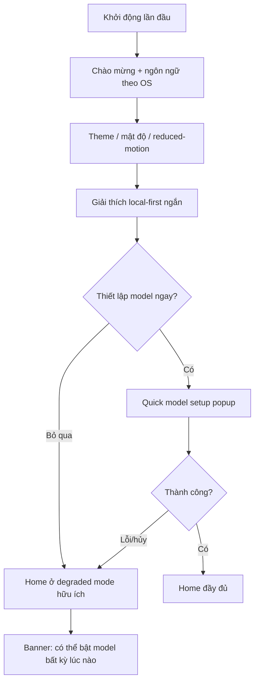

### 13.2 Tạo app từ câu nói (luồng lõi)

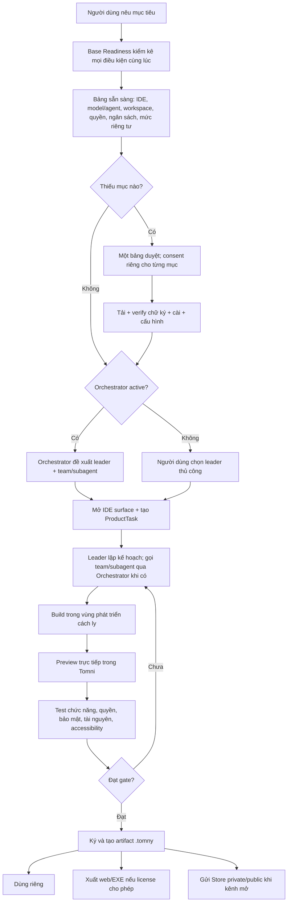

### 13.3 Thiết lập mô hình nhanh

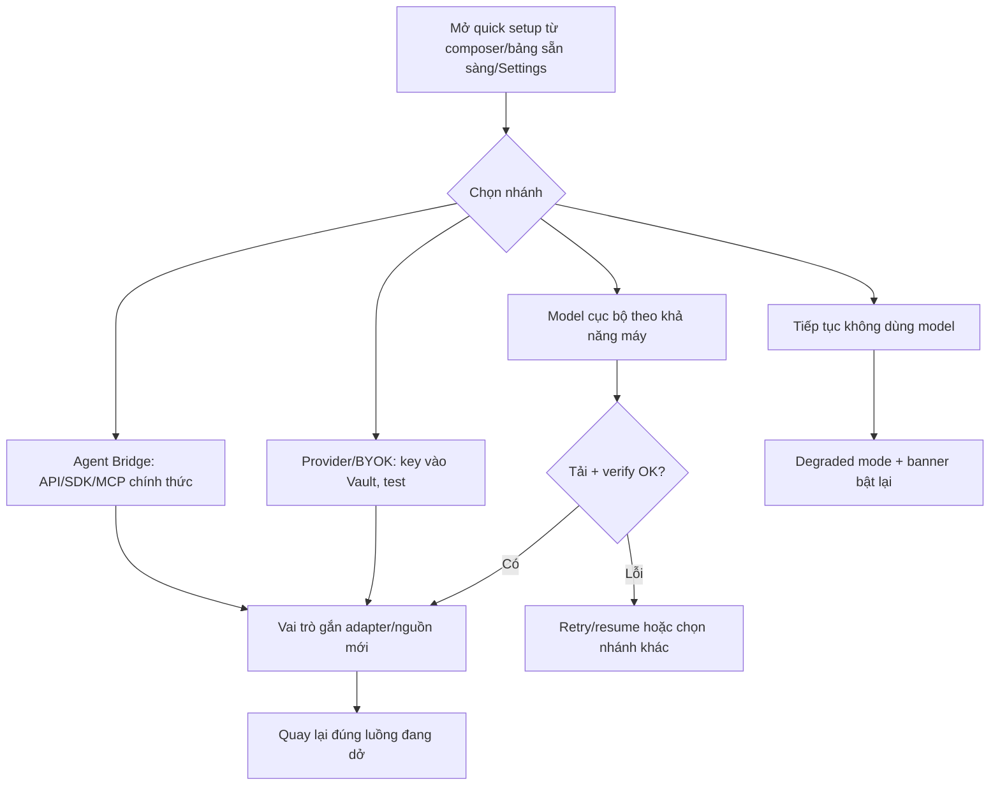

### 13.4 Cài package từ Store

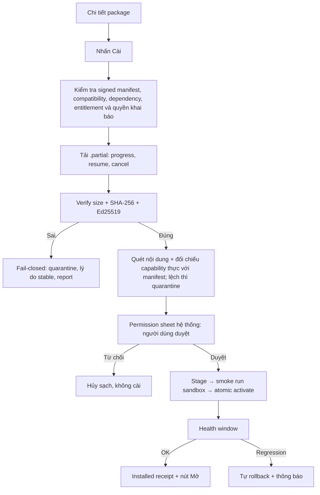

### 13.5 Cập nhật và rollback

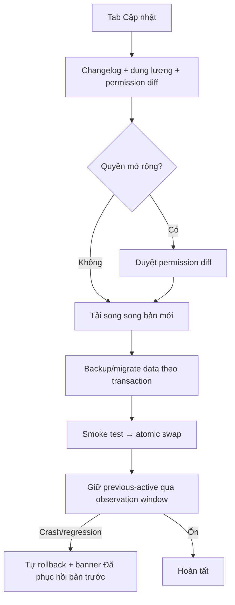

### 13.6 Gỡ package

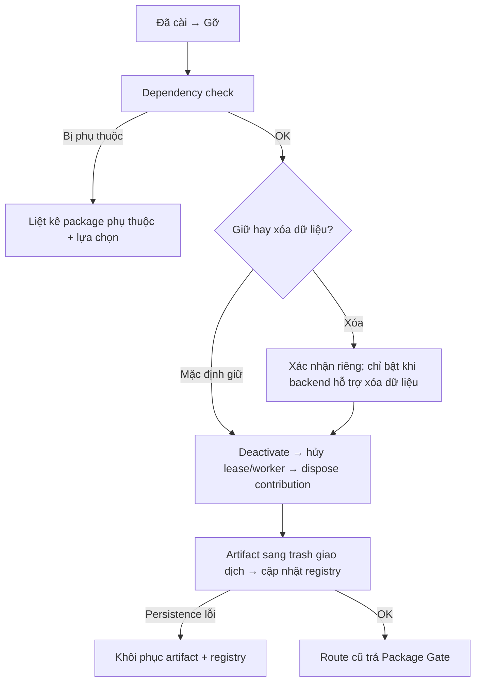

### 13.7 Cài app Microsoft qua federation

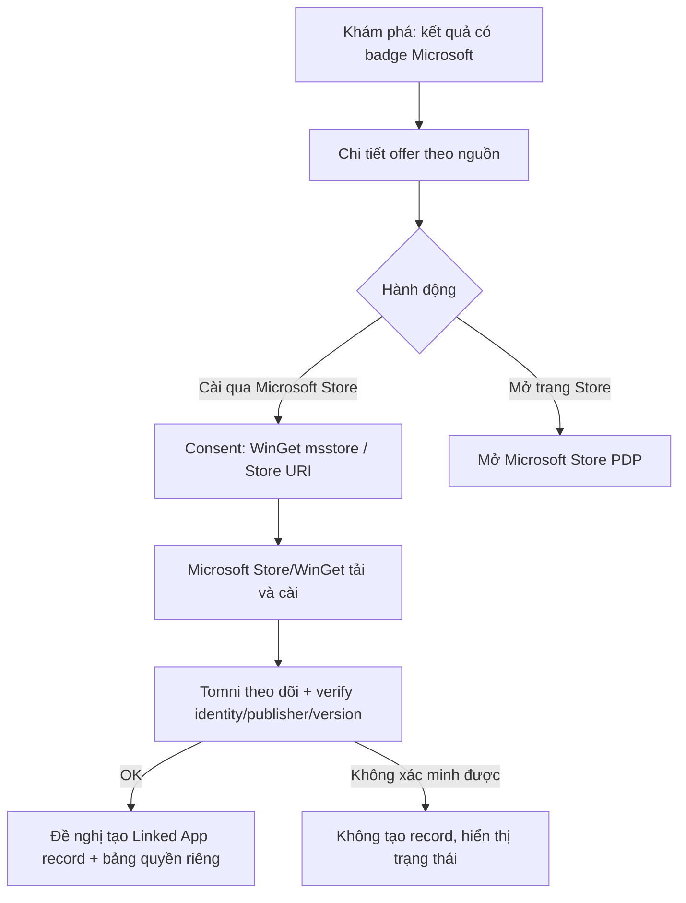

### 13.8 Nhiệm vụ agent (kể cả đội agent)

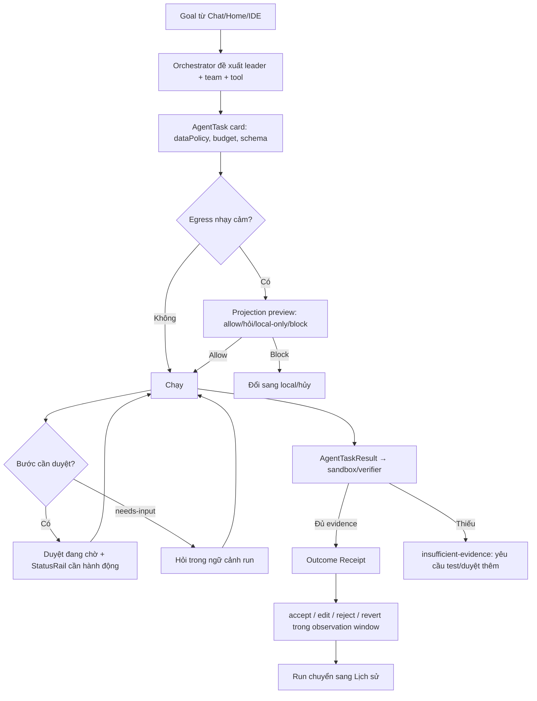

### 13.9 Thu hồi quyền giữa phiên

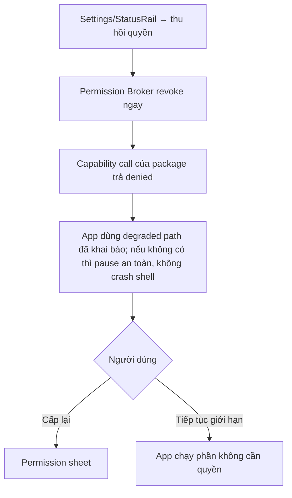

### 13.10 Offline và WebUI mất local service

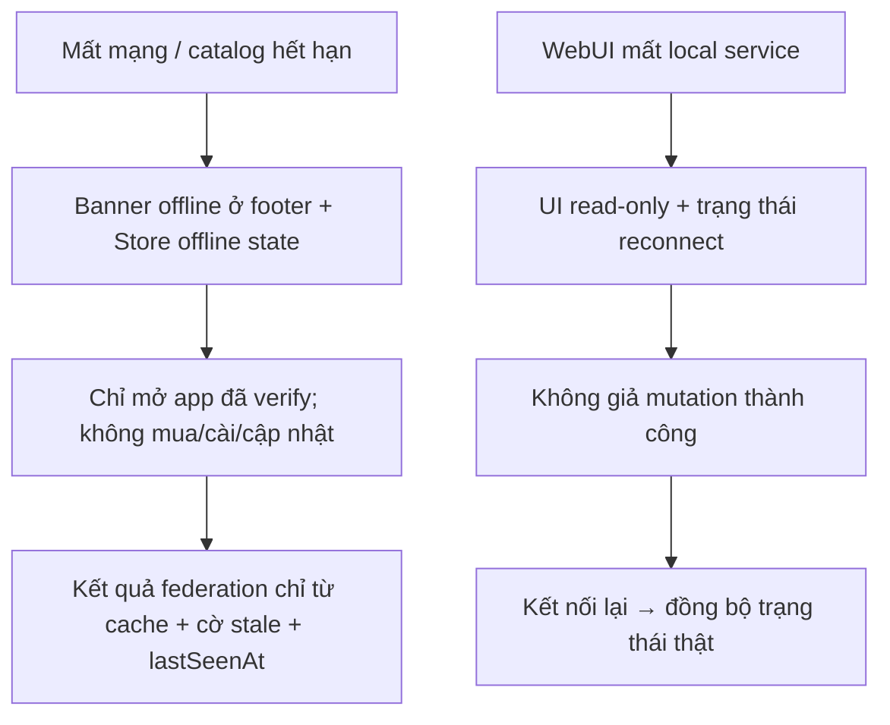

### 13.11 Migration com.tomni.studio

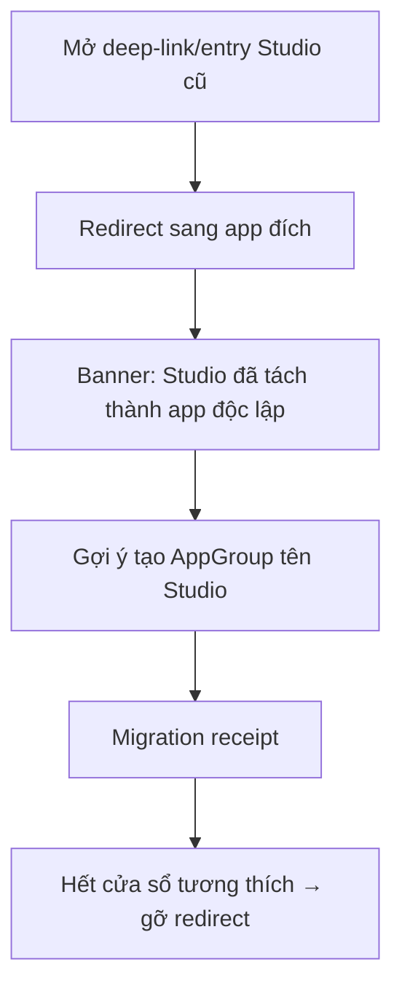

### 13.12 Preview vùng cách ly

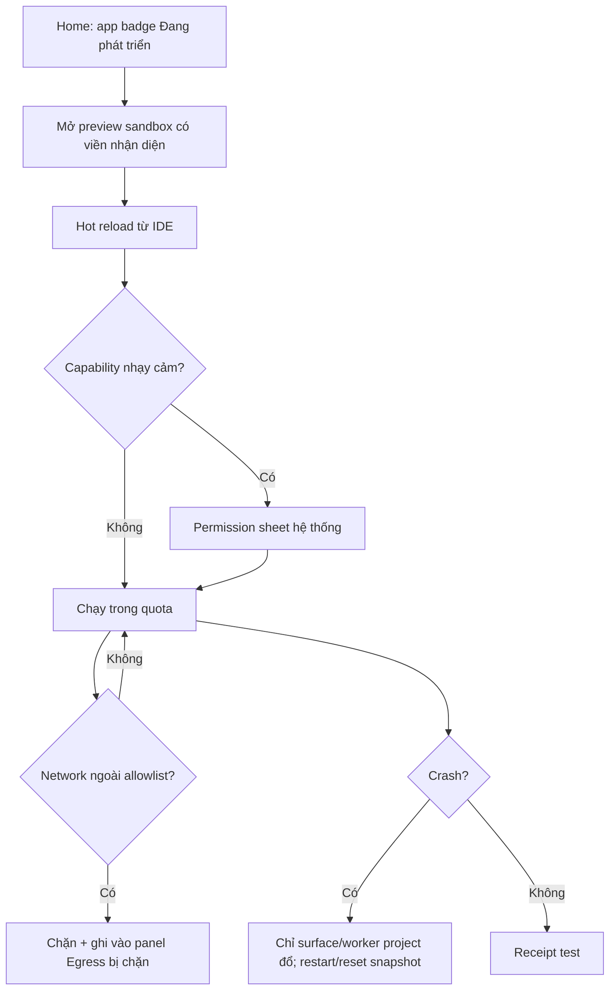

---

## 14. Ma trận trạng thái

Áp cho mọi surface có dữ liệu. Mọi trạng thái phải: giữ đúng footprint cuối (không layout shift), có cancellation/timeout/retry budget, không spinner vô trạng thái, không vòng retry vô hạn.

| Trạng thái | Hành vi bắt buộc | Thể hiện |
| --- | --- | --- |
| Loading | skeleton đúng kích thước cuối; hủy được khi đổi hướng; late result không ghi đè state mới | skeleton glass, không văn bản nhấp nháy |
| Empty | luôn có hành động tiếp theo; là nơi dùng bản sắc cosmic tinh tế | minh họa nhẹ + 1 CTA chính |
| Error | stable error code + message i18n + retry/report; không lộ stack/secret | inline cho vùng nhỏ, banner cho trang |
| Offline/stale | dữ liệu cache có `lastSeenAt` + cờ stale; chặn mua/cài/cập nhật; app đã verify vẫn mở | banner footer + nhãn stale trên card |
| Thiếu quyền | giải thích quyền cần và lý do; nút cấp (mở permission sheet) hoặc tiếp tục giới hạn | không màn hình chết |
| Degraded không model | Chat shell vẫn mở để thiết lập model/agent và dùng lệnh hệ thống; Store, package, rule security và manual routing vẫn chạy; tác vụ sinh nội dung AI bị vô hiệu có giải thích | banner có nút bật model; không nhắc lỗi lặp lại mỗi lượt |
| Quarantined/Revoked | lý do stable + đường report/appeal; dữ liệu người dùng giữ nguyên | badge cảnh báo + trang chi tiết |
| WebUI thiếu capability | control bị vô hiệu có tooltip lý do; không đổi bố cục | disabled + giải thích |
| Package crash | surface đổ riêng, shell nguyên; restart/disable/report | error boundary trong tab |
| Mutation đang xử lý | optimistic chỉ khi hoàn tác được; mặc định pending rõ với operation id | nút chuyển trạng thái, không double-submit |

Bảng ánh xạ sự cố → hành vi chi tiết (catalog sai chữ ký, crash giữa swap, dependency thiếu, RAM/VRAM thiếu, adapter regression, MCP độc hại, Continuum mất kết nối, migration lỗi, publisher revoke, verifier thiếu evidence…) tuân theo bảng “Chế độ lỗi và suy giảm” của tài liệu sản phẩm; UI không được sáng tạo hành vi khác cho cùng sự cố.

---

## 15. Motion và chuyển tab

### 15.1 Token và nguyên tắc

- Ba mức: **fast 120 ms** (hover, focus, toggle) · **standard 180 ms** (chuyển tab/surface, popup mở) · **slow 280 ms** (khoảnh khắc mở năng lực/unfold, docking khi cài đặt xong).
- Ưu tiên một chuyển cảnh rõ thay vì nhiều animation rời rạc. Motion đặc trưng (orbit, docking, unfolding) chỉ dùng cho khoảnh khắc có ý nghĩa (cài xong, kích hoạt năng lực, ghim vào nhóm), một lần, không lặp vô hạn, không làm chậm chuyển tab.
- `prefers-reduced-motion: reduce` → transition/animation về gần 0. Máy yếu → ưu tiên phản hồi input và giữ shell hơn animation/prefetch/tác vụ nền.

### 15.2 Chuyển tab/surface (khớp ResourceCoordinator)

1. pointer/focus intent chỉ preload sau ngưỡng chống hover nhiễu;
2. giữ shell và nội dung cũ ổn định trong lúc surface mới chuẩn bị;
3. skeleton/error cùng footprint cuối, không nhảy bố cục;
4. route chunk, locale, metadata tải song song trong resource budget;
5. worker/model chỉ kích hoạt khi surface thật sự cần;
6. surface mới chỉ commit sau runtime readiness + first meaningful paint handshake có operation ID/sequence; transition 120/180 ms;
7. load cũ bị hủy khi đổi ý; late result không ghi đè state mới;
8. inactive surface chuyển warm → suspended → evicted theo áp lực tài nguyên.

### 15.3 Mục tiêu đo (theo máy profile, không hứa tuyệt đối)

| Chỉ số | Mục tiêu |
| --- | --- |
| Phản hồi sau click/keyboard | P95 ≤ 100 ms |
| Surface warm đổi nội dung | P95 ≤ 180 ms |
| Cold load hiển thị skeleton ổn định | ≤ 100 ms |
| Cold first-party light interactive | P95 ≤ 1 s trên máy chuẩn |
| Long task Renderer | không tác vụ không chia nhỏ > 50 ms trong luồng thường |
| Layout shift do loading | gần 0 trong shell/card chính |
`Máy chuẩn` phải được ghi rõ CPU/RAM/GPU/OS/build và số lần đo trong performance fixture; nếu chưa có profile và trace thì chỉ được ghi “chưa đo”, không coi mục tiêu là kết quả.

---

## 16. Khả năng tiếp cận và chống mỏi

- Text đạt WCAG AA ở light/dark và sau khi áp UI Package; cùng layout/hierarchy ở light và dark, chỉ semantic token thay đổi.
- Focus ring nhìn thấy rõ (không chỉ đổi màu chữ); logical tab order; F6 xoay vùng; mọi thao tác chuột/kéo-thả có phương án bàn phím.
- Icon-only bắt buộc tooltip + accessible name; tooltip không thay label của hành động nguy hiểm.
- Trạng thái không truyền nghĩa chỉ bằng màu hoặc chuyển động; luôn kèm text/icon.
- Setting Giảm độ trong suốt luôn có trong app; đồng thời tôn trọng `prefers-reduced-transparency: reduce` khi nền tảng hỗ trợ. Khi bật, tắt blur và dùng surface đủ opaque/tương phản; hỗ trợ tăng tương phản.
- Skeleton đúng kích thước cuối; không layout shift khi dữ liệu thật xuất hiện.
- Permission sheet, security indicator và viền sandbox là vùng hệ thống: luôn đọc được với screen reader, không bị package che/ghi đè, có accessible name mô tả rủi ro.
- Chống mỏi: một tiêu điểm/một hành động chính mỗi màn hình; vùng phụ giảm nổi bật khi tập trung trong IDE/tài liệu; Comfortable mặc định; không co font để giải quyết tràn (truncate/wrap/scroll ngang/đổi số cột).
- Accessibility là một gate trong test publish package và trong tiêu chí nghiệm thu từng nhóm màn hình (mục 19), không phải bước kiểm tra cuối.

---

## 17. Yêu cầu responsive (Q5 — desktop-first, breakpoint đã khóa)

| Viewport | Hành vi |
| --- | --- |
| ≥ 1180 px | sidebar đầy đủ (220 px) hoặc thu gọn (64 px), main fluid + status rail 256 px cùng hiển thị |
| 840–1179 px | ẩn StatusRail; nút Trạng thái chung ở topbar mở right drawer dùng cùng state stream; main chiếm toàn bộ |
| 760–839 px | app grid hai cột; card cuối có thể span toàn hàng; main cuộn dọc |
| < 760 px | sidebar thành drawer/overlay; app/recent một cột, launcher hai cột; phạm vi chức năng: **Chat, Store cơ bản, giám sát task, duyệt quyền và điều khiển** |

- Responsive không xóa chức năng hoặc đổi information architecture ở ≥ 760 px; vùng bị ẩn phải có affordance mở popup/drawer tương đương.
- **IDE/VIU đầy đủ yêu cầu desktop (≥ 1180 px);** dưới ngưỡng hiển thị chế độ xem giới hạn (đọc file/trạng thái task) + hướng dẫn mở trên desktop, không giả lập chức năng.
- Kích thước khung chuẩn: topbar 48 px, footer 30 px, gap main–rail 16 px; main padding desktop trên 15/phải 32/dưới 8/trái 28 px; page content padding responsive 20–40 px, mobile 14 px dọc/16 px ngang; search cao 30 px tối đa 662 px; composer tối thiểu 98 px, send 34 px; quick action 30 px một hàng cuộn ngang; app grid 3 cột gap 14 px.
- Kiểm tra chuẩn: 1208×680 không scroll dọc ngoài vùng chủ động cuộn; 1440×900 mở rộng sạch; 840/760 không mất chức năng.

---

## 18. Nội dung chữ quan trọng (key copy)

Nguyên tắc: mọi chuỗi qua i18n; vi-VN/en-US là hai locale review chính, nhưng implementation phải đồng bộ mọi locale trong `i18n-config.json`; fallback en-US. Error dùng stable code; không hứa tuyệt đối (“không thể rò rỉ”, “an toàn 100%”, “AI vô hạn” bị cấm); phân biệt rõ ba khái niệm *truyền dữ liệu*, *lưu dữ liệu*, *dùng để cải thiện mô hình*.

| Ngữ cảnh | vi-VN (chuẩn) | en-US |
| --- | --- | --- |
| Permission sheet — tiêu đề | “{app} muốn {capability}” | “{app} wants to {capability}” |
| Permission sheet — phạm vi | “Chỉ lần này · Phiên này · Workspace này · Luôn cho tool này” | “Just once · This session · This workspace · Always for this tool” |
| Projection preview | “Dữ liệu sau sẽ được gửi tới {destination}. Xem trước bên dưới.” | “The following data will be sent to {destination}. Preview below.” |
| Mức riêng tư | “Chỉ cục bộ · Từ xa đã giảm dữ liệu · Từ xa đầy đủ (cần chấp thuận)” | “Local only · Redacted remote · Full remote (consent required)” |
| Degraded không model | “Chưa có model hoặc agent. Bạn vẫn có thể dùng Store, package và lệnh hệ thống; hãy thêm model để tạo nội dung bằng AI.” | “No model or agent is configured. Store, packages, and system commands still work; add a model to generate with AI.” |
| Offline | “Ngoại tuyến — hiển thị dữ liệu đã lưu lúc {lastSeenAt}. Không thể cài hoặc cập nhật.” | “Offline — showing data cached at {lastSeenAt}. Install and updates unavailable.” |
| WebUI mất service | “Mất kết nối tới Tomni trên máy. Chế độ chỉ xem cho tới khi kết nối lại.” | “Lost connection to Tomni on this device. Read-only until reconnected.” |
| Chữ ký sai | “Không thể cài: chữ ký không hợp lệ. Gói đã được cách ly. (Mã {code})” | “Can't install: invalid signature. Package quarantined. (Code {code})” |
| Rollback tự động | “Đã phục hồi bản trước do lỗi sau cập nhật.” | “Restored the previous version after a post-update failure.” |
| Budget cảnh báo | “Đã dùng {pct}% ngân sách ({actual}/{max}).” — hard stop: “Đã đạt ngân sách tối đa. Nhiệm vụ tạm dừng chờ quyết định của bạn.” | “{pct}% of budget used ({actual}/{max}).” / “Budget limit reached. Task paused for your decision.” |
| Nguồn Store | “Nguồn: Tomni Store” · “Nguồn: Microsoft Store — cài đặt do Microsoft Store thực hiện” | “Source: Tomni Store” · “Source: Microsoft Store — installation handled by Microsoft Store” |
| Trust tách nguồn | “Chữ ký & review Tomni và chứng nhận Microsoft là hai tín hiệu riêng biệt.” | “Tomni signing/review and Microsoft certification are separate signals.” |
| Sandbox | “Vùng cách ly — app đang phát triển. Mạng bị giới hạn, quyền cần duyệt.” | “Sandbox — app in development. Network limited, permissions require approval.” |
| Verifier thiếu evidence | “Chưa đủ bằng chứng để xác nhận kết quả. Cần thêm test hoặc duyệt thủ công.” | “Not enough evidence to verify this outcome. Add tests or review manually.” |
| Thu hồi quyền | “Quyền đã bị thu hồi. {app} tiếp tục chạy với chức năng giới hạn.” | “Permission revoked. {app} continues with limited functionality.” |
| Gỡ package | “Dữ liệu của bạn được giữ lại theo mặc định.” | “Your data is kept by default.” |
| Studio migration | “Studio đã tách thành các app độc lập. Bạn có thể nhóm chúng lại và đặt tên ‘Studio’.” | “Studio is now independent apps. You can group them and name the group ‘Studio’.” |
| Dữ liệu chưa có | “Chưa có dữ liệu” (không hiển thị số giả) | “Unavailable” |

---

## 19. Tiêu chí nghiệm thu từng nhóm màn hình

### 19.1 Shell + Onboarding

- [ ] HubShell duy nhất cho Desktop/WebUI; khác biệt chỉ ở window-control slot và capability bị vô hiệu có giải thích.
- [ ] Onboarding hoàn tất được không cần model, không cần mạng; bỏ qua model dẫn về Home degraded hữu ích.
- [ ] Ngôn ngữ khởi tạo theo OS; đổi được trong Settings và popup settings nhanh (chỉ theme/language + link Settings).
- [ ] Sidebar 220/64 px, rail 256 px, topbar 48, footer 30; thứ tự sidebar/Home/rail đúng bố cục khóa.
- [ ] F6/Ctrl+Tab/Esc hoạt động; Ctrl+T chỉ được đăng ký khi quick-assistant thật sự bật, không có dead shortcut hoặc stub gây hiểu nhầm.
- [ ] Footer chỉ hiển thị kết nối + hàng đợi nền; không trùng nội dung StatusRail.

### 19.2 Home + AppGroup

- [ ] Thứ tự Intro → Composer → Quick actions → Ứng dụng → Tiếp tục không đổi.
- [ ] Composer là nơi duy nhất chọn model/agent cho lượt chat; card Model ở rail không có selector trùng.
- [ ] App đang phát triển có badge, mở vào sandbox; không xuất hiện trong Store.
- [ ] Tạo/đổi tên/kéo-thả AppGroup có phương án bàn phím; đóng nhóm chỉ suspend; mở nhóm không tải trước app chưa cần.
- [ ] Trạng thái app (active/suspended/cần cập nhật/quarantined) hiển thị icon+text, không chỉ màu.

### 19.3 Chat + nhiệm vụ agent

- [ ] Mọi side effect, egress nhạy cảm hoặc hành động rủi ro do AI đề xuất đi qua thẻ/policy duyệt; output model không trực tiếp gây mutation. Tool read-only đã được policy cho phép không bị ép hỏi lại vô ích.
- [ ] AgentTask card đủ dataPolicy/budget/tool; projection preview chặn được egress; Security Receipt ghi lại quyết định.
- [ ] needs-input, duyệt tool, hard stop budget đều hiển thị trong ngữ cảnh run và StatusRail mức “cần hành động”.
- [ ] Receipt viewer tái hiện được: goal, criteria, versions, policy, cost, evidence, verifier; revert hoạt động trong observation window.
- [ ] Run kết thúc biến mất khỏi Quản lý và xuất hiện ở Lịch sử; không trùng hai nơi.

### 19.4 Store (Tomni + Microsoft)

- [ ] 5 tab đúng Q4; Store Search chỉ tìm Store.
- [ ] Chi tiết package đủ danh mục mục 8.2; compatibility diễn giải, không có `>=0.0.0`.
- [ ] Khi backend contract đạt gate, cài/cập nhật/rollback/gỡ hiển thị đúng trạng thái giao dịch, resume được và chữ ký sai fail-closed; trước đó state/action chưa hỗ trợ phải ẩn/disabled, không giả lập.
- [ ] Offer Microsoft có badge nguồn, provenance, lastSeenAt; trust hai nguồn tách biệt; cài do Store/WinGet thực hiện sau consent; Linked App chỉ tạo sau xác minh identity.
- [ ] Offline: cache + stale + lastSeenAt; một nguồn lỗi không diễn giải thành “không có sản phẩm”.
- [ ] Uninstall xong route trả Package Gate; dữ liệu giữ mặc định.

### 19.5 IDE + sandbox preview

- [ ] IDE core mở được khi chưa cài contribution nào; tab theo registry; gỡ contribution → Package Gate.
- [ ] Prerequisite panel gom mọi điều kiện thiếu vào một bảng, một lần duyệt.
- [ ] Preview có viền/nhãn cách ly không thể bị che; egress bị chặn hiển thị lý do; crash chỉ đổ surface project.
- [ ] Snapshot/reset hoạt động; receipt test được ghi; không telemetry khi chưa opt-in.
- [ ] Dưới 1180 px IDE chuyển chế độ xem giới hạn có hướng dẫn, không giả lập chức năng.

### 19.6 Model + Settings

- [ ] AI & Models hiển thị bốn vai trò logic và availability riêng; nguồn traffic hiện tại đúng sự thật (active/baseline/provider/unavailable); trained/candidate không hiển thị như đang phục vụ.
- [ ] Quick setup không rời luồng; luôn có lối “tiếp tục không dùng model”; không ép tải model vượt khả năng máy.
- [ ] Secret chỉ hiển thị alias sau khi lưu vào Vault; không plaintext trong UI/log.
- [ ] Thu hồi quyền có hiệu lực ngay; app dùng degraded path đã khai báo hoặc pause surface an toàn, không crash shell và không giữ capability cũ.
- [ ] Gói & quyền lợi chỉ gồm tên gói, hạn mức, nút nâng cấp; không giá/chiến lược trong UI tĩnh của brief.
- [ ] Telemetry và model improvement là hai công tắc riêng, mặc định tắt.

### 19.7 Quản lý + Lịch sử + Sản phẩm

- [ ] Duyệt đang chờ gom đủ permission/tool/egress; mỗi mục có ngữ cảnh, hạn và hệ quả khi bỏ qua.
- [ ] Lịch sử chỉ-đọc, có tiếp tục/hoàn tác khi hợp lệ; receipt export được.
- [ ] Sản phẩm phân biệt draft/đã ký/đã publish; export tôn trọng license; gửi Store dẫn đúng luồng publish.

### 19.8 Trạng thái toàn cục

- [ ] Mọi surface có đủ loading/empty/error/offline/thiếu quyền/degraded theo ma trận mục 14; footprint không đổi giữa các trạng thái.
- [ ] 1208×680 và 1440×900 đạt; 840/760 breakpoint không mất chức năng; <760 đúng phạm vi Q5.
- [ ] Light/dark/reduced-motion/reduced-transparency/tăng tương phản đạt AA.
- [ ] Không tên “Tomny/Aion/AionUi/Omni” trong UI mới; “Tomni” và “.tomny” dùng nhất quán.
- [ ] Dữ liệu rail/model/system là thật hoặc `unavailable`; không dữ liệu giả.

---

## 20. Phụ lục — Quyết định đã chốt và điểm còn mở

### 20.1 Quyết định đã chốt (2026-07-26)

| # | Quyết định |
| --- | --- |
| Q1 | Chat là mục sidebar riêng, trải nghiệm đầy đủ; giữ chỗ hợp đồng trợ lý nhanh Ctrl+T (không thay trang Chat) |
| Q2 | Run đang hoạt động/chờ duyệt ở Quản lý; run kết thúc ở Lịch sử; không trùng |
| Q3 | Company ẩn mặc định, hiện khi có workspace nhóm; hạ tầng tồn tại, UI chi tiết sau |
| Q4 | Store: Khám phá · Ứng dụng · Mở rộng · Đã cài · Cập nhật; Microsoft trong Khám phá với badge nguồn; federation cơ bản là đích bắt buộc, ranking liên nguồn/nâng cao để sau |
| Q5 | Desktop-first theo breakpoint VDS; <760 px gồm Chat, Store cơ bản, giám sát task, duyệt quyền, điều khiển; IDE/VIU cần desktop |
| Q6 | Ngôn ngữ theo OS; vi-VN + en-US là hai locale review chính; giữ locale hiện có theo config; fallback en-US |
| Q7 | TomniHubOS / Tomni / `.tomny`; “Tomny” chỉ là dữ liệu tương thích |
| Q8 | Hiển thị theo bốn vai trò logic và availability thật; Security 0.8B là candidate 600/600 chờ verifier mới + benchmark, không nhận traffic |
| Q9 | Gói & quyền lợi trung tính, không giá trong brief |
| Q10 | StatusRail ba mức thông báo: cần hành động · cảnh báo · thông tin; Notification Center đầy đủ để sau |
| Art | “Calm Cosmic Intelligence — A Universe in a Box”; 85–90% công cụ sạch, 10–15% bản sắc cosmic |

### 20.2 Quyết định đã giải quyết trong đối chiếu kỹ thuật

| Điểm | Quyết định khóa |
| --- | --- |
| IDE ABI v1 | Host `com.tomni.ide` API `1.0.0`; group/package ID khóa theo mục 9; code `codebase|agent-ops` là legacy phải migrate + test trước phát hành |
| Quick Test Tracker | tên hiển thị chính thức **Kiểm thử & Gỡ lỗi / Test & Debug**; ID giữ `com.tomni.ide.debug` |
| Rail <1180 px | một nút Trạng thái chung ở topbar mở drawer dùng cùng state stream; không icon/shortcut riêng theo card |
| UI Package `system` | được đổi token/font/icon chức năng công bố; không thay logo/wordmark Tomni hoặc security/trust chrome |
| Company Focus Mode | ẩn sidebar, rail và toolbar phụ; giữ GlobalHeader/topbar làm lối thoát và chỉ báo hệ thống |
| Raised glass | alpha sàn 0.92 light / 0.90 dark trên nền chi tiết; WCAG AA và opaque fallback vẫn là gate |
| Ctrl+T | contract palette nhanh đã mô tả ở mục 5; không đăng ký shortcut trước khi tính năng thật tồn tại |

### 20.3 Gate phụ thuộc bằng chứng, không chặn thiết kế trực quan

| Gate | Quy tắc |
| --- | --- |
| Giữ hay bỏ Security 0.8B | tiếp tục giữ ở `candidate`; chỉ quyết định sau full verify và benchmark so backend-only, backend + 0.8B, backend + shared 2B trên chất lượng bảo mật, lỗi nghiêm trọng, latency và RAM/VRAM |
| Store lifecycle mở rộng | chỉ bật resume/progress/permission diff/rollback/health receipt khi backend phát contract và test tương ứng |
| Microsoft Linked App | chỉ tạo sau identity/publisher/version verification; trước đó chỉ là offer nguồn Microsoft |
| Creator sandbox | chỉ gọi là vùng cách ly khi runtime driver, capability/quota/network policy, cleanup và crash isolation đạt gate; `iframe` không đủ |

Design Lab được phép tiếp tục theo brief này. Bản triển khai phải capability-gate theo mục 0.1 và không dùng mockup làm bằng chứng backend đã hoàn thành.
