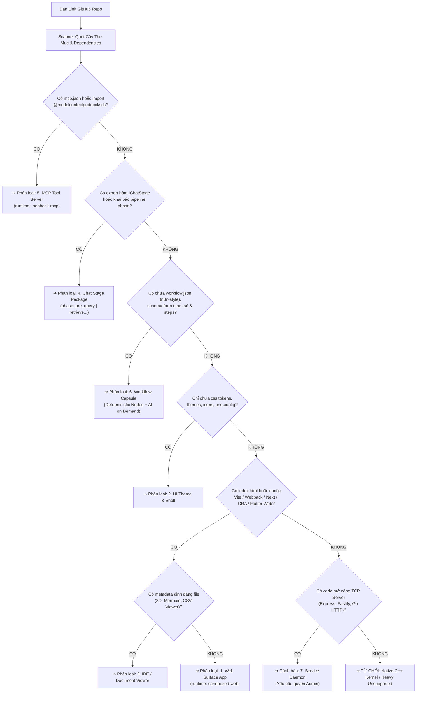

# Hệ Thống Phân Loại & Đặc Tả Toàn Diện Các Loại Package (Package Taxonomy & Architecture)

**Trạng thái:** `TARGET / CANONICAL SPECIFICATION`  
**Chủ đề:** Chuẩn hóa toàn bộ danh mục Package trong hệ sinh thái Store, cơ chế phân loại Repo-to-Package và ma trận quyền hạn Least Privilege.  
**Tài liệu liên quan:** [`docs/platform/packages.md`](packages.md), [`docs/core/chat-pipeline.md`](../core/chat-pipeline.md), [`docs/future/5-y-tuong-kien-truc-dot-pha.md`](../future/5-y-tuong-kien-truc-dot-pha.md), [`packages/desktop/src/process/automation/automationTypes.ts`](../../packages/desktop/src/process/automation/automationTypes.ts).

---

## 1. Nguyên Tắc Thiết Kế Cốt Lõi (Core Design Invariants)

Hệ sinh thái ứng dụng của TomniHubOS được xây dựng trên 3 ranh giới kỹ thuật bất di bất dịch:

1. **Phân định rõ ràng: "Text thuần" vs "Package thực thi (.tomny)":**
   - Những nội dung chỉ là văn bản (Prompt, Persona đóng vai, hướng dẫn Markdown) **tuyệt đối không đóng gói thành file nhị phân `.tomny`**. Chúng được gọi là **`Prompt Preset`** hoặc **`Persona Profile`** (lưu dạng file `.json`/`.md` nhẹ, dễ chia sẻ, không cần cài đặt).
   - Thứ được đóng gói thành `.tomny` **bắt buộc phải chứa mã nguồn, tài nguyên đồ họa, hoặc logic/quy trình thực thi (Executable Logic / State Machine / Code Assets)**.

2. **Tường lửa Cô lập (Sandbox Isolation & Least Privilege):**
   - Mã nguồn tải về từ bên ngoài (Store bên thứ ba, GitHub Repo) luôn được xem là **Untrusted Input**.
   - Mặc định 100% ứng dụng có giao diện phải chạy trong **`sandboxed-web`** (Iframe có cờ bảo vệ, zero quyền truy cập Node.js/Electron API của máy chủ). Quyền `trusted-react` chỉ dành riêng cho các thành phần First-Party cốt lõi đã qua kiểm duyệt an ninh.

3. **Tính Độc lập của Base Bundle:**
   - Nhân hệ điều hành TomniHubOS giữ kích thước siêu nhẹ. Mọi ứng dụng mở rộng (từ bảng vẽ, công cụ chat, trạm dữ liệu đến theme giao diện) đều tồn tại dưới dạng Package độc lập, có vòng đời cài đặt (`install`), cập nhật (`update`), tắt (`disable`) và gỡ bỏ (`uninstall`) sạch sẽ.

---

## 2. Bảng Ma Trận Phân Loại Toàn Diện (7 Nhóm Package)

Toàn bộ thế giới Package trong TomniHubOS được chia thành 3 tầng chức năng với 7 nhóm định danh rõ ràng:

```text
┌────────────────────────────────────────────────────────────────────────┐
│ TẦNG 1: GIAO DIỆN & KHÔNG GIAN LÀM VIỆC (SURFACES & UI)                │
│  1. Web Surface App       ─── Ứng dụng độc lập có Icon trên Dock       │
│  2. UI Theme & Shell      ─── Tùy biến Theme, Skin, Layout của OS      │
│  3. IDE / Document Viewer ─── Subtab nhúng xem file trong Workspace    │
├────────────────────────────────────────────────────────────────────────┤
│ TẦNG 2: XỬ LÝ CHAT & TRÍ TUỆ AI (PIPELINE & AGENTS)                    │
│  4. Chat Stage Package    ─── Trạm kéo thả trong thanh Chat Pipeline   │
│  5. MCP Tool Server       ─── Cung cấp Function Calling cho AI         │
│  6. Workflow Capsule      ─── n8n-style Workflow: Code tuần tự + AI    │
├────────────────────────────────────────────────────────────────────────┤
│ TẦNG 3: DỊCH VỤ HỆ THỐNG (SYSTEM SERVICES & DAEMONS)                   │
│  7. Service Daemon        ─── Tiến trình nền mở cổng mạng (Admin Only) │
│  [X] Unsupported Native   ─── C++ kernel/driver ➔ TỪ CHỐI AN TOÀN      │
└────────────────────────────────────────────────────────────────────────┘
```

---

### Chi Tiết Từng Nhóm Package

#### 1. Web Surface App (`type: "app"`, `runtime: "sandboxed-web"`)

- **Bản chất:** Ứng dụng độc lập có giao diện người dùng hoàn chỉnh (Single Page Application - SPA).
- **Nơi xuất hiện:** Xuất hiện Icon trên thanh Dock / Menu ứng dụng của TomniHubOS; khi bấm vào sẽ mở một Tab/Surface độc lập.
- **Ví dụ thực tế:**
  - `excalidraw/excalidraw`: Bảng vẽ sơ đồ tư duy & kiến trúc.
  - `gchq/CyberChef`: Công cụ mã hóa, giải mã, hash, nén dữ liệu.
  - `AykutSarac/jsoncrack.com`: Trực quan hóa cấu trúc JSON thành đồ thị node.
  - `gabrielecirulli/2048`, `Calculator`: Mini app tiện ích và giải trí nhẹ.
- **Entrypoint & Runtime:** `index.html` trong Iframe `sandboxed-web`.
- **Quyền hạn mặc định:** `[]` (Chạy offline, zero-permission; tùy chọn xin `clipboard.read/write`).

#### 2. UI Theme & Shell Package (`type: "ui"`, `runtime: "in-process"`)

- **Bản chất:** Gói tùy biến giao diện, diện mạo, bảng màu và bố cục của chính hệ điều hành TomniHubOS.
- **Nơi xuất hiện:** Áp dụng trực tiếp vào Shell của Hub OS (Menu Cài đặt Giao diện).
- **Tác động kỹ thuật:**
  - Ghi đè CSS Variables và Semantic Tokens của UnoCSS/Arco Design.
  - Tùy biến icon pack, phông chữ hệ thống.
  - Tùy biến bố cục thanh Sidebar, thanh Dock, hoặc nhúng thêm Widget đo tài nguyên CPU/RAM vào thanh trạng thái.
- **Ví dụ thực tế:** _Dracula Theme, Tokyo Night Dark, Retro MacOS 9 Skin, Cyberpunk Neon Layout_.
- **Quyền hạn:** `ui.theme` (Không có quyền can thiệp vào dữ liệu chat hay file của người dùng).

#### 3. IDE & Document Viewer (`type: "ui"`, `contributions.ide.subtabs`)

- **Bản chất:** Trình xem hoặc trình soạn thảo file chuyên dụng nhúng vào Workspace của IDE.
- **Nơi xuất hiện:** Tự động mở ra một Subtab trong IDE khi người dùng click vào một file có phần mở rộng tương ứng trong cây thư mục.
- **Ví dụ thực tế:**
  - `mermaid-js/mermaid-live-editor`: Xem và render đồ họa file sơ đồ `.mmd`, `.mermaid`.
  - `mrdoob/three.js Viewer`: Xem và xoay lật mô hình 3D cho các file `.stl`, `.gltf`, `.obj`.
  - `SheetJS Viewer`: Xem và lọc dữ liệu file bảng tính `.xlsx`, `.csv`.
- **Quyền hạn:** `workspace.read` (Chỉ cấp quyền đọc nội dung file cụ thể đang mở).

#### 4. Chat Stage Package (`type: "chat-stage-package"`, `contributions.chatStage`)

- **Bản chất:** Trạm trung chuyển (Middleware Stage) can thiệp và làm giàu dữ liệu trên dây chuyền Chat Pipeline.
- **Nơi xuất hiện:** **Không có icon trên Dock!** Xuất hiện dưới dạng một thẻ chức năng trong ngăn kéo **Chat Pipeline Drawer** của cửa sổ chat. Người dùng có thể kéo thả để thay đổi thứ tự thực thi hoặc gạt công tắc bật/tắt.
- **Bốn Pha Thực Thi (`StagePhase`):**
  1. `pre_query`: Làm sạch dữ liệu, khử teencode, quét bảo mật che mật khẩu/PII (_Laya Security Stage_).
  2. `retrieve`: Kéo tài liệu SDK mới nhất (_Context7 Docs Retriever_), tra cứu cơ sở tri thức RAG nội bộ, tìm kiếm web.
  3. `pre_model`: Tối ưu và nén prompt (_Token Compressor_), điều hướng chọn đúng tool (_Auto-Skill Router_).
  4. `post_model`: Hậu kiểm duyệt phản hồi từ LLM (_Code Syntax Linter_, _Fact Checker_).
- **Hợp đồng Code (`IChatStage`):**
  ```typescript
  export interface IChatStage {
    readonly id: string;
    readonly displayName: string;
    readonly phase: StagePhase; // 'pre_query' | 'retrieve' | 'pre_model' | 'post_model'
    execute(input: ChatStageInput): Promise<ChatStageOutput>;
  }
  ```
- **Quyền hạn:** Tùy thuộc vào pha (Ví dụ: Context7 cần `network.egress` để cào tài liệu; Laya chạy offline 100% không cần quyền).

#### 5. MCP Tool Server (`type: "agent-capsule"`, `runtime: "loopback-mcp"`)

- **Bản chất:** Máy chủ cung cấp các công cụ thực thi (Tools / Function Calling) cho AI Agent thông qua giao thức chuẩn Model Context Protocol.
- **Nơi xuất hiện:** Hiển thị trong danh mục Tool của Agent trong hộp thoại Chat; Agent tự động kích hoạt khi cần giải quyết tác vụ.
- **Ví dụ thực tế:**
  - `SQLite MCP Server`: Cho phép Agent đọc cấu trúc và truy vấn dữ liệu từ file database `.db`.
  - `Git MCP Server`: Cho phép Agent xem diff, kiểm tra log commit, tạo branch.
  - `Brave Search MCP`: Cho phép Agent tra cứu thông tin thời sự mới nhất trên Internet.
- **Quyền hạn:** `workspace.read`, `workspace.write`, `network.egress` (cần khai báo rõ ràng).

#### 6. Workflow Capsule Package (`type: "agent-capsule"`, `runtime: "in-process" / "automation"`)

- **Bản chất cốt lõi (Kiến trúc n8n-style Workflow Pipeline):**
  - **Không phải đưa cho Agent một prompt khổng lồ rồi để Agent tự bơi!**
  - Thực chất, Capsule là một **Workflow Pipeline (tương tự mô hình n8n)** chia thành chuỗi các Node/Bước thực thi có cấu trúc chặt chẽ.
  - **Nguyên lý "Chỉ gọi AI khi thực sự cần" (Deterministic-First, AI-on-Demand):**
    - **80% các bước là Deterministic Nodes (`action.code`, `action.filesystem`, `action.transform`):** Chạy thẳng bằng mã nguồn hệ thống (đọc file template HTML, parse dữ liệu, thay thế chuỗi regex, ghi file ra ổ đĩa, chạy lệnh git). Các bước này chạy trong **1ms, tốn 0 token, đạt độ chính xác 100% không bao giờ sinh lỗi cú pháp hay vỡ layout**.
    - **20% các bước là AI Nodes (`action.ai`):** Hệ thống **chỉ đánh thức LLM ở đúng bước thực sự đòi hỏi tư duy sáng tạo hoặc lập luận** (ví dụ: _"Viết đoạn văn bản quảng cáo cho phần Header dựa trên thông tin người dùng nhập"_). LLM nhận input nhỏ, sinh output ngắn, tốn chưa đầy 100-200 token rồi lập tức tắt.
  - **So sánh hiệu năng:**
    - _Để AI tự bơi từ A-Z:_ Tốn 15.000 - 30.000 tokens, mất 45 giây, nguy cơ vỡ layout hoặc lỗi cú pháp 50%.
    - _Chạy qua Workflow Capsule (n8n-style):_ Tốn đúng 150 tokens cho bước AI duy nhất, mất 1.5 giây, độ chính xác 100% vì 80% công việc là code định trước (deterministic)!
- **Nội dung bên trong một Workflow Capsule (`.tomny`):**
  - File định nghĩa quy trình `workflow.json` (tương thích trực tiếp với engine [`packages/desktop/src/process/automation/automationTypes.ts`](../../packages/desktop/src/process/automation/automationTypes.ts)).
  - Schema Form tham số hóa đầu vào (`inputSchema`).
  - Thư viện templates mã nguồn mẫu (HTML/CSS/JS boilerplate).
  - Cấu hình các Node Deterministic và Prompt tối ưu cho các Node AI.
- **Phân Loại 2 Dòng Workflow Capsule:**
  1. **Instant Run Capsule (Chạy Tức Thì - Zero Config):**
     - Bấm chạy là pipeline tự động kích hoạt tuần tự các node từ đầu đến cuối không cần hỏi thêm.
     - _Ví dụ:_ "Workflow Tối ưu hóa Code & Dọn rác dự án chuẩn Google".
  2. **Parametric Wizard Capsule (Viên nang Tham số hóa có Form nhập liệu):**
     - Hiển thị Form UI để người dùng điền nhanh các thông số (như ví dụ YouTuber tạo Landing Page):
       - _Tên sản phẩm:_ `[ Khóa học AI Pro ]`
       - _Màu sắc chủ đạo:_ `[ Xanh Neon & Dark ]`
       - _Đối tượng khách hàng:_ `[ Sinh viên CNTT ]`
     - Bấm **[Kích hoạt]** $\rightarrow$ Hệ thống đưa các biến số qua các Node Deterministic (nạp template), sau đó Node AI điền nội dung sáng tạo, và Node cuối tự động xuất bản file.
- **Khả năng Tùy biến:** Người dùng luôn có thể bấm **[Mở Workflow Editor / Mở Code]** để kéo thả thêm bớt các node, chỉnh sửa prompt của Node AI hoặc thay đổi mã script của Node Deterministic.

#### 7. Service Daemon Package (`type: "service"`, `runtime: "supervised-process"`)

- **Bản chất:** Ứng dụng máy chủ chạy ngầm liên tục, mở cổng mạng nội bộ TCP để phục vụ các phần mềm bên ngoài kết nối vào.
- **Ví dụ thực tế:**
  - _9Router Gateway_: Mở port HTTP `20128` để nhận request từ Cursor, Claude Code, Aider.
  - _Vector Database Daemon_: Máy chủ tìm kiếm véc-tơ cục bộ.
- **Quy chuẩn an toàn:**
  - Bắt buộc phải có sự kiểm duyệt và xác nhận đặc quyền của người dùng (**Explicit Admin Approval**).
  - Cấm tuyệt đối việc tự động cài ngầm từ các repo GitHub lạ để chống nguy cơ tạo Backdoor/Botnet trên máy tính.

---

## 3. Quy Trình Tự Động Phân Loại Repo-to-Package (Detection Pipeline)

Khi người dùng dán một liên kết GitHub bất kỳ vào TomniHubOS, bộ máy **Heuristic Code Scanner** sẽ duyệt cây thư mục và file cấu hình theo thứ tự ưu tiên sau:



---

## 4. Bảng So Sánh Quyền Hạn Hệ Thống (Least Privilege Matrix)

| Nhóm Package               |  Quyền Mặc Định  |                Quyền Tối Đa Có Thể Xin                |             Môi Trường Thực Thi             |
| :------------------------- | :--------------: | :---------------------------------------------------: | :-----------------------------------------: |
| **1. Web Surface App**     |   `[]` (Zero)    |                `clipboard.read/write`                 |          `sandboxed-web` (Iframe)           |
| **2. UI Theme & Shell**    |    `ui.theme`    |                      `ui.theme`                       |        `in-process` (CSS Variables)         |
| **3. IDE Document Viewer** | `workspace.read` |                   `workspace.read`                    |          `sandboxed-web` (Iframe)           |
| **4. Chat Stage Package**  |   `chat.stage`   |          `network.egress` (nếu cần cào docs)          | `worker-thread` / `in-process` (Timeout 5s) |
| **5. MCP Tool Server**     |    `mcp.tool`    | `workspace.read`, `workspace.write`, `network.egress` |       `loopback-mcp` (Child Process)        |
| **6. Workflow Capsule**    |   `[]` (Zero)    |     `workspace.write` (nếu sinh code vào project)     |   `automation-pipeline` (Node Execution)    |
| **7. Service Daemon**      | `network.listen` |         `network.listen`, `process.keepalive`         |  `supervised-process` (Cần Admin Confirm)   |

---

## 5. Kết Luận & Quy Ước Phát Triển

Hệ thống phân loại trên bảo đảm:

1. **Rõ ràng và minh bạch:** Người dùng và lập trình viên luôn biết một package sẽ chạy ở đâu (Dock, Chat, hay IDE) và có quyền làm những gì.
2. **Loại bỏ nhập nhằng:** Chấm dứt tình trạng coi text prompt là package; xác lập giá trị thực tế của **Workflow Capsule** theo kiến trúc n8n-style: 80% Deterministic Code + 20% AI on Demand để tối ưu 95% token và chống ảo giác.
3. **Bảo mật tuyệt đối:** Ngăn chặn triệt để mọi nguy cơ mã độc xâm nhập thông qua cơ chế Sandbox lồng kính và rào cản Admin với các Service mở cổng mạng.
