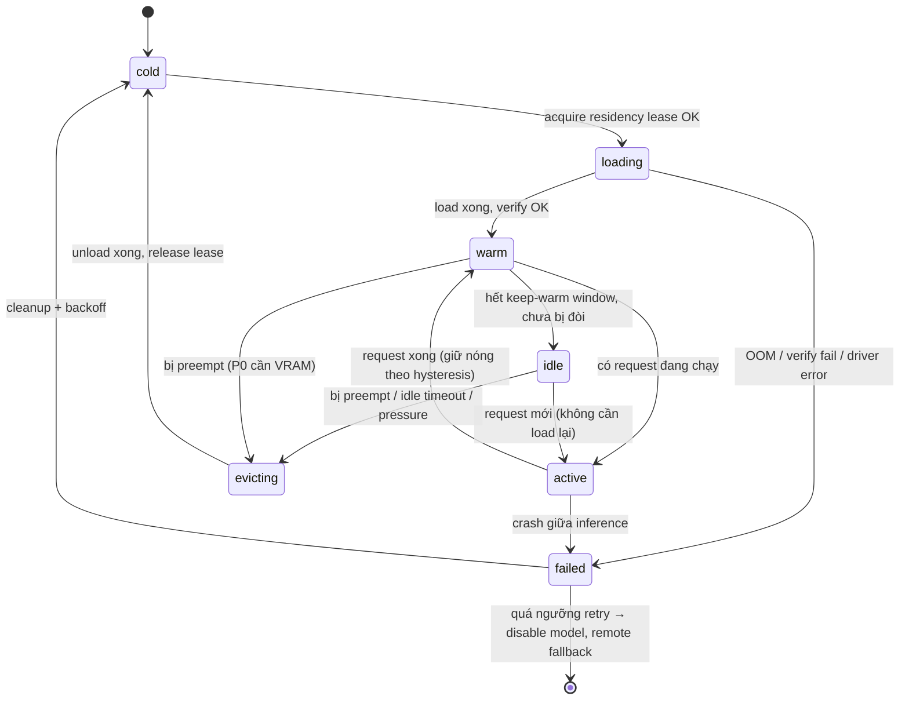
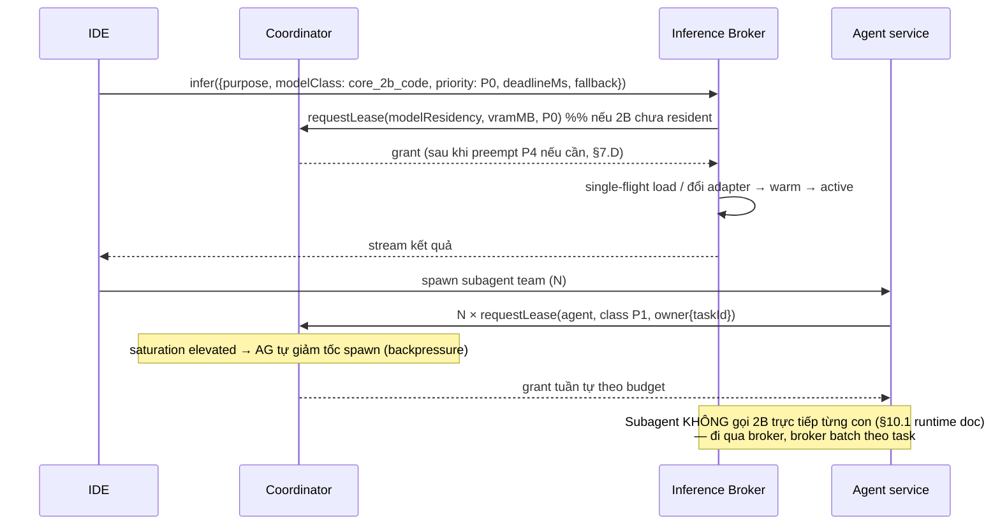
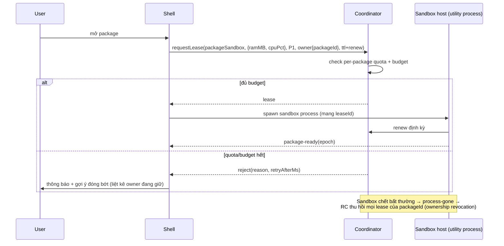

# TomniHubOS — ResourceCoordinator v2 & Transition Design

> **Trạng thái:** Production technical design — chưa sửa code.
> **Vai trò tài liệu:** đặc tả kiến trúc cho ResourceCoordinator thế hệ 2 (đa chiều tài nguyên, model residency, preemption) và pipeline chuyển tab của shell.
> **Tài liệu liên quan:**
> - `docs/prds/feature-packs/tomni-local-core-model-runtime-design.md` (§13 Local Inference Broker, §14 quyết định 0.8B, §21 Model Adapter Pack)
> - `.kiro/specs/tomni-security-core/design.md` (0.8B là classifier tùy chọn, lease đi qua adapter của Tab 1)
> - `.claude/skills/performance/SKILL.md`
> - Mã nguồn hiện tại: `packages/desktop/src/process/resource/`
>
> **Quy ước bắt buộc của tài liệu:**
> - Mọi mục gắn nhãn **[CURRENT]** là sự thật đã có trong code tại thời điểm viết (2026-07-26, branch `codex/hub-os-home`).
> - Mọi mục gắn nhãn **[TARGET]** là thiết kế đích, chưa tồn tại.
> - Mọi con số latency/dung lượng trong tài liệu là **ước lượng công thức hoặc mục tiêu cần đo trên máy sàn** — chưa có benchmark nào được chạy. Không được trích các số này như kết quả đo.

---

## 1. Phạm vi và ràng buộc sản phẩm

ResourceCoordinator phải phục vụ một Electron desktop chạy dài hạn (nhiều ngày không restart) trên máy sàn **16 GB RAM, RTX 3050 4 GB VRAM**, đồng thời:

- Security adapter **0.8B** (classifier tùy chọn của Security Core — quyết định cuối vẫn thuộc backend deterministic) và **ba adapter 2B** (một base model 2B, nhiều adapter/contract theo §6.3 runtime doc).
- Local model, remote model, MCP server (stdio + streamable HTTP), browser agent, agent team.
- Package chạy trong sandbox (utility process / WebContentsView bị cô lập).
- IDE, Store, Chat và nhiều app/package mở đồng thời.
- Training/benchmark chạy nền **an toàn** — không bao giờ làm UI mất phản hồi.
- Chuyển tab nhẹ, phản hồi nhanh, không giật giao diện.

**Bất biến sản phẩm (không thương lượng):**

1. Shell luôn phản hồi trước mọi thứ khác (interactive-first).
2. Không giả định nhiều model 2B nằm trong VRAM cùng lúc trên máy sàn.
3. Security gate không bị hạ để đạt tốc độ; 0.8B fail-closed theo spec security-core.
4. Training/benchmark luôn là công dân hạng preemptable.
5. Mọi tác vụ nặng phải qua lease — không có đường vòng (giữ nguyên nguyên tắc criterion 5.9 hiện tại).

---

## 2. Current truth — những gì đã có trong code **[CURRENT]**

Đọc từ `packages/desktop/src/process/resource/`:

| Thành phần | Hiện trạng |
| --- | --- |
| `resourceCoordinator.ts` | Lease gate ở Main process. Grant ngay nếu vừa budget, ngược lại xếp hàng theo priority (−100..100) + aging boost (30 s/bậc). Hỗ trợ `deadlineAt` (chỉ cho thời gian **chờ trong queue**), `cancelQueuedRequest`, idle hook per-kind (suspend sau 5 phút idle), Tier B self-balancing loop (sample CPU load + free RAM → pressure `healthy/constrained/critical` → co giãn effective concurrency), persist `resource-state.json`. |
| `leaseTypes.ts` | `TaskKind` = `agent, browser, emulator, windowsTest, patchBuild, ocr, transcription, docConvert, semanticIndex`. Budget = `maxConcurrent` per-kind + `maxTotalMemoryMB` + `reserveForUserMB`. Lease chỉ mang `estCostMB` (RAM một chiều). `MachineProfile` = totalMemMB, cpuCores, `hasDiscreteGPU: boolean`, freeDiskMB. |
| `lifecycleResource.ts` | Pool lifecycle chung cho `package`/`tab`: `cold → prewarming → warm → active → suspended → evicted`, warm LRU (mặc định 3), phản ứng pressure, abort/deadline cho activation. Tự nhận là resource-agnostic, "makes no GPU capability claims". |
| `balancePolicy.ts` | Tier A preset (`saver/balanced/performance`) suy từ MachineProfile; Tier B rule engine điều chỉnh budget có lý do, có persist history. |
| `resourceBridge.ts` | IPC bridge cho renderer dashboard. |
| Test | Unit + property test với fake scheduler/probe/sampler (mọi nguồn phi tất định đều inject được). |

**Khoảng trống so với yêu cầu (căn cứ để ra thiết kế v2):**

1. **Tài nguyên một chiều:** chỉ RAM (MB) + concurrency per-kind. Không có VRAM, CPU %, disk I/O, network, thermal.
2. **Không có TaskKind cho inference/model/training** — Local Inference Broker (§13 runtime doc) mới chỉ là thiết kế trên giấy, chưa có dòng code nào (không có runtime gguf/llama trong `src/`).
3. **Lease không có thời hạn sống:** `deadlineAt` chỉ áp cho chờ queue; lease đã cấp giữ vô hạn → holder crash mà không release sẽ rò budget đến khi restart Main.
4. **Không có ownership:** lease không biết ai giữ (process nào, package nào) → không thu hồi được khi sandbox chết, không quota theo owner.
5. **Không có reservation, không có preemption:** hàng đợi chỉ chờ thụ động; không có cơ chế "đòi lại" tài nguyên từ tác vụ nền.
6. **Priority là số thô** (−100..100) do caller tự đặt — không có priority class chuẩn hóa, không chống được caller tự phong P0.
7. **MachineProfile không biết dung lượng VRAM**, chỉ biết có/không dGPU.
8. **Backpressure** chỉ là queue đầy thì throw `ResourceQueueFullError` — chưa có tín hiệu chủ động cho producer (agent team spawner, prefetcher).

Thiết kế v2 dưới đây là **mở rộng tương thích** (additive) trên nền này, không viết lại: mô hình lease/queue/pressure/persistence hiện tại được giữ làm lõi, `estCostMB` trở thành một chiều trong vector chi phí.

---

## 3. Bao thư phần cứng máy sàn — ước lượng làm việc **[TARGET, cần đo]**

Các con số sau là **công thức ước lượng để định cỡ thiết kế**, phải được xác nhận bằng micro-benchmark ở §8.2 runtime doc trước khi khóa:

**VRAM (RTX 3050 4 096 MB):**

- Windows DWM + compositor Electron chiếm VRAM trước (thường vài trăm MB, biến thiên theo số màn hình/tab).
- CUDA/DirectML context + phân mảnh allocator: dự phòng 300–600 MB.
- 2B quantized (Q4 nhóm) ước ~1.1–1.5 GB weights + KV cache theo context length (vài trăm MB ở 4k ctx).
- ⇒ **Ngân sách làm việc: đúng 1 model lớp 2B resident trên GPU tại một thời điểm.** 0.8B (~0.5–0.8 GB Q4) *có thể* vừa cạnh 2B nhưng **không được cam kết**; mặc định 0.8B đi **CPU path ổn định** (đúng khuyến nghị §13.3 runtime doc), chỉ thăng hạng lên GPU khi đo được headroom thật.
- Ba "adapter 2B" là ba contract trên **một base 2B** (§6.3 runtime doc) → chuyển adapter là chuyển LoRA/prompt-contract, **không** phải load ba bộ weights. Đây là lý do kiến trúc chịu được máy sàn.

**RAM (16 384 MB):**

- Windows + dịch vụ nền: ~3–4 GB. Electron shell + vài renderer: ~1.5–3 GB.
- `reserveForUserMB` (đã có) phải giữ tối thiểu ~3 GB.
- ⇒ Ngân sách heavy-task khả dụng ~6–8 GB: đủ cho 0.8B CPU-resident (~1 GB kể cả runtime) + mmap weights 2B (đường unload GPU→RAM) + agent team + sandbox package, **không** đủ cho training đồng thời với mọi thứ → training trên máy sàn chỉ chạy khi hệ rảnh và luôn preemptable.

**Thermal:** không có API nhiệt độ đáng tin cậy đa vendor trên Windows. Thermal là **chiều best-effort**: dùng NVML (`nvidia-smi`-equivalent) khi có, nếu không thì proxy bằng sustained-utilization (GPU busy > X% liên tục Y phút → coi như thermal pressure). Không thiết kế hành vi *phụ thuộc* vào số nhiệt độ chính xác.

---

## 4. Mô hình tài nguyên v2 **[TARGET]**

### 4.1 Vector chi phí đa chiều

```ts
// Minh họa contract — không phải code production.
type ResourceVector = {
  ramMB: number;            // bắt buộc — tương thích estCostMB hiện tại
  vramMB?: number;          // 0 nếu không dùng GPU
  cpuPct?: number;          // % của tổng logical cores, ước lượng
  gpuComputePct?: number;   // tách khỏi vramMB: compute và memory là 2 chiều
  diskReadMBps?: number;
  diskWriteMBps?: number;
  netMbps?: number;
};
```

- **Admission** kiểm tra từng chiều: tổng vector của mọi lease active + request ≤ budget của chiều đó. RAM/VRAM là chiều **cứng** (grant = từ chối nếu vượt). CPU/disk/net là chiều **mềm** (dùng để xếp lịch và throttle, không chặn cứng — vì ước lượng kém tin cậy hơn).
- **Thermal không phải chiều trong vector** — nó là **trạng thái pressure** (như `ResourcePressure` hiện tại) làm co `effectiveLimit` và hạ trần `gpuComputePct` của lớp preemptable.
- Trade-off: chiều mềm có thể bị khai man/ước sai → chấp nhận, vì siết cứng CPU% sẽ tạo false-rejection nhiều hơn giá trị; sai lệch được sửa bằng Tier B đo thực tế (đã có) thay vì tin ước lượng.

### 4.2 Priority class — thay số thô bằng lớp chuẩn

| Class | Ý nghĩa | Preemptable? | Ví dụ |
| --- | --- | --- | --- |
| `P0_interactive` | Foreground người dùng đang chờ | Không bao giờ | Tab đang focus, security gate cho hành động foreground, chat đang stream |
| `P1_visible_bg` | Nền nhưng user thấy được | Không | Tab warm không focus, agent user vừa giao việc, browser agent đang chạy có UI |
| `P2_scheduled` | Việc hẹn giờ / job người dùng đặt | Cooperative | Scheduled agent, batch convert |
| `P3_indexing` | Index/embedding/prefetch | Cooperative | semanticIndex, prefetch tab |
| `P4_training` | Training / benchmark | **Bắt buộc** (cooperative + forced) | fine-tune adapter, eval run |
| `P5_maintenance` | Dọn dẹp, compaction, telemetry flush | Forced ngay | GC store, log rotate |

- Class do **service đăng ký ở Main quyết định theo kind + ngữ cảnh**, không cho renderer/package tự khai P0. Package sandbox tối đa được P1 khi visible, P3 khi ẩn.
- Ánh xạ với thứ tự §13.2 runtime doc: *Security foreground* = P0 (nó gate hành động foreground), *user-facing execution* = P0/P1, *User Understanding* = P2/P3, *background consolidation/index/benchmark* = P3–P5.
- Số priority hiện tại (−100..100) giữ làm **tie-breaker trong cùng class**; aging boost hiện có chỉ được nâng trong nội bộ class, không cho P4 già hóa vượt lên P1 (chống starvation ngược: training không bao giờ "già" thành interactive).

### 4.3 Lease v2 — thời hạn, ownership, renewal

```ts
type LeaseOwner = {
  processKind: 'main' | 'renderer' | 'utility' | 'sandbox-package' | 'worker';
  serviceId: string;        // vd 'inference-broker', 'ide.runTarget'
  taskId?: string;          // liên kết Outcome/task đang chạy
  packageId?: string;       // bắt buộc nếu processKind = sandbox-package
};

type LeaseRequestV2 = {
  kind: TaskKind;                    // mở rộng, xem 4.6
  cost: ResourceVector;
  class: PriorityClass;
  owner: LeaseOwner;
  ttlMs: number;                     // thời hạn sống của lease
  renewable: boolean;                // holder phải gia hạn trước khi hết hạn
  preemptable?: boolean;             // bắt buộc true với P4/P5
  deadlineAt?: number;               // deadline chờ queue (giữ nguyên semantics cũ)
  reservationId?: string;            // tiêu thụ reservation đã giữ trước
  requestId?: string;
};
```

- **TTL + renew (heartbeat):** lease hết hạn mà không renew → coordinator thu hồi, trả budget, phát sự kiện `lease-expired` cho owner. Đây là lưới an toàn chống rò budget khi holder treo/crash — khoảng trống số 3 ở §2. TTL gợi ý: 30 s cho inference request, 5 phút cho model residency, 10 phút cho training slice (renew mỗi ¼ TTL).
- **Ownership-based revocation:** khi utility process/sandbox package chết (Main nhận `child-process-gone` / exit event), coordinator thu hồi **mọi lease của owner đó** ngay lập tức, không đợi TTL.
- **Per-owner quota:** trần vector theo `packageId`/`serviceId` (ví dụ: một package sandbox không được giữ quá X MB RAM tổng, một agent team không giữ quá N lease `agent`). Chống một package độc chiếm.
- Trade-off: renew tạo chatter IPC định kỳ; đổi lại loại bỏ được lớp lỗi "orphan lease" vốn chỉ phát hiện được bằng restart. Chu kỳ renew ≥ 7.5 s nên chi phí không đáng kể.

### 4.4 Reservation

- `reserve(cost, class, ttlMs) → reservationId`: giữ chỗ **chưa tiêu** trong budget, để chuỗi hành động nhiều bước không bị chen ngang giữa chừng (ví dụ: chuyển tab IDE cần renderer + lease model kế tiếp; broker cần giữ VRAM trước khi bắt đầu load 20 s).
- Reservation có TTL ngắn (mặc định 10 s, tối đa 60 s), không renew được quá 3 lần → chống giữ chỗ ma.
- **Headroom tĩnh cho P0:** budget luôn cắt sẵn một lát interactive headroom (ví dụ 512 MB RAM + toàn quyền preempt VRAM) mà P2–P5 không bao giờ được lấp đầy. Đây là dạng reservation vĩnh viễn của hệ thống, kế thừa tinh thần `reserveForUserMB` hiện có và mở rộng sang VRAM.

### 4.5 Admission control, backpressure, cancellation, preemption

**Admission (thứ tự kiểm tra):**

```text
request → chuẩn hóa class (server-side) → check per-owner quota
        → check chiều cứng (RAM, VRAM) với headroom P0
        → đủ: grant  |  thiếu: class ≤ P1 → thử preempt P4/P5 (4.5.d)
                     |  vẫn thiếu: queue theo (class, priority, enqueuedAt)
        → queue đầy hoặc quota vượt: reject có mã lý do + retryAfterMs
```

**Backpressure (chủ động, thay vì chỉ throw khi đầy):**

- Coordinator publish `saturation ∈ {ok, elevated, saturated}` per-kind (suy từ queue depth + wait p95 trượt). 
- Producer bắt buộc đăng ký phản ứng: agent-team spawner giảm tốc độ đẻ subagent khi `elevated`, dừng đẻ khi `saturated`; prefetcher tab tắt hẳn khi `elevated`; broker chuyển các request P2+ sang `fallback` (cached/remote/abstain — đúng contract §13.1).
- Reject luôn kèm `reason` machine-readable (`quota-owner`, `vram-ceiling`, `queue-full`, …) + `retryAfterMs` để caller không retry-bão.

**Cancellation:**

- Giữ `cancelQueuedRequest` hiện có; thêm `AbortSignal` xuyên suốt: hủy khi còn trong queue → gỡ khỏi queue (đã có); hủy khi đã grant → holder phải release trong grace 2 s, quá hạn coordinator cưỡng chế thu hồi và đánh dấu owner `unreliable` (ảnh hưởng quota mềm).
- Mọi tác vụ gắn tab mang `tabEpoch` (xem §6) — chuyển tab làm tăng epoch, tự động abort toàn bộ tác vụ epoch cũ.

**Preemption (hai pha):**

1. **Cooperative:** coordinator gọi `onPreempt(graceMs)` trên lease preemptable, ưu tiên nạn nhân theo (class thấp nhất → chi phí giải phóng nhỏ nhất → LRU). Holder checkpoint và release. Grace mặc định: P5 = 0 s (thu ngay), P4 = 10 s (đủ để training checkpoint một step + flush), P3/P2 = 5 s.
2. **Forced:** quá grace → thu hồi lease; nếu holder là utility/sandbox process thì kill process (an toàn vì P4/P5 bắt buộc thiết kế resumable-from-checkpoint).

- **Không bao giờ preempt P0/P1.** Nếu P0 vẫn thiếu tài nguyên sau khi vét sạch P2–P5 → đây là tình huống degrade UX có kiểm soát (§7 kịch bản E), không phải preempt lẫn nhau trong lớp interactive.
- Trade-off: forced-kill yêu cầu mọi training job phải checkpoint được — đây là ràng buộc đặt lên trainer workstream (§21.9 runtime doc), đổi lấy cam kết tuyệt đối "training không bao giờ ghim GPU quá graceMs khi user cần".

### 4.6 Mở rộng TaskKind **[TARGET]**

Thêm (không đổi kind cũ): `modelResidency` (giữ model trong RAM/VRAM), `inference` (một request suy luận), `training`, `benchmark`, `mcpServer` (headless MCP background service), `packageSandbox`, `prefetch`. Mỗi kind mới có default class và trần quota riêng trong preset.

---

## 5. Vòng đời model & Local Inference Broker **[TARGET]**

Broker là **client đặc quyền duy nhất** của coordinator cho VRAM (đúng §13 runtime doc: "Ba core không được tự load/unload model"). Không service nào khác được xin `vramMB > 0`.

### 5.1 State machine residency (per model instance)



Ghi chú:

- `active` **không bao giờ bị preempt giữa request** — đơn vị preempt là ranh giới request (inference 2B tính bằng giây; chờ được). Riêng training (không phải residency thường) preempt theo checkpoint như §4.5.
- **Placement là thuộc tính trực giao với state:** `device ∈ {gpu, cpu, remote}`. Chuyển GPU→CPU là `evicting(gpu)` + `loading(cpu)` (hoặc giữ mmap weights trong RAM để đường này rẻ). 0.8B security mặc định `cpu` cố định.

### 5.2 Chính sách residency trên máy sàn

- **Một slot GPU cho lớp 2B** (theo §3). Ba adapter 2B chia nhau slot bằng cách **đổi adapter, không đổi base weights** — chi phí chuyển adapter phải được benchmark; nếu ≪ chi phí load base thì coi như miễn phí trong xếp lịch.
- **Hysteresis chống thrashing** (hiện thực hóa §13.3):
  - Keep-warm window: sau request cuối, 2B giữ `warm` tối thiểu T_warm (đề xuất khởi điểm 60 s, tune bằng dữ liệu `model_swap_count/task`).
  - Min-residency: đã load thì không bị evict bởi request **ngang class** trong T_min (đề xuất 15 s) — chỉ P0 mới phá được.
  - Swap-cost gate: trước khi swap, broker so `ước_lượng_lợi_ích (deadline đạt được)` với `chi_phí_swap (load time đo được)`; nếu fallback (CPU path, cached projection, remote) thỏa deadline thì **không swap** — đúng nguyên tắc "không để swap cost lớn hơn lợi ích".
  - Trần `residency_transition` per-task (đề xuất 2) — quá trần thì task đó bị ghim vào một placement.
- **Giữ nóng khi nào:** 2B ở `warm/idle` chừng nào không ai đòi VRAM và không có pressure; đây là mặc định vì máy sàn chỉ có 1 slot, thời gian load lại là chi phí UX lớn nhất.
- **Unload khi nào:** (a) P0/P1 cần VRAM cho việc khác (hiếm — chỉ browser agent GPU-heavy hoặc training được user promote); (b) thermal/VRAM pressure `critical`; (c) idle quá T_idle (đề xuất 10 phút) **và** RAM đủ để giữ mmap weights làm warm-on-CPU.
- **Chuyển CPU:** chỉ cho 0.8B (mặc định) và cho 2B khi GPU mất (driver reset) hoặc bị chiếm — 2B trên CPU máy sàn được coi là **degraded, chỉ phục vụ P2+**; P0/P1 khi mất GPU đi thẳng remote fallback (nếu policy cho phép) hoặc abstain theo contract `fallback` của request.
- **Remote fallback:** luôn qua security egress gate (không tắt vì lý do tốc độ); request contract bắt buộc khai `fallback` (§13.1) nên caller không bao giờ bị treo vô hạn vì thiếu model.

### 5.3 Chống hai tác vụ giành VRAM

- **Single-flight loader per device:** mọi transition `loading/evicting` trên một device đi qua một mutex duy nhất trong broker; không bao giờ có hai load song song trên cùng GPU.
- Load chỉ bắt đầu **sau khi** lease `modelResidency(vramMB)` đã được grant (reservation trước, load sau) — loại trừ race "hai bên cùng thấy VRAM trống rồi cùng cấp phát".
- Mọi kẻ xin VRAM khác broker bị từ chối ở admission (chỉ broker có capability xin `vramMB`). Browser/WebGL của package sandbox không đi qua ngân sách VRAM (Chromium tự quản) — chấp nhận **sai số không kiểm soát được** này bằng cách: đặt trần VRAM cho broker thấp hơn VRAM vật lý (ví dụ chỉ lập ngân sách 70–80% VRAM đo được lúc probe) và đo lại VRAM thực tế mỗi tick Tier B để co ngân sách khi compositor/pkg ăn nhiều hơn dự kiến. Trade-off: bỏ phí một phần VRAM để đổi lấy an toàn OOM.

### 5.4 Xử lý sự cố

| Sự cố | Phát hiện | Phản ứng |
| --- | --- | --- |
| CUDA/driver OOM khi load | lỗi từ runtime | `failed` → hạ context length / quant preset một nấc → retry 1 lần → vẫn fail: co ngân sách VRAM (ghi adjustment có reason, cơ chế Tier B sẵn có), placement CPU/remote |
| OOM giữa inference | crash worker | ownership revocation tự trả lease; request retry theo `fallback` contract; model `failed` với backoff lũy tiến; quá N=3 lần/giờ → disable model, bật remote-first, báo user |
| Driver reset (TDR) | mọi handle GPU chết đồng loạt | broker coi GPU `offline`, toàn bộ residency → `cold`; re-probe GPU sau backoff; trong lúc đó 0.8B vẫn sống (CPU), 2B đi remote/CPU-degraded |
| RAM thấp (Windows memory pressure) | sampler hiện có + commit-charge; cân nhắc `QueryMemoryResourceNotification` (best-effort) | pressure `critical` (cơ chế sẵn có) → thêm hành vi mới: evict warm LRU của lifecycle pool, drop mmap warm-on-CPU weights, từ chối admission P3+ với `retryAfterMs` |
| Thermal proxy vượt ngưỡng | NVML nếu có / sustained-utilization | hạ `gpuComputePct` trần của P2+ về 0 (P4 pause theo checkpoint), giữ P0/P1; không bao giờ tắt security gate |

---

## 6. Chuyển tab & UX pipeline **[TARGET]**

Nền tảng: `LifecycleResourcePool` hiện có (`cold/prewarming/warm/active/suspended/evicted`, warm LRU) được giữ nguyên làm state machine tab; phần dưới đây bổ sung **giao thức readiness** và **kỷ luật render** phía renderer.

### 6.1 Nguyên tắc

1. **Shell phản hồi trước:** thao tác chuyển tab được xác nhận trên UI (highlight tab, khung mới) trong cùng frame; mọi việc nặng xảy ra sau, ngoài luồng input.
2. **Snapshot phần an toàn:** khi tab rời `active`, renderer chụp snapshot khung nhìn (bitmap hoặc DOM state đã serialize) **chỉ chứa nội dung không nhạy cảm** — vùng bị security đánh dấu (secret, nội dung chưa qua gate) bị mask trước khi chụp. Snapshot dùng làm first paint khi quay lại → cảm giác tức thời mà không giữ renderer sống.
3. **Prefetch có ngân sách:** prefetcher xin lease `prefetch` class P3, chỉ chạy khi `saturation = ok` và pressure `healthy`; dự đoán đơn giản (tab kề, tab hay dùng theo giờ). Bị hủy không điều kiện khi có input người dùng.
4. **Readiness/FMP handshake:** tab chỉ được coi "đã mở" khi renderer của nó gửi `tab-ready(epoch, fmpAt)` — nghĩa là first meaningful paint thật đã commit. Trước đó shell hiển thị snapshot cũ hoặc skeleton. Không dùng timeout giả làm ready.
5. **Skeleton đúng footprint:** skeleton sinh từ layout manifest của tab (kích thước vùng chính đã biết từ lần render trước, persist theo tab) → không layout shift khi nội dung thật vào. Skeleton **tĩnh** (không shimmer lặp vô hạn); chỉ một progress indicator, và chỉ xuất hiện nếu chờ vượt 200 ms (tránh nháy), tuân thủ `prefers-reduced-motion`.
6. **Epoch chống stale:** mỗi lần chuyển tab tăng `tabEpoch`. Mọi kết quả async (data fetch, inference, agent event) mang epoch lúc phát; renderer drop mọi kết quả `epoch < current`. Tác vụ thuộc epoch cũ bị abort qua AbortSignal (§4.5) — hủy thật, không chỉ bỏ kết quả.

### 6.2 Target latency — **mục tiêu cần đo, không phải số đã benchmark**

| Chỉ số (máy sàn) | Mục tiêu đề xuất |
| --- | --- |
| Input→shell phản hồi (tab highlight) | p95 ≤ 100 ms |
| Chuyển sang tab **warm**: snapshot/nội dung hiển thị | p95 ≤ 300 ms |
| Chuyển sang tab **cold**: skeleton đúng footprint | p95 ≤ 400 ms |
| Tab cold → `tab-ready` (FMP thật) | p95 ≤ 2 500 ms |
| Frame drop trên shell khi có training nền | 0 frame > 32 ms do tranh chấp tài nguyên (đo bằng frame timing) |

Các mục tiêu này là đầu vào cho benchmark §10; sau vòng đo đầu tiên chúng được hiệu chỉnh và chỉ khi đó mới trở thành SLO chính thức.

---

## 7. State machine & sequence diagram cho sáu kịch bản **[TARGET]**

### 7.A Chuyển Home → IDE

```mermaid
sequenceDiagram
    participant U as User
    participant Shell as Shell (renderer)
    participant RC as ResourceCoordinator (main)
    participant IDE as IDE tab runtime

    U->>Shell: click tab IDE
    Shell->>Shell: epoch++ ; highlight tab (cùng frame)
    Shell->>Shell: hiển thị snapshot IDE (nếu có) / skeleton đúng footprint
    Shell->>RC: activateLifecycleResource('tab:ide', {signal(epoch)})
    Note over RC: Home: active → warm (vào warm LRU)<br/>IDE: cold|warm → active (lease P0)
    RC-->>IDE: activate hook (load state, mount)
    IDE->>IDE: render nội dung thật
    IDE-->>Shell: tab-ready(epoch, fmpAt)
    Shell->>Shell: swap snapshot/skeleton → live (không layout shift)
    Note over Shell,RC: Tác vụ epoch cũ của Home bị abort;<br/>prefetcher tạm dừng đến khi tab-ready
```

### 7.B IDE gọi model và tạo subagent



### 7.C Mở app package trong sandbox



### 7.D Training đang chạy, người dùng mở tác vụ tương tác

```mermaid
sequenceDiagram
    participant U as User
    participant Shell
    participant RC as Coordinator
    participant TR as Training job (P4, preemptable)
    participant BK as Broker

    Note over TR: đang giữ GPU compute + VRAM (lease P4, checkpoint-able)
    U->>Shell: mở Chat, gọi model (P0)
    Shell->>BK: infer(P0, deadlineMs)
    BK->>RC: requestLease(modelResidency, vramMB, P0)
    RC->>TR: onPreempt(graceMs = 10s)
    TR->>TR: checkpoint step hiện tại + flush
    TR->>RC: releaseLease
    alt quá grace
        RC->>TR: forced revoke (kill worker — resumable từ checkpoint)
    end
    RC-->>BK: grant → load/activate 2B → trả lời user
    Note over RC,TR: Training vào queue P4; chỉ resume khi<br/>pressure healthy + không có P0/P1 chờ + hysteresis T_resume (đề xuất 60s)
```

### 7.E RAM/VRAM đột ngột xuống thấp

```mermaid
sequenceDiagram
    participant OS as OS/GPU
    participant RC as Coordinator (Tier B tick)
    participant LP as Lifecycle pool
    participant BK as Broker

    OS-->>RC: sample: freeMem thấp / VRAM đo được co lại
    RC->>RC: pressure := critical (cơ chế sẵn có)
    RC->>RC: admission: từ chối P3+ (retryAfterMs), effectiveLimit co về 1
    RC->>LP: handlePressure(critical) → evict warm LRU, suspend tab ẩn
    RC->>BK: co ngân sách VRAM → BK evict idle/warm model,<br/>drop mmap weights, giữ đúng model đang active P0/P1
    RC->>RC: preempt toàn bộ P4/P5 (cooperative → forced)
    Note over RC: P0/P1 không bị đụng; nếu vẫn thiếu →<br/>degrade có kiểm soát: model → remote/abstain theo fallback contract,<br/>thông báo user với reason (không silent)
    OS-->>RC: sample hồi phục → nới dần theo hysteresis (không bật lại ồ ạt)
```

### 7.F Package hoặc model crash

```mermaid
sequenceDiagram
    participant SB as Sandbox/model worker
    participant Main as Main process
    participant RC as Coordinator
    participant BK as Broker
    participant Shell

    SB--xMain: process-gone / runtime error
    Main->>RC: ownerCrashed(owner)
    RC->>RC: thu hồi mọi lease của owner, trả budget, drainQueue
    alt là model worker
        RC->>BK: notify → residency failed → backoff (1s,5s,30s)
        BK->>BK: retry ≤ 3/giờ; quá ngưỡng → disable model,<br/>remote-first, in-flight request chạy fallback contract
    else là package
        Shell->>Shell: tab package → trạng thái crashed (giữ khung, không sập shell)
        Shell->>Shell: đề nghị user restart package (không auto-restart quá 2 lần/10 phút)
    end
    Note over RC: Mọi thu hồi ghi telemetry reason — không rò payload
```

---

## 8. API / Contract đề xuất **[TARGET]**

Nguyên tắc: **additive trên `IResourceCoordinator` hiện tại** — API cũ giữ nguyên cho caller cũ; `estCostMB` được map nội bộ thành `cost.ramMB`, priority số thô map vào class mặc định của kind.

```ts
// Minh họa contract — không phải code production.
type IResourceCoordinatorV2 = IResourceCoordinator & {
  requestLeaseV2(req: LeaseRequestV2): Promise<LeaseV2>;
  reserve(cost: ResourceVector, cls: PriorityClass, ttlMs: number): Promise<Reservation>;
  renewLease(id: string): void;                       // heartbeat
  ownerCrashed(owner: LeaseOwner): void;              // Main gọi khi process-gone
  onSaturationChange(kind: TaskKind, cb: (s: Saturation) => void): () => void;
  getBudgetV2(): MultiDimBudget;                      // per-dimension, per-class headroom
};

type LeaseV2 = Lease & {
  expiresAt: number;
  onPreempt(cb: (graceMs: number) => Promise<void>): void;
  release(): void;
};

// Broker — client đặc quyền duy nhất cho vramMB
type IInferenceBroker = {
  infer(req: InferRequest): AsyncIterable<InferChunk>;  // stream, abortable
  getResidency(): ResidencySnapshot;                    // cho dashboard
  onResidencyChange(cb: (s: ResidencySnapshot) => void): () => void;
};

type InferRequest = {
  purpose: string;                     // vd 'user_preference_reasoning'
  modelClass: 'security_0_8b' | 'core_2b' | 'remote';
  adapterId?: string;                  // một trong ba contract 2B
  priority: PriorityClass;
  deadlineMs: number;
  allowedDevices: Array<'gpu' | 'cpu' | 'remote'>;
  fallback: 'cached_projection' | 'remote' | 'abstain' | 'fail';
  estTokens?: { in: number; out: number };
  tabEpoch?: number;                   // drop/abort khi stale
  signal?: AbortSignal;
};
```

Ràng buộc contract:

- Renderer/package **không bao giờ** gọi coordinator trực tiếp — chỉ qua preload bridge (`resourceBridge` mở rộng), và bridge cắt bớt quyền: sandbox package không gọi được `requestLeaseV2` với `vramMB`, không tự chọn class > P1.
- Security core xin lease qua adapter Tab 1 sở hữu (đúng spec security-core) — coordinator không nhận request trực tiếp từ security module.
- Mọi reject/revoke đều có `code` ổn định để test và UI hiển thị lý do thật.

---

## 9. Telemetry không rò dữ liệu **[TARGET]**

**Quy tắc cứng:**

1. Telemetry chỉ chứa: số đo, enum, mã lý do, id **đã hash** (taskId/packageId hash cục bộ với salt per-install). Không bao giờ chứa prompt, payload, tên file, đường dẫn, URL, nội dung snapshot.
2. Local-first: ghi ring buffer cục bộ (giới hạn dung lượng, tự xoay vòng). Export ra ngoài máy chỉ khi user opt-in, và chỉ **aggregate** (histogram/counter), đi qua chính security egress gate như mọi outbound khác.
3. Snapshot tab (§6.1) không phải telemetry và không bao giờ rời máy.

**Metric tối thiểu (khớp §13.4 runtime doc + bổ sung):**

- Coordinator: `lease_grant_wait_ms{kind,class}` p50/p95, `lease_expired_total`, `owner_revoked_total`, `preempt_total{cooperative|forced}`, `preempt_grace_honored_ratio`, `queue_depth{kind}`, `admission_reject_total{reason}`, `budget_adjustment_total{reason}`.
- Broker: `model_load_count/task`, `model_swap_count/task`, `residency_wait_p95`, `security_gate_wait_p95`, `peak_vram`, `cpu_fallback_rate`, `external_fallback_rate`, `queue_wait/compute_time`, `adapter_switch_ms`.
- UX: `input_latency_p95`, `frame_time_p95` (và số frame > 32 ms), `tab_switch_to_snapshot_ms`, `tab_switch_to_ready_ms{warm|cold}`, `stale_result_dropped_total`.
- Hệ: `pressure_state_seconds{healthy|constrained|critical}`, `oom_events_total`, `driver_reset_total`, `thermal_proxy_trip_total`.

---

## 10. SLO đề xuất & benchmark cần chạy **[TARGET — tất cả là mục tiêu cần đo]**

SLO chỉ được **khóa sau vòng benchmark đầu tiên** trên đúng máy sàn; bảng dưới là giá trị khởi thảo:

| SLO | Mục tiêu khởi thảo |
| --- | --- |
| Shell input response | p95 ≤ 100 ms, kể cả khi training nền |
| Tab switch (bảng §6.2) | như §6.2 |
| 2B warm first-token (P0) | p95 ≤ 1 500 ms (khớp deadlineMs ví dụ §13.1) |
| 2B cold-load (máy sàn) | đo để biết — đây là input cho T_warm/T_min, không đặt mục tiêu trước |
| Preempt P4 → P0 có tài nguyên | p95 ≤ grace 10 s + load; đo tách hai pha |
| Lease orphan sau crash | 100% thu hồi ≤ 1 s (ownership) hoặc ≤ TTL (treo) |
| Soak 72 h | không tăng trưởng RSS đơn điệu ở Main; `lease_expired_total` do bug = 0 |

**Benchmark bắt buộc trước khi khóa thiết kế chi tiết (bổ sung cho §14.6 runtime doc):**

1. Đo VRAM khả dụng thực trên 3050 4 GB khi shell + 3 tab mở (xác nhận ngân sách 70–80%).
2. 2B load time (cold, từ disk nguội và disk cache nóng), adapter switch time, KV cache theo ctx.
3. 0.8B CPU: latency P50/P95 và mức chiếm core khi chạy nền cùng UI — xác nhận CPU path "ổn định".
4. Chi phí snapshot tab (chụp + restore) theo kích thước cửa sổ.
5. Training slice + checkpoint time thực tế → xác nhận grace 10 s là đủ hay phải nới.
6. Ba phương án security (backend-only / +0.8B / +shared-2B) theo đúng ma trận §14.6.

---

## 11. Ma trận máy yếu / trung bình / mạnh **[TARGET]**

| | Dưới sàn (8–12 GB RAM, không dGPU) | **Sàn (16 GB, 4 GB VRAM)** | Trung (32 GB, 8 GB VRAM) | Mạnh (64 GB+, 12–24 GB VRAM) |
| --- | --- | --- | --- | --- |
| 2B residency | Không local 2B; remote-first, degraded mode §9 runtime doc | 1 slot GPU, 3 adapter đổi tại chỗ | 2B pin thường trực + headroom | 2B luôn warm, có thể thêm model phụ |
| 0.8B security | CPU, bật theo kết quả benchmark §14.7 | CPU mặc định | GPU nếu đo được headroom | GPU |
| Đồng trú 0.8B + 2B trên GPU | — | **Không cam kết** | Có | Có |
| Training/benchmark | Không (chỉ cloud) | Chỉ khi idle, P4 preemptable, pause khi pin/thermal | Chạy nền với trần compute % | Đồng thời, trần cao hơn |
| Warm tab LRU | 2 | 3 (mặc định hiện tại) | 5 | 8 |
| Prefetch | Tắt | Chỉ khi `ok` + sạc điện | Bật | Bật |
| Agent team đồng thời | 2 | 4 | 8 | 16 |
| Preset ánh xạ | `saver` | `balanced` | `performance` | `performance+custom` |

Con số concurrency là **giá trị khởi tạo cho preset**, Tier B (sẵn có) tiếp tục tự điều chỉnh theo đo đạc thực tế — ma trận không phải hằng số chết.

---

## 12. Kế hoạch test **[TARGET]**

Tận dụng hạ tầng inject sẵn có (fake scheduler/probe/sampler/store — đã chứng minh trong test hiện tại).

**Unit + property (Vitest, fake clock):**

- Bất biến per-dimension: Σ cost active ≤ budget từng chiều, mọi thời điểm (mở rộng property test 5.4 hiện có sang vector).
- P0 không bao giờ bị preempt; P4 không bao giờ vượt class nhờ aging; headroom P0 không bao giờ bị P2+ lấp.
- TTL: lease không renew → thu hồi đúng hạn, budget trả đủ; renew đúng nhịp → không thu hồi.
- Ownership: `ownerCrashed` trả về đúng toàn bộ lease của owner, không đụng owner khác.
- Reservation: hết TTL tự trả; consume đúng một lần; không double-count với lease sinh ra từ nó.
- Broker: single-flight load (hai infer đồng thời khi cold → đúng 1 load); hysteresis T_min/T_warm; swap-cost gate chọn fallback khi deadline cho phép; epoch stale bị drop.

**Integration (main-process, fake GPU runtime):**

- Sáu kịch bản §7 chạy như test kịch bản end-to-end với fake broker/worker.
- IPC bridge: sandbox package không thể xin vramMB / class > P1 (test quyền ở bridge).
- Crash worker giữa stream → fallback contract thực thi đúng, không treo caller.

**Stress:** 1 000 request dồn vào queue với deadline hỗn hợp; spawn/kill 50 sandbox liên tục; đổi adapter 2B liên tục dưới request P0 — đo không deadlock, không grant vượt budget, wait p95 trong trần.

**Soak:** 72 h mô phỏng bằng fake clock tăng tốc + 24 h thời gian thực trên máy sàn: theo dõi RSS Main, số timer sống, listener leak, `resource-state.json` không phình.

**Failure injection:** ép CUDA alloc fail, driver reset (kill fake GPU), disk full khi persist, sampler trả NaN (đường `sample-invalid` sẵn có), renew bị trễ do event-loop nghẽn (phải không thu hồi oan — cần grace 1 chu kỳ), kill Main giữa transition (khởi động lại phải về trạng thái sạch — active/queued vốn không persist, giữ nguyên hành vi này).

---

## 13. Lộ trình triển khai theo lát cắt, có rollback **[TARGET]**

Mỗi lát sau một feature flag riêng (persist trong resource-state, version hóa schema); **rollback = tắt flag**, không cần migration ngược vì state v2 luôn ghi kèm trường v1 tương thích.

| Lát | Nội dung | Điều kiện ra khỏi lát | Rollback |
| --- | --- | --- | --- |
| **S0 — Shadow accounting** | Probe VRAM thật vào MachineProfile; vector cost ghi nhận **song song** (không enforce); metric mới chạy | 2 tuần dữ liệu shadow: ước lượng vs thực đo lệch < ngưỡng thống nhất | Tắt flag — không hành vi nào thay đổi vì chưa enforce |
| **S1 — Lease v2 lõi** | TTL + renew + ownership revocation + priority class (map từ kind); enforce RAM như cũ | 0 thu hồi oan trong 2 tuần dogfood; orphan lease = 0 sau crash test | Flag off → về requestLease v1 (API v1 chưa từng bị xóa) |
| **S2 — Broker + single residency** | Inference broker sở hữu VRAM, 1 slot 2B + adapter switch, 0.8B CPU, fallback contract | Benchmark §10 mục 1–3 hoàn thành; swap_count/task trong trần | Flag off → model do service gọi trực tiếp như trước khi có broker (tức không local 2B — remote path) |
| **S3 — Preemption + training** | onPreempt hai pha; training P4 checkpoint-able; kịch bản 7.D pass integration | Grace honored ratio ~100% trong stress; input latency SLO giữ được khi training nền | Flag off → training chỉ được chạy khi user bật thủ công và không có model local (chế độ bảo thủ) |
| **S4 — Tab readiness pipeline** | Epoch, tab-ready handshake, snapshot an toàn, skeleton footprint, prefetch P3 | Đo tab_switch metrics 2 tuần; stale_result_dropped hoạt động | Flag off → hành vi tab hiện tại (lifecycle pool vẫn chạy) |
| **S5 — Chiều mềm + thermal** | cpuPct/disk/net soft scheduling; thermal proxy co P2+ | Không tăng false-reject; thermal trip không đụng P0/P1 | Flag off từng chiều độc lập |

Thứ tự cố ý: **an toàn trước, tốc độ sau** — S1 (chống rò) đi trước S2 (model), S3 (preempt) đi trước S4 (UX polish), vì UX mượt trên nền accounting sai là nợ không trả được.

---

## 14. Sổ trade-off

| Quyết định | Phương án bị loại | Trade-off chấp nhận |
| --- | --- | --- |
| RAM/VRAM chặn cứng, CPU/disk/net mềm | Chặn cứng mọi chiều | Chiều mềm có thể bị ước sai → bù bằng Tier B đo thực; đổi lấy ít false-reject |
| Ngân sách VRAM 70–80% giá trị đo | Lập ngân sách 100% VRAM | Bỏ phí VRAM để hấp thụ phần Chromium/compositor không kiểm soát được — chống OOM quan trọng hơn tận dụng |
| 1 slot 2B + đổi adapter | Nhiều 2B đồng trú | Chuyển adapter có chi phí; nghiêm cấm giả định đồng trú trên máy sàn — đúng ràng buộc đề bài |
| 0.8B mặc định CPU | 0.8B GPU cạnh 2B | Latency 0.8B cao hơn trên CPU (cần đo §10.3) — đổi lấy tính dự đoán được của slot GPU và đúng khuyến nghị runtime doc |
| Preempt theo ranh giới request/checkpoint | Preempt tức thời (kill ngay) | P0 có thể chờ tối đa grace (10 s) trong tình huống xấu nhất — đổi lấy không mất dữ liệu training và không corrupt state; UX che bằng skeleton + fallback remote |
| TTL + renew heartbeat | Chỉ dựa process-gone event | IPC chatter định kỳ; nhưng process-gone không bắt được treo-mà-không-chết |
| Class do server gán | Caller tự khai class | Kém linh hoạt cho caller đặc biệt → mở whitelist per-service khi có nhu cầu thật |
| Telemetry aggregate-only khi export | Export sự kiện thô | Mất khả năng debug từ xa theo sự kiện — chấp nhận vì local-first là cam kết sản phẩm |
| Doc đặt tại `docs/prds/feature-packs/` (đã 12 file > giới hạn 10) | Tạo thư mục mới | Nợ cấu trúc ghi nhận: cần một PR tách `docs/prds/feature-packs/` theo chủ đề (không thuộc phạm vi tài liệu này) |

## 15. Câu hỏi mở

1. Runtime inference cụ thể (llama.cpp / ONNX Runtime / DirectML?) — quyết định thuộc backend workstream §21.7 runtime doc; thiết kế này chỉ ràng buộc contract broker.
2. `QueryMemoryResourceNotification` và NVML có đáng thêm native dependency không, hay polling `os` + `nvidia-smi` process là đủ? (đánh giá ở S5).
3. Snapshot tab: bitmap (rẻ, mờ khi resize) hay serialized DOM state (đắt, sắc nét)? — cần benchmark §10.4 trước khi chọn.
4. Grace 10 s cho training có đủ với dataset/optimizer thực tế không — chờ số đo §10.5.
5. Chính sách battery/AC cho laptop (ngoài phạm vi máy sàn desktop nhưng sẽ đến sớm).
