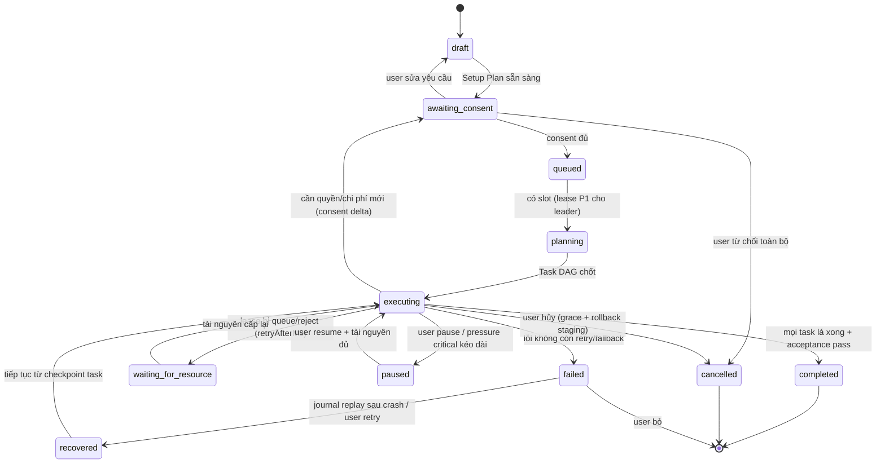
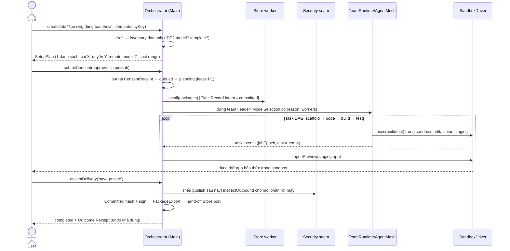
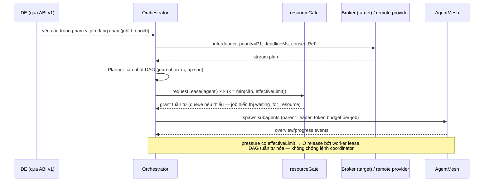
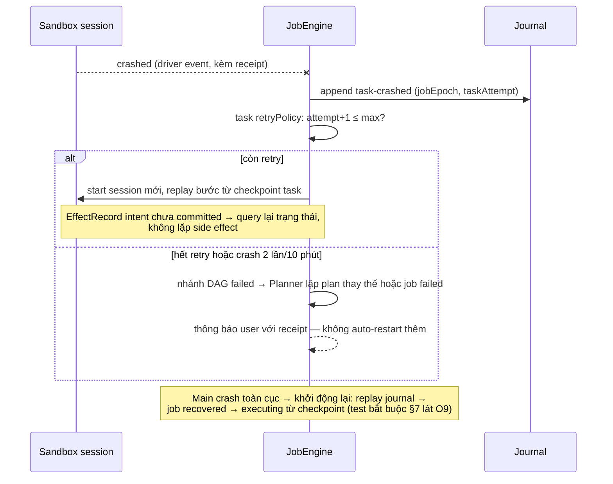
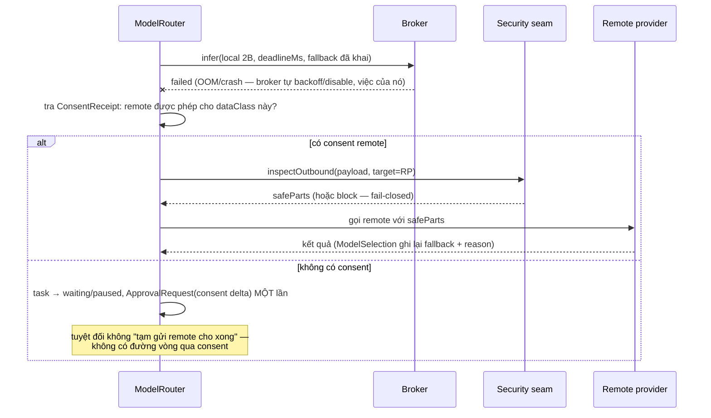

# TomniHubOS — Agent Orchestrator & Workflow Runtime Design

> **Trạng thái:** Production technical design — chưa sửa code, chưa sửa UI.
> **Ngày khảo sát workspace:** 2026-07-26, branch `codex/hub-os-home` (working tree có thay đổi song song chưa commit — xem §1.3).
> **Vị trí tài liệu:** `docs/prds/teams/` — chọn vì `docs/prds/feature-packs/` (12 mục) và `docs/prds/` gốc (11 mục) đều đã vượt giới hạn 10 mục/thư mục; `docs/prds/teams/` còn 1 mục và đúng chủ đề agent team.
>
> **Nhãn bắt buộc:**
> - **[CURRENT]** — đã tồn tại thật trong code tại snapshot khảo sát (kèm đường dẫn file).
> - **[TARGET]** — thiết kế đích, chưa có dòng code nào.
> - **[OPEN DECISION]** — cần chủ sản phẩm hoặc benchmark quyết định; worker không tự chọn.
> - Mọi con số hiệu năng trong tài liệu là **mục tiêu cần đo**. Không có benchmark nào đã chạy.
>
> **Ranh giới không đụng (các worker khác đang sở hữu):** `packages/desktop/src/process/resource/` (ResourceCoordinator/GPU/training), Store/package backend + catalog + cài đặt, Creator sandbox runtime (`workspace/creatorPreview*`), IDE contribution ABI v1 (worktree riêng), toàn bộ UI. Orchestrator chỉ **đọc** các vùng này để thiết kế contract.

---

## 1. Verified integration boundary (Pha A)

### 1.1 Đã có thật trong code **[CURRENT]**

| Thành phần | File | Điều đã xác minh |
| --- | --- | --- |
| ResourceCoordinator v1 | `process/resource/resourceCoordinator.ts`, `leaseTypes.ts` | Lease gate RAM một chiều + concurrency per-kind; queue priority + aging + deadline; `cancelQueuedRequest`; pressure `healthy/constrained/critical` co `effectiveLimit`; idle hook; persist `resource-state.json`. `TaskKind` gồm `agent, browser, emulator, windowsTest, patchBuild, ocr, transcription, docConvert, semanticIndex`. |
| Lifecycle pool tab/package | `process/resource/lifecycleResource.ts` (untracked — đang được worker resource thêm) | `cold→prewarming→warm→active→suspended→evicted`, warm LRU, abort/deadline. |
| Workspace orchestrator (fan-out surface) | `process/workspace/workspaceOrchestrator.ts` | Một chat turn tạo N sub-agent song song, mỗi surface (browser tab / editor file) có `AbortController` riêng, **đã xin lease `TaskKind:'agent'` qua coordinator, release trong `finally`**. Đây là tiền lệ tích hợp đúng mà Orchestrator mới phải theo. |
| Agent Mesh | `process/agentRuntime/agentMesh/service.ts`, `controller`, `mesh` | Registry agent/task/message theo session; token usage (spent/reserved/budget); concurrency policy riêng (`DEFAULT=4`, `MAX=8`); **DurableEventStore** — journal bền theo session, "a fresh Main process can rebuild the registry" (nền tảng resume-sau-crash đã có sẵn); `security/secretFirewall.ts`; MCP server nội bộ (`agentMesh/mcp/server.ts`). |
| Approval memory | `common/chat/approval/ApprovalStore.ts`, `ideToolGuard.ts` | Cache "always allow" mức session theo `(action, identifier)` cho Gemini/ACP/Codex. Chỉ là memory phiên — **không** phải hệ consent có phạm vi/persist. |
| Creator preview (sandbox) | `process/workspace/creatorPreviewRuntime.ts`, `creatorPreviewPolicy.ts` (untracked — worker sandbox đang thêm) | Main-process điều phối preview; untrusted code chỉ chạy qua `CreatorSandboxDriver` được inject, có policy limits, receipt, crash request, tích hợp lifecycleResource + coordinator. |
| Security seam | `.kiro/specs/tomni-security-core/design.md` + `agentMesh/security/secretFirewall.ts` | Spec `inspectOutbound` fail-closed, `safeParts` là payload duy nhất được rời máy; secretFirewall đã có ở mesh. Commit gần nhất `154c722 feat(security): add fail-closed outbound text inspection` cho thấy seam đang được hiện thực. |
| Company pipeline spec | `.kiro/specs/agent-company-pipeline/design.md` | Spec đệ quy `runRole`, `roleExecutor`, cổng duyệt theo giai đoạn, vòng test, concurrency & lease, `PipelineEvent`. Đang bị sửa song song — dùng làm input tư duy, không coi là API ổn định. |

### 1.2 Chỉ là target, chưa có code **[TARGET]**

- Local Inference Broker + residency VRAM (thiết kế tại `tomnihubos-resource-coordinator-and-transition-design.md` §5, §8 — gọi tắt **RC-v2 doc**).
- Lease v2 (TTL/ownership/preemption/priority class) — RC-v2 doc §4.
- Định dạng package **`.tomny`**: trong code, chuỗi `.tomny` hiện chỉ là **tên thư mục metadata workspace legacy** (`common/config/constants.ts:25` — `LEGACY_WORKSPACE_META_DIR = '.tomny'`). Chưa tồn tại package format, packer, hay installer nào.
- Job/Workflow runtime mức sản phẩm (draft→completed) — không có module nào tên orchestrator ngoài `workspaceOrchestrator` (phạm vi hẹp: fan-out surface trong một chat turn).
- Consent có phạm vi + persist, artifact provenance/signing, Store publish pipeline (mới ở mức PRD `tomni-package-backend-mvp.md`).

### 1.3 Đang thay đổi song song — chưa thể kết luận **[PARALLEL, đọc-only]**

| Vùng | Bằng chứng git status | Hệ quả cho thiết kế này |
| --- | --- | --- |
| `process/resource/**` | modified: `resourceCoordinator.ts`, `leaseTypes.ts`, `balancePolicy.ts`, `balanceAdvisor.ts`, `systemProbe.ts`, `resourceState.ts`, `resourceBridge.ts`; **mới:** `gpuProbe.ts`, `pressureSampler.ts`, `lifecycleResource.ts` | API coordinator có thể đổi dưới chân. Orchestrator tích hợp qua **một shim duy nhất** (`resourceGate`, §5.5) pin vào bề mặt v1 tối thiểu; mọi thay đổi API hấp thụ tại shim. |
| `process/workspace/**` | modified: `workspaceOrchestrator.ts`, `surfaceTypes.ts`, `browserSurfaceRunner.ts`, `editorAgentRunner.ts`; **mới:** `creatorPreview*` (4 file) | Sandbox contract chưa đông cứng → Orchestrator định nghĩa `SandboxDriverPort` (§5.4) và test bằng fake; nối thật khi worker sandbox công bố ổn định. |
| `process/ide/**` (~115 file modified) + IDE ABI v1 worktree riêng | toàn bộ cây ide/ đang sửa | Không gọi trực tiếp module ide nội bộ; chỉ dùng qua ABI v1 khi công bố. Trước đó: `IdeCapabilityPort` với fake. |
| Store/package backend | chưa có code trong `process/` (không tồn tại thư mục store backend); PRD đang sửa | Xuất `PackageExport` hand-off contract (§5.6); packing/cài đặt thuộc worker Store. |
| `.kiro/specs/agent-company-pipeline/*` | modified | Đối chiếu khái niệm (role recursion, stage gates) nhưng không bind vào schema của spec đang trôi. |

### 1.4 Contract Orchestrator **được phép gọi**

1. **ResourceCoordinator v1** (`getResourceCoordinator()`): `requestLease`, `releaseLease`, `cancelQueuedRequest`, `getEffectiveLimit`, `getState`, `onStateChange`, `registerLifecycleResource`/`activate...` (cho tab/preview do mình sở hữu). Khi Lease v2 ship: `requestLeaseV2` **không có `vramMB`**, class tối đa do bảng §4.4 quy định.
2. **Inference Broker (khi tồn tại):** duy nhất `infer(InferRequest)` + `onResidencyChange` (đọc). Trước khi broker tồn tại: gọi model qua provider hiện có (remote) — local model coi như "chưa có" trong inventory.
3. **AgentMesh service:** tạo session/agent/task, đọc overview, set concurrency (nhưng giá trị phải suy từ `getEffectiveLimit('agent')` — §5.5).
4. **WorkspaceOrchestrator:** `runWorkspace` cho surface browser/editor (nó tự xin lease của nó — không double-lease, xem Red-team R2).
5. **CreatorPreview (qua bridge/port):** open/operate/close preview session cho artifact do job build.
6. **Security seam:** `inspectOutbound` (mọi payload rời máy), classification API khi security core công bố.
7. **Approval/Consent service** (module mới của thiết kế này, §5.3).

### 1.5 Contract Orchestrator **không được sở hữu / không được gọi**

| Cấm | Chủ sở hữu | Lý do |
| --- | --- | --- |
| Xin lease có `vramMB > 0`, load/unload/di trú model, đổi adapter | Inference Broker | RC-v2 doc §5: broker là client đặc quyền duy nhất của VRAM; single-flight loader |
| `setBudget`, `applyPreset`, `setMode` | User qua dashboard resource | Orchestrator không được tự nới ngân sách để job của mình chạy nhanh hơn — xung đột lợi ích trực tiếp |
| Quyết định allow/block/mask dữ liệu | Security core (policy authoritative, fail-closed) | Orchestrator chỉ chuẩn bị payload và tôn trọng kết quả |
| Thực thi code không tin cậy trong Main | CreatorSandboxDriver / utility process | Tiền lệ đã đúng trong `creatorPreviewRuntime.ts`: "never evaluated in this module" |
| Cài đặt/gỡ package, ghi catalog | Store backend worker | Orchestrator chỉ tạo yêu cầu cài (sau consent) và chờ kết quả |
| Ghi trực tiếp vào project user từ agent | Artifact Committer duy nhất (§4.4) | Chống stale-write; một cửa ghi duy nhất có kiểm tra epoch |

---

## 2. Luồng sản phẩm: "Tạo ứng dụng báo thức cho tôi" (Pha B) **[TARGET]**

### 2.1 Bảy giai đoạn

```text
(1) Intent          user nói mục tiêu → Orchestrator dựng JobSpec nháp + success criteria
                    (theo mẫu "hợp đồng kết quả" §3.2 runtime doc)
(2) Inventory       kiểm tra thứ đã có: IDE capability (qua IdeCapabilityPort), model
                    local/remote khả dụng, package/template liên quan, dung lượng disk.
                    Thuần đọc — KHÔNG cài gì, KHÔNG gọi remote model ở bước này.
(3) Setup Plan      MỘT danh sách duy nhất mọi thứ cần: cài đặt (kèm dung lượng),
                    quyền (capability), model sẽ gọi (local/remote + dữ liệu gì rời máy),
                    ước lượng chi phí nếu dùng remote. Không hỏi luân phiên.
(4) Consent         user duyệt Setup Plan một lần → ConsentReceipt ghi lại từng grant
                    có phạm vi. Từ chối một phần → Orchestrator lập plan thay thế
                    (vd: không remote model → chỉ local/degraded) hoặc dừng ở draft.
(5) Provision+Team  cài package (qua Store worker), chọn leader model (ModelSelection
                    có lý do), dựng team agent (AgentMesh) + surface cần thiết.
(6) Build loop      planning → executing trên Task DAG: scaffold → code → build → test
                    → preview trong sandbox → user thử → sửa theo feedback.
                    Artifact chỉ nằm trong staging của job.
(7) Deliver         user chấp nhận → đóng gói PackageExport (`.tomny` — tên format
                    là [OPEN DECISION] D1) → dùng riêng (cài local) / lưu private /
                    chuẩn bị publish Store (approval gate riêng).
```

Quy tắc cứng của luồng:

- **Không hỏi luân phiên:** mọi nhu cầu phát hiện ở (2) gom vào một Setup Plan. Nhu cầu phát sinh **giữa chừng** (6) — ví dụ agent nhận ra cần thêm một package — không được hỏi từng cái: job chuyển `awaiting-consent` (delta), Orchestrator gom mọi nhu cầu mới trong cửa sổ gom 30 s thành **một** consent delta rồi mới hỏi (Red-team R3).
- **Không side effect trước consent:** không tải, không cài, không gửi bất kỳ byte nào lên remote model/MCP ngoài máy trước khi ConsentReceipt tồn tại. Inventory chỉ đọc local.
- **Preview trước, deliver sau:** user luôn dùng thử trong sandbox trước khi artifact được phép rời staging.

### 2.2 Vòng đời Job — state machine



Quy tắc chuyển trạng thái:

- Chỉ **một** writer cho state machine: `JobEngine` trong Main. Mọi sự kiện (từ agent, sandbox, resource, user) vào qua hàng đợi sự kiện tuần tự per-job — không có race hai sự kiện cùng ghi state.
- Mọi transition ghi vào **journal append-only trước, áp state sau** (write-ahead). Crash giữa chừng → replay journal dựng lại đúng state (mở rộng pattern `DurableEventStore` đã có ở agentMesh **[CURRENT]** sang job).
- `paused` vs `waiting_for_resource`: paused là ý chí (user/policy), waiting là cơ học (thiếu lease). Không gộp — UI và telemetry cần phân biệt vì hành động khắc phục khác nhau.
- `recovered` là trạng thái **đi qua**, không đứng lâu: sau replay, job hoặc về `executing` hoặc `failed` nếu checkpoint không tái lập được.

### 2.3 Task DAG, checkpoint, retry, chống stale

- **TaskNode**: đơn vị giao cho một agent/tool; khai `dependsOn`, `retryPolicy {maxAttempts, backoff}`, `idempotencyKey`, `checkpoint` (con trỏ vào journal + artifact staging đã commit của task).
- **Epoch hai tầng:** `jobEpoch` tăng khi job bị cancel/restart; `taskAttempt` tăng mỗi lần retry. Mọi kết quả async mang `(jobId, jobEpoch, taskId, taskAttempt)`; JobEngine drop mọi sự kiện có epoch/attempt cũ. Đây là phiên bản job-level của `tabEpoch` trong RC-v2 doc §6.
- **Side effect có sổ:** mỗi side effect ngoài staging (cài package, gọi remote model tính tiền, tạo repo) ghi `EffectRecord {effectId, idempotencyKey, status: intent|committed|rolled-back}` vào journal **trước khi thực hiện**. Replay sau crash: effect `intent` chưa `committed` → hỏi lại trạng thái thật (query Store/provider) thay vì tự làm lại — chống double-install/double-charge (Red-team R4).
- **Retry:** chỉ task khai `idempotent: true` được auto-retry; task có side effect ngoài staging phải đi qua EffectRecord. Retry ngân sách per-job (mặc định 10 lần tổng) — hết ngân sách → `failed` có lý do, không loop vô hạn.

### 2.4 Artifact, provenance, và cửa ghi duy nhất

- Mọi artifact agent tạo ra nằm trong **staging** per-job: `<appData>/orchestrator/jobs/<jobId>/staging/` — không bao giờ ghi thẳng vào workspace user hay package đích.
- `ArtifactRecord {artifactId, taskId, jobEpoch, contentHash, producedBy (agentId+modelSelectionId), inputsHash, createdAt}` — đủ để trả lời "file này do agent nào, model nào, từ input nào".
- **Artifact Committer** là module duy nhất được chuyển artifact từ staging ra ngoài (vào project user, vào PackageExport). Điều kiện commit: job ở `completed` (hoặc user chấp nhận từng phần rõ ràng), `jobEpoch` khớp, hash khớp, và với PackageExport: **ký** (§4.4).

### 2.5 Approval gates (human-in-the-loop)

| Gate | Khi nào | Mặc định |
| --- | --- | --- |
| `install` | tải/cài package, runtime, model weights | hỏi trong Setup Plan |
| `egress` | lần đầu job gửi dữ liệu tới remote model/MCP/browser ngoài máy | hỏi trong Setup Plan, kèm mô tả lớp dữ liệu (§4.1) |
| `cost` | chi phí remote dự kiến vượt trần job | trần mặc định là [OPEN DECISION] D5; vượt → consent delta |
| `dangerous-capability` | fs ngoài workspace, shell, network listen, thiết bị | luôn hỏi, không có "always" mặc định |
| `sensitive-data` | classification chạm lớp `restricted` (§4.1) | luôn hỏi từng lần |
| `publish` | đưa PackageExport lên Store | luôn hỏi, kèm diff manifest + capability list |

Grant có **phạm vi**: `once` / `job` / `package` / `always` (always yêu cầu thao tác riêng, persist, xem được và thu hồi được trong settings). `ApprovalStore` hiện tại **[CURRENT]** chỉ là cache phiên → module consent mới persist riêng, không phá API cũ.

---

## 3. Điều phối model và agent **[TARGET]**

### 3.1 Vai trò

```text
JobEngine (state machine, journal)
└─ Planner        — dùng leader model dựng/điều chỉnh Task DAG
└─ TeamRuntime    — adapter trên AgentMesh [CURRENT]: leader + worker agents,
                    token budget per-job, concurrency từ resourceGate
└─ SurfaceRuntime — adapter trên workspaceOrchestrator [CURRENT] cho browser/editor
└─ ModelRouter    — chọn model theo ModelSelection policy; gọi qua Broker (local)
                    hoặc provider remote; KHÔNG bao giờ đụng VRAM/residency
└─ SandboxPort    — build/test/preview qua CreatorSandboxDriver contract [PARALLEL]
└─ McpPort        — tool qua MCP (agentMesh mcp [CURRENT] + headless MCP khi có)
```

### 3.2 ModelSelection

```ts
// Minh họa contract — không phải code production.
type ModelSelection = {
  id: string;
  role: 'leader' | 'worker' | 'reviewer';
  candidates: Array<{ modelRef: string; locality: 'local' | 'remote'; reasonTags: string[] }>;
  chosen: string;
  reason: string;              // hiển thị cho user — "cho xem lý do" (§3.2 runtime doc)
  constraints: { maxCostUSD?: number; deadlineMs?: number; dataClasses: DataClass[] };
  consentRef?: string;         // bắt buộc nếu locality = remote
};
```

- Tiêu chí chọn: khả dụng thật (inventory), capability tag của model pack, consent, trần chi phí, preference user. **Không** xếp hạng theo chất lượng vì chưa có eval data — thứ hạng chất lượng là [OPEN DECISION] D2 chờ benchmark lane (§14.6/§16.3 runtime doc).
- Trên máy sàn: leader model cho việc "xây một app" nhiều khả năng phải là **remote** (2B local chưa được chứng minh đủ sức dẫn dắt build nhiều bước — không khẳng định khi chưa đo). Mặc định đề xuất: leader = remote (sau consent), worker cơ khí (format, rename, test-run) = local 2B khi broker sẵn sàng. Đây là D2.

### 3.3 Kỷ luật tài nguyên

- Mỗi agent trong team = một lease `agent` qua resourceGate (theo tiền lệ workspaceOrchestrator **[CURRENT]**). Số worker đồng thời của TeamRuntime luôn = `min(teamSpec.size, getEffectiveLimit('agent').effective, agentMesh policy max)` và **cập nhật theo `onStateChange`** — pressure co thì team co, không chống lệnh.
- Surface do workspaceOrchestrator tự xin lease của nó → TeamRuntime **không** xin lease trùng cho cùng surface (Red-team R2).
- Inference: mọi request local đi qua `broker.infer` với `priority` do JobEngine gán (job foreground user đang xem = P1, job nền = P2/P3) — Orchestrator không tự phong P0; P0 dành cho tương tác trực tiếp của user, không phải cho job.
- Backpressure: khi coordinator báo `saturation != ok` (API target RC-v2 §4.5; trước đó suy từ `getState().queued`), TeamRuntime ngừng spawn thêm agent và Planner không mở nhánh DAG mới.

### 3.4 Bậc thang fallback (không tự ý, luôn trong phạm vi consent)

| Sự cố | Bậc 1 | Bậc 2 | Bậc 3 |
| --- | --- | --- | --- |
| Local model bận/thiếu VRAM | chờ theo `deadlineMs` trong queue broker | fallback theo contract request: `cached_projection`/CPU-degraded cho việc phụ | remote **nếu consentRef cho phép**, ngược lại `waiting_for_resource` |
| Remote mất kết nối | retry backoff (3 lần, jitter) | đổi provider cùng consent scope nếu có | `paused` + thông báo; task local-only tiếp tục |
| Thiếu RAM (reject/queue) | job → `waiting_for_resource`, đăng ký `onStateChange` chờ | thu nhỏ team (release worker lease, DAG tuần tự hóa) | thông báo user gợi ý đóng bớt app |
| Worker/agent crash | RC thu hồi lease (ownership khi v2; hiện tại: release trong finally + mesh watchdog) | retry task theo retryPolicy từ checkpoint | nhánh DAG `failed`, Planner lập kế hoạch thay thế hoặc job `failed` |
| Sandbox crash | giữ receipt + log, restart sandbox session, replay bước build từ checkpoint | quá 2 lần/10 phút → dừng auto-restart, hỏi user | — |

Không bậc nào được: bỏ qua security gate, nâng class ưu tiên, hoặc gọi remote ngoài consent.

---

## 4. Bảo mật & riêng tư **[TARGET]**

### 4.1 Data classification trước egress

- Lớp dữ liệu: `public` / `internal` / `personal` / `restricted` (secret, credential, dữ liệu bị security core đánh dấu).
- Mọi payload chuẩn bị rời máy (remote model, MCP ngoài, browser agent điền form) đi qua seam `inspectOutbound` **[CURRENT-đang hình thành]** của security core — Orchestrator gửi payload + `target` + `surface`, chỉ dùng `safeParts` trả về. Fail-closed: security không trả lời → không gửi.
- Consent `egress` khai **lớp dữ liệu tối đa** được phép cho từng target; classification lúc chạy vượt lớp đã consent → chặn + consent delta.

### 4.2 Capability per task & package

- `CapabilityGrant {capability, scope, grantedAt, consentRef, expiresAt?}` gắn vào job và vào package sinh ra. PackageExport **mang theo capability manifest** — cài lại ở máy khác phải xin lại đúng các quyền đó (không kế thừa ngầm).
- Agent chỉ nhìn thấy tool tương ứng capability đã cấp: TeamRuntime lọc tool list trước khi đưa cho model — quyền không có thì tool không xuất hiện, không dựa vào model "tự giác".

### 4.3 Audit log local-first

- Sự kiện audit: consent cấp/thu hồi, egress allow/block, install, commit artifact, publish, mọi forced-stop. Trường: enum + id hash (salt per-install) + số đo. **Không** chứa prompt, nội dung file, đường dẫn thô, secret — đồng bộ quy tắc telemetry RC-v2 doc §9.
- Ring buffer + rotate; xem được trong app; export ra ngoài chỉ aggregate và qua chính `inspectOutbound`.

### 4.4 Ký artifact trước khi rời sandbox

- Khi user chấp nhận deliver: Committer tính Merkle/hash-list toàn bộ staging → ký bằng khóa per-install (sinh lúc first-run, lưu OS keystore) → `SignedArtifactManifest` nằm trong PackageExport.
- Store worker (ranh giới của họ) verify chữ ký + hash khi cài; mismatch → từ chối cài.
- Ký per-install đủ cho "dùng riêng"; **publish Store cần danh tính ký thật (PKI/registry)** — [OPEN DECISION] D6 thuộc Store workstream, Orchestrator chỉ cần slot `signatures[]` mở rộng được.

---

## 5. API & tích hợp **[TARGET]**

Vị trí module đề xuất: `packages/desktop/src/process/agentRuntime/orchestrator/` — nằm dưới `agentRuntime` (đúng chủ đề, tránh thêm mục con thứ 43 vào `process/` vốn đã vượt trần 10; nợ cấu trúc của `process/` ghi nhận ở Red-team R10).

### 5.1 Bề mặt chính

```ts
// Minh họa contract — không phải code production, chưa chạy ở đâu cả.
type IAgentOrchestrator = {
  createJob(spec: JobSpecInput, opts: { idempotencyKey: string }): Promise<JobRef>;
  getSetupPlan(jobId: string): Promise<SetupPlan>;                 // giai đoạn (3)
  submitConsent(jobId: string, decision: ConsentDecision, opts: { idempotencyKey: string }): Promise<JobRef>;
  start(jobId: string): Promise<void>;                             // queued → planning
  pause(jobId: string): Promise<void>;
  resume(jobId: string): Promise<void>;
  cancel(jobId: string, opts?: { graceMs?: number }): Promise<void>; // mặc định 5_000
  acceptDelivery(jobId: string, mode: 'install-private' | 'save-private' | 'prepare-publish'): Promise<PackageExportRef>;
  getJob(jobId: string): Promise<JobSnapshot>;                     // state + DAG + artifacts
  onJobEvent(jobId: string, cb: (e: JobEvent) => void): () => void;
  listJobs(filter?: JobFilter): Promise<JobSummary[]>;
};

type OrchestratorErrorCode =
  | 'ORCH_JOB_NOT_FOUND'      | 'ORCH_INVALID_STATE'      // transition không hợp lệ
  | 'ORCH_CONSENT_REQUIRED'   | 'ORCH_CONSENT_EXPIRED'
  | 'ORCH_RESOURCE_REJECTED'  // kèm retryAfterMs từ coordinator
  | 'ORCH_SECURITY_BLOCKED'   // inspectOutbound từ chối — không kèm nội dung
  | 'ORCH_SANDBOX_UNAVAILABLE'| 'ORCH_MODEL_UNAVAILABLE'
  | 'ORCH_CANCELLED'          | 'ORCH_CHECKPOINT_CORRUPT'
  | 'ORCH_IDEMPOTENT_REPLAY'; // request trùng idempotencyKey → trả kết quả cũ, không lỗi
```

- **Idempotency:** `createJob`/`submitConsent`/`acceptDelivery` bắt buộc `idempotencyKey`; key trùng trả đúng kết quả lần đầu (`ORCH_IDEMPOTENT_REPLAY` là mã thông tin, không phải lỗi) — an toàn khi renderer retry sau IPC timeout.
- **Cancellation:** `cancel` phát AbortSignal xuống mọi task/inference/surface của jobEpoch hiện tại, chờ `graceMs` cho agent flush log, sau đó cưỡng chế; staging giữ nguyên (immutable) để user xem lại, nhưng bị đánh dấu `epoch-cancelled` — Committer từ chối vĩnh viễn.
- Mã lỗi ổn định, có test chốt (renderer và test integration bind vào code, không bind message).

### 5.2 Kiểu dữ liệu lõi (rút gọn)

```ts
type JobSpecInput = { goal: string; workspaceRef?: string; successCriteria?: string[]; budget?: { maxCostUSD?: number } };
type SetupPlan = {
  installs: Array<{ ref: string; kind: 'package' | 'model' | 'runtime'; sizeMB: number }>;
  egressTargets: Array<{ target: string; dataClassMax: DataClass; purpose: string }>;
  capabilities: Array<{ capability: string; reason: string; scopeOffered: ConsentScope[] }>;
  estimatedCost?: { remoteCallsUSDRange: [number, number] };  // range ước lượng, ghi rõ chưa đo
};
type TeamSpec = { leader: ModelSelection; workers: Array<{ role: string; modelSelection: ModelSelection }>; maxConcurrent: number };
type SandboxRun = {
  runId: string; jobId: string; jobEpoch: number;
  kind: 'build' | 'test' | 'preview';
  driverSession: string;                    // id phía CreatorSandboxDriver
  status: 'starting' | 'running' | 'succeeded' | 'failed' | 'crashed' | 'cancelled';
  receiptRef?: string;                      // CreatorPreviewReceipt [CURRENT]
};
type ApprovalRequest = { id: string; jobId: string; gate: ApprovalGate; payloadSummary: SafeSummary; offeredScopes: ConsentScope[] };
```

`SafeSummary` là mô tả đã qua sanitize (không path thô, không nội dung) — renderer chỉ nhận được lớp này.

### 5.3 Ranh giới process

| Process | Được làm | Cấm |
| --- | --- | --- |
| **Main** — `agentRuntime/orchestrator/` | JobEngine, journal, Planner, ModelRouter, Committer, consent persist | Chạy code untrusted; DOM |
| **Preload bridge** | Expose subset `IAgentOrchestrator` + event stream; cắt `acceptDelivery('prepare-publish')` sau approval `publish` | Expose journal thô, consent store thô |
| **Renderer** | Projection JobSnapshot/JobEvent; UI approval (ngoài phạm vi lượt này) | Gọi coordinator/broker/security trực tiếp |
| **Utility/sandbox** | Thực thi build/test/preview qua driver; agent worker process | Xin lease trực tiếp (đi qua Main), đọc consent store |

### 5.4–5.6 Ports cho vùng song song

- **`SandboxDriverPort`** — mirror tối thiểu của `CreatorSandboxDriver` **[PARALLEL]**: `start(job-scoped spec) → session`, `exec(build|test)`, `openPreview`, `stop`, event `crashed`. Orchestrator code chỉ import type từ port của mình; adapter nối sang creatorPreview khi worker sandbox công bố ổn định.
- **`ResourceGatePort`** (`resourceGate.ts`) — điểm tích hợp coordinator **duy nhất**: bọc `requestLease/release/cancel/getEffectiveLimit/onStateChange` v1; khi v2 ship chỉ sửa file này. Có contract test pin hành vi (grant/queue/release/pressure-shrink) chạy trên coordinator thật, làm cảnh báo sớm nếu worker resource đổi semantics.
- **`PackageExportPort`** — hand-off cho Store worker: `{manifest, capabilityManifest, signedArtifactManifest, stagingDir}` → Store packer chịu trách nhiệm format `.tomny` (D1) và cài đặt. Orchestrator không viết packer.
- **`IdeCapabilityPort`** — inventory khả năng IDE (ngôn ngữ, build runner) đọc-only; bind vào IDE ABI v1 khi công bố, trước đó dùng fake trả "IDE sẵn có, capability mặc định".

---

## 6. Sequence diagrams (Pha B) **[TARGET]**

### 6.1 "Tạo ứng dụng báo thức"



### 6.2 IDE gọi leader model và tạo subagent



### 6.3 Training nền nhường tài nguyên cho tác vụ người dùng

```mermaid
sequenceDiagram
    participant TR as Training job (P4, thuộc worker resource)
    participant RC as Coordinator
    participant O as Orchestrator
    actor U as User

    Note over TR,RC: Training giữ GPU/RAM lease preemptable (thiết kế RC-v2 §7.D — vùng của worker resource)
    U->>O: yêu cầu job tương tác (build app)
    O->>RC: requestLease(agent/inference, P1) qua resourceGate
    RC->>TR: onPreempt(grace) → checkpoint → release   %% RC làm, O không can thiệp
    RC-->>O: grant
    O-->>U: job chạy; UI không giật (SLO của RC, không phải của O)
    Note over O: Orchestrator KHÔNG biết và KHÔNG cần biết training bị nhường —<br/>nó chỉ thấy lease được cấp. Không có API nào cho O đòi preempt.
```

### 6.4 Sandbox/package crash và recovery



### 6.5 User hủy giữa lúc agent đang tạo artifact

```mermaid
sequenceDiagram
    actor U as User
    participant O as JobEngine
    participant T as Agent đang chạy
    participant C as Committer

    U->>O: cancel(jobId, graceMs=5000)
    O->>O: jobEpoch++ ; journal cancel-intent
    O->>T: AbortSignal (mọi inference/sandbox run epoch cũ)
    T->>T: dừng; artifact viết dở vẫn nằm trong staging epoch cũ
    alt quá grace
        O->>T: cưỡng chế (release lease, kill worker qua mesh)
    end
    T-->>O: kết quả trễ (epoch cũ) → DROP (epoch mismatch)
    U->>O: tạo job mới (dự án khác)
    Note over C: staging epoch-cancelled bị Committer từ chối vĩnh viễn —<br/>không tồn tại đường nào để artifact cũ ghi vào dự án mới
```

### 6.6 Model local thất bại và fallback an toàn



---

## 7. Kế hoạch triển khai theo lát cắt (Pha C) **[TARGET]**

Mọi lát nằm trong `packages/desktop/src/process/agentRuntime/orchestrator/**` + `tests/unit/orchestrator/**` — **không đụng file nào của các vùng song song**. Feature flag gốc: `orchestrator.enabled` (mặc định off); mỗi lát một flag con; rollback = tắt flag (module không được import khi off).

### 7.1 Bảng lát cắt

| Lát | Nội dung | Phụ thuộc | Song song được với | Acceptance test |
| --- | --- | --- | --- | --- |
| **O1 — Job core** | JobSpec/JobState/TaskNode types, JobEngine state machine, journal write-ahead + replay (mượn pattern DurableEventStore), epoch/idempotency | Không — thuần logic + fake clock | Mọi lát khác | Property: mọi transition hợp lệ theo §2.2; replay journal bất kỳ prefix → state xác định; sự kiện epoch cũ bị drop 100% |
| **O2 — Inventory & SetupPlan** | Probe đọc-only model/package/IDE qua ports (fake cho vùng chưa ổn định); builder gom 1 SetupPlan | O1; `IdeCapabilityPort` fake | O3, O4 | Với inventory giả định X thiếu Y → SetupPlan chứa đúng Y, đúng 1 lần, không side effect nào được phát |
| **O3 — Consent service** | ConsentReceipt persist, scope once/job/package/always, thu hồi; ApprovalRequest queue | O1 | O2, O4 | Không side effect nào chạy khi thiếu grant (test bằng effect-log); thu hồi luôn thắng grant cũ; consent delta gom trong cửa sổ 30 s thành 1 request |
| **O4 — resourceGate + contract test** | Shim coordinator v1; contract test pin grant/queue/release/pressure | Coordinator v1 (đọc-only, API public) | O1–O3 | Contract test xanh trên coordinator thật hiện tại; TeamRuntime concurrency co giãn theo effectiveLimit giả lập |
| **O5 — TeamRuntime + ModelRouter** | Adapter AgentMesh, ModelSelection, fallback ladder §3.4, EffectRecord cho remote call | O1, O3, O4; AgentMesh [CURRENT] | O6, O7 | Kịch bản 6.2/6.6 chạy integration với fake broker/provider; không đường code nào gọi remote thiếu consentRef (test tĩnh + runtime) |
| **O6 — SandboxPort adapter** | Bind SandboxDriverPort ↔ creatorPreview contract | **Chờ worker sandbox công bố contract ổn định**; đến lúc đó dùng fake | O5, O7 | Kịch bản 6.4 với fake driver: crash → retry → dừng auto-restart đúng ngưỡng |
| **O7 — Artifact + Committer + signing** | Staging, ArtifactRecord, Merkle hash, ký per-install (OS keystore), commit gate | O1 | O5, O6 | Cancel giữa chừng (6.5): staging epoch-cancelled không thể commit bằng bất kỳ API nào; hash mismatch → từ chối |
| **O8 — PackageExport hand-off** | Manifest + capability manifest + SignedArtifactManifest → port | O7; **chờ Store worker** nhận format (D1) | — | Golden-file manifest; Store fake verify chữ ký pass/fail đúng |
| **O9 — Recovery & failure injection** | Kill Main giữa mọi transition; EffectRecord intent-recovery; soak journal | O1–O7 | — | Ma trận kill-point: mọi điểm chết → recovered hoặc failed sạch, 0 double side effect, 0 orphan lease (đo qua coordinator state) |
| **O10 — Bridge + renderer projection** | Preload subset, JobEvent stream, SafeSummary | O1–O5; **UI worker** làm màn hình | — | Bridge không expose journal/consent thô (test bề mặt API); mã lỗi ổn định snapshot |

**Đường găng:** O1 → {O2,O3,O4} → O5 → O9. O6/O8 tách khỏi đường găng nhờ ports + fakes — worker sandbox/store chậm không chặn lõi.

### 7.2 Phân loại quyết định

- **Làm ngay (không chờ ai):** O1, O2, O3, O4, O7, O9 — sáu lát này đủ cho một job end-to-end với fake sandbox/model, chạy sau flag.
- **Chờ vùng song song ổn định:** O5 phần broker local (chờ RC-v2 S2), O6 (creator sandbox contract), O8 (Store), O10 (UI worker), IdeCapabilityPort thật (IDE ABI v1).
- **Chờ benchmark:** thứ hạng chất lượng model trong ModelSelection (D2); mọi target latency của job pipeline (đặt sau khi O9 có harness đo).
- **Chờ quyết định sản phẩm:** D1 tên format package; D5 trần chi phí mặc định; D6 danh tính ký khi publish; D7 chính sách "always" cho capability nguy hiểm (đề xuất: không bao giờ có always — cần chủ sản phẩm xác nhận).

### 7.3 Bản đồ xung đột đa-agent

| Khu vực | Nguy cơ | Quy tắc |
| --- | --- | --- |
| `process/resource/**` | Worker resource đang sửa cả 8 file | Orchestrator chỉ import từ `resourceCoordinator.ts` public API qua `resourceGate.ts`; cấm import file nội bộ khác (`balancePolicy`, `gpuProbe`, …). Contract test O4 là chuông báo sớm. |
| `process/workspace/**` | creatorPreview chưa commit | Không import trực tiếp cho tới O6; chỉ dùng type port riêng |
| `process/ide/**` | ~115 file đang sửa + ABI worktree | Tuyệt đối không import; chờ ABI |
| `common/chat/approval/**` | Đang sửa song song | Không sửa; consent service là module mới, chỉ tham chiếu khái niệm |
| `common/types/agent/**` | Đang sửa song song | Orchestrator tự khai type trong thư mục mình; hợp nhất type sau khi hai bên đông cứng (ghi nợ) |
| i18n / locales | UI worker sở hữu | Lượt này không có UI → không chạm; O10 sẽ theo skill i18n khi đến lượt |

---

## 8. Red-team — điểm mơ hồ/rủi ro và cách xử lý

| # | Rủi ro phát hiện | Xử lý trong tài liệu |
| --- | --- | --- |
| R1 | **Đụng độ tên `.tomny`**: code hiện dùng `.tomny` làm *thư mục metadata workspace legacy* (`constants.ts:25`); dùng cùng tên cho *định dạng package* sẽ gây nhầm lẫn tooling (ignore rules, migration script legacy đang match `.tomny/`) | Ghi thành **[OPEN DECISION] D1**: xác nhận tên extension (giữ `.tomny` và đổi tên dir legacy, hay chọn `.tomnypkg`). O8 bị gate bởi D1 — không viết packer trước khi chốt |
| R2 | **Double-lease**: workspaceOrchestrator đã tự xin lease `agent` cho surface; nếu TeamRuntime cũng xin cho cùng công việc → tính phí 2 lần, budget cạn ảo | Quy tắc §3.3 + §1.4: lease theo *đơn vị thực thi* — surface do workspaceOrchestrator lease, agent mesh worker do TeamRuntime lease; một công việc không được có 2 chủ lease. Acceptance O5 có test đếm lease trên coordinator fake |
| R3 | **Consent drip**: "hiển thị một lần" mâu thuẫn với nhu cầu phát sinh giữa job → nguy cơ quay lại hỏi luân phiên | §2.1: consent **delta** gom trong cửa sổ 30 s, job pause một lần; acceptance O3 kiểm số lần hỏi ≤ 1 + số delta thật sự |
| R4 | **Replay journal lặp side effect** (cài package 2 lần, remote call tính tiền 2 lần) | §2.3 EffectRecord intent→committed + query-trạng-thái-thật khi recover; O9 có ma trận kill-point đo "0 double side effect" |
| R5 | **Stale artifact ghi vào dự án mới** khi user hủy rồi tạo job khác | Epoch hai tầng + Committer một cửa + staging `epoch-cancelled` bị từ chối vĩnh viễn (6.5). Không tồn tại API ghi thẳng — kiến trúc, không phải kỷ luật |
| R6 | **Orchestrator tự phong ưu tiên cao / nới budget** để job mình chạy nhanh (xung đột lợi ích) | §1.5 cấm `setBudget/applyPreset`; job tối đa P1; class do bảng cố định, không phải tham số caller. Contract test O4 assert không có call cấm |
| R7 | **Leader model trên máy sàn**: 2B local có thể không đủ dẫn dắt build app; nếu mặc định local thì hỏng UX, nếu mặc định remote thì đụng privacy | **[OPEN DECISION] D2** + đề xuất mặc định: leader remote *sau consent rõ ràng*, worker cơ khí local; chỉ chốt sau benchmark lane §14.6 runtime doc. Không khẳng định năng lực chưa đo |
| R8 | **Trần chi phí remote không có số**: thiết kế nói "vượt trần thì hỏi" nhưng trần bao nhiêu là quyết định sản phẩm | **[OPEN DECISION] D5**: đề xuất khởi điểm trần mềm per-job cấu hình được, mặc định hỏi ở mọi mốc ×2 chi phí đã duyệt; chủ sản phẩm chốt số |
| R9 | **API coordinator đổi dưới chân** (8 file đang sửa song song, gpuProbe/pressureSampler mới xuất hiện) | Toàn bộ tích hợp qua `resourceGate.ts` duy nhất + contract test chạy trên coordinator thật trong CI → phát hiện drift ngay khi worker resource merge; sửa 1 file thay vì N call-site |
| R10 | **Nợ cấu trúc thư mục**: `process/` đã 42 mục (trần 10), `docs/prds/` 11 mục — thêm module/tài liệu ở đâu cũng "phạm luật" | Module đặt dưới `agentRuntime/` (không thêm mục vào `process/`); doc đặt `docs/prds/teams/` (còn 1 mục). Việc tái cấu trúc `process/` và `docs/prds/` ghi nhận là nợ riêng, **ngoài phạm vi**, không tự "dọn dẹp" trong lúc nhiều worker đang mở file |
| R11 | **AgentMesh có concurrency + token budget riêng** (max 8) → hai bộ não giới hạn có thể mâu thuẫn | §3.3: coordinator là authority về *tài nguyên máy* (số agent sống); mesh giữ authority về *token spend*; TeamRuntime luôn lấy `min()` hai phía và ghi telemetry khi hai phía lệch để tune |
| R12 | **Preview sandbox có thể phát network khi user "dùng thử"** app báo thức (vd app gọi API thời gian) | Preview chạy dưới `creatorPreviewPolicy` limits **[PARALLEL — chưa xác nhận default-deny network]**. Ghi **[OPEN DECISION] D8** gửi worker sandbox + security: xác nhận network trong preview là deny-by-default, chỉ mở theo capability đã consent. Orchestrator phía mình: không cấp capability network cho preview trừ khi SetupPlan có và user duyệt |

## 9. Sổ quyết định mở (tổng hợp)

| ID | Câu hỏi | Người quyết | Chặn lát nào |
| --- | --- | --- | --- |
| D1 | Tên định dạng package (`.tomny` vs tên khác, xử lý đụng độ dir legacy) | Chủ sản phẩm + Store worker | O8 |
| D2 | Leader model mặc định trên máy sàn (remote-sau-consent vs local-2B) | Chủ sản phẩm + benchmark | Mặc định runtime của O5 (code vẫn viết được — policy là data) |
| D3 | Thứ hạng chất lượng model trong ModelSelection | Benchmark lane | Không chặn code — chặn tuning |
| D4 | Cửa sổ gom consent delta 30 s có đúng kỳ vọng UX | Chủ sản phẩm | Không chặn — hằng số cấu hình |
| D5 | Trần chi phí remote mặc định per-job | Chủ sản phẩm | Giá trị default của O3 |
| D6 | Danh tính ký khi publish Store (PKI/registry) | Store workstream | O8 phần publish |
| D7 | Có cho phép scope `always` với dangerous-capability không (đề xuất: không) | Chủ sản phẩm | Bảng gate O3 |
| D8 | Network trong sandbox preview: xác nhận deny-by-default | Worker sandbox + security | Điều kiện nghiệm thu O6 |

---

**Điều kiện "worker bắt đầu được ngay":** O1–O4 + O7 + O9 có đặc tả state machine (§2.2), bảng transition, contract TS (§5), acceptance test cụ thể (§7.1) và không đụng file của bất kỳ worker nào khác. Các quyết định mở đều có default đề xuất hoặc bị cô lập thành data/config — không quyết định nào chặn việc dựng lõi.
