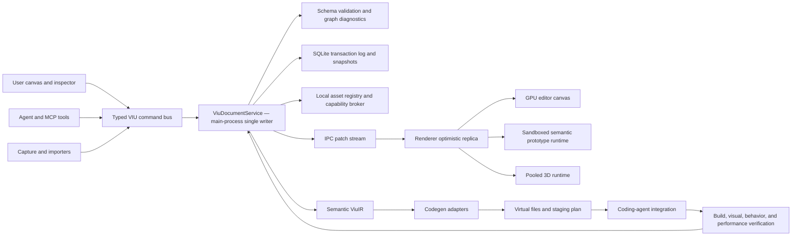

# VIU master product and engineering plan

Status: **Target specification — not yet implemented.**

This document resets VIU around the intended product: a local-first, agent-native visual product studio where a person and an agent design the same runnable experience without touching production code. It supersedes the prompt-centric direction described by the current V0.x UI. Existing capture, fidelity evidence, and immutable-contract work remain valuable compatibility layers.

## 1. Product decision

VIU is not a prompt-to-code form and not merely a screenshot editor.

> VIU is a Figma-core visual product studio with an executable prototype runtime. The user and the agent mutate the same semantic visual document. Code is generated only from an explicitly approved revision.

The target is not immediate parity with every Figma product. VIU must first reach parity in the core work needed to design web and application experiences:

- infinite canvas and direct manipulation;
- semantic layout and responsive frames;
- reusable components, variants, variables, and tokens;
- clickable prototype flows and application states;
- professional motion and scroll-linked storytelling;
- local 2D, video, font, audio, and 3D assets;
- deterministic history, review, and approval;
- traceable design-to-code generation.

VIU should exceed a conventional design tool in four areas:

- an agent can operate the document through the same command engine as the user;
- local files can be linked instantly without an upload step;
- the prototype runtime understands routes, state, forms, scroll, motion, and 3D;
- a logic guardian validates reachability, behavior, accessibility, performance, and export readiness.

FigJam, slides, advanced illustration/vector authoring, cloud multiplayer, and a plugin marketplace are post-beta concerns. They must not delay the usable core.

## 2. Non-negotiable principles

1. **The VIU document is the source of truth.** Prompt text and generated code are derived artifacts.
2. **Canvas first.** A blank project opens immediately into a usable canvas. A prompt is optional assistance, never a gate.
3. **One mutation path.** User gestures, inspector edits, importers, and agent tools all emit typed `ViuCommand` transactions.
4. **No production code during design.** Design and Prototype modes cannot invoke code-edit tools. Generation starts only from an approved snapshot.
5. **Prototype before export.** A user must be able to click, type, scroll, navigate, trigger state, and inspect motion before any code exists.
6. **Local-first assets.** Linking a local file is the default; no upload and no forced copy. Portable bundling is an explicit later action.
7. **Semantic before pixel-only.** Controls, layout, routes, behaviors, states, variables, and accessibility semantics are stored explicitly.
8. **Every change is reviewable.** Agent changes support preview, diff, accept/reject, cancellation, and one-step undo.
9. **Runtime and generators share one IR.** Prototype behavior and generated behavior may not drift into separate models.
10. **Performance and accessibility are design inputs.** VIU warns while the experience is being designed, not only after export.
11. **Stable identity end to end.** Node, token, interaction, state, and timeline IDs survive design, generation, integration, and verification.
12. **Measured claims only.** Visual fidelity, frame rate, load time, and codegen quality are reported against locked fixtures and profiles.

## 3. Definition of a usable VIU

A non-technical user can complete this journey without opening an editor or terminal:

1. Open an empty VIU project.
2. Create a screen or choose a premium starter document.
3. Add frames, text, controls, images, video, and local assets by clicking or dragging.
4. Resize, align, group, apply auto-layout, and configure responsive behavior.
5. Connect controls to screens, overlays, variables, states, media, motion, or 3D actions.
6. Preview the result as a real website at desktop, tablet, and mobile sizes.
7. Ask an agent to change the selected scope; inspect the proposed visual diff and approve it.
8. Run logic, accessibility, asset, responsive, motion, and performance validation.
9. Approve an immutable VIU revision.
10. Generate a target implementation, then let the coding agent integrate and repair it using node-to-code traces.

The product is not usable if a user still has to describe every visual change as an implementation prompt, if the agent writes React during Design mode, or if Prototype mode is only a static screenshot.

## 4. Workspace information architecture

```text
┌ Project bar ─ Project | Design / Prototype / Present | Viewport | Undo | Validate | Approve ┐
├ Left workspace ────────────┬ Infinite visual canvas ─────────────────────┬ Inspector ──────┤
│ Pages and flows            │ Frames, screens, sections                  │ Design          │
│ Layers                     │ Selection, guides, constraints             │ Layout          │
│ Assets                     │ Interaction connections                    │ Prototype       │
│ Components                 │ Responsive variants                        │ Motion          │
│ Variables and tokens       │ 2D and embedded 3D scenes                  │ Data / 3D       │
│ Revisions                  │                                             │ Quality         │
├────────────────────────────┴─────────────────────────────────────────────┴─────────────────┤
│ Context dock: Agent chat | Motion timeline | Prototype debugger | Diagnostics             │
└────────────────────────────────────────────────────────────────────────────────────────────┘
```

### Empty-project experience

The canvas appears immediately with five quick actions:

- **New screen** — desktop, tablet, mobile, watch, or custom frame.
- **Smart section** — navbar, hero, proof, feature, pricing, form, footer, or blank composition.
- **Link local asset** — picker, Explorer/Finder drop, or pasted path.
- **Premium starter** — editorial, cinematic product, commerce, dashboard, portfolio, and 3D story documents.
- **Ask agent** — create or edit within an explicit scope.

Starters are native VIU documents, not code templates. They provide an immediate polished result while remaining fully editable and replaceable. A starter establishes style DNA, token modes, component grammar, responsive rules, and motion defaults; the agent then composes a unique result rather than repeatedly emitting a generic landing page.

### Modes

- **Design:** clicks select and edit; interactions do not execute.
- **Prototype:** interaction handles, flow graph, states, scenarios, and timeline bindings are authored.
- **Present:** the experience executes exactly as a user would encounter it.
- **Review:** user/agent diffs, diagnostics, comments, and approval state are visible.
- **Generate:** available only for an approved revision; produces a virtual file graph and integration plan before any write.

Design selection and Present execution must never conflict. Double-click enters a group or component, `Esc` exits, and an explicit mode switch determines whether a control is selected or activated.

## 5. Core interaction model

### Canvas and direct manipulation

P0 must include:

- infinite pan and zoom;
- click, marquee, and multi-select;
- drag, resize, rotate, duplicate, copy/paste, delete, and nudge;
- snapping, smart guides, align, and distribute;
- grouping, reparenting, masking, lock, hide, and z-order;
- layers virtualization, rename, search, collapse, and drag reorder;
- frame presets and visible breakpoint bounds;
- undo/redo, autosave, crash recovery, and named checkpoints;
- keyboard-accessible equivalents for every primary operation.

Text edits through an IME-safe text overlay. Images, SVGs, videos, controls, frames, groups, and 3D scenes are first-class nodes. A rectangle with a click behavior should be promotable to a semantic control so the generator does not have to infer intent from pixels.

### Layout and responsive design

The layout system supports:

- free/absolute layout;
- horizontal and vertical stack layout;
- grid layout;
- gap, padding, alignment, distribution, and wrap;
- fixed, hug, fill, percent, min, max, and aspect-ratio sizing;
- left/right/center/scale and top/bottom/center/scale constraints;
- desktop/tablet/mobile/custom breakpoints;
- base properties with sparse breakpoint overrides;
- container-aware responsive rules after the core breakpoint model is stable;
- an inspector explanation for computed size and position.

The solver must be deterministic and framework independent. Its primitives intentionally map to Flexbox/Grid and Flutter layout concepts so generated output preserves design intent.

### Components, variables, and design systems

- component definitions, instances, slots, and overrides;
- component properties and interactive variants;
- nested instances without subtree duplication;
- variables with modes such as light, dark, brand, locale, or product tier;
- token aliases for color, type, spacing, radius, effect, and motion;
- typography styles, gradients, strokes, shadows, blur, blend, and masks;
- style DNA separated from the user's personal profile;
- design lint for hierarchy, spacing rhythm, contrast, typography, repetition, and inconsistent overrides.

Personalization may influence default language, explanation depth, aesthetic suggestions, and recommended starter direction. It must never leak private profile data into the product content or replace the project's explicit style DNA.

## 6. Key user journeys

### A. Premium website without code

1. Open VIU and create a desktop screen.
2. Link logo, imagery, video, and fonts from local storage.
3. Add Navbar, Hero, Product Story, Proof, Pricing, and CTA smart blocks.
4. Pick or derive a style DNA from a moodboard/reference artifact.
5. Edit directly or select the hero and ask the agent to make it more cinematic.
6. Connect CTA, pricing, modal, and form actions.
7. Preview desktop, tablet, and mobile.
8. Validate, resolve diagnostics, and approve.

Target: a new user can produce and understand a polished six-to-eight-section site in ten minutes, with a visible premium starter in under one second and optional agent refinement continuing asynchronously.

### B. Local 3D scrollytelling

```text
Drop C:\assets\product.glb
→ VIU grants and registers a local AssetRef
→ a 3D Scene Block appears immediately with a placeholder
→ metadata, bounds, clips, textures, and thumbnail resolve in workers
→ click “Make scroll story”
→ add chapters and pose the camera/model at each chapter
→ add text overlays, hotspots, easing, pin duration, and fallbacks
→ scrub and Present
→ validate GPU/mobile/reduced-motion budgets
→ approve and generate
```

The P0 3D experience is deliberately not a miniature Blender. It provides a strong product-visualization block: automatic camera framing, orbit/turntable/scroll presets, environment and light presets, clip selection, camera bookmarks, hotspots, scroll chapters, and poster/video fallback. Scene tree, gizmos, material editing, particles, and shader parameters deepen in later milestones.

Target: a valid asset pack becomes a usable 3D story prototype in under fifteen minutes without upload or code.

### C. Product-flow validation

If an Account screen exists but no user action reaches it, VIU reports it before approval. The validator also finds:

- controls without actions;
- actions whose target is missing;
- required screens unreachable from a flow start;
- overlays with no close path;
- forms without loading, error, success, or retry states;
- component variants or state transitions with no entry path;
- focus traps and keyboard-dead paths;
- responsive overflow and clipped critical content;
- motion without reduced-motion behavior;
- missing or over-budget assets.

Deep-link-only, system-only, admin-only, and intentionally unreachable screens require an explicit documented exception.

### D. Agent co-design

1. The user selects a node, component, screen, page, or project scope.
2. The agent inspects the document, computed layout, assets, flow graph, diagnostics, and an optional render snapshot.
3. The agent submits a preview transaction against a known revision.
4. VIU validates it and renders a ghost/before-after diff.
5. The user accepts, rejects, narrows, or discusses the proposal.
6. A committed proposal is one atomic history entry and can be undone once.

Autonomy modes are `suggest-only`, `apply-after-review`, and `auto-apply-within-granted-scope`. Destructive edits, asset relinks, external network access, generation, dependency installation, and repository writes always retain explicit approval boundaries.

### E. Approved generation and integration

```text
Draft → Prototype ready → Reviewed → Approved revision
      → Generate virtual files → Review integration plan
      → Agent integrates into repository → Build and run
      → Visual/behavior comparison → Bounded repair → Report
```

Any material design edit after approval invalidates that approval or creates a new revision. Generated code never becomes the design source of truth.

## 7. Target architecture



### Process ownership

- `ViuDocumentService` in the main process is the authoritative single writer and revision sequencer.
- The renderer owns editor chrome, camera, selection, hover, optimistic drag/resize previews, and a read replica.
- The renderer commits one transaction at pointer-up instead of recording pointer movement at frame rate.
- Asset grants, filesystem paths, hashing, watchers, custom protocol, persistence, builds, and local tool invocation remain outside the renderer.
- Layout, geometry, spatial indexing, thumbnail generation, asset decoding, code generation, and visual comparison use bounded workers.
- The agent tool adapter calls the document service directly, so an agent can design headlessly even when the VIU React surface is closed.
- Heavy work acquires a `ResourceCoordinator` lease and supports progress, cancellation, timeout, and memory limits.

### Three renderers from one document

1. **Editor renderer:** retained GPU scene for large-canvas navigation, primitives, selection, and effects.
2. **Prototype renderer:** sandboxed DOM/semantic runtime for real controls, routes, forms, accessibility, and browser-like behavior.
3. **3D renderer:** pooled WebGL/WebGPU scene runtime for GLTF/GLB, cameras, lights, clips, materials, and post effects.

The renderer boundary is explicit. The editor may optimize pixels aggressively, but Present mode and generated code consume the same semantic IR and behavior interpreter.

For the first production backend, benchmark PixiJS WebGL2 for the retained 2D canvas. Keep a renderer interface so another backend can replace it. WebGPU remains an opt-in capability until the selected 2D backend's implementation and target GPU matrix are stable. React and Arco render the editor shell, panels, menus, and accessible controls; they do not render one React component per node on a large canvas.

Three.js is the first 3D runtime adapter. Prefer WebGL2 for a conservative baseline and evaluate its WebGPU renderer per release/GPU tier. Use one context pool: inactive 3D blocks render a cached thumbnail, while selected or live Present blocks acquire a real-time surface.

## 8. Document engine V2

Do not extend V1 with an ever-growing set of optional `rect` fields. Introduce a versioned V2 schema and a pure one-way importer from V1.

```ts
type ViuProjectState = {
  schemaVersion: 2;
  projectId: string;
  revision: number;
  canvasPages: Record<PageId, ViuCanvasPage>;
  screens: Record<ScreenId, ViuScreen>;
  nodes: Record<NodeId, ViuNode>;
  components: Record<ComponentId, ViuComponent>;
  tokens: ViuTokenRegistry;
  variables: Record<VariableId, ViuVariable>;
  flows: Record<FlowId, ViuFlow>;
  behaviors: Record<BehaviorId, ViuBehavior>;
  timelines: Record<TimelineId, ViuTimeline>;
  assets: Record<AssetId, ViuAssetMetadata>;
  dataSources: Record<DataSourceId, ViuMockDataSource>;
  scenarios: Record<ScenarioId, ViuScenario>;
};

type ViuNode = {
  id: NodeId;
  type:
    | 'frame'
    | 'group'
    | 'text'
    | 'vector'
    | 'image'
    | 'video'
    | 'audio'
    | 'control'
    | 'component-instance'
    | 'repeater'
    | 'model-3d'
    | 'runtime-surface'
    | 'hotspot';
  parentId: NodeId | null;
  childIds: NodeId[];
  localTransform: Matrix2D;
  size: { width: number; height: number };
  positionMode: 'flow' | 'absolute';
  sizing: ViuSizing;
  constraints: ViuConstraints;
  layout?: ViuLayoutContainer;
  paints: ViuPaint[];
  strokes: ViuStroke[];
  effects: ViuEffect[];
  content?: ViuNodeContent;
  semantics: ViuSemantics;
  componentBinding?: ViuComponentBinding;
  behaviorBindings: BehaviorId[];
  provenance: ViuProvenance;
  exportHints?: ViuExportHints;
};
```

### Model rules

- `CanvasPage` organizes work in the design file; it is not a product route.
- `Screen` is an executable route/frame with breakpoints and prototype state.
- `Section` is a semantic scroll region within a screen.
- `Overlay` represents modal, drawer, popover, tooltip, or sheet behavior.
- Components store structure, properties, slots, variants, and state behavior.
- Instances store references and sparse overrides rather than copied subtrees.
- Rich text uses paragraphs and spans; it is not one unstructured string.
- Geometry after layout is a derived cache, not authoritative global coordinates.
- Provenance and fidelity metadata from V1 remain attached to imported/captured subtrees.
- Absolute local paths never appear in portable document JSON or agent-visible snapshots.
- Stable IDs cannot be regenerated merely because a node is moved, regrouped, or exported.

### Persistence and recovery

```text
<workspace>/.viu/projects/<project-id>/
  manifest.json
  project.sqlite
  thumbnails/
  managed-assets/
  traces/
  exports/
```

A standalone project lives under app data and can later attach to a workspace. SQLite WAL stores transactions, snapshots, branches, asset registry records, approvals, codegen runs, trace maps, and diagnostics. Asset bytes do not live in SQLite.

- transactions become durable within 500 ms;
- snapshot after roughly 200 transactions or 5 MB of journal;
- startup loads the latest snapshot and replays the tail;
- crash recovery loses at most the uncommitted gesture;
- named checkpoints and agent proposals are branches/revisions, not duplicate project files;
- approved snapshots remain immutable, content-addressed contracts under `.viu/contracts`.

## 9. Command bus, history, and collaboration model

```ts
type ViuTransaction = {
  transactionId: string;
  documentId: string;
  baseRevision: number;
  actor: { id: string; kind: 'user' | 'agent' | 'system' };
  origin: 'canvas' | 'inspector' | 'agent-tool' | 'import' | 'code-sync';
  commands: ViuCommand[];
  preconditions?: Array<{ nodeId: NodeId; expectedVersion: number }>;
  mode: 'preview' | 'commit';
  idempotencyKey?: string;
  summary: string;
};

type ViuTransactionResult = {
  accepted: boolean;
  revision: number;
  normalizedCommands: ViuCommand[];
  inverseCommands: ViuCommand[];
  diagnostics: ViuDiagnostic[];
  changedNodeIds: NodeId[];
  conflict?: ViuConflict;
};
```

`ViuCommand` is a closed, versioned union for insert, update, delete, reparent, reorder, layout, tokens, components, variants, variables, behaviors, timelines, keyframes, assets, screens, and scenarios.

Rules:

- a transaction is atomic;
- preview performs full validation but does not mutate the authoritative revision;
- agent writes require `baseRevision`, idempotency, and scoped preconditions;
- inverse commands provide actor-aware undo rather than restoring an old whole-document snapshot;
- delete cascades, design-system rewrites, and broad agent changes require preview/review;
- presence, cursor, viewport, hover, and selection are ephemeral channels, not document history;
- local user plus multiple local agents use the main-process sequencer first;
- do not add a CRDT until local actor-scoped undo and merge semantics are correct;
- future network collaboration may preserve this transaction API and add property-level merge plus a specialized rich-text CRDT.

## 10. Agent-native tool contract

Expose a small stable tool surface with typed action unions rather than dozens of fragile tools:

```text
viu_inspect
viu_preview_transaction
viu_commit_transaction
viu_asset
viu_validate
viu_export
```

Capabilities include:

- inspect project/page/screen/selection/node/component/token/asset/flow/timeline;
- request computed geometry, diagnostics, prototype state, or a render snapshot;
- query by type, name, semantics, ancestry, bounds, component, route, or token usage;
- create, update, delete, reparent, and reorder nodes;
- align, distribute, group, set layout, and set responsive overrides;
- create components, properties, variants, instances, tokens, and modes;
- connect interactions, variables, routes, overlays, forms, and state transitions;
- create motion tracks, keyframes, presets, and scroll stories;
- link approved local assets and configure 3D scenes;
- run design checks and deterministic prototype scenarios;
- export an approved revision to a virtual file graph.

Example:

```ts
viu_preview_transaction({
  documentId,
  baseRevision,
  summary: 'Replace the selected hero with a cinematic product story',
  commands,
});
```

Every tool response includes revision, changed IDs, warnings, diagnostics, and an undo transaction ID when committed. Agent context receives asset IDs and safe display names, not arbitrary filesystem access. The UI highlights affected nodes and can follow the agent's focus without making its camera/selection part of the project.

## 11. Local asset architecture

The default asset mode is `linked`, which means zero-copy local use.

```ts
type ViuAssetRef = {
  id: AssetId;
  mode: 'linked' | 'managed';
  mediaType: 'image' | 'svg' | 'video' | 'audio' | 'font' | 'model-3d' | 'lottie' | 'rive';
  mime: string;
  bytes: number;
  sha256?: string;
  modifiedAt: number;
  metadata: ViuAssetMetadata;
};
```

Flow:

1. User drops a file, chooses it, or pastes a path.
2. The main process canonicalizes it, validates the grant, sniffs MIME, and creates an `AssetRef`.
3. A placeholder node appears in under 100 ms.
4. Workers extract metadata, dependency graph, thumbnail, dimensions, font data, media duration, or 3D bounds/clips.
5. The renderer streams through a secure `viu-asset://<project>/<asset-id>` protocol.
6. A watcher refreshes the preview when the file changes.
7. A missing file preserves all bindings and exposes a `Relink` action.
8. `Bundle` copies by content hash only when portability/sharing/export requires it.

P0 formats: raster image, SVG, common video, font, and GLB. Next: audio, HDR/EXR, `.gltf` dependency trees, Lottie, and Rive. HTML/JavaScript artifacts remain opaque or run in a separate sandbox with network disabled; imported scripts never gain document-service or filesystem capability.

The registry stores the absolute path only in local main-process persistence. Portable contracts redact usernames and paths. Export asks whether to copy approved assets into output, emit licensed references, or require relinking.

## 12. Prototype and behavior runtime

The prototype is a declarative interpreter, not arbitrary user JavaScript.

Triggers include:

- click/tap, double-click, hover, press, focus, blur, and keyboard;
- drag/drop and pointer gestures;
- load, timer, media, and animation completion;
- scroll enter/leave/progress and intersection;
- form submit and mock-data result;
- 3D object, hotspot, clip, and camera events.

Actions include:

- navigate, back, open/close overlay, and scroll-to;
- set/toggle/increment variable;
- change component variant or application state;
- condition, sequence, parallel, delay, and retry;
- submit a mock form/request and bind mock data;
- play, pause, seek, or stop media/timeline;
- control a 3D camera, object transform, material property, or animation clip.

Present mode records a deterministic scenario trace. The debugger shows the active screen, variable state, fired trigger, guard result, actions, timeline progress, and errors. This trace powers validation and codegen verification.

## 13. Motion and scrollytelling system

Motion has two authoring levels.

### Quick motion

- reveal, fade, slide, scale, blur, and clip presets;
- stagger by child/order;
- hover, press, focus, and component-state transitions;
- sticky/pin, parallax, marquee, and scroll-to;
- duration, delay, easing, spring, direction, and reduced-motion fallback.

### Timeline authoring

```ts
type ViuTimeline = {
  id: TimelineId;
  durationMs: number;
  tracks: ViuTrack[];
};

type ViuTrack = {
  targetId: NodeId;
  property: ViuAnimatableProperty;
  keyframes: Array<{
    time: number;
    value: TypedMotionValue;
    easing: ViuEasing;
  }>;
  binding:
    | { kind: 'time' }
    | {
        kind: 'scroll';
        sourceId: NodeId;
        start: ViuScrollAnchor;
        end: ViuScrollAnchor;
        scrub: boolean;
        pin?: NodeId;
      };
};
```

The timeline supports keyframes, curves, springs, nested timelines, markers, clips, scrubbing, and deterministic checkpoints. Animatable properties are typed; invalid interpolation such as color-to-transform is rejected rather than coerced.

`Scroll Story` is a first-class authoring object:

- choose scroll source, length, pin duration, and direction;
- add chapters with one click;
- pose text, layout, media, 3D object, material, clip, and camera state at each chapter;
- interpolate progress between chapters;
- preview wheel, trackpad, touch, keyboard, and programmatic scroll;
- create an explicit reduced-motion narrative and static/mobile fallback;
- expose a performance rail showing expensive effects and 3D frames.

The runtime owns a deterministic scroll-progress model and does not store raw GSAP or arbitrary script in the VIU document. A web adapter may lower ViuIR to CSS, Web Animations, framework motion, or a specialized runtime according to target capabilities. Because native `ScrollTimeline` support can vary, generated output needs a tested fallback rather than depending on it unconditionally.

## 14. 3D scene block

`model-3d` stores:

- local `assetId` and dependency manifest;
- scene/node/mesh hierarchy metadata;
- object transforms and visibility;
- active camera, camera bookmarks, and animation tracks;
- light/environment presets and overrides;
- material parameter overrides;
- animation clips, clip state, and hotspots;
- LOD, texture, device-tier, and poster/video fallback policy;
- interaction and timeline bindings.

Drop flow:

1. Show a placeholder instantly.
2. Parse GLB/GLTF metadata, bounds, textures, extensions, and clips in a worker.
3. Auto-frame the model and choose a neutral light/environment preset.
4. Generate a thumbnail and device-budget diagnostics.
5. Render real time only when selected, visible in Present mode, or explicitly pinned live.
6. Dispose bitmaps, textures, buffers, and renderer resources deterministically.

P0 supports GLB, orbit, turntable, auto-camera, environment/light presets, animation clips, camera chapters, hotspots, scroll rotate, and poster fallback. P1 adds GLTF dependency folders, scene tree, transform gizmos, multiple cameras/lights, material controls, HDR, compression helpers, and richer timelines. P2 adds particles, shader parameters, multiple scenes, and advanced post-processing after security/performance gates exist.

Every 3D project has a device-tier budget for triangles, draw calls, texture memory, shader compile, first useful frame, and frame time. VIU warns before approval and can propose texture compression, mesh compression, LOD, lower DPR, disabled post effects, offscreen pause, or fallback media.

## 15. Sandbox and security boundary

The built-in prototype interpreter executes only declarative VIU behavior. It does not evaluate project JavaScript.

Generated-code preview uses an isolated Electron surface/partition with:

- sandbox enabled;
- Node integration disabled;
- context isolation and web security enabled;
- strict CSP;
- navigation, new windows, downloads, permissions, and unapproved protocols denied;
- network disabled by default;
- only session-whitelisted asset IDs available through the custom protocol.

Local paths are untrusted input even when they come from the user or an agent. The asset broker must protect against:

- path traversal and percent-encoding tricks;
- symlink, junction, reparse-point, and grant-root escape;
- Windows device paths, UNC policy bypass, alternate data streams, and case ambiguity;
- validate/read time-of-check/time-of-use races;
- false MIME, polyglot, malicious SVG/XML, embedded script, and active HTML;
- GLTF external URIs outside the granted root or hidden network references;
- decompression bombs, oversized textures, pathological meshes, and decoder crashes;
- unbounded CPU, RAM, disk, process, worker, or GPU consumption.

Parsers/decoders use size, time, memory, nesting, dependency, and output limits. Logs, contracts, render snapshots, and agent context redact absolute personal paths and metadata that are not required for the operation.

## 16. Design-to-code and integration

```mermaid
flowchart LR
    AP["Approved VIU revision"] --> VA["Schema, graph, asset, a11y, perf validation"]
    VA --> RI["Resolve layout, components, variants, variables, and behavior"]
    RI --> IR["Semantic ViuIR"]
    IR --> TA["Target adapter"]
    TA --> VF["Virtual file graph"]
    VF --> IP["Repository-aware integration plan"]
    IP --> RV["User review"]
    RV --> WR["Agent applies bounded patch"]
    WR --> BU["Sandbox build and run"]
    BU --> CO["Visual and scenario comparison"]
    CO --> FX["Bounded agent repair"]
    FX --> RP["Evidence report and trace map"]
```



```ts
type ViuCodegenAdapter = {
  id: string;
  capabilities: ViuTargetCapabilities;
  analyzeRepository(input: RepoSnapshot): Promise<ViuTargetContext>;
  emit(ir: ViuIR, context: ViuTargetContext): Promise<GeneratedFileGraph>;
  createIntegrationPlan(generated: GeneratedFileGraph, repository: RepoSnapshot): Promise<PatchPlan>;
  verify(output: BuiltTarget, contract: ApprovedViuContract): Promise<VerificationReport>;
};
```

Adapter sequence:

1. empty repository → React/Vite web;
2. existing React/Vite and Next.js integration;
3. Flutter for capabilities with a defined mapping;
4. additional adapters through an explicit capability matrix.

The adapter emits deterministic/idempotent AST or template graphs, not ad-hoc concatenated strings. Unsupported capabilities produce diagnostics and an explicit runtime/fallback decision; they are not silently discarded.

### Trace and repair

```text
.viu/traces/<build-id>.json
nodeId        → file + symbol + generated span + hash + runtime locator
interactionId → route/handler/state transition
componentId   → emitted component and instance sites
tokenId       → CSS variable/theme field
assetId       → packaged output and license mode
```

Development output may include `data-viu-id`. Runtime capture maps actual bounds, state, and errors back to VIU IDs. If a developer modifies a generated region, its hash becomes `modified`; the generator does not overwrite it blindly. The integration agent uses a three-way plan and reports conflicts.

Initial reverse synchronization is deliberately bounded: design → code → verification/trace. VIU does not promise lossless arbitrary code → design round-tripping before a separate importer can prove it.

## 17. Validation gates

### Before approval/export

- schema and transaction invariants;
- parent/child cycles, orphan references, and duplicate IDs;
- layout ambiguity, overflow, clipping, and breakpoint gaps;
- token, component, variant, and override consistency;
- missing, changed, unlicensed, unsupported, or over-budget assets;
- contrast, labels, alt text, heading hierarchy, focus order, touch target, and keyboard path;
- missing reduced-motion, pause, skip, poster, or text narrative;
- unreachable required screen, state, route, or component variant;
- missing target, empty action, dead end, modal without close, and broken back path;
- form without validation/loading/error/success/retry behavior;
- timeline target/property mismatch and nondeterministic scenario;
- 3D device-tier budget violations.

Critical accessibility and logic errors block approval. A user may override only with a recorded reason and an exported diagnostic report.

### After generation

- target capability coverage;
- node, token, component, asset, interaction, and timeline trace coverage;
- install/build/typecheck/lint/test;
- console, runtime, navigation, permission, and network errors;
- deterministic prototype-scenario traversal;
- screenshots at locked breakpoints, states, and motion checkpoints;
- perceptual/geometry/typography comparison against VIU Present mode;
- generated-page Core Web Vitals profile;
- 3D first-frame, frame-time, draw-call, texture, and shader report;
- bounded repair and a final list of residual differences.

## 18. Capability matrix

| Area       | P0 — usable vertical slice                                         | P1 — Figma core                                           | P2 — immersive/runtime                 | P3 — platform                |
| ---------- | ------------------------------------------------------------------ | --------------------------------------------------------- | -------------------------------------- | ---------------------------- |
| Canvas     | Infinite canvas, zoom/pan, select, resize, snap, layers, undo/redo | Rotate, ruler, guides, mask, vector, bulk edit            | Massive-canvas optimization            | Multiplayer and branch merge |
| Layout     | Frame, free/stack, constraints, desktop/mobile                     | Full auto-layout, grid, hug/fill, min/max, breakpoints    | Fluid/container rules                  | Adaptive/data-driven layout  |
| Visual     | Text, shape, SVG, image, video, gradient/effects                   | Advanced type, blend, variable fonts                      | Lottie, Rive, advanced effects         | Effect/plugin graph          |
| Components | Component, instance, token                                         | Variants, properties, nested instance, modes              | Interactive state machines             | Versioned libraries          |
| Prototype  | Navigate, overlay, back, scroll-to, component state                | Variables, conditions, forms, multi-action, drag/keyboard | Data mocks, recorder, replay           | User-test analytics          |
| Motion     | Presets, sticky, parallax, basic scroll progress                   | Timeline, keyframes, easing, springs                      | Nested timeline and orchestration      | Motion plugins               |
| 3D         | GLB block, camera/light preset, clips, scroll rotate               | Scene tree, gizmo, material, HDR, chapters                | Particles, shaders, multi-scene        | Spatial/plugin ecosystem     |
| Agent      | Inspect/preview/commit parity, diff, undo                          | Component/flow/motion tools                               | Compose, simulate, optimize experience | Agent/plugin marketplace     |
| Quality    | Assets, targets, reachability, overflow                            | States, focus, contrast, touch, reduced motion            | Perf, visual regression, simulation    | Project analytics            |
| Delivery   | Approved contract, manifest, trace, React/Vite                     | Existing-repo integration                                 | Multiple adapters and repair loop      | Adapter SDK                  |

P0 includes premium native starter documents and at least one cinematic 3D scrollytelling preset. Users must see the intended quality before the advanced editor is complete.

## 19. Performance budgets

Measure p95 across at least thirty runs on two locked profiles: a low-tier 8 GB iGPU laptop and a reference 16 GB, four-core, 1440p machine. Do not report the best run.

| Metric                                              |                                       Release gate |
| --------------------------------------------------- | -------------------------------------------------: |
| Warm open to interactive                            |                                           ≤ 800 ms |
| Cold open of standard project                       |                                              ≤ 2 s |
| Open 10,000-node document to usable                 |                       ≤ 1.5 s on reference profile |
| Pan/zoom/drag at 10,000 total / 2,000 visible nodes |                                       ≥ 55 FPS p95 |
| Input-to-paint                                      |                                        ≤ 32 ms p95 |
| Hover/select/hit test                               |                                        ≤ 16 ms p95 |
| Layout 100 dirty nodes                              |                                 ≤ 8 ms worker time |
| Layout 1,000 dirty nodes                            |                                ≤ 50 ms worker time |
| Commit 100 simple commands                          |                                        ≤ 25 ms p95 |
| Apply/undo agent transaction of 500 operations      |             ≤ 250 ms; no main-thread block > 50 ms |
| Asset placeholder after local drop                  |                                           ≤ 100 ms |
| Local image below 20 MB to thumbnail                |                                           ≤ 500 ms |
| Cached 2D Present refresh                           |                                           ≤ 300 ms |
| Valid 75 MB GLB to first useful frame               |                        ≤ 2.5 s on performance tier |
| Cached 3D Present refresh                           |                                            ≤ 1.5 s |
| Incremental 2D heap for standard 10k project        |                                           ≤ 250 MB |
| Incremental 3D corpus memory                        |                ≤ 700 MB with declared texture tier |
| ViuIR + target emit for 1,000 nodes                 |                ≤ 2 s, excluding dependency install |
| Standard multi-screen export                        | ≤ 15 s, excluding model latency/dependency install |
| Autosave durability                                 |                                           ≤ 500 ms |
| Renderer-crash recovery                             |            ≤ 5 s; lose at most uncommitted gesture |
| Sixty-minute soak                                   |              no crash; no monotonic leak above 10% |
| Idle editor                                         |                average CPU below 1% after settling |

Generated web targets use locked Core Web Vitals gates of LCP ≤ 2.5 s, INP ≤ 200 ms, and CLS ≤ 0.1 for the declared fixture/device profile.

When a budget is exceeded, VIU must degrade intentionally: reduce DPR, textures, shadows, blur/post effects, live 3D surfaces, or offscreen work; enable LOD/compression/fallback; and explain the change. It must never freeze the editor silently.

IPC patches are normally below 256 KB. A transaction is capped at 1,000 commands or 2 MB before chunking/proposal batching is required. Worker queues, decoder concurrency, texture cache, render surfaces, and build jobs all have hard bounds.

## 20. Accessibility requirements

The editor and generated output target WCAG 2.2 AA.

### Editor

- all primary actions have keyboard paths;
- the canvas has an accessible layer/tree alternative;
- focus is visible and shortcuts are discoverable/remappable;
- selection, movement, resize, constraints, undo, and agent diff are announced;
- 200% zoom retains functionality;
- status never depends only on color;
- the inspector includes contrast and semantic checks;
- screen-reader navigation does not require a GPU hit test.

### Prototype and output

- landmarks, heading order, labels, alt text, focus order, and live regions;
- keyboard-complete menu/modal/form flows;
- understandable loading, empty, validation, error, success, and retry states;
- adequate touch targets;
- `prefers-reduced-motion`, pause/skip for long animation, and non-motion equivalents;
- 3D stories include a static poster, readable narrative, keyboard controls, and reduced-motion camera mode.

Automated checks do not replace keyboard, screen-reader, motion, and human aesthetic reviews. Critical accessibility errors block approval unless the user records a conscious exception.

## 21. Usable-first delivery plan

Delivery is organized around end-to-end vertical slices, not isolated engines that remain invisible for months. Calendar estimates must be made only after team capacity is known; the sequence and exit gates below are binding.

### M0 — Direction reset and V2 foundation

Deliver:

- schema V2 RFC and invariants;
- V1 fixture corpus and pure V1 → V2 migrator;
- command reducer, preview/commit protocol, inverse commands, and diagnostics;
- main-process document session with SQLite log/snapshot;
- local asset capability model, threat model, and custom-protocol spike;
- renderer backend benchmark spike and locked performance harness;
- feature flag for VIU Next.

Exit gate: fixture migration is deterministic/idempotent; command fuzzing cannot create cycles or invalid references; security boundaries and one 2D renderer backend are approved.

### M1 — Instant Canvas end-to-end alpha

Deliver:

- blank canvas, premium starter, frame/text/shape/control/image/video;
- pan/zoom, select, multi-select, drag, resize, snap, layers, inspector;
- local image/video/SVG/font/GLB linking with placeholder, thumbnail, watcher, missing/relink;
- command history, autosave, crash recovery, copy/paste, and shortcuts;
- minimal agent inspect/preview/commit tools with visual diff;
- two-screen navigation and full-screen Present mode;
- a deliberately small React/Vite virtual export to prove shared IR and trace.

Exit gate: a new user creates a polished landing, links a local asset, accepts one agent edit, clicks to a second screen, reopens without data loss, and exports/builds a traced sample without touching code.

### M2 — Semantic layout and Figma core

Deliver:

- stack/grid/free layout, constraints, hug/fill/min/max, breakpoint overrides;
- guides, align/distribute, grouping, masking, rotate, richer vector/text/effects;
- components, instances, properties, variants, tokens, variables, and modes;
- responsive desktop/tablet/mobile preview;
- style DNA, curated design grammar, and design lint.

Exit gate: premium landing, ecommerce, and dashboard fixtures remain semantic and responsive at three breakpoints; agent tools have parity for every new mutation.

### M3 — Clickable product prototype and logic guardian

Deliver:

- route/flow graph, overlays, back/scroll, variables, conditions, component states;
- forms, validation, mock data, loading/error/empty/success states;
- keyboard, drag, timer, and multi-action behavior;
- scenario recorder/debugger and deterministic replay;
- reachability, dead-action, state-completeness, accessibility, and responsive validation.

Exit gate: all required primary flows execute and validator fixtures have zero undetected invalid targets or required unreachable screens.

### M4 — Professional motion and scrollytelling

Deliver:

- motion presets, state transitions, sticky, parallax, stagger, and marquee;
- timeline, keyframes, easing curves, springs, nested timelines, markers;
- scroll progress, chapters, pin/scrub, motion debugger, and checkpoint capture;
- reduced-motion authoring and runtime fallback;
- agent motion tools.

Exit gate: replay is deterministic; editor scrub equals Present mode at locked checkpoints; scroll and motion stay inside frame budgets.

### M5 — Local 3D story studio

Deliver:

- GLB and GLTF-dependency asset pipeline;
- pooled Three.js runtime, scene metadata/tree, camera/light/environment presets;
- clips, camera bookmarks/chapters, hotspots, object/material tracks;
- scroll-linked camera/model control, performance rail, LOD/compression guidance;
- mobile, low-tier, and reduced-motion fallback;
- agent 3D inspection/configuration tools.

Exit gate: the 3D golden fixture is created from local assets, runs without upload, passes declared GPU/memory budgets, and exports with functional fallback.

### M6 — Production codegen and repository integration

Deliver:

- stable ViuIR and adapter capability contract;
- deterministic React/Vite adapter, then existing React/Next integration;
- asset packaging/license policy, routes, state, motion, and Three.js output;
- virtual file review, staging/worktree integration, node-to-code trace;
- sandbox build, scenario replay, screenshot comparison, and bounded repair;
- Flutter adapter only after capability mapping and web pipeline gates pass.

Exit gate: all golden fixtures install/build/run, preserve required behavior, meet trace coverage, and produce evidence reports without overwriting unrelated or modified code.

### M7 — Beta hardening

Deliver:

- onboarding and discoverability;
- diagnostics, relink, migration recovery, project packaging, and support bundle;
- cross-OS/GPU/locale coverage;
- accessibility and security audit;
- long-running soak, cancellation, corruption recovery, and resource backpressure;
- polished starter corpus without generic repeated aesthetics.

Exit gate: beta Definition of Done below is satisfied with no P0/P1 product defect or high/critical security issue.

### Dependency rules

- no agent write before transaction/precondition/history;
- no production codegen before semantic layout, component, behavior, and approval models stabilize;
- no generated-code execution before sandbox and asset capabilities;
- no visual-fidelity claim before deterministic renderer, trace, and comparator;
- no network CRDT/multiplayer before local actor-scoped undo and revision merge are correct;
- no advanced 3D effect before resource budgets and fallback exist.

## 22. Golden vertical-slice corpus

Every milestone must preserve earlier slices.

### Premium landing

- six to eight sections, 100–180 nodes, three breakpoints;
- distinctive typography, tokens, reusable components, and style DNA;
- sticky nav, modal, hover, form, reveal, and scroll-to;
- first presentable starter under one second.

### Ecommerce

- listing, search/filter, detail, cart, checkout, success, and failure;
- component variants, forms, variables, and full state coverage;
- no orphan route or dead purchase action.

### Dashboard

- sidebar/header, virtualized 1,000-row table, chart, filters, and dark/light modes;
- desktop/tablet/mobile layout;
- keyboard/focus and overflow validation.

### 3D scrollytelling

- one 50–75 MB product GLB, textures up to declared 4K tier;
- camera animation, transparent material, hotspots, six to eight chapters;
- text overlays, pin/scrub, poster and reduced-motion fallback;
- no network request or asset upload.

## 23. Test and release strategy

Suggested test distribution:

- 60% unit/property/fuzz tests;
- 20% component/editor tests;
- 15% integration/contract tests;
- 5% Electron E2E;
- visual, AI evaluation, performance, accessibility, and security remain cross-cutting gates.

### Unit/property/fuzz

- command reducer, normalization, transaction atomicity, inverse operations, undo/redo;
- apply → undo returns the original digest;
- at least 10,000 randomized valid/invalid command sequences without cycle/orphan corruption;
- transforms, snapping, geometry, constraints, auto-layout, and breakpoints;
- component/variant/token/variable resolution;
- behavior reachability, state machines, scenario replay;
- timeline interpolation and scroll mapping;
- asset manifest, grant, dependency, and path policy;
- V1 migration and every future migrator chain;
- ViuIR and target adapter determinism.

Command engine, migration, graph validator, and asset broker target at least 95% branch coverage; the repository maintains its general ≥80% target.

### Integration

- renderer → preload → main document session;
- optimistic gesture → committed patch → recovery;
- asset grant/custom protocol/watcher/missing/relink;
- agent preview/diff/approval/undo;
- prototype semantics equal generated-runtime semantics;
- worker timeout/cancel/crash/resource release;
- save, reopen, corruption recovery, and migration;
- codegen virtual files → integration plan → sandbox build → trace.

### E2E

1. Blank canvas → add control → connect screen → Present click.
2. Drop local image/video/GLB → render → reopen offline.
3. Agent adds a section → reject → digest unchanged.
4. Agent changes 100 nodes → approve → one undo restores all.
5. Create missing Account route → validator catches it → connect → passes.
6. Build each golden corpus and compare states/breakpoints/checkpoints.
7. Move an asset → relink without losing motion or behavior bindings.
8. Open V1 fixture → migrate → save/reopen without mutating source.

### Visual and AI evaluation

- pixel/perceptual/geometry/typography comparison for locked 2D states;
- GPU-tier baselines and perceptual thresholds for 3D;
- timeline screenshots at deterministic progress checkpoints;
- generated output compared to VIU Present mode;
- pinned model/version/config, multiple seeds, and a fixed agent-tool task corpus;
- agent score covers schema validity, task completion, graph validity, operation count, undoability, and aesthetics;
- human aesthetic rubric scores hierarchy, type, spacing, color, consistency, responsiveness, originality, and motion.

### Cadence

- pull request: typecheck, lint, unit, component, schema, and security contracts;
- nightly: E2E, visual, migration corpus, and codegen builds;
- weekly: AI corpus, cross-OS/GPU matrix, accessibility sampling, and sixty-minute soak;
- release candidate: all golden slices, security review, performance budgets, and recovery suite.

## 24. Migration from current V0.x

Keep:

- URL/image capture and provenance;
- fidelity metadata and limitations;
- immutable content-addressed contracts;
- Electron main/renderer boundary;
- capture, image, contract, and dashboard tests as compatibility evidence.

Replace:

| V1                             | V2                                                                |
| ------------------------------ | ----------------------------------------------------------------- |
| `documents[]`                  | canvas pages, screens, and scenes                                 |
| flat `nodes[]` plus `parentId` | normalized stable node tree/map                                   |
| global `rect`                  | local transform, size, layout participation, and derived geometry |
| monolithic `style`             | paints, strokes, effects, text styles, and token bindings         |
| raw asset URL/path             | capability-scoped `AssetRef`                                      |
| shallow interactions           | typed behavior and flow graph                                     |
| shallow motion                 | timelines, tracks, keyframes, and bindings                        |
| `runtime` boundary             | sandbox/runtime/3D node with explicit capability                  |
| `prompt` and `improvedPrompt`  | optional product brief metadata only                              |
| session-memory state           | snapshot plus append-only transaction journal                     |

Migration rules:

1. Freeze golden V1 fixtures for prompt, URL, and image projects.
2. Implement a pure, checksum-tested, idempotent V1 → V2 migrator.
3. Never modify the V1 source; create backup and V2 output.
4. Dual-read V1/V2, but V2-only-write; do not dual-write both schemas.
5. Preserve old immutable contracts as evidence.
6. Ship behind `VIU Next` until every fixture opens, saves, reopens, prototypes, and exports without loss.
7. Keep a legacy reader for at least two stable releases after V2 becomes default.

## 25. Proposed module placement

```text
packages/desktop/src/common/viu/
  schema/
  commands/
  protocol/
  diagnostics/
  codegen/
  index.ts

packages/desktop/src/process/services/viu/
  documents/
  persistence/
  assets/
  importers/
  runtime/
  codegen/
  verification/
  index.ts

packages/desktop/src/process/bridge/viuBridge.ts
packages/desktop/src/process/worker/viu/

packages/desktop/src/renderer/pages/studio/ide/Viu/
  index.tsx
  canvas/
  components/
  panels/
  runtime/
  store/
  tools/
  workers/
```

Shared types must move out of process-only modules. Renderer code never reads Node/Electron/filesystem APIs directly. Business logic stays in pure shared/service modules, IPC remains thin, and every directory remains below the repository's ten-child limit.

Suggested ownership waves for four concurrent agents:

- **Wave 1:** root owns schema/RFC/integration; agents own migrator/invariants, benchmark harness, and local-asset threat/IPC contract.
- **Wave 2:** root owns command-service integration; agents own canvas slice, prototype graph/runtime, and agent transaction/diff.
- **Wave 3:** root owns vertical-slice integration; agents own motion, 3D/local assets, and codegen/trace/verification.

Only one owner changes central schema/shared types at a time. Other workstreams consume locked fixtures and contracts.

## 26. Definition of Done

A capability is done only when:

- UX and observable acceptance criteria exist;
- user and agent have equivalent mutation capability;
- every mutation is transactional and undoable;
- autosave/recovery and failure paths are covered;
- it passes declared performance, accessibility, and security budgets;
- all user-facing text is localized across configured locales;
- a golden fixture and automated tests exist;
- output has design-to-runtime/code trace where applicable;
- documentation, diagnostics, and onboarding are updated.

VIU beta is done only when:

- all four golden slices complete design → prototype → agent edit → approval → generation → integration → verification;
- no user must open code before Generate;
- all required screens/actions/states are reachable and valid;
- locked exported projects build and run successfully;
- agent tool-task pass rate is at least 95% without invalid documents;
- one hundred crash/recovery runs lose no committed transaction;
- no P0/P1 defect or high/critical security issue remains;
- accessibility, performance, migration, soak, and cross-platform gates pass;
- V1 sources remain unchanged by migration.

## 27. Principal risks and mitigations

| Risk                                     | Mitigation                                                                                               |
| ---------------------------------------- | -------------------------------------------------------------------------------------------------------- |
| “Equal to Figma” becomes unlimited scope | Lock Figma-core web/app workflows; postpone multiplayer, advanced illustration, and marketplace          |
| A beautiful result depends on model luck | Curated style grammar, premium native documents, tokens/components, design lint, multi-seed/human corpus |
| Preview and generated output diverge     | One semantic IR, shared behavior semantics, scenario replay, trace, and visual comparison                |
| Agent corrupts a document                | Typed scoped commands, preconditions, atomic preview transaction, validation, review, inverse operation  |
| Rect-based V1 contaminates V2            | One-way migrator and a clean versioned model rather than optional-field expansion                        |
| 3D freezes Electron                      | Worker parsing, progressive placeholder, one context pool, GPU tiers, cancellation, LOD, hard quotas     |
| Linked asset moves or changes            | Fingerprint, watcher, Missing state, Relink, managed/bundle option                                       |
| Fonts differ across machines             | Font asset manifest, license metadata, metrics snapshot, explicit fallback                               |
| Codegen overwrites existing work         | Virtual graph, staging/worktree plan, trace hashes, three-way integration, diff approval                 |
| Renderer gains filesystem power          | Main-process capability broker, custom asset protocol, context isolation, narrow IPC                     |
| AI evaluation is nondeterministic        | Pin model/config, multiple seeds, score functional commands and final state, human review                |
| Schema churn blocks parallel work        | One schema owner, versioned contracts, fixtures, migrator chain, workstream boundaries                   |

## 28. Technical references and decision notes

- [PixiJS renderer guidance](https://pixijs.com/8.x/guides/components/renderers) — benchmark WebGL as the production baseline; treat WebGPU as a gated capability.
- [PixiJS retained render loop and scene graph](https://pixijs.com/8.x/guides/concepts/render-loop) — relevant to batching, culling, invalidation, and GPU scene ownership.
- [Three.js GLTFLoader](https://threejs.org/docs/pages/GLTFLoader.html) — GLTF/GLB loading, compression, texture, material, camera, and animation support.
- [Three.js WebGPU renderer](https://threejs.org/manual/en/webgpurenderer) — WebGPU with WebGL2 fallback, but still requires explicit compatibility/performance gates.
- [Electron custom protocol](https://www.electronjs.org/docs/latest/api/protocol) — secure asset streaming without exposing raw `file://` paths.
- [Electron security checklist](https://www.electronjs.org/docs/latest/tutorial/security) and [context isolation](https://www.electronjs.org/docs/latest/tutorial/context-isolation) — mandatory preview and IPC boundaries.
- [Web Animations API](https://developer.mozilla.org/en-US/docs/Web/API/Web_Animations_API) — common web animation timing/playback model.
- [ScrollTimeline](https://developer.mozilla.org/en-US/docs/Web/API/ScrollTimeline) — useful target capability, but not assumed universally available.
- [WCAG 2.2](https://www.w3.org/TR/WCAG22/) — editor and generated-output accessibility target.

## 29. Immediate next implementation package

Do not begin with a cosmetic rewrite of the prompt panel. The first implementation package must contain these inseparable foundations:

1. Schema V2 RFC and V1 fixtures/migrator.
2. Pure command reducer plus preview/commit/inverse transaction contract.
3. Main-process document session with revision stream and durable journal.
4. Local asset registry/grant/custom-protocol spike.
5. GPU canvas backend benchmark with frame, selection, and text-edit proof.
6. One golden end-to-end slice: create frame, link local image, agent edits via transaction, connect two screens, Present, approve, emit traced React/Vite virtual files.

That slice proves the product architecture and gives the user something visibly useful immediately. Every subsequent milestone expands the same pipeline instead of replacing it.
