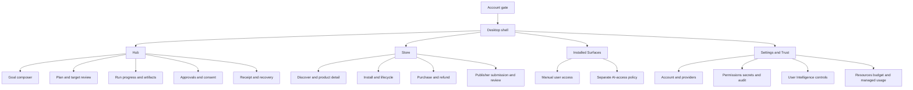
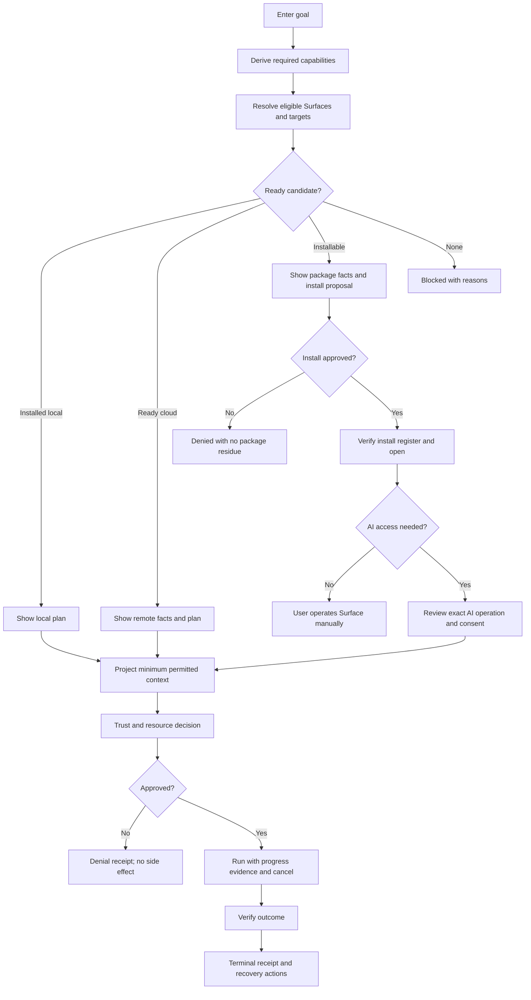
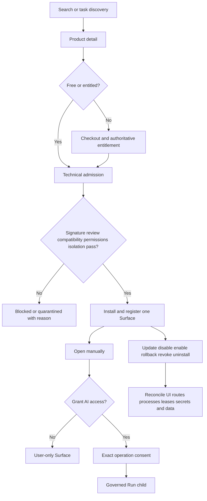
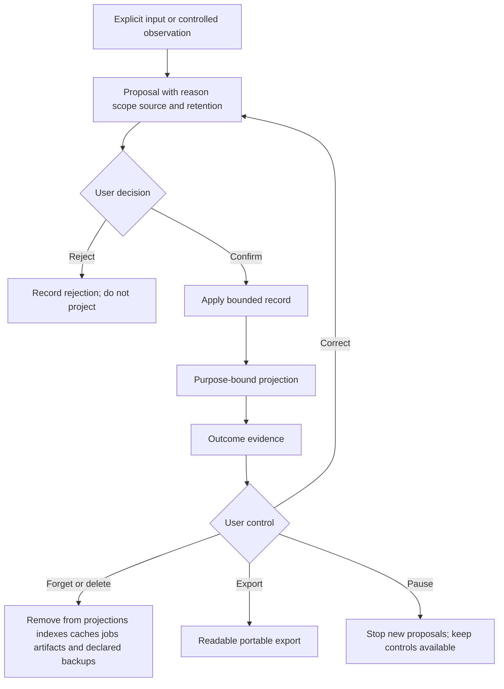

# Product vision

**Status:** TARGET, with current implementation evidence tracked in [current architecture](../architecture/current.md).

## Product thesis

TomniHubOS is a desktop-first, eventually cross-platform Agent OS. It is not another chat client and it is not a bundle of permanently installed productivity screens. It is a trusted hub where a person can connect the AI and automation systems they choose, give an outcome, and let governed agents complete the work with visible permissions, evidence, and recovery.

The operating-system idea is behavioral rather than kernel-level: TomniHubOS provides identity, capability, context, scheduling, resource, audit, package, and interaction primitives that many agents and applications can share.

### Account-first entry

TomniHubOS has no guest product mode. The first usable screen is Tomni Account sign-in because the account is the stable owner for Store entitlements, package access, cloud usage, synchronization, user-consent receipts, recovery, and audit. The desktop app uses a browser-based OAuth/OIDC Authorization Code + PKCE flow; Main process exchanges and protects session material in approved OS storage, while renderer code receives only session state and narrowly scoped commands. A previously verified, unexpired protected session may unlock an explicitly defined offline-local grace mode; a first sign-in, expired/revoked session, purchase, publishing, sync, cloud, and account-sensitive action require online revalidation.

An account is not automatically a publisher. Publishing additionally requires a Publisher Profile with verified membership, role/status, namespace, and enrolled signing public key. Main and Store service derive that publisher identity from the verified session and artifact signature; renderer-provided account, publisher, or key identifiers are claims, never authority.

The durable advantage is a **user-owned intelligence layer**. With consent, the system learns the person's explicit preferences, recurring work patterns, active projects, trusted tools, and successful outcomes. That context improves planning and routing without trapping the user in one model provider or exporting private history by default.

## Two MVP cores

### 1. Hub Agent OS

The Hub turns an intent into a governed run:

1. accept the goal and relevant workspace;
2. project only the permitted context;
3. resolve each required capability against the trusted base, installed packages, signed remote capabilities, and Store catalog;
4. select an MVP target deterministically from capability, privacy, an allowed user pin, health, resource availability, and hard budget;
5. plan and delegate work to one or more agents;
6. acquire resource and capability leases;
7. execute through a provider, CLI, local runtime, MCP tool, installed package, or remote zero-install capability;
8. inspect side effects and request approval at policy boundaries;
9. verify the result;
10. persist evidence, usage, and a terminal receipt;
11. recover, resume, or compensate when execution fails.

A provider is an adapter, not the product. One governed run contract must apply to local models, cloud APIs, subscription CLIs, remote agents, and future runtimes.

### 2. Trust and User Intelligence

Trust is part of execution, not a settings page. The core owns:

- identity and origin;
- capability grants and time-bounded approvals;
- secret storage and opaque secret handles;
- outbound data and destination policy;
- package provenance, isolation, and revocation;
- immutable-enough audit evidence and recovery state;
- private context, preferences, habits, and project memory;
- provenance, confidence, scope, retention, export, correction, and deletion;
- clear separation between learned context and authorization.

User understanding exists to reduce repetition and improve outcomes. It must remain inspectable and reversible. Inferred data never silently grants permissions.

## Parallel launch platform tracks

Local and cloud AI support the governed Hub runtime. The Store/package ecosystem is a continuous launch track because it proves capability discovery, isolation, distribution, interoperability, and first revenue without placing optional applications in the base.

### Local and cloud AI

TomniHubOS exposes one runtime contract across:

- local inference on available CPU, GPU, NPU, or sidecar runtimes;
- cloud model APIs;
- provider and coding CLIs;
- remote agent transports;
- MCP servers and tools;
- package-contributed adapters.

Routing is policy-based and observable. Users can pin a target, use automatic selection, prohibit cloud execution, define budgets, and inspect fallback decisions. Local weights are optional downloads, not mandatory base payload.

### Store and capability packages

The base ships the trusted platform. Domain functionality is installed separately through signed packages with explicit contributions and permissions.

The capability resolver searches what the base already provides, what is installed locally, what can run remotely without a local executable, and what is available to install. It returns comparable candidates with trust, privacy, data-location, price, latency, offline, UI, and compatibility facts. The Hub can use an approved remote capability immediately, but it proposes an explicit install when the user wants direct UI interaction, local execution, or offline availability.

Independent packages include, but are not limited to:

- IDE and code workspaces;
- Browser and web automation surfaces;
- Office or document applications;
- media, design, testing, monitoring, and developer tools;
- provider adapters, agent capsules, workflows, and MCP integrations.

Studio is a user-facing group and a migration alias for related packages. It must not become a monolithic dependency or a hidden base bundle.

## Free core and commerce

The Hub Agent OS, local Trust and User Intelligence, local orchestration control with API LLM reasoning, workflow and Super Package authoring, BYOK, supported CLIs, local AI, and local package execution do not require a subscription, but do require a signed-in Tomni Account under the account-first rule.

Tomni has two commerce rails:

1. **Managed Usage:** one Tomni Credit unit pays for separately metered managed AI and managed cloud resources.
2. **Store:** packages, Super Packages, publisher services, and clearly labelled sponsored placement.

Free software does not imply subsidized model, VM, GPU, storage, network, paid-package, or human-support cost. A managed resource is prepaid, user-supplied, publisher-funded, or explicitly sponsored. No billable provider call or cloud resource starts before a bounded quote and sufficient reservation.

The normative model, illustrative cost ranges, and operating gates live in [product economics](economics.md). The technical contracts live in [credits and billing](../platform/credits-and-billing.md), [managed cloud execution](../platform/cloud-execution.md), and [Store commerce](../platform/store-commerce.md).

## MVP checkpoints and execution alignment

The [MVP master plan](../execution/mvp-plan.md) owns implementation order and evidence. Product meaning stays stable across its checkpoints:

| Checkpoint | Product meaning                                                                                                       |
| ---------- | --------------------------------------------------------------------------------------------------------------------- |
| C0         | Freeze same-revision inventory, corpora, owners, release surfaces, and reproducible failure baselines.                |
| C1         | Freeze the minimal Store, Package App, Surface, identity, lifecycle, AI-consent, and commerce contracts.              |
| C2         | Complete the person-operated Store lifecycle, submission/review/publication, and Store commerce with AI access off.   |
| C3         | Converge Security, causal User Intelligence, and Orchestration behind versioned benchmarks and shared policy seams.   |
| C4         | Prove one production local AI-to-reviewed-Surface journey with separate installation and AI-access consent.           |
| C5         | Prove local/cloud/hybrid Surface placement, extract IDE, and remove every optional implementation from the base.      |
| C6         | Decide the C6A Core plus Store release and the independent C6B Full managed-usage extension from same-revision proof. |

The Store/package track advances continuously from S0 evidence through S6 release. It never waits for managed AI or managed cloud; only paid activation waits for valid entitlement plus the normal package identity, Trust, ABI, compatibility, and isolation gates.

Progress reports acceptance atoms for Hub, Trust/User Intelligence, Store/Package, Managed Usage, and Release. They publish separate Core plus Store and Full managed-usage percentages, and release readiness is the lowest required critical-track completion rather than an average.

## Product principles

### User choice over provider lock-in

A user can connect any provider or CLI that has a compliant adapter. The claim means an open adapter contract, not an unsafe promise to execute arbitrary binaries without policy. Provider terms, local platform restrictions, and user permissions still apply.

### Small trusted base

Base functionality is allowed only when it is required to operate, govern, secure, update, or extend the base, or is universally required by governed runs and packages. Optional routes, assets, bridges, translations, workers, and source implementations must be absent from the base artifact until their package is installed.

### Security on the shared seam

Every execution target passes through the same permission, secret, egress, resource, evidence, and cancellation lifecycle. Per-feature checks are useful defense in depth but do not establish a platform guarantee.

### Private by default

Context stays local unless the user or an explicit policy permits a projection to leave the device. Models receive the minimum context required for the step. Raw secrets never enter prompts or renderer state.

### Outcome evidence over activity

Agent work is complete only when acceptance criteria are verified. Token usage, subprocess activity, or a plausible model response does not prove the requested outcome.

### Honest status

The product distinguishes implemented behavior from an aspiration. A feature is not CURRENT until a reachable production path and appropriate tests demonstrate it.

## Product interaction architecture

**Status: TARGET.** This section owns the canonical information architecture, interaction rules, screen responsibilities, and user journeys. Reachable behavior and gaps remain in [current architecture](../architecture/current.md); checkpoint acceptance and percentages remain in the [MVP master plan](../execution/mvp-plan.md). A wireframe or prototype is design evidence only and never makes a feature CURRENT.

### Information architecture

The shell contains only trusted-base navigation. IDE, Browser, Office, Studio-related tools, media, testing, monitoring, and other domain applications appear only as installed Package App Surfaces or Store entries. A disabled or uninstalled Surface must disappear from launch navigation; an unavailable optional route redirects to its Store detail or a clear recovery state.

### Navigation and interaction model

- **Account gate:** no product workspace is usable before a valid account session or an explicitly valid offline-local grace session.
- **Hub:** starts from the person's goal, then exposes the selected capabilities, placement, permissions, cost, progress, evidence, and recovery. It does not start from a provider-specific chat surface.
- **Store:** owns discovery, product facts, acquisition, lifecycle, publication, review, and ordinary-payment commerce. Payment can unlock acquisition but cannot alter technical trust.
- **Installed Surfaces:** remain directly usable by the person. AI access is a separate, revocable grant for exact operations.
- **Settings and Trust:** expose account, model/provider metadata, permissions, secrets, audit, User Intelligence, resources, and separately gated managed usage.
- **Receipts:** every governed action ends in a durable completed, failed, cancelled, timed-out, or compensated state with recovery guidance.

### Canonical flow catalogue

| Flow ID | Journey               | Required user-visible sequence                                                                                    | Success terminal                                      | Failure or denial terminal                                      | Primary checkpoint |
| ------- | --------------------- | ----------------------------------------------------------------------------------------------------------------- | ----------------------------------------------------- | --------------------------------------------------------------- | ------------------ |
| UX-01   | Account-first entry   | Launch -> browser sign-in -> verified session -> protected shell                                                  | Hub ready with account state                          | Signed-out, expired, revoked, offline-ineligible, or retry      | C1, C6A            |
| UX-02   | Governed goal         | Goal -> capability plan -> target and placement -> policy -> run -> verify -> receipt                             | Verified outcome and receipt                          | Denied, cancelled, failed, timed out, or compensated receipt    | C3, C4, C6A        |
| UX-03   | Protected side effect | Proposed action -> destination/data/scope review -> allow once, bounded allow, or deny                            | Committed effect with evidence                        | No external effect and a denial receipt                         | C3, C6A            |
| UX-04   | Store lifecycle       | Search -> detail -> consent -> install -> open -> update/disable/enable/rollback/revoke/uninstall                 | Correct Surface and clean lifecycle receipt           | Fail closed, recover, or restore previous valid state           | C2, C5, C6A        |
| UX-05   | Surface AI access     | Open manually -> inspect declared operations -> exact consent -> governed invocation -> revoke                    | One parent receipt with linked child evidence         | App remains user-usable while AI access is denied or revoked    | C1, C4             |
| UX-06   | Store commerce        | Offer -> checkout -> authoritative capture -> entitlement -> unchanged trust gates -> activation -> refund/revoke | Exactly-once order, grant, activation, and accounting | No activation, duplicate charge, or trust bypass                | C2, C6A            |
| UX-07   | User Intelligence     | Observe/input -> propose -> explain -> confirm/reject -> apply -> outcome -> correct/forget/export/delete         | Next projection reflects the user's control           | No permission drift; withheld or deleted data stays unavailable | C3, C6A            |
| UX-08   | Placement choice      | Compare eligible local/cloud/install/hybrid options -> show privacy/region/retention/price -> consent -> run      | Chosen placement completes under one Run              | No silent local-to-cloud fallback                               | C3, C5             |
| UX-09   | Publisher lifecycle   | Upload -> automated findings -> human review when required -> publish/stage/delist/revoke/appeal                  | Signed approved catalog entry                         | Sealed rejection or quarantine with remediation                 | C2, C6A            |

### Governed goal flow

At every decision, the UI shows why a candidate was included or excluded. Installation, purchase, context projection, AI access, and protected execution are distinct decisions and must never be collapsed into one confirmation.

### Store, publication, and Surface lifecycle

Publisher submission follows a separate authority path: native file selection -> bounded staging -> immutable submission -> deterministic findings -> mandatory human review when policy requires it -> signed publication -> staged rollout -> delist/revoke/appeal. Submission success must not be presented as publication success.

### User Intelligence control loop

Learned context may improve proposals and explanations but never grants permission, changes payment state, or bypasses deterministic routing and Trust.

### Screen blueprints

| Surface                | Primary regions                                                                                         | Mandatory data                                                                                                   | Mandatory non-happy states                                                                   |
| ---------------------- | ------------------------------------------------------------------------------------------------------- | ---------------------------------------------------------------------------------------------------------------- | -------------------------------------------------------------------------------------------- |
| Account gate           | Brand/context, browser sign-in action, session help                                                     | issuer state, online requirement, offline-grace eligibility                                                      | missing deployment config, callback failure, expiry, revocation, offline-ineligible          |
| Hub                    | goal composer, plan timeline, target/placement comparison, approval drawer, progress/artifacts, receipt | capability reasons, selected model/Surface, placement, context projection summary, permissions, budget, evidence | no candidate, install declined, approval denied, resource unavailable, cancel, crash/restart |
| Store browse/detail    | query and filters, result list, product facts, lifecycle actions                                        | publisher, version, signature/review, compatibility, permissions, data behavior, placement, size, price          | unsigned/revoked, incompatible, checkout unavailable, quarantined, update/rollback failure   |
| Installed Surface host | package identity header, isolated content, lifecycle and AI-access controls                             | exact package/Surface/version, runtime trust, current grants                                                     | disabled, revoked, unavailable runtime, crashed sandbox, stale consent                       |
| Trust center           | approval queue, active grants, secret handles, egress/audit timeline                                    | origin, capability, destination, data class, scope, expiry, revocation                                           | denied action, expired/replayed grant, protected storage unavailable                         |
| User Intelligence      | proposal inbox, confirmed records, provenance/detail, projection preview, controls                      | source, reason, scope, confidence, retention, use history                                                        | reasonless proposal, deletion pending, export failure, paused learning                       |
| Publisher workspace    | native upload, immutable submission status, findings, review/publication timeline                       | publisher authority, artifact fingerprints, codes/severity/evidence/remediation                                  | invalid authority, rejected archive, human review required, delisted/revoked                 |
| Resources and usage    | local resource health, target availability, budgets, managed switches                                   | placement, estimated/actual usage, hard limit, quote/reservation when enabled                                    | insufficient resource, budget exceeded, managed service disabled, reconciliation failure     |

### UX state and progress contract

Every actionable item has one visible availability state:

- **Available:** the user-reachable production path is enabled and its authority is healthy.
- **Limited:** a real subset works, with the exact limitation stated; local fixture, development-only, or test-only behavior is never labelled Available.
- **Unavailable:** no reachable path exists or the feature switch is intentionally disabled.
- **Blocked:** a named dependency or failed gate prevents the action, with a safe next step when one exists.

Progress is not authored by a screen. The UI consumes the canonical acceptance snapshot defined by the master plan and displays the exact numerator, denominator, revision, and evidence time. It must obey these rules:

1. show `passing required atoms / total required atoms`, with a derived percentage to one decimal place;
2. show `—` when the denominator or same-revision evidence snapshot is missing;
3. use a checked box only for a production acceptance atom; show LOCAL/DEV evidence separately and unchecked;
4. never average checkpoint percentages to claim release readiness;
5. show Core plus Store and Full managed usage separately;
6. remove hard-coded percentages, sample notifications, and unconditional healthy/ready labels;
7. preserve the last verified snapshot as stale evidence rather than silently treating it as current.

### Interaction and visual quality bar

- Use one calm operational hierarchy: goal and current decision first, evidence and advanced detail progressively disclosed.
- Use semantic design tokens, Arco Design controls, Icon Park icons, and the configured i18n system; no hard-coded theme colors or user-visible strings.
- Never use color alone for trust, money, failure, or availability. Pair icon, label, and explanatory text.
- Keyboard navigation, visible focus, screen-reader names, reduced-motion behavior, 200 percent zoom, and contrast must be verified for every release surface.
- Destructive actions state scope and consequence, require deliberate confirmation, and leave a receipt or recovery path.
- Loading is bounded and cancellable. Empty, offline, stale, permission-denied, partial, and recovery states are designed before polish.
- Secret values never render. Sensitive context summaries show categories and purpose, not raw protected content.
- Mobile-style narrow widths may stack panels, but desktop remains the MVP evidence platform and must keep the active decision and cancel action visible.

### Design handoff definition

A Terra High screen design is implementation-ready only when it references one or more `UX-01` through `UX-09` flows and the applicable C0-C6 atom IDs, covers success/empty/loading/limited/blocked/denied/cancelled/recovery states, names the authoritative data and action owner, and specifies accessibility, i18n, telemetry consent, evidence, rollback, and kill-switch behavior. Visual polish cannot remove or merge required consent boundaries.

### Terra High design work packets

The following work packets are the single visual-design handoff for the checkpoint ledger. They are design requirements, not claims that the corresponding product behavior is CURRENT. Terra High must keep each packet traceable to the referenced flows and atoms; it must not add a second percentage or status system.

- **D-C0 — Evidence and availability:** design the application-level progress summary, checkpoint drawer, atom detail, evidence receipt, stale snapshot, and “progress evidence unavailable” states. Cover `C0-01` through `C0-03`, the status contract, and `UX-01`/`UX-02`. Each atom row needs its exact numerator/denominator, reachability, revision, command, evidence time, owner, blocker, and next atom. No polished “healthy” state may appear without a compatible receipt.
- **D-C1 — Account, Package App identity, and consent:** design account sign-in/recovery, Package App facts, exact one-Surface identity, installation review, and separate AI-access consent. Cover `C1-01` through `C1-06`, `UX-01`, `UX-04`, and `UX-05`. The consent pattern must visibly distinguish installation, ordinary payment, AI operation, data classes, destination, secrets, budget, expiry, revoke, and consequences of denial.
- **D-C2 — Store and publisher lifecycle:** design browse/search, installed-first explanation, product detail, checkout/refund, lifecycle controls, publisher submission, findings, human review, staged publication, delist, and revoke. Cover `C2-01` through `C2-06`, `UX-04`, `UX-06`, and `UX-09`. Include pending, offline, compatibility mismatch, signature/review failure, duplicate-payment prevention, rollback, and restart recovery states.
- **D-C3 — Governed goal and private intelligence:** design goal composition, capability/placement comparison, side-effect approval, model and resource facts, run progress, artifacts, terminal receipt, context proposal/provenance, and correction/forget/export/delete controls. Cover `C3-01` through `C3-07`, `UX-02`, `UX-03`, and `UX-07`. The layout must make unavailable target, cloud-prohibited, denied effect, no silent fallback, paused learning, and deletion-in-progress states explicit.
- **D-C4 — AI-to-Surface approval journey:** design the moment a person elects to give an already installed Surface specific AI access, including operation schema, capability, placement, data classes, destination, secret lease category, limits, expiry, live cancellation, revoke, child evidence, and parent receipt. Cover `C4-01` through `C4-08` and `UX-05`. Person-operated use remains available in every AI-denied, expired, or revoked state.
- **D-C5 — Placement, zero-install cloud, and clean base:** design local/install/remote/hybrid comparison, remote session facts, tenant/region/retention/data facts, artifact-transfer approval, session progress/revoke, no-installed-package base state, and optional-route recovery. Cover `C5-01` through `C5-06`, `UX-04`, and `UX-08`. A remote presentation cannot resemble a locally installed app, and any unavailable placement must explain why without offering an unsafe fallback.
- **D-C6A — Candidate and release assurance:** design the release evidence center for Core plus Store: gate summary, cross-checkpoint blockers, test receipt drill-down, security/recovery verdicts, and signed-candidate facts. Cover `C6A-01` through `C6A-07`. The release screen displays only evidence from its declared revision and preserves a prior snapshot as stale rather than relabelling it current.
- **D-C6B — Managed usage:** design the separately gated Credit, quote, reservation, metering, settlement, refund/release, reconciliation, cloud-resource, cleanup, and orphan-recovery surfaces. Cover `C6B-01` through `C6B-05`. Until this checkpoint passes, managed controls are visibly disabled with a non-chargeable explanation; no design implies that a disabled service is included in Core plus Store readiness.

### Terra High delivery checklist

This is a **design-delivery** checklist, deliberately separate from the runtime acceptance ledger. A `[x]` here means the named packet has an approved, implementation-ready design handoff; it never changes a C0-C6 percentage or a feature availability state. At this snapshot no Terra High artifact has been accepted, so every packet remains unchecked.

| Done | Design packet | Handoff must include                                                                                |
| ---- | ------------- | --------------------------------------------------------------------------------------------------- |
| [ ]  | D-C0          | Evidence dashboard, atom drill-down, stale/missing evidence, and all `C0-01`–`C0-03` states.        |
| [ ]  | D-C1          | Account and recovery, Package identity, install/payment/AI-consent separation, and `C1-01`–`C1-06`. |
| [ ]  | D-C2          | Store/publisher/commerce lifecycle, mutation recovery, and `C2-01`–`C2-06`.                         |
| [ ]  | D-C3          | Goal, planning, private-intelligence controls, governed-run evidence, and `C3-01`–`C3-07`.          |
| [ ]  | D-C4          | Exact AI-to-Surface approval, live control, revoke/recovery, and `C4-01`–`C4-08`.                   |
| [ ]  | D-C5          | Local/remote/hybrid placement, clean-base/optional-package states, and `C5-01`–`C5-06`.             |
| [ ]  | D-C6A         | Release evidence center and `C6A-01`–`C6A-07`.                                                      |
| [ ]  | D-C6B         | Managed-usage, money, cloud cleanup, and `C6B-01`–`C6B-05`.                                         |

For each checked packet, attach the prototype/frame URL or file, flow and atom IDs, state inventory, owner approvals, accessibility/i18n review, and dated design decision record. A declined or superseded handoff is returned to `[ ]`; no stale prototype remains labelled ready.

For every packet, deliver the desktop default plus narrow-width behavior; loading, empty, error, limited, blocked, denied, cancelled, offline, stale, and recovery variants; keyboard/focus annotations; i18n expansion notes; semantic token and component guidance; destructive-action confirmation; and the evidence/receipt destination. A packet is accepted for implementation only after Design, Product, Security, and the owning checkpoint Integrator agree that its information cannot collapse two consent or authority boundaries.

## MVP user journeys

The Core plus Store candidate must prove these journeys end to end.

1. **Provider-neutral run:** connect one local model, one cloud API, and one CLI adapter; submit the same goal; observe governed selection or an explicit pin; cancel safely; receive a durable receipt.
2. **Governed delegation:** submit one multi-step goal; a parent Run delegates a bounded child step with narrowed capability and budget, cascades cancellation, verifies the child result, and aggregates linked evidence into one receipt.
3. **Protected side effect:** an agent proposes an outbound or filesystem action; the Hub shows destination, data class, capability, and scope; denial stops the action; approval is time- and scope-bounded.
4. **Controlled user intelligence:** enter or observe a preference, receive an explained proposal, consent or reject it, use a bounded projection, record the outcome, then inspect, correct, export, forget, and delete it; prove the next proposal and projection change without changing permissions.
5. **Discoverable and downloadable capability:** request a capability missing from base; resolve it to an approved remote zero-install candidate or an explicit local-install proposal; then install a tiny signed pilot and a fully extracted IDE package, and use, update, disable, uninstall, and roll back both without rebuilding base. Browser and other optional packages follow after MVP.
6. **Store commerce:** buy one first-party package, receive an entitlement, activate it through the same technical trust gates, refund it exactly once, and prove a third-party 15/85 accounting fixture without public payout.
7. **Workflow and interoperability:** invoke one remote capability without local download, call one package from another through a narrowed grant, and replay one private workflow or Super Package with visible progress and evidence.
8. **Failure recovery:** interrupt a run during execution; restart the application; resume or terminate without duplicating an external side effect, order, entitlement, debit, or refund.

The full managed-usage checkpoint additionally proves one prepaid managed-AI settlement and one scale-to-zero managed-cloud task. The Core plus Store candidate can be distributed with those independent switches disabled but must be reported separately until both managed journeys pass.

## MVP success measures

Release evidence should report:

- percentage of production execution targets covered by the shared security seam;
- percentage of runs reaching exactly one valid terminal state;
- delegated parent/child runs with valid lineage, no privilege amplification, cancellation cascade, and verified evidence aggregation;
- cancellation latency and orphan-process count;
- context projection size, provenance coverage, and user correction/deletion success;
- controlled learning proposals accepted, rejected, corrected, forgotten, and reflected in later outcomes without permission drift;
- routing latency, cost estimate accuracy, and fallback reason coverage;
- base artifact size and forbidden optional-module count;
- signed pilot and IDE install, rollback, quarantine, uninstall, and clean-base optional-owner absence;
- task-level outcome success on a fixed, versioned evaluation set.

Additional release measures include exactly-once Store order, entitlement, refund, revocation, and third-party accounting-fixture results, plus passing, failing, and blocked acceptance atoms and enabled or disabled switches for every MVP track.

Growth, marketplace breadth, and polished optional applications follow these trust and reliability measures; they do not replace them.

## Non-goals for the first MVP

- shipping any IDE, Browser, Office, Studio, Music, MakeVideo, Terminal, Testing, Monitor, media/design, or other optional implementation in the base;
- packaging Browser or polishing the remaining optional applications before the Core plus Store candidate passes;
- supporting every model or provider before the adapter contract is stable;
- public third-party seller onboarding or payout before the blocked legal and accounting gates pass;
- warm VM pools, reserved capacity, or multi-provider managed-cloud breadth before measured demand and isolation evidence;
- the drag-and-drop workflow or Super Package builder; one private execution fixture is enough for MVP;
- autonomous high-impact actions or background learning without permission, causal control, and recovery;
- cloud synchronization of private context by default;
- training a general foundation model as a prerequisite for product validation;
- claiming cross-platform parity without platform-specific release evidence.
